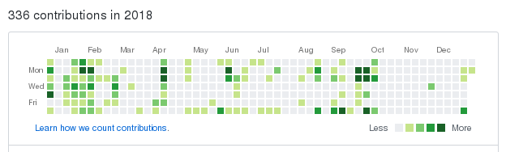

+++
title = "2018 - 式微"
summary = ''
description = ""
categories = []
tags = []
date = 2019-01-19T07:35:31+08:00
draft = false
+++

PID 72072963  

今年也是一如既然给的苟且，每年指定的计划也从来不会完成，所以干脆不再粘贴一遍到这里了

<iframe frameborder="no" border="0" marginwidth="0" marginheight="0" width=330 height=86 src="//music.163.com/outchain/player?type=2&id=431610015&auto=1&height=66"></iframe>

总共写了 40 篇文章，多多少少读了如下 6 本书

- [Redis设计与实现](https://book.douban.com/subject/25900156/)
- [魔力Haskell](https://book.douban.com/subject/26877215/)。重看，读到 "高级类型类和项目实践" 部分弃了
- [修改软件的艺术：构建易维护代码的9条最佳实践](https://book.douban.com/subject/27151925/)。还是先写单元测试吧
- [深入理解并行编程](https://book.douban.com/subject/27078711/)。读了将近三分之一，水平不够缺乏实际经验，有些无法理解
- [深入浅出 Rust](https://book.douban.com/subject/30312231/)
- [APUE](https://book.douban.com/subject/25900403/)。目前进度是第十五章

尝试去读一些大佬的博客，然后写一些收获，记录在 [weekly-reading](https://github.com/Hanaasagi/weekly-reading)，但是肺炎之后就提不起干劲了

GitHub 上仅有 336 个 contributions，连去年的一半都没有达到

- [viva](https://github.com/Hanaasagi/viva): MOCK stderr，使其输出红色
- [machine-uid](https://github.com/Hanaasagi/machine-uid): 获取机器 ID
- [ticket](https://github.com/Hanaasagi/ticket): 唯一 ID 生成器
- [ticket-py](https://github.com/Hanaasagi/ticket-py): ticket 的 Python 绑定
- [rikka](https://github.com/Hanaasagi/rikka): NAT 穿透
- [kurumi](https://github.com/Hanaasagi/kurumi): kernel

想了想，感觉什么都没做，空虚的一年

<!-- 
真正的内容当然要注释掉! 

自从 16 年起养成了每年年末去看一部剧场版的习惯，16 年的 你的名字、17 年的 烟花，以及 18 年的 我想吃掉你的胰脏。有趣的是在 18 年年初之际，有幸阅读了原著，感觉真的十分的棒。仿佛能够感觉到初恋的甜蜜气息。说起这种话题，便想起了我曾经辜负了两个女孩子，第一位是因为我的自卑，第二位是因为我对第一位恋恋不忘。反正错误都在我的身上，她们都是十分美好的存在。

17 年的时候定下了许多的目标，没有一个完成的。饲养猫咪比我想象的更加复杂，我没有精力以及财力去为她提供良好的条件，所以应该会放弃一段时间。奇怪的是，我好像也是因为这种理由埋葬了我的初恋。日语倒是在上班路上去尝试背了五十音，但是又忘记了。

18 年我毕业了，现在的我十分怀恋学校的生活。一部分理由是因为上班后自我学习的时间严重减少，从本博客的文章数目便可以得知。另一部分是我觉得真的很累，代码写的并不顺心，也无法从工作中获取新的知识。所以如标题，慢慢的衰落了。

10 月中旬去了 EGOIST 的演唱会，虽然遭遇了主办方发错票的事情，但 LIVE 真的超开心。

10 月下旬，第一次患肺炎。虽然没有住院，但是好难受。高烧到 39 度多，自从我有记忆来从未到达这么高的温度。可那时的我却很淡定，觉得死了就死了吧，于是就在家里躺了一晚上。次日仿佛醒了一般，有了求生意识，去了医院。治疗缓解了病情，但是心脏跳动次数异常。非常神奇的感觉，就是那种能够感受到心脏砰砰的跳，然后愈发烦躁，迫切的想让世界安静下来。

或许是因为生病，整个人都懒得动了，以前的 weekly reading 未再更新。就连每周的阅读也取消了，处于一种懒散的状态。

1 月去看了 FATE 的剧场版，因为种种原因迟到了一个小时，不过电影院观影真的很棒，尤其是库丘林的枪在地上滑的时候，音效不能太赞。如果有机会想在 2 月去看黎明之花。

2019 我只希望自己不要继续摸鱼下去，能够精进自己的技艺！
-->

    