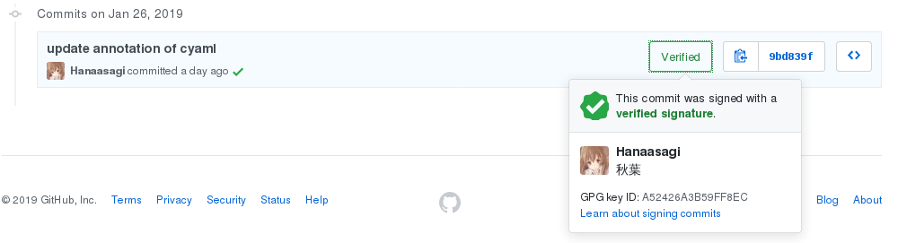

+++
title = "GPG"
summary = ''
description = ""
categories = []
tags = []
date = 2019-01-27T13:12:19+08:00
draft = false
+++

### PGP 和 OpenPGP 和 GPG

- PGP(Pretty Good Privacy): Phil Zimmermann 开发的加密软件，用于加密、数字签名及产生非对称密钥。PGP 本身是商业应用程序
- OpenPGP: 使用最广泛的电子邮件加密标准.由 IETF 的 OpenPGP 工作组所定义(RFC 4880)。OpenPGP 最初源 PGP。PGP 及其同类产品均遵守 OpenPGP 加解密标准
- GnuPG（GNU Privacy Guard，GPG):加密软件，它是 PGP 的满足 GPL 协议的替代物。GnuPG 也遵循 OpenPGP 标准

关于 PGP 的历史可以参考 [维基百科 - PGP](https://zh.wikipedia.org/wiki/PGP)

GnuPG 目前有两个版本:

1) GnuPG 1

> `gpg` will stay for embedded and server usage, as it brings less dependencies and smaller binaries.  
>From man gpg:
>> This is the standalone version of gpg. For desktop use you should consider using gpg2.

2) GnuPG 2

> `gpg2` is a redesigned version of `gpg`, but changes are mostly on internal level. The newer version is split into multiple modules, for example there are also modules for X.509 (used by S/MIME).  
> From man gpg2:
>> In contrast to the standalone version gpg, which is more suited for server and embedded platforms, this version is commonly installed under the name gpg2 and more targeted to the desktop as it requires several other modules to be installed.

引用自 [Are GnuPG 1 and GnuPG 2 compatible with each other?](https://superuser.com/questions/655246/are-gnupg-1-and-gnupg-2-compatible-with-each-other)


### 生成

执行 `gpg --full-generate-key` 进行生成，整个过程是交互式的

第一步选择想要的加密算法

```
Please select what kind of key you want:
   (1) RSA and RSA (default)
   (2) DSA and Elgamal
   (3) DSA (sign only)
   (4) RSA (sign only)
```

第二步选择合适的密钥长度

```
RSA keys may be between 1024 and 4096 bits long.
What keysize do you want? (3072) 
```

第三步选择有效期

```
Please specify how long the key should be valid.
         0 = key does not expire
      <n>  = key expires in n days
      <n>w = key expires in n weeks
      <n>m = key expires in n months
      <n>y = key expires in n years
```

第四步填写信息

```
Real name: realname
Email address: realname@gmail.com
Comment: realname's gpg
You selected this USER-ID:
    "realname (realname's gpg) <realname@gmail.com>"

Change (N)ame, (C)omment, (E)mail or (O)kay/(Q)uit? 
```

第五步为私钥设置密码

等待足够生成足够的随机数后即可

```
public and secret key created and signed.

pub   rsa1024 2019-01-27 [SC]
      107CE5612083CFE9196D3368E9C9C473844B11C1
      107CE5612083CFE9196D3368E9C9C473844B11C1
uid                      realname <realname@gmail.com>
sub   rsa1024 2019-01-27 [E]
```

### 其他常用操作

1) 列出本地所有的密钥

`gpg --list-keys` 

2) 导出

根据 UID `realname@gmail.com` 导出相应的公钥和私钥

```
gpg --output public.gpg --armor --export realname@gmail.com  # 公钥
gpg --output private.gpg --armor --export-secret-key realname@gmail.com  # 私钥
```

P.S. `armor` 参数可以将其转换为 ASCII 码显示

3) 导入

导入刚导出的文件

```
gpg --import public.gpg.gpg  # 公钥
gpg --allow-secret-key-import --import private.gpg  # 私钥
```

4) 加密和解密

```
root@/usr/src# echo 'hello world' > plain.txt 
root@/usr/src# gpg -r realname@gmail.com --encrypt plain.txt  # 公钥加密
root@/usr/src# ls  # plain.txt.gpg
plain.txt  plain.txt.gpg
root@/usr/src# gpg plain.txt.gpg  # 私钥解密
gpg: WARNING: no command supplied.  Trying to guess what you mean ...
gpg: encrypted with 1024-bit RSA key, ID 9A82DEFFE5376AEA, created 2019-01-27
      "realname <realname@gmail.com>"
File 'plain.txt' exists. Overwrite? (y/N) 
```

使用文件接收者的公钥加密，对方接收后通过自己的私钥进行解密

5) 签名

```
root@/usr/src# gpg --sign plain.txt  # 二进制形式
root@/usr/src# ls
plain.txt  plain.txt.gpg
root@/usr/src# gpg --clearsign plain.txt  # ASCII 可见形式
root@/usr/src# cat plain.txt
plain.txt      plain.txt.asc  plain.txt.gpg  
root@/usr/src# cat plain.txt.asc 
-----BEGIN PGP SIGNED MESSAGE-----
Hash: SHA256

hello world
-----BEGIN PGP SIGNATURE-----

iLMEAQEIAB0WIQQQfOVhIIPP6RltM2jpycRzhEsRwQUCXE2pfAAKCRDpycRzhEsR
wUihA/4lfSX1cb+c3SOh6tFj/06iVk6yifUyVBZW5hSIN8q1doMgSNbp9rGY/ONL
0CEFNFRywhIK/mWdd6sRSmVdq/ENRc20WV0BsyNc7/LEcVVhO0pVz2f/zcuJvAkD
UgjWnRVS6MMFsabK/k1Drd6alUd/oJrGx8IrKc+an7kxQ9zkFg==
=SDgN
-----END PGP SIGNATURE-----
root@/usr/src# gpg --detach-sign plain.txt  # 签名和数据分开
```

6）配置 Git

```
git config --global user.signingkey realname@gmail.com
```

设置 Git 全局使用该密钥加密：

```
git config --global commit.gpgsign true
```


7) GitHub

将自己的公钥配置到 GitHub 以获得 buff。参考 [GithubHelp - Adding a new GPG key to your GitHub account](https://help.github.com/articles/adding-a-new-gpg-key-to-your-github-account/)



### 遇到的问题

因为使用多台笔记本，所以需要导入导出。在一台 Arch Linux 上遇见到过无法签名的问题，参考 [ gpg: signing failed: Inappropriate ioctl for device #2798](https://github.com/keybase/keybase-issues/issues/2798)。通过 `export GPG_TTY=$(tty)` 得以解决


    