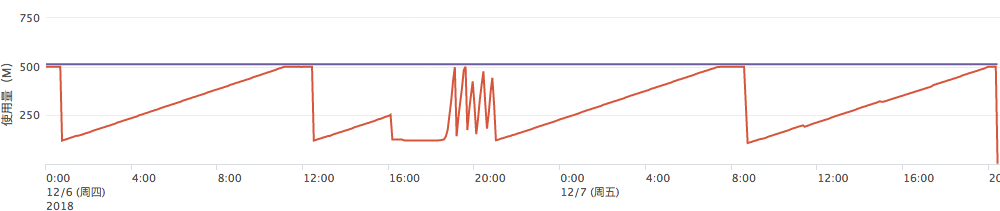

+++
title = "记一个内存泄漏问题"
summary = ''
description = ""
categories = []
tags = []
date = 2019-04-14T07:23:28+08:00
draft = false
+++

好久之前的事情，遇到了一个比较容易找到的内存泄漏问题

大致就是一个定时任务的写法过于骚气，简化版代码如下

```Python
from werkzeug.utils import cached_property


class T(object):

    def __init__(self, api_client):
        self._api_client = api_client

    def ping(self):
        print('T ping')


class ApiClient(object):

    def __del__(self):
        print('ApiClient __del__ called')


class MyApiClient(ApiClient):

    @cached_property
    def t(self):
        return T(self)


def ping():  # 定时调用
    client = MyApiClient()
    client.t.ping()
```

监控发现这个的内存增长大致呈现 `f(x)=k*x` 的样子，然后触发 OOM 被重启




问题在于两点

- `cached_property`的地方造成了循环引用
- Python2 下重写了 `__del__`(https://github.com/kubernetes-client/python/blob/28ef9775b05d616f5accc4972479bdc0818cf132/kubernetes/client/api_client.py#L76)

由于Python2 无法推导以何种顺序调用 `__del__` 是安全的，所以这种被归为 uncollectable，可以通过 `gc.garbage` 来查看这些对象

> A list of objects which the collector found to be unreachable but could not be freed (uncollectable objects). By default, this list contains only objects with `__del__()` methods. [1] Objects that have `__del__()` methods and are part of a reference cycle cause the entire reference cycle to be uncollectable, including objects not necessarily in the cycle but reachable only from it. Python doesn’t collect such cycles automatically because, in general, it isn’t possible for Python to guess a safe order in which to run the `__del__()` methods. If you know a safe order, you can force the issue by examining the garbage list, and explicitly breaking cycles due to your objects within the list. Note that these objects are kept alive even so by virtue of being in the garbage list, so they should be removed from garbage too. For example, after breaking cycles, do `del gc.garbage[:]` to empty the list. It’s generally better to avoid the issue by not creating cycles containing objects with `__del__()` methods, and garbage can be examined in that case to verify that no such cycles are being created.


Python3 下这种情况是可以被回收的，详细参考[PEP 442](https://www.python.org/dev/peps/pep-0442/)。

对于这种直接 gdb 然后查看 `gc.garbage` 即可

```
(gdb) call (void *) PyGILState_Ensure()
$1 = (void *) 0x1
(gdb) call (void) PyRun_SimpleString("import gc; gc.collect(); print(gc.garbage)")
(gdb) call (void) PyGILState_Release((void *) $1)
```

这里的 `print` 会在进程的 STDOUT 中输出，而不是 gdb 的控制台中

```
[<__main__.MyApiClient object at 0x7f34e9520a90>, <__main__.MyApiClient object at 0x7f34e9520c10>, <__main__.MyApiClient object at 0x7f34e9520c90>, <__main__.MyApiClient object at 0x7f34e9520d10>, <__main__.MyApiClient object at 0x7f34e9520d90>]
```
    