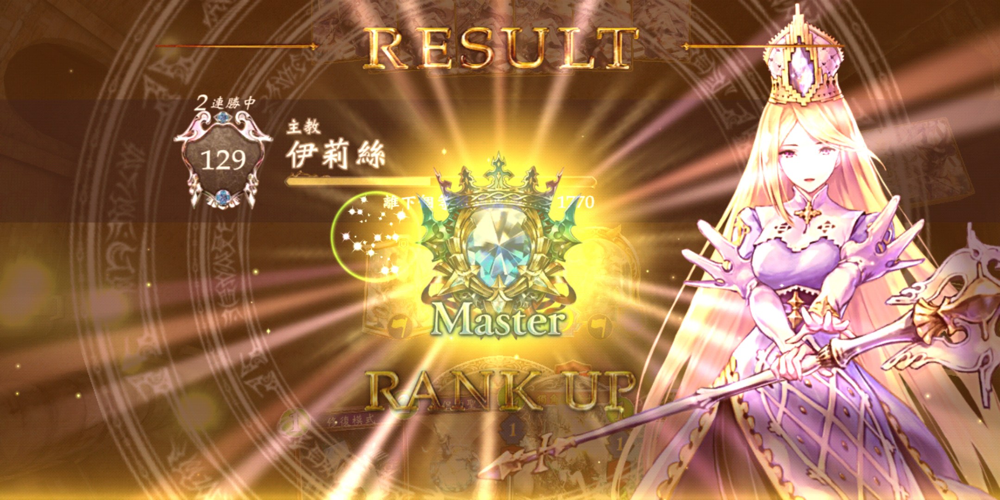
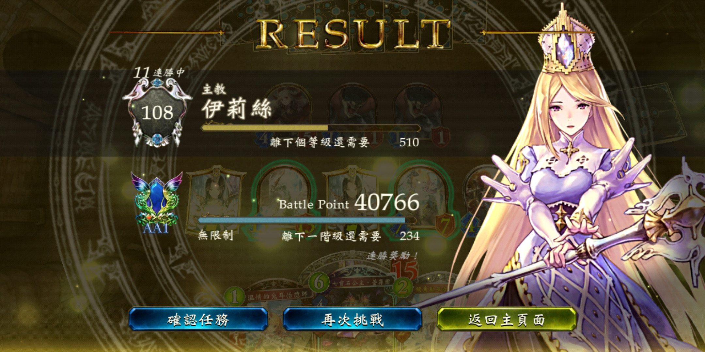
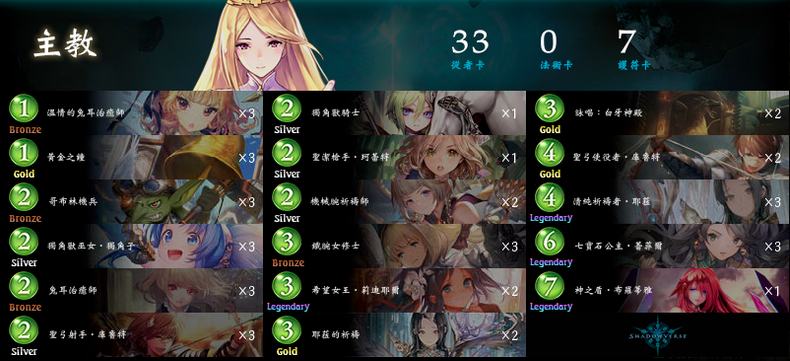
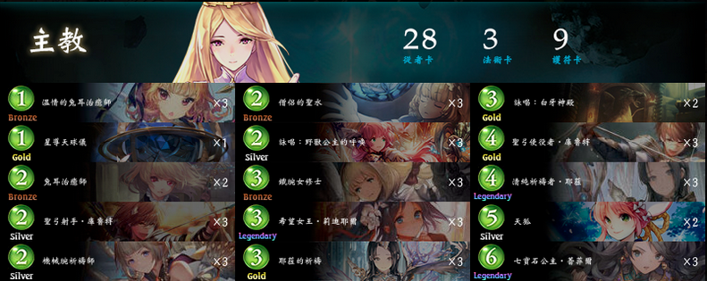
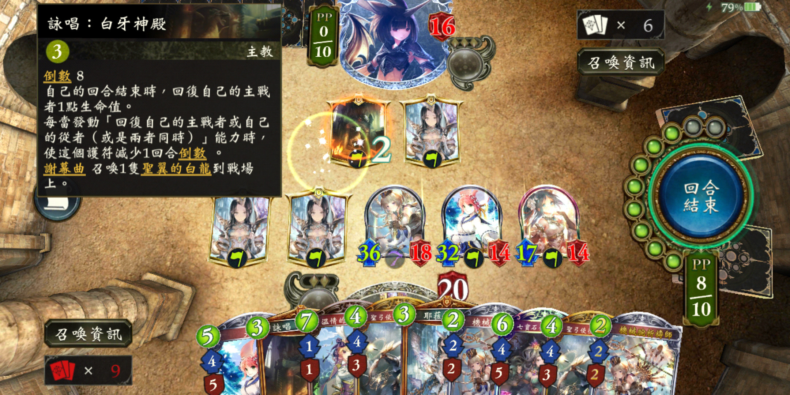
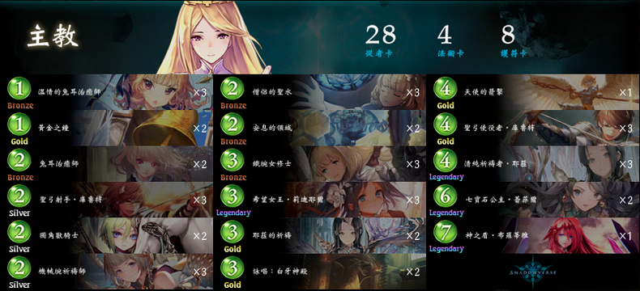
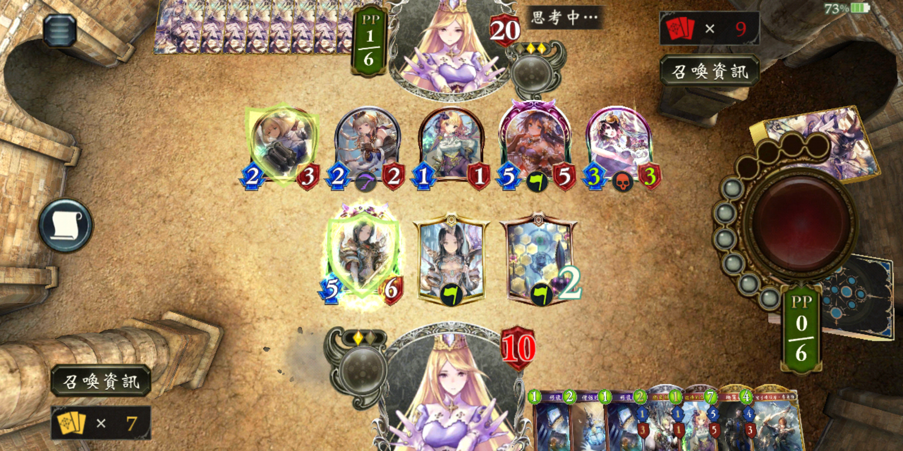

+++
title = "shadowverse 无限制 M 段搭车指南"
summary = ''
description = ""
categories = []
tags = []
date = 2019-07-21T11:53:01+08:00
draft = false
+++

~~下面将讲述这一个月我是如何不务正业的~~

本人在这段时期一直在使用耶拉教，从 A2 升级到 Master

并且最高取得 11 连胜

#### ROG 前期(2019/06/27~2019/07/11)

所使用卡组

P.S 在削弱前 "清純祈禱者‧耶菈" 为 2 费 2/2 的超模卡片

耶拉教在 ROG 时期得到前所未有的加强，因为在无限制中相当于有 6 张"耶菈的祈禱"可以使用。那么我们稍加计算便可以得出抽到可能产生 "耶菈的祈禱" 的卡牌的期望次数为

$$
\begin{aligned}
E = \frac{a+b+1}{b+1} = \frac{34+6+1}{6+1} = 6.83 （a 为非耶拉组件,b 为耶拉组件）
\end{aligned}
$$

从概率角度来说，我们抽 7 张卡牌就可以抽到一张耶拉(但现实往往不是这样的)。根据 shadowverse 的先后手规则，后手很有可能会在第 4 回合就出一张耶拉，因为就算不额外的过牌此时也已经 8 张牌(耶拉黏在手上的现象)。而 ROG 前期的耶拉是一张 2 费卡，这一回合会产生很强的爆发力

基本上除了这段时期的二大毒瘤

- 耶拉教
- 复仇鬼

无其他卡组可以很好的应对(特化构筑针对耶拉教的卡组除外，比如加入 "支配之線" 的复仇者)

所以这套卡组投入了 5 张耶拉组件，并且投入了大量的回复

- "聖弓射手‧庫魯特" 可以在后期直接借助 "修復模式" 和 "七寶石公主‧蕾菲爾" 的效果来斩杀复仇鬼
- "希望女王‧莉迪耶爾" 回复的同时可以过牌获得更多的回复组件
- "哥布林機兵" 用来卖掉换 "修復模式"
- "獨角獸巫女‧獨角子" 对方不解会造成更大的威胁的卡牌，但是实际上效果并不好
- "神之盾‧布羅蒂雅" 防虫妖斩杀。但是如果后手效果一般，7 费有点慢，不适用现在快节奏的虫妖
- "聖弓使役者‧庫魯特" 这张卡非常危险，尤其在耶拉内战的时候，因为其强力的 AOE 可能会将对方清场，如果此时对方没有进化点数的话，很容易解不掉，然后被滚雪球
- "黃金之鐘" 一般用于前期过牌，即使有回复效果，但是后期卡格子严重

根据数据统计，耶拉教、复仇鬼在这段时期的胜率是在 50% 左右

#### ROG 至今(2019/07/11~?)

"清純祈禱者‧耶菈" 被削弱，变为 4 费 3/4，虽然有影响但是并不大，主要限制了耶拉在于进化回合的爆发力。不过隔壁的复仇鬼就惨了，"絢爛的妖豔吸血鬼" 在削弱之后我基本就没有在对战中见过了

这段时期的 T1

- 耶拉教
- 复仇鬼
- 虫妖

因为环境的变动，虫妖虽然没有变化也跻身 T1 了。在这段时间，本人对战主要碰到的就是虫妖和耶拉教了

因为种种因素，卡组进行了修正(输的太惨了)

*套牌原作者 Tatsuki*

主要变化为投入了 "星導天球儀"、"詠唱：野獸公主的呼喚"、"天狐" 在第 5 回合进行爆发，基本上如果和预期一致的话，后手第 2 回合"詠唱：野獸公主的呼喚"，第 3 回合 "詠唱：白牙神殿"，第 4 回合 "清純祈禱者‧耶菈"，第 5 回合 "天狐" 进化和 "神聖獵鷹" 配合一下可以获得 +3/+3 的效果。需要做好对面 6 费 "忒彌斯的審判" 直接全灭的心里准备

由于虫妖的速攻，此卡组在 6 费的时候必须上守护，甚至需要放两个防止过墙斩杀，所以卡组里面投入了 9 张守护，但是还是在很多时候显得无力

一般对虫妖的时候，本人是这么干的

- 如果开场换牌了且手里拿到了耶拉组件，那么第三回合如果有 "希望女王‧莉迪耶爾" 且对面下一回合的场攻不能够解掉这张牌，那么直接打出去。对手一般会为了防止抽牌解掉拿"妖精的惡作劇"或者"對空射擊"来解掉，这样可以减少被过墙的概率
- "強者的威嚴" 这样可以给予 5 点伤害，但是缺点在于只攻击攻击力最低的。所以我们需要避雷针，比如 "詠唱：野獸公主的呼喚" 召唤的 "神聖獵鷹"
- "妖精的大呵欠" 和 "呢喃之森" 这两张是在是令人痛苦。在对局中我有几次被直接锁掉随从，尤其是当你使用了两张耶拉后，格子只有 3 的情况下。对面可以苟两回合然后再爆发
- "森之女王‧莉莎" 这个我现在还是不明白解还是不解，因为在对局中见过直接回手牌来上手多个虫子的。但是如果解了，根据虫妖的现有构筑也会抽到 "遠古精靈" 和 "森之女王‧莉莎"

有趣的是有一局对面布羅蒂雅，然后我这面两个耶拉卡了格子且有天狐和莉迪耶爾，最后爆牌而死

根据现有劣势，并且参考以前饼佬的领域耶拉教做了第三套卡组

"安息的領域" 专门防虫妖斩杀，并且能够保住当前的随从。

>自己的回合結束時，如果自己的戰場上沒有已攻擊狀態的從者，到下個自己的回合開始為止，自己的主戰者所受到的傷害如果為4以上則會轉變為3，並且到下個自己的回合開始為止，給予自己的主教從者全體「無法對這個從者進行攻擊」效果。 

由于"安息的領域"的苟命效果，重新将"神之盾‧布羅蒂雅"投入。只要将节奏拖下去，场上随从经过两个回合的回复加持，足以斩杀对面。这里不建议使用双耶拉，因为 3 个格子在对面有守护的时候是不容易斩杀的，但 4 个格子就不一样了

在耶拉内战的时候只要不"忒彌斯"，那么可以通过一张"聖弓使役者‧庫魯特"夺回场面优势

OK，大致就是这个样子。目前耶拉教和虫妖还是太强，希望能够削弱，不然没法玩地心少女了
    