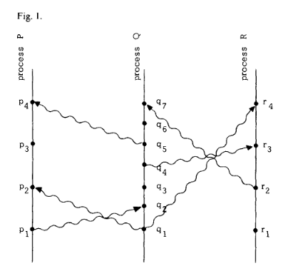
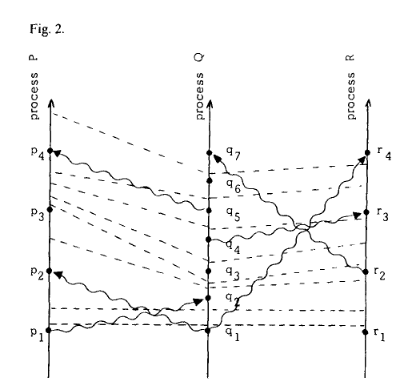
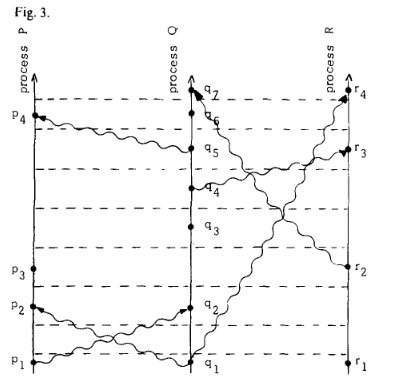

+++
title = "Time, Clocks, and the Ordering of Events in a Distributed System"
summary = ''
description = ""
categories = []
tags = []
date = 2019-07-29T12:28:53+08:00
draft = false
+++

本文是论文 [Time, Clocks, and the Ordering of Events in a Distributed System](https://lamport.azurewebsites.net/pubs/time-clocks.pdf) 的阅读笔记

分布式系统包含了许多空间上分离的不同进程，它们通过交换消息来进行通信。在分布式系统中，有时很难去说两个事件谁先谁后，因为机器的系统时间存在着差异。如果采用全局时钟，那么也会面临网络延迟及一系列故障。因此这种 "happened before" 关系是偏序的(简单说就是不是任意两个事件都可以比较大小的)。此篇论文中主要讨论了 "happened before" 上的偏序关系，并且给出一种分布式算法来将其延伸成全序

### The Partial Ordering

人们习惯于通过物理时间来确定事件的发生顺序，但是这通常在分布式系统中是不精确的。所以我们不借助于物理时间来定义 "happened before" 关系。假定系统由一组进程组成，每个进程包含一个事件序列。视应用而定，这些事件可能是执行一个子程序，或者一条机器指令。我们假定发送消息或者接收消息也是一种事件。我们可以使用 → 符号来定义 "hapened before" 关系

定义如下:

1. 如果 a 和 b 是同一个进程中的事件，若 a 早于 b，那么有 a → b
2. 如果 a 是一个进程发送消息的事件，b 是另一个进程接收此消息的事件，那么 a → b
3. 传递性: 如果 a → b 且 b → c，则 a → c。两个独立事件如果 a ↛ b 且 b ↛ a，那么称为并发

并且我们假定对于任意的事件 a 有 a ↛ a(具有反自反性)

可以使用时空关系图来表达我们的定义

从图中我们还可以知道 a → b 意味着 a 和 b 可能具有因果关系。如果两个事件可以互不影响，那么它们可以并发。比如， p3 和 q3 是并发的。q3 发生在 p3 的前面但是 p 直到 p4 事件才能确信 q3 已经执行，所以 q3 ↛ p3 且 q3 ↛ p3

### Logical Clocks

现在我们在系统中引入时钟的概念。这是一个抽象的概念，它可以是自增计数器。为每一个事件分配一个递增的序号，以这个序号作为事件发生的时间

- 对于进程 i，\\(C_i(a)\\) 表示 a 事件发生的事件
- C 为整个系统的逻辑时钟，对于进程 j 中的事件 b 若其发生时间 \\(C(b)\\) 那么有 \\(C(b) = C_j(b)\\)

现在考虑这种时钟系统的正确定义。我们不能将定义建立在物理时间上，因为这需要引入能够与物理时间同步的时钟。我们的定义必须基于事件发生的顺序。合理且有力的条件是如果事件 a 发生在 b 之前，那么 a 应该在比 b 更早的时间发生。我们正式的将此条件(Clock Condition)叙述如下:

1. C1: 如果 a 和 b 是同一个进程的事件，且 a 早于 b，那么有 \\(C\_i(a) < C\_i(b)\\)
2. C2: 如果 a 是 \\(P\_i\\) 进程发送消息的时间，b 是进程 \\(P_j\\) 接收到此消息的时间，那么有 \\(C\_I(a) < C\_j(b)\\)

其中虚线指 tick line

通过图可以看出，C1 意味着同一个进程的两个时间间一定会有 tick line；C2 意味着每一条消息线都会与 tick line 交叉

将 tick line 作为笛卡尔系的坐标轴可以得出图三

现在我们来引入满足上面的 Clock Condition 的时钟，此时钟需要满足两条 IR(implementation rule):

1. IR1: 每个进程 \\(P\_i\\) 实现时钟 \\(C\_i\\)，并且能够在事件间自增
2. IR2: 如果事件 a 是进程 \\(P\_i\\) 发送了消息 m，那么消息 m 中应当包含时间戳 \\(T\_m = C\_i(a)\\)。进程 \\(P\_j\\) 收到消息 m 后应当将 \\(C\_j\\) 置为大于或者等于其现有的值且大于 \\(T\_m\\) 的数字(简单讲就是 \\(C\_j = max(C\_i(a), C\_j(b))\\))

### Ordering the Events Totally

为了将偏序关系扩展为全序关系，我们需要对进程进行排序

使用符号 \\(\Rightarrow\\) 来表示事件的全序关系，当且仅当满足下面任意条件

1. \\(C\_i(a) < C\_j(b)\\)
2. \\(C\_i(a) == C\_j(b)\\) 且 \\(p\_i < p\_j\\)

时，有 \\(a \Rightarrow b\\) 成立

不难发现，如果 a → b 那么一定 \\(a \Rightarrow b\\)

那么这种在事件上的全序关系有什么用呢？它能够为我们解决一些分布式场景下的互斥问题，比如多个进程要访问同一个资源。我们需要找到一种算法能够满足下面的需求:

1. 必须等当前获取到资源的进程释放后，其他进程才能再次获取
2. 必须按请求发起的顺序获取资源
3. 如果每个进程最终都释放了资源，那么每一个请求都应最终获取到资源

我们假设资源在初始时已经被某个进程所获取

需要注意如果我们使用一个中心调度进程来保证请求的顺序和接收到的相同，实际上几乎是不可能的。举个例子，我们让 \\(p\_0\\) 作为调度进程。假设 \\(p\_1\\) 向 \\(p\_0\\) 发送了请求并且向 \\(p\_2\\) 发送一条消息。当 \\(p\_2\\) 收到消息时，也会向 \\(p\_0\\) 发送请求。在这里 \\(p\_2\\) 的请求可能会先于 \\(p\_1\\) 的请求到达 \\(p\_0\\)。这样就违背了条件 2

为了解决这个问题，我们实现一个具有满足 IR1 和 IR2 时钟的系统。另外为了更简单的说明这个解决方法，我们做出一些假设。这些假设可以通过额外的手段来满足，比如 ACK 机制

1. \\(p\_1\\) 向 \\(p\_2\\) 发送消息的顺序一定和接收消息的顺序一致，且消息一定送达
2. 任意两个进程都可以通信

解决方法如下:

每个进程需要维护一个私有的 request queue，我们假设初始时里面含有一个消息 \\(T\_0:P\_0\\)。\\(T\_0\\) 是小于任意进程时钟的一个时间，\\(P\_0\\) 则是初始时获取到资源的进程

1. 为了获取资源，进程 \\(P\_i\\) 发送请求资源消息 \\(T\_m:P\_i\\) 到每一个进程。同时也将这个消息放到自己的 request queue 中，\\(T\_m\\) 是进程发送消息时的时间
2. 当进程 \\(P\_j\\) 接收到请求资源消息 \\(T\_m:P\_i\\) 后，将此消息放入自己的 request queue 且向 \\(P\_i\\) 发送自己当前的时间作为 ACK
3. 释放资源的时候，进程 \\(P\_i\\) 会删除 request queue 中的任何 \\(T\_m:P\_i\\) 请求，然后向所有进程发送包含当前时间的释放资源的消息
4. 当进程 \\(P\_j\\) 接收到 \\(P\_i\\) 释放资源的消息时，它会删除自己 request queue 中任何 \\(T\_m:P\_i\\) 消息
5. 进程 \\(P\_i\\) 在满足下面两个条件的时候成功获取资源
  - 在 request queue 中，存在 \\(T\_m:P\_i\\)，且没有任何请求消息 \\(\Rightarrow\\) 它
  - \\(P\_i\\) 已经从其它所有进程中接收到了时间戳大于 \\(T\_m\\) 的消息

这种算法可以通过状态机来实现，缺点在于需要所有进程的参与。每个进程都需要知晓所有的命令，所以如果一个进程失去响应那么会影响所有进程的状态转移

### Anomalous Behavior

上面的算法还有一个缺陷，外部的事件会造成非预期的行为。比如 A 发送了请求 \\(R\_a\\)，然后使用系统外的渠道通知 B，B 马上发送请求 \\(R\_b\\)。可能 \\(R\_b\\) 会得到一个更小的时间戳，然后获取到资源。注意这里的结果在正常情况下是可以发生的，但是我们在一个外部的事件中为其引入了先后顺序，即 A 一定早于 B，所以这里会使实际上正常的结果和我们预期的不符。因为这种外部的时间，系统根本不知道，所以这个顺序也是不知道的

我们使用 \\(\varphi\\) 来代表系统中的所有事件，定义符号 \\(\mapsto\\)，若 a 早于 b 发生，那么有 \\(a \mapsto b\\)。需要注意这里论文中的印刷不清晰，实际上此符号是加粗的箭头，而且也要注意这个和 → 的概念是不同的。上面所描述的场景就是 \\(a \mapsto b\\) 且 \\(a \nrightarrow b\\) 的情况

有两种方法可以规避
1. 为系统引入额外的信息，当 B 接收到 A 的通知发送 \\(R\_b\\) 的时候应该强制将时间置为大于 \\(T\_a\\) 的 \\(T\_b\\)
2. 构建一个符合强时钟条件的系统

强时钟条件(Strong Clock Condition): 对于任何属于 \\(\varphi\\) 的事件 a 和 b，如果 \\(a \mapsto b\\) 那么 \\(C(a) < C(b)\\)

### Physical Clocks

使用 \\(C\_i(t)\\) 表示在 t 时刻读取时钟 \\(C\_i\\) 得到的时间。为了数学上的方便，我们认为 \\(C\_i\\) 是连续的，对 t 可微，\\(dC\_i(t)/dt\\) 表示时钟在 t 时刻上的速率。为了让此时钟更接近于物理时钟，我们需要保证

1. PC1: 存在一个远小于 1 的常数 \\(\kappa\\)，对所有的 i 有 \\(|dC\_i(t)/dt - 1| \lt \kappa\\)。对于一般的石英钟，\\(\kappa \le 10^{-6}\\)
2. 对于任意两个时钟有 \\(|C\_i(t) - C\_j(t)| \lt \varepsilon\\)

这两个前置条件约束了时钟的速率和时钟漂移带来的误差

为了避免之前提到的 \\(a \mapsto b\\) 且 \\(a \nrightarrow b\\)(*Anomalous Behavior*)，我们定义 \\(\mu\\) 为事件 b 和 事件 a 的物理时间差(b 晚于 a 发生)。那么我们需要保证对于任意的 i 和 j，有 \\(C\_i(t + \mu) - C\_j(t) > 0\\)。根据 PC1 和 PC2 可以推导处不等式 \\(\epsilon/(1-\kappa) \le \mu\\)。若此条件满足则可以避免 *Anomalous Behavior*

### Reference
[Time, Clocks, and the Ordering of Events in a Distributed System](https://lamport.azurewebsites.net/pubs/time-clocks.pdf)

    