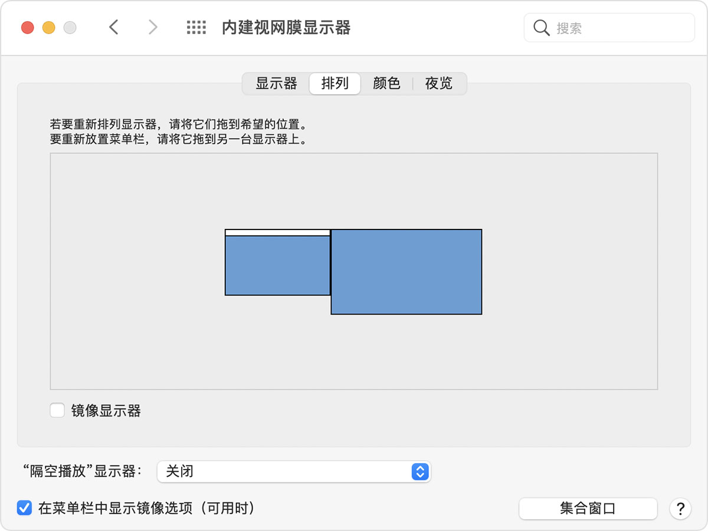
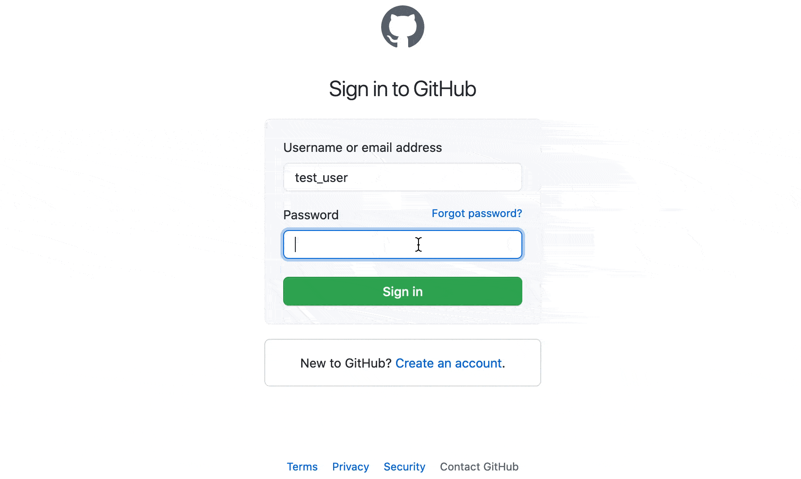

+++
title = "锤子和勺子的 N 种用法"
summary = ''
description = ""
categories = []
tags = []
date = 2021-03-12T16:46:26+08:00
draft = false
+++

[Hammerspoon](https://www.hammerspoon.org/) 是 Mac 上一款自动化工具。提供了丰富的 API，可以让用户通过 Lua 脚本来访问系统功能，包括但不限于剪贴板、窗口、键盘事件、文件系统、电池、屏幕、Wi-Fi  等。每一个扩展插件称之为 Spoon，因为项目本身是开源的，所以社区上有许多现成的 Spoon。具体可以参考 [官方 Spoon 仓库](http://www.hammerspoon.org/Spoons/) ，及 [Spoon 使用说明](https://github.com/Hammerspoon/hammerspoon/blob/master/SPOONS.md#how-do-i-install-a-spoon)。项目本身是来源自 [mjolnir](https://github.com/mjolnirapp/mjolnir)，已经有五年多了，并且最近一直有 commit，还发了版，所以凉掉是不用担心的


 [官方 Spoon 仓库](http://www.hammerspoon.org/Spoons/) 中推荐：

- [UnsplashZ](http://www.hammerspoon.org/Spoons/UnsplashZ.html)：定时更换壁纸，壁纸来源于 Unsplash。默认是自然类别图片，可以更改代码中的 `?nature` 自定义图片类别
- [AppLauncher](http://www.hammerspoon.org/Spoons/AppLauncher.html)：快捷键启动应用，Alfred 更好用一些
- [HSearch](http://www.hammerspoon.org/Spoons/HSearch.html)：快捷搜索
- [WinWin](http://www.hammerspoon.org/Spoons/WinWin.html)：窗口管理
- [PasswordGenerator](http://www.hammerspoon.org/Spoons/PasswordGenerator.html)： 快捷生成密码并且放到粘贴版中


如果对成熟配置比较感兴趣，那么可以继续参考[这篇文章](https://sspai.com/post/53992)


下面本文来讲一下，如何从 0 开始搞 Hammerspoon，并通过 3 个小例子来说明如何编写插件。阅读下面部分需要的前置条件：

- 安装 Hammerspoon
- Lua 基础，可以直接 [Learn X in Y minutes](https://learnxinyminutes.com/) 和 [Programming in Lua(市面上有中译本)](https://www.lua.org/pil/contents.html)
- 浏览器打开这个页面 [Hammerspoon-Doc](https://www.hammerspoon.org/docs/)


以下所有代码可以从 [GitHub](https://github.com/Hanaasagi/re-zero/tree/master/hammerspoon) 找到


### From scratch

hammerspoon 启动时会加载 `~/.hammerspoon` 中的文件。这个目录一般如下这个样子

```
.
|-- Spoons
|   |-- xxx.spoon
|   |   |-- init.lua
|   |   `-- docs.json
|   |-- yyy.spoon
|   |   |-- init.lua
|   |   `-- docs.json
`-- init.lua
```


`init.lua` 是入口，需要引入所有的 Spoon。Spoons 目录中存放所有的插件，插件需要以 `.spoon` 结尾，每个插件需要包含 `init.lua` 文件。Spoon 需要满足

- Spoon names should use TitleCase.
- Spoon methods/variables/constants/etc. should use camelCase.

加载一个 Spoon 需要通过内置的 API `hs.loadSpoon()`，参数为 Spoon 的名称。调用此函数后会执行对应 Spoon 下的 `init.lua` 文件。我们可以直接在 `init.lua` 上平铺写代码，也可以通过返回一个 `obj` 的方式。Hammerspoon 会自动调用 `obj`  的 `init` 方法。


首先我们在根目录的 `init.lua` 中加载我们所有的 Spoon


```lua
spoons_list = {"Archer", "Wind", "Bitwarden"}  -- 对应后文中 3 个例子的 Spoon 名称

for _, v in pairs(spoons_list) do
    hs.loadSpoon(v)
end
```


为了使我们调试更方便，我们开启 Auto Reload 功能

```lua
local pathwatcher = require "hs.pathwatcher"
local alert = require "hs.alert"

function autoReload()
    -- https://www.hammerspoon.org/go/#fancyreload
    function reloadConfig(files)
        doReload = false
        for _, file in pairs(files) do
            if file:sub(-4) == ".lua" then
                doReload = true
            end
        end
        if doReload then
            hs.reload()
        end
    end

    pathwatcher.new(os.getenv("HOME") .. "/.hammerspoon", reloadConfig):start()
    alert.show("Hammerspoon Config Reloaded")
end

```


- `hs.alert` 是可以在屏幕中央弹出字符串信息，然后自动消失
- `hs.pathwatcher` 可以监控目录和文件变更，如果有那么就执行回调函数


另外，我们在调试的时候需要打开 Hammerspoon 的 Console，借助 `hs.logger` 模块可以向打印调试日志


### Example 1 键位映射

我们首先来编写一个比较简单的 Spoon。它只作一件事情，监听键盘事件，然后决定时候更改这些事件内容。具体需求是，没有显式方向键的那种 HHKB 有点麻烦，所以使用 `Alt`/`Opt` + `hjkl` 来做方向键。其实这种需求可以直接通过 [Karabiner-Elements](https://karabiner-elements.pqrs.org/) 完成


这里我们需要借助 `hs.eventtap` 模块，它不只可以监听键盘的事件，鼠标触控板也可以的。

```lua
function listener(event)
   -- do something
end

tapper = eventtap.new({hs.eventtap.event.types.keyDown}, listener)
tapper:start()
```


`hs.eventtap.new` 函数接收两个参数，事件类型和回调函数。这里我们监听的是键盘的键按下的事件。额外说一点，键按下(KeyDown)和弹起(KeyUp)是不同的事件，这点其他编程框架也是一样的。如果我们监听弹起(keyUp)事件，那么比如我们按住方向键持续移动，这种情景是没有 KeyUp 的


下面我们实现回调函数:


```lua
-- custom leader key
local leaderKey = 'alt'
-- custom event mapping
local eventMap = {
    -- newKeyEvent(mods, key, isDown)
    h = eventtap.event.newKeyEvent({}, "left", true),
    j = eventtap.event.newKeyEvent({}, "down", true),
    l = eventtap.event.newKeyEvent({}, "right", true),
    k = eventtap.event.newKeyEvent({}, "up", true)
}

local function listener(event)
    -- Get the keyboard modifiers of an event
    local flags = event:getFlags()
    -- Get the keycode name of the event
    local keyName = keycodes.map[event:getKeyCode()]

    if not flags:containExactly({leaderKey}) then
        return
    end

    local newEvent = eventMap[keyName]
    if not (newEvent == nil) then
        return true, {newEvent}
    end
end
```


回调函数接收一个  `event` 对象并返回布尔值和新的 `event` 对象。如果布尔值为 `true` 那么会拦截掉原有的 `event` 对象，否则继续发送这个 `event` 。因为这里我们是重新映射，所以返回的是 `true`。在回调函数中我们首先判断是否按下 `Alt`/`Opt`，所以通过 `getFlags` 来提取修饰键名称。然后我们使用 `getKeyCode` 来判断是否是 `hjkl` 。最后返回新的 `event` 对象，`newKeyEvent` 参数分别为修饰键名称数组，键名称，是否按下


OK，我们这样完成了键位映射功能。可能你也发现了，Hammerspoon 实现了很多领域的功能，但是对比那些领域中的佼佼者会显得逊色


### Example 2 窗口管理

Mac 上有一个比较好用的平铺式窗口管理工具 [Amethyst](https://github.com/ianyh/Amethyst) 。我们这里使用 Hammerspoon 实现如下的窗口操作

```lua
local options = enum({
    "center",  -- 居中
    "fullscreen",  -- 全屏
    "halfleft",  -- 左半ping
    "halfright",
    "halftop",
    "halfbottom",
    "northeast",
    "northwest",
    "southeast",
    "southwest"

})

local directions = enum({"left", "right", "up", "down"})
```


我们可以定义一个函数实现平移操作

```lua
function obj:panning(direction)
    -- obj:updateOperatedAt()

    local cwin = window.focusedWindow()

    if not cwin then
        alert.show("No focused window")
        return
    end

    local cscreen = cwin:screen()
    local cres = cscreen:fullFrame()
    local wtopleft = cwin:topLeft()
    local stepw = cres.w / 30
    local steph = cres.h / 30

    if direction == directions.left then
        cwin:setTopLeft({x = wtopleft.x - stepw, y = wtopleft.y})
    elseif direction == directions.right then
        cwin:setTopLeft({x = wtopleft.x + stepw, y = wtopleft.y})
    elseif direction == directions.up then
        cwin:setTopLeft({x = wtopleft.x, y = wtopleft.y - steph})
    elseif direction == directions.down then
        cwin:setTopLeft({x = wtopleft.x, y = wtopleft.y + steph})
    end
end
```


`hs.window` 模块提供了窗口的操作。首先我们使用 `hs.window.focusedWindow` 获取到当前窗口。这里需要说明两个概念:

- window: 窗体，一个 App 可以有多个窗体
- screen: 屏幕，多个显示器有多个屏幕

Hammerspoon 这里假定一个跨越所有屏幕的网格， 原点 0,0 在主屏幕的左上角。（主屏幕左侧或上方的屏幕将具有负坐标） 




我们根据 window 对象所在的 screen 的 height, width 来计算一次移动的具体是多少。然后借助 `setTopLeft` 方法重新设置对象的左上角座标。这样我们就完成了窗口移动的函数了。再来我们编写左半屏，右半屏这种功能，`moveToUnit` 能够移动并且缩放窗口，其参数是一个 `hs.geometry` ，这个可以有多种表示形式，总之就是表示了 x, y, w, h。具体还是参考[文档](https://www.hammerspoon.org/docs/hs.geometry.html) 吧


```lua
function obj:moveAndResize(option)
    obj:updateOperatedAt()

    local cwin = window.focusedWindow()
    if not cwin then
        alert.show("No focused window")
        return
    end

    if option == options.center then
        cwin:centerOnScreen()
    elseif option == options.fullscreen then
        cwin:toggleFullScreen()
    elseif option == options.halfleft then
        cwin:moveToUnit(layout.left50)
    elseif option == options.halfright then
        cwin:moveToUnit(layout.right50)
    elseif option == options.halftop then
        cwin:moveToUnit('[0,0,100,50]')
    elseif option == options.halfbottom then
        cwin:moveToUnit('[0,50,100,100]')
    elseif option == options.northwest then
        cwin:moveToUnit('[0,0,50,50]')
    elseif option == options.northeast then
        cwin:moveToUnit('[50,0,100,50]')
    elseif option == options.southwest then
        cwin:moveToUnit('[0,50,50,100]')
    elseif option == options.southeast then
        cwin:moveToUnit('[50,50,100,100]')
    end
end

```


窗口操作函数都准备好了，接着我们要绑定快捷键。`hs.hotkey.bind` 可以新建快捷键，例如


```lua
hotkey.bind(hyper, "Left", function()
    -- do something
end)
```


不过这样有点麻烦，我们需要使用大量的绑定。键盘上面顺手的一共就那么几个键，早晚被绑定完了，除此之外窗口移动本身是内聚性高的一组操作。所以这里我们借助 Vim 的 LeaderKey 的概念，定义一个 窗口管理的 Prefix。正好 hammperspoon 也提供了这样的 API `hs.hotkey.modal`


```lua
k = hs.hotkey.modal.new('cmd-shift', 'd')
function k:entered() hs.alert'Entered mode' end
function k:exited()  hs.alert'Exited mode'  end
k:bind('', 'escape', function() k:exit() end)
k:bind('', 'J', 'Pressed J',function() print'let the record show that J was pressed' end)

```


 `cmd-shift` + `d` 进入快捷键组，我们在这个组中绑定了 `J` 这个键，显示提示信息 `Pressed J` 然后执行回调函数。`entered` 和 `exited` 都是回调函数，分别在进入和退出的时候调用。这个功能好是好，但是我们需要显示的按键才能从组中退出。一般来说， Vim 或者 tmux 这中工具都有一个超时的(或者是按键间隔时长)。这里我希望比如超过 2 秒没有按键产生，那么直接退出，恢复正常的输入状态


```lua
obj.lastOperatedAt = os.time(os.date("!*t"))


-- 每次窗口操作时更新 lastOperatedAt
function obj:updateOperatedAt()
    obj.lastOperatedAt = os.time(os.date("!*t"))
end

local checker = timer.new(0.5, function()
    local currentTime = os.time(os.date("!*t"))
    if (currentTime - obj.lastOperatedAt) >= 2 then
        k:exit()
    end
end)

function obj:init()
    k = hotkey.modal.new('alt', 'w')

    function k:entered()
        -- obj:showStatus()

        if not checker:running() then
            checker:start()
        end
    end

    function k:exited()
        -- obj:hideStatus()
        if checker:running() then
            checker:stop()
        end
    end
end
```


因为没有直接的 API 做这个事情，所以启一个定时器，每隔 0.5 秒检查一下最近 2 秒内是否进行过窗口操作就行了


在进行窗口操作的时候，我希望有一个显示的提示，比如 Vim 中 Normal/Insert Mode 的提示一样，确切的知道自己处于何种模式中，免得瞎按键误操作。万能的 hammerspoon 还提供了 `hs.canvas` 这种绘图的 API


```lua
function obj:showStatus()
    if self.statusInfo == nil then
        statusInfo = canvas.new({x = 0, y = 0, w = 0, h = 0})
        statusInfo:insertElement({
            type = "text",  -- 文本类型
            text = "wMode",  -- 文本内容
            textFont = "Impact",
            textSize = 128,
            textColor = {hex = "#1891C3"},  -- 颜色
            textAlignment = "center"  -- 居中
        })

        self.statusInfo = statusInfo
    end
  
    local mainScreen = screen.mainScreen()
    local mainRes = mainScreen:fullFrame()
    statusInfo:frame({
        x = (mainRes.w - 512) / 2,
        y = (mainRes.h - 256) / 2,
        w = 512,
        h = 256
    })

    self.statusInfo:show()
end

function obj:hideStatus()
    if self.statusInfo == nil then
        return
    end
    self.statusInfo:hide()
end
```


我们这里使用的是文字类型的 `Element` ，canvas 对象的 frame 属性需要每次设置的，因为换了切换屏幕后宽和高都会改变的


### Example 3 简化 Bitwarden 密码管理

效果如下图，这个 Spoon 目前还没有发现替代品 (￣_,￣ )


P.S. 本 GIF 中黑点的数量不代表密码的真实密码的长度


这个 Spoon 需要结合 Bitwarden 一起使用，并且需要安装 Bitwarden-cli。因为其实是调用的 Shell Command，用到了 `lock`, `unlock`,  `get` 这 3 个命令，用法可以参考 [The Bitwarden command-line tool (CLI)](https://bitwarden.com/help/article/cli/)


我们首先封装一下 Bitwarden-cli 的几个命令

```lua
local bitwarden = {}

function bitwarden:lock()
    hs.execute([[ /usr/local/bin/bw lock ]], true)
end

function bitwarden:unlock(password)
    local output, status = hs.execute(string.format(
                                          [[ /usr/local/bin/bw unlock '%s']],
                                          password), true)
    if not status then
        alert.show("Login Failed")
        logger:e(string.format("Login Failed, the bw cli returns: %s", output))
        return false, ""
    end

    -- A trick way: grep the bitwarden cli output
    local sessionKey = string.match(output, '%"[%w%p]+%"') -- with quotes
    if not sessionKey then
        alert.show("Could not find the session text from the bw command output")
        logger:e(string.format(
                     "session key grep failed, the bw cli returns: %s", output))
        return false, ""
    end

    return true, sessionKey
end

function bitwarden:getPassword(itemName, sessionKey)
    output, status = hs.execute(string.format(
                                    [[ /usr/local/bin/bw get password "%s" --session %s]],
                                    itemName, sessionKey), true)
    if not status then
        alert.show("Get Item Password Failed")
        logger:e(
            string.format("get item failed, the bw cli returns: %s", output))
        return false, ""
    end

    return true, output
end
```


步骤是，根据用户的 Master Password 进行 `unlock`，拿到 session 后获取到用户指定 Name 下的 Password，最后 `lock` 销毁当前的 session。session 是使用正则从 `unlock` 命令的结果中扣出来的，有点 Low


因为需要用户输入密码，这里需要使用 `hs.dialog` 模块中的 `textPrompt`。这个就是输入文本框，和 JS 差不多的。


```lua
function askBwPassword()
    local app = application.frontmostApplication()
    local win = window.focusedWindow()

    -- Firstly, we unlock the bitwarden vault.
    hs.focus() -- need manually focus: https://github.com/Hammerspoon/hammerspoon/issues/1561
    local button, password = dialog.textPrompt("Your Bitwarden password", "",
                                               "", "OK", "Cancel", true)
    if button == "Cancel" then
        return
    end

    local status, sessionKey = bitwarden:unlock(password)
    if not status then
        return
    end

    -- Secondly, we ask for the item.
    local button, itemName = dialog.textPrompt("Which Item", "", "", "OK",
                                               "Cancel", false)
    if button == "Cancel" then
        bitwarden:lock()
        return
    end

    local status, itemPassword = bitwarden:getPassword(itemName, sessionKey)
    if not status then
        bitwarden:lock()
        return
    end

    bitwarden:lock()
    -- Thirdly, send the keyboard events to the app and focus the window.
    eventtap.keyStrokes(itemPassword, app)
    -- hs.pasteboard.setContents(itemPassword)
    win:focus()
end
```


我们使用两个 ``textPrompt`` ，第一个要密码，第二个需要 Name。我们需要实现密码直接输入到之前 focus 的文本框中，那么首先我们需要获取到当前聚焦的 app 和 window(一个 app 可以有多个 window)。通过 `hs.eventtap.keyStrokes` 发送模拟键盘事件到 App 中，然后还原窗口聚焦。这样一般我们再敲一下回车就可以登录了


Bitwarden 在浏览器上是有扩展插件的，但是这个 Spoon 解决了在所有 App 中输入密码的问题


### Next Step

编写插件，自娱自乐 <(￣ˇ￣)/


### Reference 

- [Hammerspoon-Docs](https://www.hammerspoon.org/docs)
- [Getting Started with Hammerspoon](https://www.hammerspoon.org/go/)
-  [Programming in Lua](https://www.lua.org/pil/contents.html)
- [awesome-hammerspoon](https://github.com/ashfinal/awesome-hammerspoon)


    