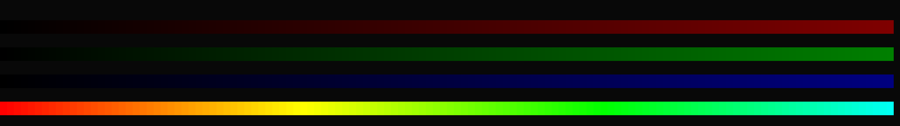

+++
title = "ANSI Escape Sequences"
summary = ''
description = ""
categories = []
tags = []
date = 2021-04-19T04:27:37+08:00
draft = false
+++

*本文是科普向的文章，介绍了 Ansi Escape Sequences 在日常编码生活中的作用*

Ansi Escape Sequences 可以用于控制 cursor 的位置，颜色；字体样式以及作为 Terminal 的控制命令使用。所有序列都以 `ESC` 字符开头，第二个字符则是所在分类的标识。

`ESC` 字符等价于

- Ctrl-Key: `^[`
- 八进制: `\033`
- Unicode: `\u001b`
- 十六进制: `\x1b`


比如下面的代码是等价的，均输出红色的 `hello world`

```
In [7]: print("\033[31m{message}\033[0m".format(message="hello world"))
hello world

In [8]: print("\x1b[31m{message}\x1b[0m".format(message="hello world"))
hello world

In [9]: print("\u001b[31m{message}\u001b[0m".format(message="hello world"))
hello world
```


通常我们接触到比较多的分类就是:

- `ESC ]`： OSC – 操作系统命令（Operating System Command）

- `ESC [`： CSI - 控制序列导入器（Control Sequence Introducer）


所有分类可以参考 [Wiki](https://en.wikipedia.org/wiki/ANSI_escape_code)


### CSI 序列


#### 文本渲染

在终端输出颜色是最常见的，比如 Python 中的颜色库 [colorama](https://github.com/tartley/colorama)，其原理便是用到了 CSI 序列。在 3 bit 下前景色和背景色格式均为 `\033[{颜色码}m`，是通过颜色码的值范围来区别的。前景色占 `[30, 37]`，背景色则为 `[40, 47]`。`\033[0m`则可以重置我们的颜色和样式。所以我们可以将需要特殊渲染的文本放在 `\033[{i}m` 和`\033[0m`中间


对于 3 bit 的前颜色，可以由如下代码输出

```python
colors = ["Black", "Red", "Green", "Yellow", "Blue", "Magenta", "Cyan", "White"]

for name, i in zip(colors, itertools.count(30)):
    print(f"\033[{i}m{name}\033[0m")
```


对于 4 bit 颜色，就是在 3 bit 颜色的基础上增加了色彩深度。格式为 `\033[{颜色码};1m` 的表示亮色，就是在 3 bit 的基础上添加了 `;1` 字符。关于不同 bit 下的颜色可以参考 [色彩深度](https://zh.wikipedia.org/zh/%E8%89%B2%E5%BD%A9%E6%B7%B1%E5%BA%A6)


```
In [32]: for name, i in zip(colors, itertools.count(30)):
    ...:      print(f"\033[{i};1m{name}\033[0m")
    ...:
```


而对于 8 bit 颜色，因为如果要直接塞，占用的数值空间太大。这里就二级编码了，格式则变成了

- 前景色`ESC[38;5;{颜色码}m`
- 背景色`ESC[48;5;{颜色码}m`

这里颜色码的范围是 0 到 255

```
In [33]: for i in range(256):
    ...:     print(f"\033[38;5;{i}m{i:6}\033[0m", end='')
    ...:     if (i + 1) % 16 == 0:
    ...:         print()
    ...:

```


上述代码运行结果可以参考下图


最后我们来看看 24 bit 颜色，即我们所说的 True Color 是怎么表示的。目前支持 True Color 的终端可以在这份[列表](https://gist.github.com/XVilka/8346728#now-supporting-true-color)中找到 ，或者执行这个[脚本](https://github.com/gnachman/iTerm2/blob/master/tests/24-bit-color.sh)。这个脚本便是利用的转义序列




24 bit 下的格式为

- 前景色 `ESC[38;2;{r};{g};{b}m`
- 背景色 `ESC[48;2;{r};{g};{b}m`


其中 `{r} {g} {b}` 代表的是 RGB 颜色值。


除了颜色上的控制，我们也可以使用转义序列来控制字体风格:


- `\033[2m`  set dim/faint mode

- `\033[3m`  set italic mode

- `\033[4m`  set underline mode 

- `\033[5m`  set blinking mode 

- `\033[7m`  set inverse/reverse mode 

- `\033[8m`  set invisible mode  

- `\033[9m`  set strikethrough mode


#### 光标控制

其次我们经常用 curl 或者 wget 这种命令，或者我们安装某个 Package 的时候，都会有进度条。

```
test.zip  100%[=====================================================>]  21.90K  --.-KB/s    in 0.02s
```

这其实也可以通过 Ansi Escape Sequence 来做到。我们需要控制 cursor 的位置，因为需要在同一行上反复刷新内容


- 向上: `\033[{n}A`

- 向下: `\033[{n}B`

- 向右: `\033[{n}C`

- 向左: `\033[{n}D`

  

`{n}` 为移动的字符数目，如果移动字符数目超过当前的字符数目，则不会继续移动。比如当前 cursor 在 50 字符的位置，那么 `\033[1000D` 不会将 cursor 移动到上一行，会停在本行的最左侧。


```Python
import time


def loading():
    total = 100

    for i in range(1, total + 1):
        print(
            "\033[1000D{percent:3}%  [{process:<50}]".format(
                percent=i, process="=" * int((i / 100 * 50))
            ),
            end="",
            flush=True,
        )
        time.sleep(0.05)


loading()
```


以此类推，可以实现多行的进度条

```Python
import time
import operator
import random
import functools


def one_loading(percent: int) -> None:
    print(
        "\033[1000D{percent:3}%  [{process:<50}]".format(
            percent=percent, process="=" * int((percent / 100 * 50))
        ),
        end="",
        flush=True,
    )


def multi_loading(count: int) -> None:
    process = [0] * count
    current_cursor = 0

    while True:
        if all(map(functools.partial(operator.eq, 100), process)):
            break

        for idx, current_percent in enumerate(process):
            next_percent = min(current_percent + random.randint(1, 10), 100)

            if current_cursor > idx:
                print(
                    "\033[{n}A".format(n=abs(current_cursor - idx)), end="", flush=True
                )
            elif current_cursor < idx:
                print(
                    "\033[{n}B".format(n=abs(current_cursor - idx)), end="", flush=True
                )

            current_cursor = idx
            process[idx] = next_percent
            one_loading(next_percent)
            time.sleep(0.01)


multi_loading(4)
```

除此之外还有更多的光标控制序列，可以参考文档


### OSC 序列

关于 OSC 序列，每个终端支持程度不一样。有些还有自定义的 OSC 序列，可以参考以下内容:

- Xterm https://invisible-island.net/xterm/ctlseqs/ctlseqs.html#h3-Operating-System-Commands
- ITerm2 https://iterm2.com/documentation-escape-codes.html


#### OSC 52

如果我们想在 ssh 后的 shell 中复制一段文本，最简单的方式是使用鼠标选中然后复制。如果没有鼠标，我们该如何做呢？OSC 52 可以在这个时候帮助我们。格式为 `'\033]52;{clipboard};{base64_data}\07'`。其中的 `clipboard` 用于选择使用哪个剪贴板，主剪贴板是 `c`,`base64_data` 则是 base64 编码(RFC-4648)后的内容。此操作需要在 Terminal 中勾选 "Applications in terminal may access clipboard" 的选项(如果有的话，比如 ITerm2)，不同 Terminal 操作不同，可以 Google。我们可以在执行下面的代码，然后查看自己的粘贴版中的内容是否为 `hello`


```Python
print('\033]52;c;aGVsbG8=\07')  # Python code
```


如果我们在 TMUX 下，那么我们需要使用额外的字符编码才能生效。格式为


```Python
print("\033Ptmux;\033\033]52;c;aGVsbG8=\x07\033\\")  # Python Code
```


对于 Vagrant + Vim 的用户，可能对于这个 [hterm/osc52.vim](https://chromium.googlesource.com/apps/libapps/+/master/hterm/etc/osc52.vim) 比较熟悉。我一直以来也是用的这个脚本，但是这有个问题就是复制的时候会闪一下。写这篇文章的时候看了一下源代码。闪屏的原因是因为


```
exec("silent! !echo " . shellescape(a:str))  " Vim Code
```


`!echo` 是执行的 shell 命令，会让 Vim 切回 Shell 环境中，然后再切回来。改进的方法就是直接向 Shell 进程 的 STDOUT 输出。可以参考 [remove-copy.vim](https://github.com/Hanaasagi/remote-copy.vim)


### Reference  

- [ANSI Escape Sequences - Github Gist](https://gist.github.com/fnky/458719343aabd01cfb17a3a4f7296797)  
- [ANSI escape code - Wikipedia](https://en.wikipedia.org/wiki/ANSI_escape_code)

    