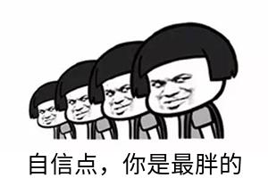
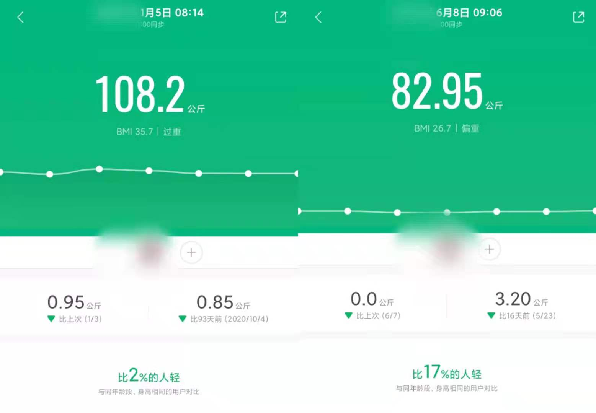
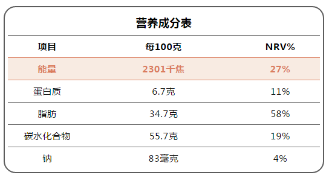
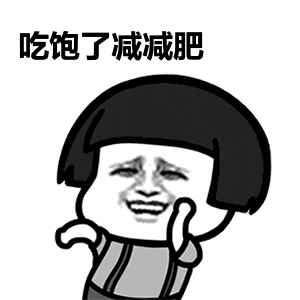
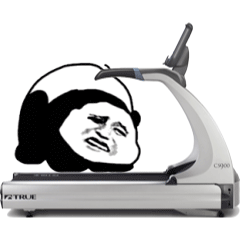

+++
title = "关于我减重25KG这档事"
summary = ''
description = ""
categories = []
tags = []
date = 2021-06-16T15:40:10+08:00
draft = false
+++

分享一下本人的减重经历和体会。~~犹豫再三还是决定放出图~~

减重的一个核心原则就是：**消耗热量大于摄入热量** 。我们可以通过运动提升我们的消耗热量，通过控制饮食来减少摄入热量。如果采用控制饮食而不运动的方式，那么一旦恢复以前的饮食状态，那么还是会重新进入摄入热量大于消耗热量的状态

下面会分为几个方面来说一下这半年来我采用的一些做法

  * [饮食篇](#---)
      - [营养成分表](#-----)
      - [减少食量](#----)
      - [减少碳水摄入](#------)
      - [料理方法](#----)
      - [间歇性断食/生酮](#--------)
      - [增加肉类的摄入](#-------)
  * [运动篇](#---)
      - [户外运动](#----)
      - [室内运动](#----)
      - [HITT](#hitt)
      - [左旋肉碱](#----)
  * [心理篇](#---)
      - [卡路里的罪恶感](#-------)
      - [枯燥乏味](#----)
  * [扩展阅读](#----)

## 饮食篇

#### 营养成分表

基本上带包装的食物都会有这张表的，这个需要留意一下

表中的“NRV%”（营养素参考值）指的是，100g食品中该营养素的含量，占该营养素每日摄入量的比例。

这个表的作用在于能够有效的产生罪恶感，抑制食欲。不推荐拿着计算器来算每日摄入的热量，这个算起来很复杂而且不准确，我想吃之前没有人会测一下多少克的吧。。。心里上有个数就好了。有些知名的品牌快餐可以在网路上查找到热量表，比如麦当劳(实际金拱门)的[营养计算器](https://www.mcdonalds.com.cn/nutrition_calculator)。或者使用薄荷的 APP，上面也有全面的热量表信息

#### 减少食量

这里不是在建议节食。

一个最简单的办法就是将碗换成小一号的，对于体重基数大的我，这个效果十分明显。在减重的第一周内就明显的看到了体重的下降，不过不能完全断定是因为这个导致的，因为第一周我也开始了运动。减少食量并没有产生生理上的饥饿感觉，但是心理上总觉得没有吃饱。。。我采用了两种办法来缓解：

- 尽早刷牙，个人而言有刷牙后不吃东西的强迫症
- 通过咀嚼口香糖(无糖)，给予心里上的慰藉

需要反复试验吃什么，吃多少能够满足自己的营养需求，同时不会引起饥饿感。找到这个窗口的下限 

#### 减少碳水摄入

首先要做的就是少吃糖，比如巧克力这种能够带来幸福感的甜美毒药。能不吃就不吃，尤其是含代可可脂的产品。这种高糖的食物通常还会含有很多的脂肪。虽然脂肪的摄入是必不可少的，但通过摄入肉类的途径是一个更好的选择

其次，减少高碳水的主食的摄入。包含下面常吃的几种：

- 米饭
- 常见的面食(精制)，如面条，馒头...
- 土豆，红薯

这里有一种说法就是避免吃高 GI 的食物。

GI 指的是升糖指数，GI 越高意味着使用食物后血糖上升速度越快，导致胰岛素增加，然后在胰岛素的作用下储存起来，方便之后使用。储存的方式有两种。首先会以肝糖原的形式储存在肝脏(glycogenesis)。但肝脏储存量有限，多余的糖就会以脂肪的形式囤积在身体各处(lipogenesis)

低 GI 的食物代表是粗粮制品，比如网路上各大减重食品店里的黑麦面包。这里我要说一下，某鲨牌的黑麦面包是真的难吃，我都怀疑自己吃得是不是塑胶。另外还有特制的食物，比如焙朗的那种饼干。这个和平常的饼干味道差不多，一不小心就会再撕开一包🤣

本人是米饭党，开始的时候觉得不吃就不吃吧。主食的戒断在一两周左右就很痛苦了，这违背了自己二十多年的饮食习惯(米饭真香)。后来找到的一种办法就是西兰花，这个东西吃下去饱腹感是真的强。后来我也不是完全远离这些，一周会有两三餐是吃精制碳水的

下面的两个方式可以避免掉该吃什么的疑惑

- 网上搜索
- 直接外卖 APP 搜减脂餐

#### 料理方法

高端的食材往往只需要最朴素的烹饪方式，那就是清水煮一下。为了不忘记那种醉人的味道，油炸还有烧烤偶尔吃一下就可以了，吃得时候也要注意不要一次吃很多。另外这里着重提一点：调味料。很多调味料是高热量的，比如花生酱、老干妈这类。一手拿着黑麦面包，然后抹上厚厚的花生酱，咬伤一口，眼角滑下负罪感的泪滴😢

#### 间歇性断食/生酮

生酮饮食这个要求太高了，而且有没有进入生酮的状态需要试纸测尿液的，因此这个没有试过。间歇性断食是我在减重约一个月后采用的方法，断食的模式是 16: 8，即 16 小时不进食，在另外的 8 小时内进食。就我而言是 9 点多吃一顿，然后 16 点多吃一顿。视个人情况而定吧，我觉得上班族做到这个挺难的

<iframe width="560" height="315" src="https://www.youtube.com/embed/RfiRjYUH9JQ" title="YouTube video player" frameborder="0" allow="accelerometer; autoplay; clipboard-write; encrypted-media; gyroscope; picture-in-picture" allowfullscreen></iframe>

#### 增加肉类的摄入

如果减重期间有运动的话，是需要增加蛋白质的摄入的。如果之前摄入的就很多，那么就不需要增加了。一方面是肉类里的蛋白质参与肌肉的修复和增长，另一方面可以长时间保持饱腹感。最重要的是吃肉很爽呀

肉类推荐鸡胸肉，避免高油高盐的料理方法。

## 运动篇

运动需要遵循两个字： 坚持。这一篇章结束(误)。适合自己的运动才是正确的。个人而言是按照这个流程走的，运动后请做拉伸，据说可以利于肌肉的恢复生长

#### 户外运动

1. 快走(5km)  + 跳绳 10min  
2. 快走(5km)  + 跳绳 15min
3. ...
4. 快走(8km) + 跳绳 40min
5. 跑步 + 快走(8km) + 跳绳
6. ...
7. 跑步5km + 跳绳

可以看到上面是一个循序渐进的过程。我是根据自己的心率作为依据来判断的，测量的装备就是手环/手表之类的。在最开始的一周，我尝试过慢跑，但是发现跑了几步之后小腿正前方的部分会疼，查了一下说这是和脚掌着地的姿势有关？？？我姿势改来改去还是疼，最后就选择快走了。快走我会维持在心率 140 左右，如果心率不够就跑几步。由于体重基数大，跑几步心率很快就会上来了。跳绳也是，最开始的时候撑死跳 10 分钟的，喘不动气感觉要狗die，后来慢慢往上加

#### 室内运动

- 哑铃 2kg -> 5kg
- 弹力绳
- 健腹轮(吃灰中)

这个下一个 Keep APP(非广告) 就好了，每天锻炼一下。力量训练可以增加肌肉，提高基础代谢。同样的采取循序渐进的方式，开始的时候不要太猛，要不然第二天起床的时候疼得要死。弹力绳这个器具蛮好用的，可以缠手上做扩胸，或者绕脚掌帮助做卷腹。友情提醒一下，弹力绳用的时候记得穿衣服，当心大力出奇迹被崩到。至于健腹轮，这个我很长时间没有用了。做不起来的话，可以在健腹轮路径前方放哑铃或者其他物品，缩短距离。但这样感觉没什么效果，总感觉回拉的时候是屁股在用力。。。

#### HITT

这个做了想吐，有能力的大佬就跟着做吧。我反正从里面找了挑了几个容易做的，当作补充运动来做的

#### 左旋肉碱

这个我试过，没有显著效果。可能是因为自己减重的速率已经达到极限了？原因不清楚，吃的话可以有安慰剂的作用，可以选择不吃

## 心理篇

这个其实蛮重要的，一旦开始减重就想要迫切的看到体重的下跌。如果发现体重上升了，就会有一种难受的感觉，觉得自己付出了却没有回报，从而当日只想躺尸。减重是一个长期的过程，基本上可以以周为单位来看变化的。对于我来说这个就是一个波形的，但是总体下降。比如前一天明明吃得少，但是第二天体重上升的质量大于昨日的进食量。还有有时候会两周体重基本持平，但是下一周发现体重每天都在掉。顺便一提不要去买啥体脂称，作为已经被收了智商税的过来人由衷提醒。这个买了也是当作体重称来用

#### 卡路里的罪恶感

控制饮食后会出现的心理症状，吃东西的时候会有负罪感。如果产生了这种情况建议缓一下，吃点想吃的。比如前几天还吃了原味鸡的我也一样在减重。。。如果当天摄入的比较多，那么就多运动补偿回来

#### 枯燥乏味

这个我是在运动的时候感切颇深，因为这实际上就是在重复...重复是枯燥的，久而就不会想要运动了。这里我一般是通过转移注意力来解决的。跑步的时候可以听 Podcast, 举哑铃的时候看 Anime。总之让身体去运动，让脑子做别的事情

## 扩展阅读

- [Thomas阿福 - YouTube Channel](https://www.youtube.com/watch?v=RU1yASLP7Go&list=PLFMHvP96ItaudrR61BoKIRSSRq0ildc3a&index=1)
- [shuaisoserious - YouTube Channel](https://www.youtube.com/watch?v=fvSIe-MbdfI)
- [Dr. Eric Berg DC - YouTube Channel](https://www.youtube.com/c/DrEricBergDC/videos)

    