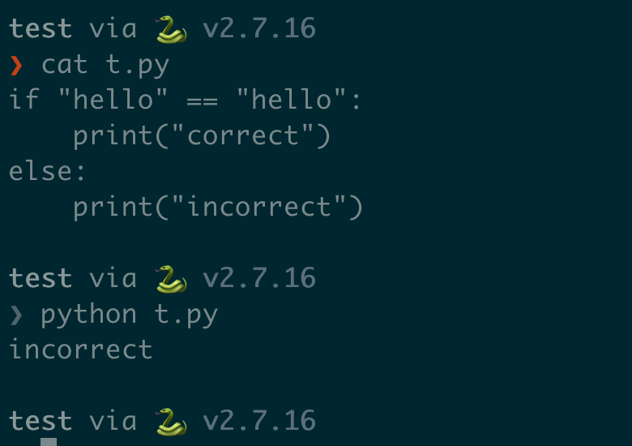
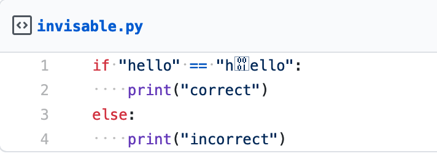
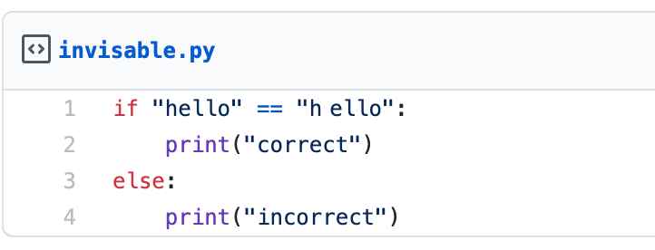
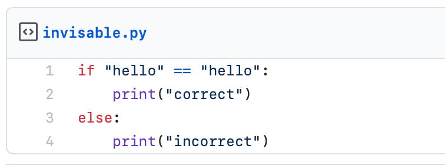
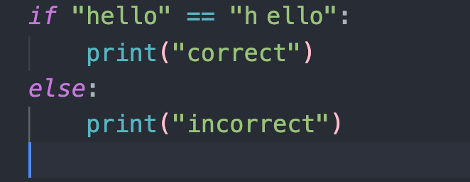
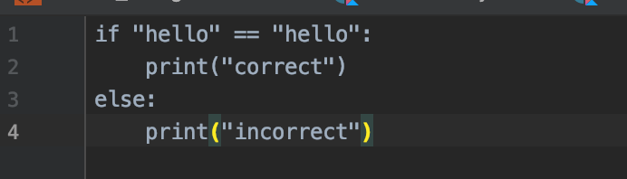

+++
title = "如果 Bug 会隐身"
summary = ''
description = ""
categories = []
tags = []
date = 2021-06-30T14:47:00+08:00
draft = false
+++

今天要来讲一个魔幻的故事。这个故事发生在约两年前，在 Review 别人代码的时候发现了一个神奇的事情，有一个字符我能看到，但是周围的同时不能看到。为了还原这种场景，请看下面的代码：




为什么脚本的输出是 `incorrect` 呢？


因为这个脚本中有一个神奇的字符[``]，就是中括号内的那个。你看不到不需要觉得奇怪，这并不是一个类似于皇帝的新衣的故事。为了验证这个字符的存在，可以使用 Hexdump 来校验


```
$ hexdump -C t.py
00000000  69 66 20 22 68 65 6c 6c  6f 22 20 3d 3d 20 22 68  |if "hello" == "h|
00000010  01 65 6c 6c 6f 22 3a 0a  20 20 20 20 70 72 69 6e  |.ello":.    prin|
00000020  74 28 22 63 6f 72 72 65  63 74 22 29 0a 65 6c 73  |t("correct").els|
00000030  65 3a 0a 20 20 20 20 70  72 69 6e 74 28 22 69 6e  |e:.    print("in|
00000040  63 6f 72 72 65 63 74 22  29 0a                    |correct").|
0000004a
```


在第二行的开头，有一个十六进制的 `\x01` ，这个字符的名称是 `SOH` ，属于不可见字符。在 2018 年的时候，Firefox Nightly 能够以一种特殊形式显示这个字符，在 Chrome 中则不行。Vim 可以以灰色`^A`显示这个字符，而 PyCharm 则不行。这个字符是怎么出现在代码中的，我并不知道。。。。


今天突然想起这回事，还是因为这个 [issue](https://github.com/aio-libs/aiohttp/issues/5730)，请求一个 URL，`aiohttp` 的 Client 返回的 `invalid character in header`。然后就 `curl` 查 header，查了半天发现有一个 `\x01` 混在里面。。。终端里面 `curl` 打印的内容是无法察觉到这个字符的，用 `unparse` 的显示也不行，真的是天坑


### 附录：常见 APP 显示测试

包含这个字符的代码放到了 [Gist](https://gist.github.com/Hanaasagi/58f34a6d3e1920a7be085986abf0e905) 上，可以自行测试自己所使用的 APP 的显示情况

#### Firefox Nightly 91.0a1 ✅




#### Chrome  91.0.4472.114 ✅





#### Safari 14.1.1 (16611.2.7.1.4) ❌





#### Vscode 1.57.1 ✅





#### Android Studio 4.0 ❌



~~ 因为没有 PyCharm 所以拿 Android Studio 顶包 ~~
    