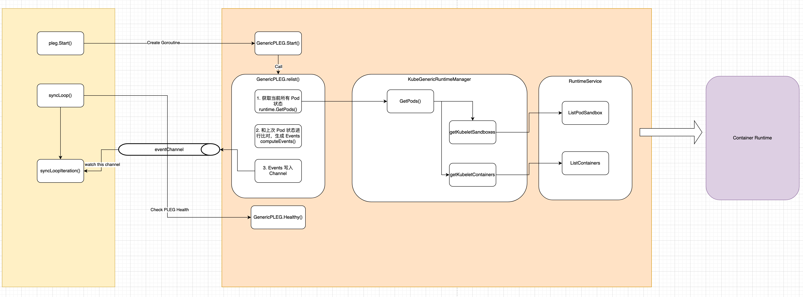

+++
title = "Kubernetes 源码剖析 — kubelet PLEG"
summary = ''
description = ""
categories = []
tags = []
date = 2021-07-03T13:50:00+08:00
draft = false
+++

*本文代码基于Kubernetes v1.21.2, commit sha 为 `092fbfbf53427de67cac1e9fa54aaa09a28371d7`*


继续上一篇文章，本文对于 pkg/kubelet/kubelet.go:1459 中的 PLEG 进行展开

```golang
func (kl *Kubelet) Run(updates <-chan kubetypes.PodUpdate) {
    // .. 省略之前的代码
	// Start the pod lifecycle event generator.
	kl.pleg.Start()
	kl.syncLoop(updates, kl)
}
```


### What is PLEG?

PLEG 的全称是 Pod Lifecycle Events Generator(Pod 生命周期事件生成器)。kubelet 是每个节点的 agent，负责管理节点上的 Pod，并使它们运行到 Spec 中期望的状态。为了实现这一目标，kubelet 需要对于 Pod Spec 和 Container 的状态变化作出反应。对于 Spec 的变化，kubelet 会从多个来源来观测这一改动；对于 Container 状态变化，kubelet 采用定时轮询的方式去获取容器的最新状态。但是随着 Pod/Container 的数量增加，轮询会产生很大的开销。并且 kubelet 对于每一个 Pod 都有一个 goroutine 进行管理，这个会在后面的文章中分析 PodWorker。在没有 PLEG 之前，是直接查询 Container 状态的所以会导致周期性大量并发的请求到 Container Runtime，造成性能问题。PLEG 的引入便是为了解决这个问题:

- Reduce unnecessary work during inactivity (no spec/state changes)
- Lower the concurrent requests to the container runtime.


为了生成 Pod 生命周期事件，PLEG 需要检测 Container 状态的变化。 与之前的方案相比较，虽然也是轮询，但是PLEG 是单 goroutine 的，计算出事件后，之后相关的 Pod Worker 会被唤醒进行工作。虽然有些 Container Runtime 会有自己的事件，但是 PLEG 并没有进行对接，依旧采用定时轮询对比前后两次状态来生成的事件


关于 PLEG 的详细设计可以参考 [官方文档](https://github.com/kubernetes/community/blob/master/contributors/design-proposals/node/pod-lifecycle-event-generator.md)


PLEG 相关的代码位于 pkg/kubelet/pleg 目录下。首先我们来看 `kubelet` 结构体中的 `pleg` 的定义，它的类型是 `PodLifecycleEventGenerator` interface


```golang
// PodLifecycleEventGenerator contains functions for generating pod life cycle events.
type PodLifecycleEventGenerator interface {
	Start()  // 生产 PodLifecycleEvent 到 channel
	Watch() chan *PodLifecycleEvent  // 直接返回了 channel
	Healthy() (bool, error)
}
```


我们将围绕上面 3 个函数进行展开，分析 PLEG 对外提供的功能。PLEG 中定义了 4 中事件类型

pkg/kubelet/pleg/pleg.go:24

```golang
type PodLifeCycleEventType string

const (
	// ContainerStarted - event type when the new state of container is running.
	ContainerStarted PodLifeCycleEventType = "ContainerStarted"
	// ContainerDied - event type when the new state of container is exited.
	ContainerDied PodLifeCycleEventType = "ContainerDied"
	// ContainerRemoved - event type when the old state of container is exited.
	ContainerRemoved PodLifeCycleEventType = "ContainerRemoved"
	// PodSync is used to trigger syncing of a pod when the observed change of
	// the state of the pod cannot be captured by any single event above.
	PodSync PodLifeCycleEventType = "PodSync"
	// ContainerChanged - event type when the new state of container is unknown.
	ContainerChanged PodLifeCycleEventType = "ContainerChanged"
)
```


### `GenericPLEG.Start`

`Start` 函数会创建一个 goroutine，核心的逻辑位于 `relist` 函数中

pkg/kubelet/pleg/generic.go:130

```golang
// Start spawns a goroutine to relist periodically.
func (g *GenericPLEG) Start() {
    // relistPeriod 值为 1 秒，在创建 PLEG 结构体的时候传入
	go wait.Until(g.relist, g.relistPeriod, wait.NeverStop)
}
```


我们把此函数拆为两部分来看，第一部分比对新旧所有的容器，然后生成对应的 Event

pkg/kubelet/pleg/generic.go:190 

```golang
// relist queries the container runtime for list of pods/containers, compare
// with the internal pods/containers, and generates events accordingly.
func (g *GenericPLEG) relist() {
    timestamp := g.clock.Now()
    // .. 省略: Prometheus 的 metrics 相关逻辑
	// 1. Get all the pods. 参数为 true 的时候会包含 exited and dead containers
	podList, err := g.runtime.GetPods(true)
    // 更新最近一次执行的时间，在 Healthy 函数中会用到
    g.updateRelistTime(timestamp)
	pods := kubecontainer.Pods(podList)
    // 存储此次运行的 All Pods
	g.podRecords.setCurrent(pods)

	// 2. Compare the old and the current pods, and generate events.
	eventsByPodID := map[types.UID][]*PodLifecycleEvent{}
    // podRecords 是一个 Map 结构，key 为 POD_ID，value 则为一个 POD Record，每一个 Record 保存了 OLD 和 CURRENT 信息
    // type podRecord struct {
    // 	old     *kubecontainer.Pod
    // 	current *kubecontainer.Pod
    // }
    // type podRecords map[types.UID]*podRecord
    
    // 3. 全量比较每一个 POD(此次/上次)下的容器差别，然后生成对应的事件
	for pid := range g.podRecords {
		oldPod := g.podRecords.getOld(pid)
		pod := g.podRecords.getCurrent(pid)
		// Get all containers in the old and the new pod.
        // 这个函数返回 POD 下的 container 和 sandbox (pause container)
		allContainers := getContainersFromPods(oldPod, pod)
		for _, container := range allContainers {
            // 生成 event
			events := computeEvents(oldPod, pod, &container.ID)
			for _, e := range events {
                // 等价于 	eventsByPodID[e.ID] = append(eventsByPodID[e.ID], e)
				updateEvents(eventsByPodID, e)
			}
		}
	}
   
    // ... 接下文
}
```

基本逻辑就是将当前的 Pod 列表和上一次 relist 的 Pod 列表进行对比之后，就会针对每一个变化生成相应的 Pod 级别的事件

对比并生成事件的函数为 `computeEvents`，pkg/kubelet/pleg/generic.go:333

```golang
func computeEvents(oldPod, newPod *kubecontainer.Pod, cid *kubecontainer.ContainerID) []*PodLifecycleEvent {
	var pid types.UID
	if oldPod != nil {
		pid = oldPod.ID
	} else if newPod != nil {
		pid = newPod.ID
	}
    // 定义在 pkg/kubelet/pleg/generic.go:410
    // FindContainerByID and convertState
	oldState := getContainerState(oldPod, cid)
	newState := getContainerState(newPod, cid)
	return generateEvents(pid, cid.ID, oldState, newState)
}
```


`getContainerState` 根据 `cid`(containerId) 在 POD 的 `Containers` 和 `Sandboxes` 中查找对应的 container，然后将 state 转换成 `plegContainerState`。对应的映射关系如下，pkg/kubelet/pleg/generic.go:86 `convertState` 的内容

- `ContainerStateCreated` => `plegContainerUnknown`
- `ContainerStateRunning` => `plegContainerRunning`
- `ContainerStateExited` => `plegContainerExited`
- `ContainerStateUnknown` => `plegContainerUnknown`

然后我们来实际生成事件的函数 `generateEvents`，此函数接收新旧两个 `State` 然后返回对应事件

```golang
func generateEvents(podID types.UID, cid string, oldState, newState plegContainerState) []*PodLifecycleEvent {
	if newState == oldState {
		return nil
	}

    switch newState {
	case plegContainerRunning:
		return []*PodLifecycleEvent{{ID: podID, Type: ContainerStarted, Data: cid}}
	case plegContainerExited:
		return []*PodLifecycleEvent{{ID: podID, Type: ContainerDied, Data: cid}}
	case plegContainerUnknown:
		return []*PodLifecycleEvent{{ID: podID, Type: ContainerChanged, Data: cid}}
	case plegContainerNonExistent:
		switch oldState {
		case plegContainerExited:
			// We already reported that the container died before.
			return []*PodLifecycleEvent{{ID: podID, Type: ContainerRemoved, Data: cid}}
		default:
			return []*PodLifecycleEvent{{ID: podID, Type: ContainerDied, Data: cid}, {ID: podID, Type: ContainerRemoved, Data: cid}}
		}
	default:
		panic(fmt.Sprintf("unrecognized container state: %v", newState))
	}
}
```

其实这里的模型就是状态机，不过不是一般的给予状态 A 加状态转移函数，然后跳转到 B 这种。而是给予状态 A 和 状态 B，返回了从 A 到 B 的状态转移的名称


得到 Events 后，我们接着看 `relist` 函数的后半部份

```golang
func (g *GenericPLEG) relist() {
	// .. 承上
	for pid, events := range eventsByPodID {
        // 这里省略开启 Cache 后需要更新 Cache 并且判断是否需要二次核对的逻辑
		pod := g.podRecords.getCurrent(pid)
		// Update the internal storage and send out the events.
        // 更新 podRecord，将 current 赋值到 old，然后将 current 赋值为 nil
		g.podRecords.update(pid)
		for i := range events {
			// Filter out events that are not reliable and no other components use yet.
			if events[i].Type == ContainerChanged {
				continue
			}
			select {
			case g.eventChannel <- events[i]:
			default:
				klog.ErrorS(nil, "Event channel is full, discard this relist() cycle event")
			}
		}
	}
}


```

事件会被发送到 `eventCahnnel` 中


### `GenericPLEG.Healthy`

在 `syncLoop` 函数中的 `for` 循环内，每次都会检查 `runtimeState.runtimeErrors`

pkg/kubelet/kubelet.go:1845

```golang
func (kl *Kubelet) syncLoop(updates <-chan kubetypes.PodUpdate, handler SyncHandler) {
	klog.InfoS("Starting kubelet main sync loop")
	for {
		if err := kl.runtimeState.runtimeErrors(); err != nil {
			klog.ErrorS(err, "Skipping pod synchronization")
            // .. 省略: 二进制指数退避的 sleep	
			continue
		}
		// 调用 syncLoopIteration，从多个 channel 中 select 消息
		if !kl.syncLoopIteration(updates, handler, syncTicker.C, housekeepingTicker.C, plegCh) {
			break
		}
	}
}
```


`runtimeErrors` 会遍历所有的 `healthChecks` 数组中的健康检查函数，然后逐一调用，最后通过 `NewAggregate` 函数进行聚合

```golang
func (s *runtimeState) runtimeErrors() error {
	s.RLock()
	defer s.RUnlock()
	errs := []error{}
	if s.lastBaseRuntimeSync.IsZero() {
		errs = append(errs, errors.New("container runtime status check may not have completed yet"))
	} else if !s.lastBaseRuntimeSync.Add(s.baseRuntimeSyncThreshold).After(time.Now()) {
		errs = append(errs, errors.New("container runtime is down"))
	}
    // type healthCheck struct {
	//     name string
	//     fn   healthCheckFnType
	// }
	for _, hc := range s.healthChecks {
        // 执行函数
		if ok, err := hc.fn(); !ok {
			errs = append(errs, fmt.Errorf("%s is not healthy: %v", hc.name, err))
		}
	}
	if s.runtimeError != nil {
		errs = append(errs, s.runtimeError)
	}

    // 返回错误聚合
	return utilerrors.NewAggregate(errs)
}
```


通过 `addHealthCheck` 函数可以向此数组中追加检查项。对于 PLEG 是在  `NewMainKubelet` 函数中添加的

pkg/kubelet/kubelet.go:341

```golang
// NewMainKubelet instantiates a new Kubelet object along with all the required internal modules.
// No initialization of Kubelet and its modules should happen here.
func NewMainKubelet(...) (*Kubelet, error) {
	// ...
	klet := &Kubelet{
		// ...
	}
	// ...
	klet.pleg = pleg.NewGenericPLEG(klet.containerRuntime, plegChannelCapacity, plegRelistPeriod, klet.podCache, clock.RealClock{})
	klet.runtimeState = newRuntimeState(maxWaitForContainerRuntime)
	klet.runtimeState.addHealthCheck("PLEG", klet.pleg.Healthy)
    // ...
   
    return klet, nil

}
```


` klet.pleg.Healthy` 函数的定义如下

pkg/kubelet/pleg/generic.go:134

```golang
// Healthy check if PLEG work properly.
// relistThreshold is the maximum interval between two relist.
func (g *GenericPLEG) Healthy() (bool, error) {
	relistTime := g.getRelistTime()
	if relistTime.IsZero() {
		return false, fmt.Errorf("pleg has yet to be successful")
	}
	// Expose as metric so you can alert on `time()-pleg_last_seen_seconds > nn`
	metrics.PLEGLastSeen.Set(float64(relistTime.Unix()))
	elapsed := g.clock.Since(relistTime)
    // 常量 relistThreshold = 3 * time.Minute
	if elapsed > relistThreshold {
		return false, fmt.Errorf("pleg was last seen active %v ago; threshold is %v", elapsed, relistThreshold)
	}
	return true, nil
}

```


即最近 3 分钟内没有执行过 PLEG 的逻辑，那么变会报错

```
9月 25 11:05:06 k8s-dev-node1 kubelet[546]: I0925 11:05:06.003645     546 kubelet.go:1794] skipping pod synchronization - [container runtime is down PLEG is not healthy: pleg was last seen active 21m18.877402888s ago; threshold is 3m0s]
```


### `GenericPLEG.Watch`

调用 `Watch` 函数可以得到 `eventChannel` 然后取出事件  

pkg/kubelet/pleg/generic.go: 125  

```golang
// Watch returns a channel from which the subscriber can receive PodLifecycleEvent
// events.
// TODO: support multiple subscribers.
func (g *GenericPLEG) Watch() chan *PodLifecycleEvent {
	return g.eventChannel
}
```


这些事件会在 pkg/kubelet/kubelet.go:1919 的 `syncLoopIteration` 被消费。这里便和前面的 `syncLoop` 衔接起来了

```golang
func (kl *Kubelet) syncLoopIteration(
    configCh <-chan kubetypes.PodUpdate, 
    handler SyncHandler,
	syncCh <-chan time.Time, 
    housekeepingCh <-chan time.Time, 
    plegCh <-chan *pleg.PodLifecycleEvent
) bool {
	select {
    // .. 省略
	case e := <-plegCh:
		if e.Type == pleg.ContainerStarted {
			// record the most recent time we observed a container start for this pod.
			// this lets us selectively invalidate the runtimeCache when processing a delete for this pod
			// to make sure we don't miss handling graceful termination for containers we reported as having started.
			kl.lastContainerStartedTime.Add(e.ID, time.Now())
		}
        // 即 event.Type != pleg.ContainerRemoved
		if isSyncPodWorthy(e) {
			// PLEG event for a pod; sync it.
			if pod, ok := kl.podManager.GetPodByUID(e.ID); ok {
				klog.V(2).InfoS("SyncLoop (PLEG): event for pod", "pod", klog.KObj(pod), "event", e)
				handler.HandlePodSyncs([]*v1.Pod{pod})
			} else {
				// If the pod no longer exists, ignore the event.
				klog.V(4).InfoS("SyncLoop (PLEG): pod does not exist, ignore irrelevant event", "event", e)
			}
		}

		if e.Type == pleg.ContainerDied {
			if containerID, ok := e.Data.(string); ok {
				kl.cleanUpContainersInPod(e.ID, containerID)
			}
		}

	}
	return true
}
```

1. 如果事件类型为 `pleg.ContainerStarted` 则会在 Pod 维度上纪录最近一个 Container 的启动时间
2. 对于非 `pleg.ContainerRemoved` 类型的事件，则会分发任务到 PodWorker 然后进行同步
3. 如果事件类型为 `pleg.ContainerDied `，那么会删除 Container，这里只负责删除。如果 spec 中有 restart-always 之类的配置，是由 `syncLoop` 中的逻辑检测然后重新创建 container 的


关于 `syncLoop` 中的其他内容，会在之后的文章分析


整理后的流程图如下:




### Reference

- [Pod Lifecycle Event Generator: Understanding the "PLEG is not healthy" issue in Kubernetes](https://developers.redhat.com/blog/2019/11/13/pod-lifecycle-event-generator-understanding-the-pleg-is-not-healthy-issue-in-kubernetes)
- [Kubelet: Pod Lifecycle Event Generator](https://github.com/kubernetes/community/blob/master/contributors/design-proposals/node/pod-lifecycle-event-generator.md)


    