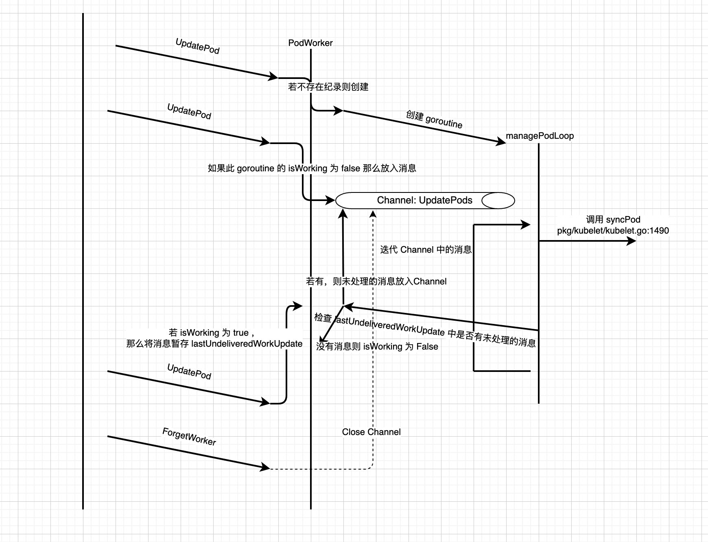

+++
title = "Kubernetes 源码剖析 — kubelet PodWorker"
summary = ''
description = ""
categories = []
tags = []
date = 2021-07-03T14:10:00+08:00
draft = false
+++

*本文基于Kubernetes v1.21.2, commit sha 为 `092fbfbf53427de67cac1e9fa54aaa09a28371d7`*


承接上文，我们来继续看 `syncLoop` 中的内容

pkg/kubelet/kubelet.go:1845

```golang
// syncLoop is the main loop for processing changes. It watches for changes from
// three channels (file, apiserver, and http) and creates a union of them. For
// any new change seen, will run a sync against desired state and running state. If
// no changes are seen to the configuration, will synchronize the last known desired
// state every sync-frequency seconds. Never returns.
func (kl *Kubelet) syncLoop(updates <-chan kubetypes.PodUpdate, handler SyncHandler) {
	plegCh := kl.pleg.Watch()
	// Responsible for checking limits in resolv.conf
	// The limits do not have anything to do with individual pods
	// Since this is called in syncLoop, we don't need to call it anywhere else
	if kl.dnsConfigurer != nil && kl.dnsConfigurer.ResolverConfig != "" {
        // 1. 打开 /etc/resolves.conf 并解析
		kl.dnsConfigurer.CheckLimitsForResolvConf()
	}

	for {
        // 2. .. 省略: 如果自身状态异常，那么会进行一个初始值为 100 毫秒，上限为 5 秒的二进制指数退避 sleep
        // 3. 执行主要逻辑，从不同的 channel 中接收消息并分发处理
        // syncTicker 是 duration 为 1 秒的 Ticker; housekeepingTicker 则是 2 秒
		if !kl.syncLoopIteration(updates, handler, syncTicker.C, housekeepingTicker.C, plegCh) {
			break
		}
	}
}
```


这里对于 DNS 的配置文件进行检查，`CheckLimitsForResolvConf` 做了以下的事情

1. 打开 /etc/resolv.conf， 并解析。如果出错则打印日志并产生一条 Event
2. 如果 search path 上的 domain 的大于 MaxDNSSearchPaths 则打印日志并产生一条 Event。MaxDNSSearchPaths 的值为 6
3. 如果 search path 的长度超过 MaxDNSSearchListChars 则打印日志病产生一条 Event， MaxDNSSearchListChars 的值为 256


`/etc/resolv.conf` 的内容如下:

```
$ cat /etc/resolv.conf 
search lan
nameserver 192.168.199.1
```


对于 seach 项进行检查是因为 Linux 的低版本的 glibc 限制，参考 https://man7.org/linux/man-pages/man5/resolv.conf.5.html

> In glibc 2.25 and earlier, the search list is limited to
> six domains with a total of 256 characters.  Since glibc
> 2.26, the search list is unlimited.


kubelet 的核心逻辑位于 pkg/kubelet/kubelet.go:1919 的 `syncLoopIteration` 函数中，不过本篇我们先略过这个，来看看 kubelet 的 PodWorker

```golang
func (kl *Kubelet) syncLoopIteration(
    configCh <-chan kubetypes.PodUpdate, 
    handler SyncHandler,
	syncCh <-chan time.Time, 
    housekeepingCh <-chan time.Time, 
    plegCh <-chan *pleg.PodLifecycleEvent
) bool {
	select {
	case u, open := <-configCh:
		// Update from a config source; dispatch it to the right handler
		// callback.
		if !open {
			klog.ErrorS(nil, "Update channel is closed, exiting the sync loop")
			return false
		}

		switch u.Op {
		case kubetypes.ADD:
			klog.V(2).InfoS("SyncLoop ADD", "source", u.Source, "pods", format.Pods(u.Pods))
			// After restarting, kubelet will get all existing pods through
			// ADD as if they are new pods. These pods will then go through the
			// admission process and *may* be rejected. This can be resolved
			// once we have checkpointing.
			handler.HandlePodAdditions(u.Pods)
        // .. 省略其他事件类型
		default:
			klog.ErrorS(nil, "Invalid operation type received", "operation", u.Op)
		}
    // .. 省略: 部分 channel 的消息处理
    }
    return true
}
```

所有的 `handler.HandlePodXXX` 的函数最终都会调用 `dispatchWork` 这个函数进行任务的分发处理

pkg/kubelet/kubelet.go:2032

```golang
func (kl *Kubelet) dispatchWork(pod *v1.Pod, syncType kubetypes.SyncPodType, mirrorPod *v1.Pod, start time.Time) {
	// check whether we are ready to delete the pod from the API server (all status up to date)
	containersTerminal, podWorkerTerminal := kl.podAndContainersAreTerminal(pod)
	if pod.DeletionTimestamp != nil && containersTerminal {
		klog.V(4).InfoS("Pod has completed execution and should be deleted from the API server", "pod", klog.KObj(pod), "syncType", syncType)
		kl.statusManager.TerminatePod(pod)
		return
	}

	// optimization: avoid invoking the pod worker if no further changes are possible to the pod definition
	// (i.e. the pod has completed and its containers have been terminated)
	if podWorkerTerminal && containersTerminal {
		klog.V(4).InfoS("Pod has completed and its containers have been terminated, ignoring remaining sync work", "pod", klog.KObj(pod), "syncType", syncType)
		return
	}

	// Run the sync in an async worker.
	kl.podWorkers.UpdatePod(&UpdatePodOptions{
		Pod:        pod,
		MirrorPod:  mirrorPod,
		UpdateType: syncType,
		OnCompleteFunc: func(err error) {
			if err != nil {
				metrics.PodWorkerDuration.WithLabelValues(syncType.String()).Observe(metrics.SinceInSeconds(start))
			}
		},
	})
	// Note the number of containers for new pods.
	if syncType == kubetypes.SyncPodCreate {
		metrics.ContainersPerPodCount.Observe(float64(len(pod.Spec.Containers)))
	}
}
```


 这里便会调用到 PodWorker 中的 `UpdatePod` 函数。PodWorker 实现了一个 goroutine 池来管理 Pod

#### Per Pod Goroutine 的创建

pkg/kubelet/pod_workers.go:199

```golang
// Apply the new setting to the specified pod.
// If the options provide an OnCompleteFunc, the function is invoked if the update is accepted.
// Update requests are ignored if a kill pod request is pending.
func (p *podWorkers) UpdatePod(options *UpdatePodOptions) {
	pod := options.Pod
	uid := pod.UID
	var podUpdates chan UpdatePodOptions
	var exists bool

	p.podLock.Lock()
	defer p.podLock.Unlock()
	if podUpdates, exists = p.podUpdates[uid]; !exists {
		// We need to have a buffer here, because checkForUpdates() method that
		// puts an update into channel is called from the same goroutine where
		// the channel is consumed. However, it is guaranteed that in such case
		// the channel is empty, so buffer of size 1 is enough.
		podUpdates = make(chan UpdatePodOptions, 1)
		p.podUpdates[uid] = podUpdates

		// Creating a new pod worker either means this is a new pod, or that the
		// kubelet just restarted. In either case the kubelet is willing to believe
		// the status of the pod for the first pod worker sync. See corresponding
		// comment in syncPod.
		go func() {
			defer runtime.HandleCrash()
			p.managePodLoop(podUpdates)
		}()
	}
	if !p.isWorking[pod.UID] {
		p.isWorking[pod.UID] = true
		podUpdates <- *options
	} else {
		// if a request to kill a pod is pending, we do not let anything overwrite that request.
		update, found := p.lastUndeliveredWorkUpdate[pod.UID]
		if !found || update.UpdateType != kubetypes.SyncPodKill {
			p.lastUndeliveredWorkUpdate[pod.UID] = *options
		}
	}
}

```


对于每一个 Pod，都会有一个 goroutine 负责管理，它所执行的函数是 `managePodLoop`。podWorkers 的工作就是管理这些 goroutine 。对于一个新的 Pod，PodWorker 首先会创建一个 channel `podUpdates`，然后赋值到自己的 map `p.podUpdates` 中，这个 map 维护了所有 goroutine 的消息输入端， `close` 这个 channel 便可以使对应的 goroutine 退出。`UpdatePod` 函数会被频繁调用，消息只有在 Pod 的 管理 goroutine 的 `isWorking` 条件为 `false` 的时候才会被直接传入 channel，否则会放到 `lastUndeliveredWorkUpdate` 中。这个变量维护了最近一个没有被处理的消息。`SyncPodKill` 类型的消息具有最高的优先级，如果当 `lastUndeliveredWorkUpdate` 中的消息为 `SyncPodKill` 时，之后任何的消息都不能覆盖掉它。为什么这里需要 `lastUndeliveredWorkUpdate` 而不是消息都直接放入 channel 呢？因为 Kubernetes 是按照最终状态对齐的，比如我们这里连续的 3 个 `SyncPodUpdate` 消息过来，`managePodLoop` 是按照最新的 Spec 去更新的，所以会产生两次的重复更新。`lastUndeliveredWorkUpdate` 的作用便是缓冲并合并


#### Per Pod Goroutine 的销毁

当触发 `HandlePodRemoves` 操作的时候会删除对应 Pod 的管理 goroutine，对应的调用栈为 

pkg/kubelet/kubelet.go:2130 `HandlePodRemoves`

pkg/kubelet/kubelet.go:1761 `deletePod`

pkg/kubelet/pod_workers.go:246 `removeWorder`

```golang
func (p *podWorkers) removeWorker(uid types.UID) {
	if ch, ok := p.podUpdates[uid]; ok {
		close(ch)
		delete(p.podUpdates, uid)
		// If there is an undelivered work update for this pod we need to remove it
		// since per-pod goroutine won't be able to put it to the already closed
		// channel when it finishes processing the current work update.
		delete(p.lastUndeliveredWorkUpdate, uid)
	}
}
func (p *podWorkers) ForgetWorker(uid types.UID) {
	p.podLock.Lock()
	defer p.podLock.Unlock()
	p.removeWorker(uid)
}
```


#### Per Pod Goroutine 的工作

pkg/kubelet/pod_workers.go:157

```golang
func (p *podWorkers) managePodLoop(podUpdates <-chan UpdatePodOptions) {
	var lastSyncTime time.Time
	for update := range podUpdates {
		err := func() error {
			podUID := update.Pod.UID
			// This is a blocking call that would return only if the cache
			// has an entry for the pod that is newer than minRuntimeCache
			// Time. This ensures the worker doesn't start syncing until
			// after the cache is at least newer than the finished time of
			// the previous sync.
			status, err := p.podCache.GetNewerThan(podUID, lastSyncTime)
			if err != nil {
				// This is the legacy event thrown by manage pod loop
				// all other events are now dispatched from syncPodFn
				p.recorder.Eventf(update.Pod, v1.EventTypeWarning, events.FailedSync, "error determining status: %v", err)
				return err
			}
			err = p.syncPodFn(syncPodOptions{
				mirrorPod:      update.MirrorPod,
				pod:            update.Pod,
				podStatus:      status,
				killPodOptions: update.KillPodOptions,
				updateType:     update.UpdateType,
			})
			lastSyncTime = time.Now()
			return err
		}()
		// notify the call-back function if the operation succeeded or not
		if update.OnCompleteFunc != nil {
			update.OnCompleteFunc(err)
		}
		if err != nil {
			// IMPORTANT: we do not log errors here, the syncPodFn is responsible for logging errors
			klog.ErrorS(err, "Error syncing pod, skipping", "pod", klog.KObj(update.Pod), "podUID", update.Pod.UID)
		}
		p.wrapUp(update.Pod.UID, err)
	}
}
```


`syncPodFn` 是核心处理内容，它的实际实现在 kubelet.go 文件中。我们先来看最后收尾的  `wrapUp` 函数

pkg/kubelet/pod_workers.go:262

```golang
func (p *podWorkers) wrapUp(uid types.UID, syncErr error) {
	// Requeue the last update if the last sync returned error.
	switch {
	case syncErr == nil:
		// No error; requeue at the regular resync interval.
		p.workQueue.Enqueue(uid, wait.Jitter(p.resyncInterval, workerResyncIntervalJitterFactor))
	case strings.Contains(syncErr.Error(), NetworkNotReadyErrorMsg):
		// Network is not ready; back off for short period of time and retry as network might be ready soon.
		p.workQueue.Enqueue(uid, wait.Jitter(backOffOnTransientErrorPeriod, workerBackOffPeriodJitterFactor))
	default:
		// Error occurred during the sync; back off and then retry.
		p.workQueue.Enqueue(uid, wait.Jitter(p.backOffPeriod, workerBackOffPeriodJitterFactor))
	}
	p.checkForUpdates(uid)
}
```

pkg/kubelet/pod_workers.go:278

```golang
func (p *podWorkers) checkForUpdates(uid types.UID) {
	p.podLock.Lock()
	defer p.podLock.Unlock()
	if workUpdate, exists := p.lastUndeliveredWorkUpdate[uid]; exists {
		p.podUpdates[uid] <- workUpdate
		delete(p.lastUndeliveredWorkUpdate, uid)
	} else {
		p.isWorking[uid] = false
	}
}
```

`checkForUpdates` 函数负责从 `lastUndeliveredWorkUpdate` 中取出待处理的消息然后塞到 `podUpdates` channel 中。如果没有任何消息需要处理，那么会将 `isWorking` 置为 `false`，允许外部从 `UpdatePod` 这条路径传入消息


整个 PodWorker 的工作逻辑如下图



    