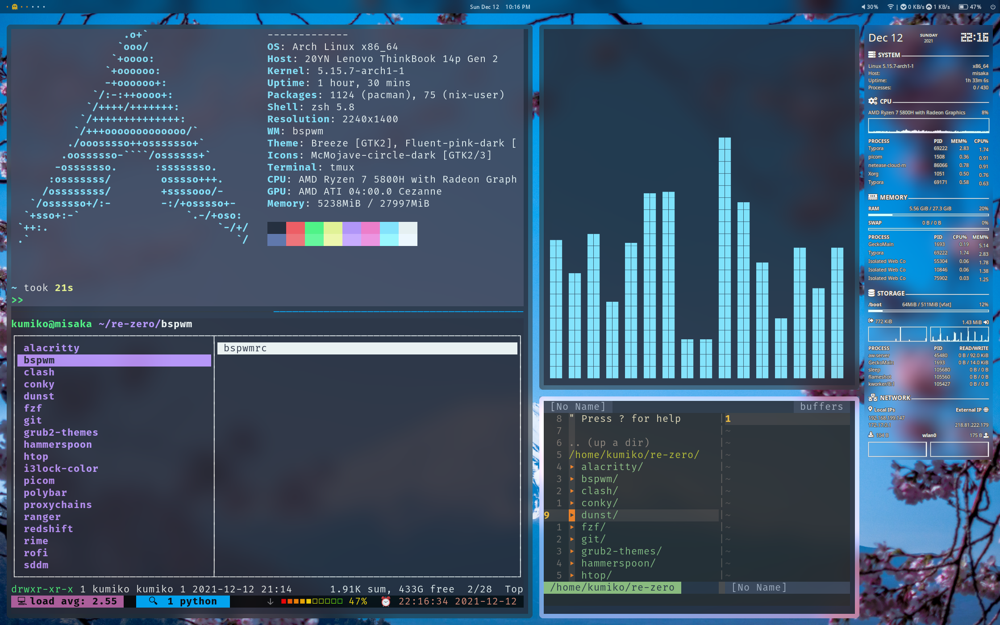
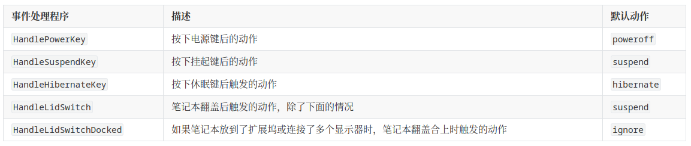

+++
title = "My Arch Linux RICE"
summary = ''
description = ""
categories = []
tags = []
date = 2021-12-12T14:31:18+08:00
draft = false
+++

本文分享一下自己的 Linux 配置，发行版为 ArchLinux

- [GRUB Theme](#grub-theme)
- [Display Manager Theme](#display-manager-theme)
- [LockScreen](#lockscreen)
  * [电源键锁屏](#-----)
  * [快捷键锁屏](#-----)
  * [超时自动锁屏](#------)
  * [合上笔记本锁屏](#-------)
- [输入法](#---)
- [配置键位](#----)
  * [CapsLock 映射到左 Ctrl](#capslock------ctrl)
  * [快捷键组合](#快捷键组合)
- [Lanucher](#lanucher)
- [Window Manager](#window-manager)
- [Terminal](#terminal)
- [Tmux](#tmux)
- [CommandLine](#commandline)
  * [Shell](#shell)
  * [Fuzzy Finder](#fuzzy-finder)
  * [Tools](#tools)
- [File Manager](#file-manager)
- [Browser](#browser)
- [System backup and restore](#system-backup-and-restore)
- [省电设置](#----)




### GRUB Theme

GRUB 的配置文件为 `/etc/default/grub` ，如果我们需要对主题样式进行修改，那么需要编辑  `GRUB_THEME` 项对应路径的文件。这里推荐不直接编辑，而是改成一个新的自定义文件的路径。配置文件的语法为

```
# Global property declaration.
OPTION : VALUE
# Component property de
+ COMPONENT {
    OPTION_1 = VALUE_1
    OPTION_2 = VALUE_2
    ...
    OPTION_N = VALUE_N
}
```

比如在 `Global` 中可以配置背景图片，或者背景颜色

```
desktop-color: "#000000"
# Image should be placed into the theme's directory. Image is scaled to the screen resolution. 
desktop-image: "background.jpg"
```

`boot_menu` 可以控制启动菜单的位置及样式

```
# 3:4:3 的比例水平居中菜单，距离上方 20% 的间距，高度为 40%
+ boot_menu {
  left = 30%
  top = 20%
  width = 40%
  height = 40%
}
```

所有配置项可以参考 http://wiki.rosalab.ru/en/index.php/GRUB2_theme_/_reference#Using_themes 

改动之后如何测试效果呢？如果每次要重启显然是不现实的，这里可以通过 https://github.com/hartwork/grub2-theme-preview 启动 QEMU 快捷测试。

最后别忘记通过 `update-grub` 命令来更新 `etc/grub/grub.cfg` 文件


现成的第三方主题有

- https://github.com/vinceliuice/grub2-themes
- https://github.com/Generator/GRUB2-themes
- https://github.com/Se7endAY/grub2-theme-vimix


### Display Manager Theme

- [LightDM](https://wiki.archlinux.org/title/LightDM_(%E7%AE%80%E4%BD%93%E4%B8%AD%E6%96%87))
- [SDDM](https://wiki.archlinux.org/title/SDDM_(%E7%AE%80%E4%BD%93%E4%B8%AD%E6%96%87))

我们可以选择在开机后使用命令的方式登录到我们的桌面，也可以使用 Display Manager 来通过图形化的欢迎界面进行登录。DM 本身是可选的，我这里使用的是 SDDM。主题方面可以在 KDE Store 中找到，然后手动安装，比如 [sddm-sugar-candy](https://framagit.org/MarianArlt/sddm-sugar-candy)。将主题的 tarball 解压到 `/usr/share/sddm/themes` 中，然后在配置文件 `/etc/sddm.conf` 中指明当前主题。对于 SDDM 的配置可以借助工具 [sddm-config-editor](https://github.com/lxqt/sddm-config-editor) 来完成

```ini
# Generated by SDDM Configuration Editor
[Theme]
Current=sugar-candy
```

预览主题可以通过命令

```
sddm-greeter --test-mode --theme /usr/share/sddm/themes/<主题名称>
```


### LockScreen

用于锁屏的程序有以下几种可以参考：

- [i3lock](https://github.com/i3/i3lock)
- [i3lock-color](https://github.com/Raymo111/i3lock-color)
- [i3lock-fancy](https://github.com/meskarune/i3lock-fancy)
- [betterlockscreen](https://github.com/betterlockscreen/betterlockscreen)

选择一种适合自己的就好了，我自己用的是 i3lock-color

#### 电源键锁屏

首先我们要搞定电源键的行为，因为默认的行为是关机！！！而且这个配置相当混乱。当我们按下电源按键的时候会发送 ACPI 事件，对于这个事件的处理有很多工具可以完成，比如 `acpid`，比如 `systemd`，功能上有重叠的也有不重叠的。如果你用的是 Plasma 这种桌面那么无需担心，因为都接管好了。但是如果要自己配置还是比较麻烦的。首先编辑 `/etc/systemd/logind.conf` 文件，修改后需要 `systemctl restart systemd-logind` 生效。对应事件解释如下表格




如果改了上面的配置但是没有生效，可能是由于你的其他程序接管了 ACPI 事件。对于 `HandlePowerKey`，我的配置的值是 `suspend`。接下来我们需要 suspend 时启动我们的锁屏程序，这个需要手动写 systemd service 文件 

```
[Unit]
Description=User suspend actions
Before=sleep.target

[Service]
User=%I
Type=forking
Environment=DISPLAY=:0
ExecStart=/usr/bin/lock
ExecStartPost=/usr/bin/sleep 1

[Install]
WantedBy=sleep.target
```

*P.S. As screen lockers may return before the screen is "locked", the screen  may flash on resuming from suspend. Adding a small delay via `ExecStartPost=/usr/bin/sleep 1` helps prevent this.*

最后我们以自己的用户启动这个 service，`systemctl enable suspend@<用户名> `。这样我们按下电源键就可以锁屏了

#### 快捷键锁屏

这部分可以和下面快捷键的一起来看，因为我用的是 `sxhkd`，可以通过绑定快捷键来执行命令。所以直接在 `sxhkdrc` 中添加

```
# Lock screen
ctrl + alt + q
    lock
```

按下 `Crlt` + `Alt` + `Q` 便触发锁屏


#### 超时自动锁屏

本人使用的是 `xautolock` 这个工具，只要执行

```
xautolock -time <分钟> -locker <锁屏的bin路径> 
```

就会在无操作后自动锁屏。不用工具的话，写 systemd 配置文件也是可以的


#### 合上笔记本锁屏

编辑 `/etc/systemd/logind.conf`，取消注释并修改成`HandleLidSwitch=suspend`，这样会触发刚才的 `suspend.server` 进行锁屏


### 输入法

`fcitx5` 是一个输入法框架，对于中文输入需要额外的模块。本人使用的是 `fcitx5-rime`，是 `fcitx5` 在` librime` 上的包装。不用 Rime 的可以安装 `fcitx5-chinese-addons `  获得拼音支持。`fcitx5-rime` 的安装方式如下

```shell
pacman -S fcitx5 fcitx5-qt fcitx5-gtk fcitx5-configtool fcitx5-rime fcitx5-chinese-addons 
```

然后配置环境变量，编辑 `~/.pam_environment`

```ini
GTK_IM_MODULE DEFAULT=fcitx
QT_IM_MODULE  DEFAULT=fcitx
XMODIFIERS    DEFAULT=\@im=fcitx
SDL_IM_MODULE DEFAULT=fcitx
```

扩展词库推荐

- [fcitx5-pinyin-zhwiki-rime](https://aur.archlinux.org/packages/fcitx5-pinyin-zhwiki-rime/)：中文 wiki 百科词库
- [fcitx5-pinyin-moegirl-rime](https://aur.archlinux.org/packages/fcitx5-pinyin-moegirl-rime/)： 萌娘百科词库
- [rime-dict](https://github.com/Iorest/rime-dict)： Rime 增强词库

如果 AUR 中的 `zhwiki-rime` 安装出现错误的话，可以通过原作者的[仓库](https://github.com/felixonmars/fcitx5-pinyin-zhwiki/releases)下载 `zhiwiki.dict.yaml` 然后放到对应的路径中。词库的安装方式如下

在 Rime 的配置目录 `~/.local/share/fcitx5/rime/` (不是 `~/.config/fcitx5/rime`) 中新建对应输入方案的 `schema.custom.yaml` ，比如明月拼音简体字，那么就是 `luan_pinyin.custom.yaml`，然后添加如下内容

```yaml
patch:
  "translator/dictionary": extended  # 词典名字可自定义,与下方文件名保持一致即可
```

然后新建 `extended.dict.yaml` ，添加扩展词库配置

```yaml
---
name: extended
version: "2021.12.09"
sort: by_weight
use_preset_vocabulary: true  #是否启用默认的“八股文”词库及词频系统,如需启用请设为 true 。
import_tables:
  # - luna_pinyin
  - aurora_pinyin
  - zhwiki
  - moegirl
  - sogou
```

扩展词库需要在当前目录下面，比如 `zhwiki` 项就需要 `zhwiki.dict.yaml` 词库文件。另外一点特别需要注意，如果你的词库中没有单个汉字的话会出现输入声母后无法出现候选词列表的情况，这点可以参考 [librime#72](https://github.com/rime/librime/issues/72) 。所以至少需要一个含有 《通用规范汉字表》的词库，比如 [aurora_pinyin.dict.yaml](https://github.com/hosxy/rime-aurora-pinyin/blob/master/aurora_pinyin.dict.yaml)

Linux 上输入法皮肤无法像鼠鬚管那样在 YAML 中指定样式，需要使用 `fcitx5` 框架的主题，这里使用的是 [fxitx5-nord](https://github.com/tonyfettes/fcitx5-nord) ，安装方式可以参考 README。至于键位按照自己喜欢的就好了，这里放一份自己用的

```yaml
patch:
  menu:
    page_size: 8
  schema_list:
  - schema: luna_pinyin_simp
  # https://github.com/rime/rime-prelude/blob/master/key_bindings.yaml
  key_binder:
    bindings:
      - accept: "Control+c"
        send: "Escape"
        when: "has_menu"
      - accept: "Control+p"
        send: "Page_Up"
        when: "has_menu"
      - accept: "Control+n"
        send: "Page_Down"
        when: "has_menu"
      - accept: "Control+j"
        send: "Down"
        when: "has_menu"
      - accept: "Control+k"
        send: "Up"
        when: "has_menu"
      - accept: "Tab"
        send: "Down"
        when: "has_menu"
      - accept: "Control+h"
        send: "BackSpace"
        when: "composing"
```


### 配置键位

一个舒服的键位是可以提高工作效率的。比如平常需要用到一些小拇指参与的按键，`Ctrl` , `Backspace`, `Esc`，在使用的时候手难免会偏移中心位置，所以我一般会添加新的映射。重新映射的时候最好能够左右手均衡，不要出现经常使用的快捷键需要一个手按两个键的情况，左右手各按一个会快很多，比如

- `CapsLock` 映射到左 `Ctrl`
- `Ctrl-H` 映射到 `Backspace` 
- `Ctrl-[` 映射到 `Esc`


键位修改在 Linux 上有很多工具去做，这里使用 `xkeysnail` 和 X 自带的配置来修改。主要原则是

- `Super` 键作为桌面相关操作的修饰键，比如切换工作区
- `Alt` 键作为 Alacritty 及 Tmux 操作的修饰键，比如在 Tmux 中切换 window
- `Ctrl` 键单独分配给 Vim 用


#### CapsLock 映射到左 Ctrl

X 下提供了简单的键盘修改功能，可以修改布局、重新映射一些功能键。其实 KDE 的系统界面来修改键盘最后也是改得这些配置文件，脱离了 KDE 可以使用 `setxkbmap` 这个命令来修改。对于 `CapsLock` 的映射有两个预设选项可以替换

- `caps:ctrl_modifier`
- `ctrl:nocaps`

这两个选项的作用相近，区别在于是否会有一个额外的 `CapsLock` 发送。可以查看定义

- `/usr/share/X11/xkb/symbols/capslock`

```
cha kan// This changes the <CAPS> key to become a Control modifier,
// but it will still produce the Caps_Lock keysym.
hidden partial modifier_keys
xkb_symbols "ctrl_modifier" {
    replace key <CAPS> {
        type[Group1] = "ONE_LEVEL",
        symbols[Group1] = [ Caps_Lock ],
        actions[Group1] = [ SetMods(modifiers=Control) ]
    };
    modifier_map Control { <CAPS> };
};
```

- `/usr/share/X11/xkb/symbols/ctrl`

```
// Eliminate CapsLock, making it another Ctrl.
partial modifier_keys
xkb_symbols "nocaps" {
    replace key <CAPS> { [ Control_L, Control_L ] };
    modifier_map  Control { <CAPS>, <LCTL> };
};
```

对于有些程式使用 `caps:ctrl_modifier` 依然会存在问题的，比如 `fcitx5-rime`，修改成 `ctrl:nocaps` 比较彻底一些

当前 X 的键盘配置可以通过 `setxkbmap -print -verbose 10` 查看


#### 快捷键组合

因为有时候还会用到 Mac，两个系统下一会儿 `Ctrl-C` 一会儿 `CMD-C` 就很脑壳疼。所以需要一套适合自己的平台无关全局快捷键。对于这种复杂的键位映射，我们需要额外的工具来搞。在 Mac 下可以使用 `karabiner` 配置，在 Linux 下我使用的是 [xkeysnail](https://github.com/mooz/xkeysnail)。此工具由 Python 编写，定义键位映射也是通过 Python 文件。我这边按键的习惯是偏向于 Mac 的，因为 Linux 下 `Ctrl-C` 在 Terminal 中是发送 signal 而在其他 App 中作为复制快捷键这点让我觉得不够统一。所以将复制/剪切/粘贴/Undo/Redo/保存 这几个常用的都改成了以 Alt 作为修饰键


`xkeysnail` 的配置十分简单，分为快捷键类型 /快捷键作用域/映射三个部分，分别以 Python 中的函数和参数来进行表达

- `define_modmap` 更改修饰键的行为
- `define_conditional_modmap` 对指定的 Application 生效键位映射，参数1匹配 App 名称的正则，参数2为映射
- `define_multipurpose_modmap` 对于一个按键可以作为两种用途使用。按下弹起可以映射到一个键，长按则可以映射到另一个键。一般是用来重新定义按键的长按行为使用
- `define_conditional_multipurpose_modmap` 综合了上面两个函数的功能
- `define_keymap` 基础的键位映射，参数1为 callable 可以用于匹配的条件判断，参数2为映射


在 `xkeysnail` 的配置中，按键以  `K("(<Modifier>-)*<Key>")` 的形式表达，其中 Modifier 可以为

- `C` or `Ctrl` -> Control key
- `M` or `Alt` -> Alt key
- `Shift` -> Shift key
- `Super` or `Win` -> Super/Windows key

Modifier 前还可以添加 `L` 或者 `R` 来表示左侧按键还是右侧按键

一份简单的配置如下:

```Python
import re
from xkeysnail.transform import *

# define timeout for multipurpose_modmap
define_timeout(1)

define_keymap(
    lambda wm_class: wm_class.lower() not in ("alacritty"),
    {
        # Copy, Paste and Select
        K("LM-C"): K("C-C"),
        K("LM-V"): K("C-V"),
        K("LM-X"): K("C-X"),
        K("LM-A"): K("C-A"),
        K("LM-S"): K("C-S"),
        # Cursor
        K("LM-H"): (K("left")),
        K("LM-J"): (K("down")),
        K("LM-K"): (K("up")),
        K("LM-L"): (K("right")),
        K("C-H"): (K("backspace")),
        # Beginning/End of line
        K("C-A"): (K("home")),
        K("C-E"): (K("end")),
        # Undo
        K("LM-Z"): K("C-z"),
        # Redo
        K("LM-Shift-Z"): K("C-Shift-Z"),
    },
    "Custom Key Binding",
)

```

在 Linux 下同类的工具还有

- https://github.com/kmonad/kmonad


如果你想追求极致的统一，直接将 Linux 的键位映射成 Mac 的话，可以尝试 https://github.com/rbreaves/kinto 。但是这个会做一些奇怪的事情，修改 `/sys/module/hid_apple/parameters/swap_opt_cmd` 文件对调按键，这会导致其他的 App 的按键失效，比如 Alacritty 这样的可以自定义快捷键的 App


### Lanucher

Mac 下有很出名的效率工具 [Alfred](https://www.alfredapp.com/ )，可以提供诸如快捷启动，文件搜索，剪切板访问等功能，除此之外还有强大的各种 workflow 可以集成。Linux 上虽然没有这样一个大而全的工具，但是有许多小工具可以作为替代，比如快捷启动方面可以使用  [Albert](https://github.com/albertlauncher/albert) 。不过在这里我使用的是一个更加全面的工具 [Rofi](https://github.com/davatorium/rofi)。其支持

- 窗口切换: `rofi -show window`
- 快捷启动: `rofi -modi drun -show drun`
- 文件查找: `rofi -modi filebrowser  -show filebrowser`
- 脚本以及动态生成菜单(dmenu):  `rofi -dmenu -i -no-fixed-num-lines -p "Yes or No"`
- 自定义样式


动态菜单的功能极大的扩展了 Rofi 本身，我们可以去制作一些插件，比如 [Bitwarden Rofi Menu](https://github.com/mattydebie/bitwarden-rofi) 。因为配置比较多，这里不展开了，有兴趣可以参考 [Rofi - 文档](https://github.com/davatorium/rofi/blob/next/doc/rofi.1.markdown)


### Window Manager

Linux 下有名的 Window Manager 有如下的几个，可以自行了解一下每个的特点

- [i3wm](https://i3wm.org/)
- [xmonad](https://xmonad.org/)
- [aweosome](https://awesomewm.org/)
- [dwm](https://dwm.suckless.org/)
- [bspwm](https://github.com/baskerville/bspwm)

在经过一番折腾后，我选择了 `bspwm`。如果你用 `awesome` 的话，可以尝试一下超级炫酷的 [the-glorious-dotfiles](https://github.com/manilarome/the-glorious-dotfiles)


`bspwm` 是一个平铺式的 WM(但有 monocle 布局的)，本着 Unix 哲学中的前两条

1. *Small is beautiful.*
2. *Make each program do one thing well.*

其只做了窗口排列管理功能，对外提供了一个 unix domain socket 进行通信。我们可以通过 `bspc` 这个命令来与 daemon 进程通信，所以我们可以在 Terminal 中去尝试对窗口管理的各种操作，编写复杂的脚本来控制窗口。如果我们需要通过快捷键的方式来进行窗口管理，那么我们可以借助 `sxhkd` 这个程式来触发。它的配置非常简单，就是一个快捷键 + 命令的映射文件。比如

```
# Start alacritty
super + Return
    alacritty

# screenshot
alt + shift + 4
    flameshot gui
```

`bspwm` 分为如下几个层级

- Monitor: 对应显示器。外接显示器的话就会存在多个
- Desktop: 桌面，就是工作区的概念
- Window/Node: 窗口

Window 是最小的管理单位，可以在不同的 Monitor + Desktop 的组合下移动。bspwm 将 window 视为满二叉树的节点(Node)进行管理

```
             1                          a                          a
             ^                         / \                        / \
                         --->         1   2         --->         1   b
                                          ^                         / \
                                                                   2   3
                                                                       ^

 +-----------------------+  +-----------------------+  +-----------------------+
 |                       |  |           |           |  |           |           |
 |                       |  |           |           |  |           |     2     |
 |                       |  |           |           |  |           |           |
 |           1           |  |     1     |     2     |  |     1     |-----------|
 |           ^           |  |           |     ^     |  |           |           |
 |                       |  |           |           |  |           |     3     |
 |                       |  |           |           |  |           |     ^     |
 +-----------------------+  +-----------------------+  +-----------------------+

             X                          Y                          Z

```

对于每个窗口都有如下几种 state

- tiled: 按照大小和位置由二叉树的层级决定
- pseudo_tiled:  tiled 的变种
- floating: 浮动，可以自由移动或者改变大小
- fullscreen: 全屏

通过以上的知识，可以初步的对 `bspwm` 进行配置

```bash
# 获取主显示器，我一般只使用外接显示器，不用内置的笔记本显示器
export MONITOR=$(xrandr -q | grep primary | cut -d' ' -f1)
MONITOR=${MONITOR:-${MONITORS[0]}}
# 对于指定的 Monitor 设置 Desktop 的标志，这里开了 7 个 Desktop
bspc monitor $MONITOR -d I II III IV V VI VII
# 可以对于指定的程式绑定到指定的 Desktop 中打开，并且设置默认状态
bspc rule -a Nightly                        desktop=^1 state=fullscreen

# 聚焦到指定的 Desktop，可以绑定到快捷键上
bspc desktop -f ^1
# 移动当前窗口到指定的 Desktop
bspc node -d ^1
# 切换当前聚焦的窗口，这个语法详见 man 文档
bspc node -f next.local.!hidden.window
bspc node -f prev.local.!hidden.window
# 切换窗口的 state
bspc node -t fullscreen
# 移动窗口位置，参数为左上角座标偏移量，需要 floating 的 state
bspc node -v -20, 0
# 窗口拉伸
bspc node -z left -20 0  # 向左拉长 20
```

对于窗口的美化可以直接抄作业。`bspwm` 的 Desktop 的布局默认是 tiled 的，也就是上面的平铺二叉树式。但是也可以改成 monocle 布局，在这种布局下多个窗口是层叠在一起的

```bash
shell# window border width
bspc config border_width                 10
# Size of the gap that separates windows.
bspc config window_gap                   15
# 边框颜色
bspc config active_border_color \#E84F4F
bspc config focused_border_color \#E84F4F

# Padding space added at the sides of the monitor or desktop.
bspc config top_padding                  40
bspc config bottom_padding               0

# 圆角
bspc config split_ratio                  0.62
# 在 monocle 模式下没边框和间隙
bspc config borderless_monocle           true
bspc config gapless_monocle              true
```

遗憾的是 `bspwm` 的 `focused_border_color` 我配置了但是没有生效，只能另辟蹊径。采用了一个循环脚本结合 `chwb` 来改颜色。如果使用 `chwb2` 可以改双边框的颜色

```bash
{ echo; bspc subscribe node_focus; } |
     while read -r _; do
        sleep 0.05
        chwb -c CC6464 $(pfw)
     done
```


### Terminal

我使用的是 Alacritty，配置可以参考之前的[文章](https://blog.dreamfever.me/2021/02/13/alacritty-pei-zhi-zhi-nan/)


### Tmux

Tmux 可以让我们在一个 Terminal 实例中进行复用，现成的 [.tmux](https://github.com/gpakosz/.tmux) 项目就很好用了。有 5个插件

- [tmux-resurrect](https://github.com/tmux-plugins/tmux-resurrect)
- [tmux-continuum](https://github.com/tmux-plugins/tmux-continuum)
- [tmux-fpp](https://github.com/tmux-plugins/tmux-fpp)
- [tmux-thumbs](https://github.com/fcsonline/tmux-thumbs)
- [tmux-open](https://github.com/Hanaasagi/tmux-open) : 自己 patch 了一份支持 `translate-shell`

前两个是一起使用的，因为 Tmux 比如在关机的情况下，下次是没法 attach 上次的 session 的。这两个插件可以进行备份与恢复，能够随时找回上次的环境。第三个插件是需要 [PathPicker](https://github.com/facebook/PathPicker) 的。PathPicker 就是 `fpp`，它可以读取一段输入然后找出所有的文件，并以一个交互式的方式让你去对这个文件做一些事情。`tmux-fpp` 会将 pane 上的文本发送到传入到 `fpp` 中然后快捷打开文件。第四个插件是快速选择选择文本的，可以将屏幕上的文本复制到剪切板中，或者执行自定义的命令。第五个插件也是选择文本，不过功能是在文件管理器中打开或者在浏览器中搜索。对于后面三个插件的使用可以参考下面的 Gif 场景

1. 从 man 文档中选择段落然后翻译
2. 打开 man 文档中提到的目录
3. 打开一个在屏幕上之前出现过的文件


### CommandLine

主要是一些常用的命令和工具

#### Shell

个人使用的是 zsh 作为默认 shell。推荐使用一下的插件

```shell
plugins=(
  git
  vi-mode  # 可以使用 Ctrl + [ 开始 vim 模式。对于长命令，比如 curl post json 这样的可以 Ctrl + [ 再 vv 直接在 vim 中编辑
  zsh-autosuggestions  # 会以阴影文字提示命令，可以直接 Ctrl + [ 再 l 采用。对于一些经常重复的命令，效果很明显
  zsh-syntax-highlighting  # 高亮
  # fast-syntax-highlighting  作者删库了，但是有 fork 下来的
)
```

#### Fuzzy Finder

推荐 [fzf](https://github.com/junegunn/fzf) ，可以通过 `Ctrl` + `r` 来搜索历史命令，`Ctrl` + `t` 来补文件目录名称

#### Tools

一些常用命令的替换品，基本是氧化物

- [zoxide](https://github.com/ajeetdsouza/zoxide) : 替换 cd 命令，同类的由 autojump 和 z.lua
- [ripgrep](https://github.com/BurntSushi/ripgrep):  替换 grep，可以和很多工具链进行组合
- [nix](https://nixos.org/): 跨平台包管理器，可以结合 nix-home-manager 和 lorri 来使用
- [exa](https://github.com/ogham/exa): 替换 ls 命令
- [tokei](https://github.com/XAMPPRocky/tokei): 代码行数统计工具，相似的工具有很多
- jq: 处理 JSON 数据，比如 curl | jq 。处理其他格式的数据可以使用 [dasel](https://github.com/TomWright/dasel)
- [croc](https://github.com/schollz/croc): 跨设备文件传输。之前有个 Firefox Send 但是凉了
- [KDE-Connect](https://kdeconnect.kde.org/): 局域网神器，并且支持 MacOS
- [lazygit](https://github.com/jesseduffield/lazygit): TUI 下的 Git，同类的还有 [tig](https://github.com/jonas/tig)
- [pueue](https://github.com/Nukesor/pueue): task manager


### File Manager

- [nnn](https://github.com/jarun/nnn)
- [ranger](https://github.com/ranger/ranger)

在上面两个作出选择吧！`nnn` 是很强大的，甚至可以看[视频](https://github.com/jarun/nnn/wiki/Live-previews)，但是衡量了一下 `ranger` 更符合一个 Vim 用户的习惯。所有的配置项在[官方配置文件](https://github.com/ranger/ranger/blob/master/ranger/config/rc.conf)中已经仔细说明了。这里列出自己进行改经的的地方

```
# 开启图片预览
set preview_images true
set preview_images_method ueberzug

# 结合 Tmux 在新的 pane 中打开文件，这样可以将 ranger 当成文件树来使用，固定在一个 pane 中
map e eval if 'TMUX' in os.environ.keys(): fm.execute_console("shell tmux splitw -h 'vim " + fm.thisfile.basename + "'")

# 原来的是通过 F1 F2 来创建文件的，改成新的按键
map o  console touch%space
map O  console mkdir%space
# cw 原来的不好用，就是简单的 rename。这里改成保留扩展名的 rename。因为大部分情况下扩展名不需要修改的！
map cw eval fm.open_console('rename ' + ('' if fm.thisfile.is_directory else '.' + fm.thisfile.extension), position=7)
```

因为 `ranger` 只支持  256 色，所以 theme 无法做到很精致。这里推荐使用 `dracula`，这个几乎所有的应用都能找到对应的配色。。文件预览的颜色使用 `base16/gruvbox-dark-pale` 可以通过 `highlight` 这个 package 来继续安装，用的时候指定环境变量就好了

```shell
alias ranger='HIGHLIGHT_STYLE=base16/gruvbox-dark-pale ranger'
```

`ranger` 可以配合 `zoxide` 一起使用，可以在 `ranger` 中快速切换常用的目录。我对于 `ranger-zoxide` 自己 patch 了[一份](https://github.com/Hanaasagi/re-zero/tree/master/ranger/plugins/zoxide)，让 `z` 命令和 `cd` 具有一样的功能


### Browser

本人是 Firefox 党(手动狗头，平时在用 Firefox Nightly。浏览器一直是键盘党难受的地方之一，经常需要从浏览器中复制一段文字(比如从 stackoverflow 复制代码)。安利一个在用的插件 [vimium-c](https://github.com/gdh1995/vimium-c)，在 Firefox 下还有几个类似的

- [VimFx](https://github.com/akhodakivskiy/VimFx)
- [vimium](https://github.com/philc/vimium)
- [tridactyl](https://github.com/tridactyl/tridactyl)

因为有了快捷键映射工具，其实在浏览器上也可以不借助插件达到类似 Vim 的效果，比如将  J/K 和 H/L映射到 Down/Up 和浏览器自身的 Tab 页切换快捷键上。个人最看中的还是对文字进行选择的功能，上面的几个插件都可以办到的。`vimium` 家族的需要按 v 进入 visual mode，这时会自动给你一个选择区的起始光标，然后 h/j/kl 就可以扩大选中范围了。如果起始光标位置不对，要么按 o 更改起始位置，要么按 c 进入 caret mode。个人比较推荐 caret mode 因为是直接移动的光标，而 o 会带着选择范围走。而 `tridactyl` 会先进入一个 hint mode，可以快速的将光标移动位置，但是在页面上有大量文字的情况下容易触发密集恐惧症。不过 `tridactyl` 由一个 `:editor` 的 command，可以在页面的文本框开启 Vim 模式。这个功能也是可以用 [firenvim](https://github.com/glacambre/firenvim) 来完成的


**但是非常诚实地讲，我还是喜欢使用鼠标来选择文字 : ( **


### System backup and restore

我在安装 Linux 的时候使用的是 `btrfs` 作为文件系统，关于如何安装可以参考 [ArchWiki](https://wiki.archlinux.org/title/Btrfs_(%E7%AE%80%E4%BD%93%E4%B8%AD%E6%96%87)) and [Arch Linux with BTRFS Installation (Base)](https://www.nishantnadkarni.tech/posts/arch_installation/)。我这里 `subvolume` 的划分是

- `@`
- `@home`
- `@var`
- `@snapshots`
- `@tmp`

这个按照个人需求来就好了。备份可以通过 `crontab` 脚本完成，或者直接使用开源的 [Timeshift](https://github.com/teejee2008/timeshift)，其也是通过 `crontab` 的方式进行备份，不过提供了一个常用的界面配置备份周期和备份保存数目可以省去自己写脚本的麻烦。对于个别目录进行备份可以使用 `rsync` 命令或者 [restic](https://github.com/restic/restic) 工具


### 省电设置

笔记本电量掉的非常厉害，在没有播放音乐，视频的情况下仅仅写 `markdown` 和浏览网页 2小时 45 分钟，电源就会降到 46%，这么算来也就 5 小时就会用尽。所以我们需要工具来帮助我们省电

- [TLP](https://linrunner.de/tlp/index.html)
- [PowerTOP](https://github.com/fenrus75/powertop)

我这里使用的是 TLP 进行电源管理。安装后需要开启自启动并且禁用 `systemd-rfkill` 和 `systemd-rfkill`，默认配置便可以使用，配置项参考 [文档](https://linrunner.de/tlp/settings/index.html)。这里需要注意一点，很多文章提到了需要改 `SATA_LINKPWR_ON_BAT=max_performance` 来防止 Btrfs 文件系统损坏的问题。这个问题在 Kernel 4.15 应该已经被解决了， 参考 [FQA - Does SATA ALPM cause disk corruption with Btrfs?](https://linrunner.de/tlp/faq/disks.html?highlight=btrfs#does-sata-alpm-cause-disk-corruption-with-btrfs)


    