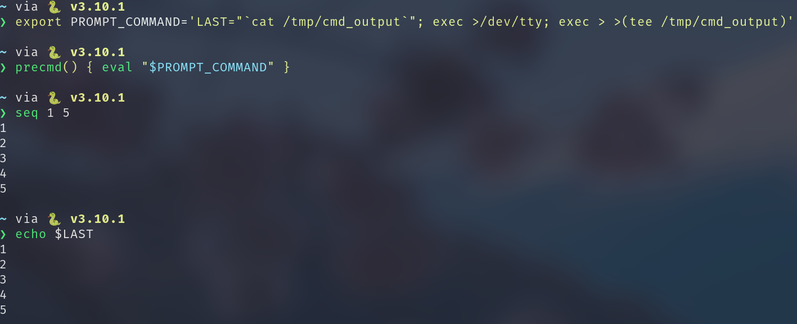
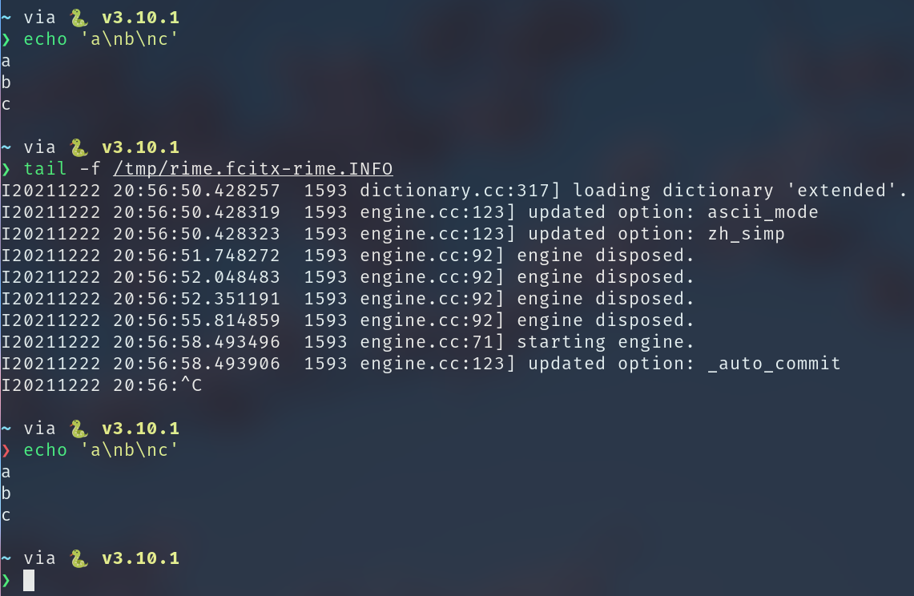
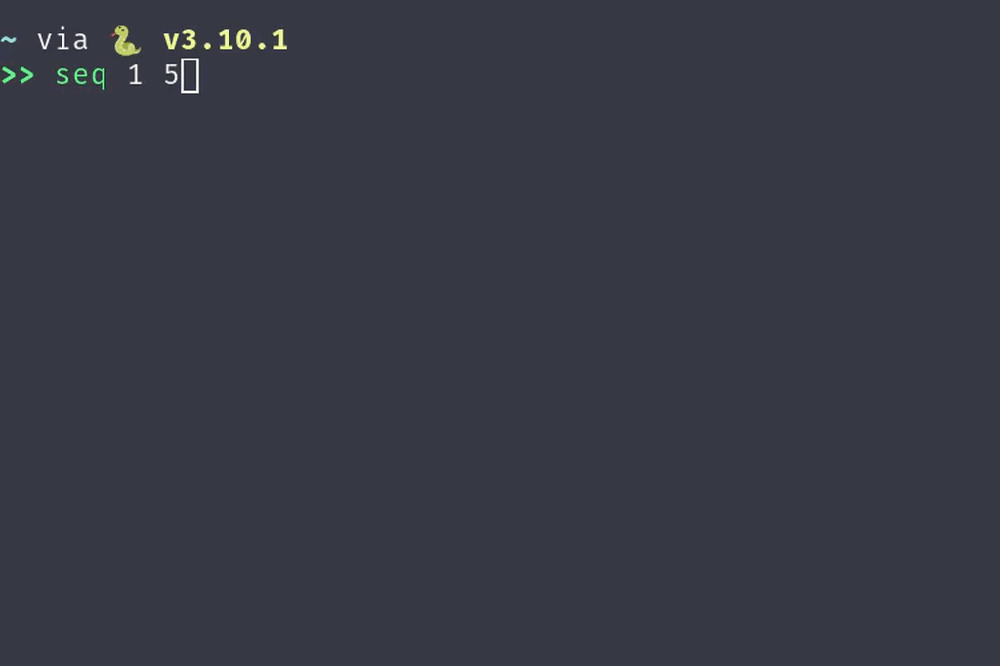

+++
title = "N 种方式复制上一条命令的输出"
summary = ''
description = ""
categories = []
tags = []
date = 2021-12-23T06:55:41+08:00
draft = false
+++

在写技术 Blog 的时候，经常会遇到粘贴一段命令及其输出的情况。对于粘贴上一条命令有很简单的方法，读取 `history` 文件就好了，比如下面这条 `alias`

```
alias '@cpc'='echo -n $(fc -l -1 | awk "{\$1=\"\";print substr(\$0,2)}") | xclip -select clipboard'
```

对于命令的输出，因为默认没有写入文件。想要复制的时候总是处于事后的状态，本文分享几种方式去简化这一操作


### The first Way

重复执行上一条命令然后将输出通过管道发送到剪贴板，比如

```
$ !! | xclip -select clipboard
```

`!!` 是指代上一条命令，shell 会自动展开，同样的还有 `!-2`, `!-3` 分别指代向上第 N 条命令。


缺点：

1. 需要重复执行命令，对于没有幂等或者有 side effect 的情况下，同一条命令多次执行输出可能都不一样

   

### The second way

第二种方式使用 `PROMPT_COMMAND`，这个是 Bash 独有的。对于 Zsh 的用户，可以通过 `precmd` 这个 hook 来做这件事情

```
precmd() { eval "$PROMPT_COMMAND" }
```

Bash 会在显示 `PS1` 变量之前执行 `PROMPT_COMMAND`，比如

```Shell
[kumiko@misaka ~]$ echo $PS1
[\u@\h \W]\$
[kumiko@misaka ~]$ export PROMPT_COMMAND="date +%H:%M:%S"
13:01:50
[kumiko@misaka ~]$ echo 'hello'
hello
13:01:53
```

我们可以看到时间被显示在每次输出 `PS1` 中的内容 `[kumiko@misaka ~]$` 之前(此处不能理解为每次命令执行后输出时间)。利用这个 hook 我们可以 Hack 掉 File Descriptors，代码如下

```
export PROMPT_COMMAND='LAST="`cat /tmp/cmd_output`"; exec 1>/dev/tty; exec 1> >(tee /tmp/cmd_output)'
```

这条命令由三部分组成，可能对于 shell 不熟悉的同学比较奇怪 `exec >/dev/tty` 是什么意思。因为大多数情况下，`exec` 的使用场景是替换当前进程空间，执行一条命令。这里是 `exec` 的另一个用法，打开指定的 `FD` 进行读写。比如

```
$ echo 'hahah' > a.txt

$ exec 0< a.txt; cat  # 0< 要连在一起，否则会判断 0 是一条命令字符串
hahah
```

对于一个进程的 `FD` ，默认情况下是

- 0: `STDIN` - 标准输入
- 1: `STDOUT` - 标准输出
- 2: `STDERR` - 标准错误输出

当我们没有参数执行 `cat` 的时候，`STDIN` 实际上是打开的 `/dev/tty`，所以会从当前终端读取数据，然后进行回显。但是前面的 `exec 0< a.txt` 将默认的 0 号 `FD` 的指向替换成了一个读取 `a.txt` 的 `FD`，就相当于我们平常使用的重定向。知道了这点，上面的命令便不难理解了。`LAST` 变量保存的是一个执行过程，对应着 `/tmp/cmd_output` 文件的内容。`exec 1>/dev/tty` 将标准输出定向到 `/dev/tty` ，所以我们可以在终端看到命令的输出，`exec 1> >(tee /tmp/cmd_output)` 相当于 `dup` 了 `FD`，使得标准输出还会在 `/tmp/cmd_output` 中写入一份

然后我们的 `$LAST` 就是上一条命令的输出了，效果如下



如果需要同时支持 `STDOUT` 和 `STDERR` ，可以使用下面命令，原理相同

```
export PROMPT_COMMAND='LAST="`cat /tmp/cmd_output`"; exec 1>/dev/tty; exec 1> >(tee /tmp/cmd_output); exec 2>/dev/tty; exec 2> >(tee /tmp/cmd_output);'
```


缺点：

1. 如果你有多个 Shell 进程同时执行命令，会出现单文件同时写入的情况。这里需要每个 Shell 分配一个独立文件名称，比较麻烦


### The third way

个人目前使用的方式。我们先来观察一下终端中，执行命令后的输出有什么特点。我这里是 [starship](https://github.com/starship/starship) 和 Zsh 的组合，其他的可以照抄然后自己改动一下




两个 `PS1` 之间就是我们的命令 + 输出部分。命令正常执行成功后显示的是绿色的 `❯`，如果上一次命令的 `ExitCode` 不为 0，那么显示的是红色的 `❯`。此符号在 starship 中可以进行配置，参考文档 https://starship.rs/config/#character

- `success_symbol`: The format string used before the text input if the previous command succeeded.
- `error_symbol`: The format string used before the text input if the previous command failed.


这里顺便提一下 starship 的原理，其本质是 Hack 掉`PROMPT` 变量，更改为执行 `starship` 的二进制文件，并将 Shell 中的上下文作为参数传入，比如 `STARSHIP_CMD_STATUS` 就是上一条命令的 `ExitCode`。通过一番组合后输出 `PS1`，参考 [starship.zsh#L95](https://github.com/starship/starship/blob/2653b5ed139089949ac2475894fe0b2634a74ab9/src/init/starship.zsh#L95)


根据以上信息我们可以将 `success_symbol` 和 `error_symbol` 作为锚点，然后模拟文本选择。下面有两种方式

- 对于支持快捷键选区的 Terminal，比如 Alacritty。可以通过 `xdotool` 来发送按键指令，通过脚本替代人工选择
- 对于 Tmux 下，我们可以编写 Tmux Script 来做


这里我选择更加通用的 Tmux 来进行说明：


第一步，为了让我们可以移动光标进行区块选择，我们要先进 copy 模式

```
copy-mode
```

然后根据清除当前的已有的选区，这步是避免环境不干净，确保在一个当前没有任何选区的情况下执行命令

```
send -X clear-selection
```

下面我们开始移动光标，先移动到行首，因为我们当前有可能已经输入了文字

```
send -X start-of-line
send -X start-of-line
```

需要注意，这里需要执行两次，因为有逻辑行和物理行的概念。比如我的宽度只有16个字符，如果我输入了 17 个字符那么会产生折行，但是逻辑上我没有换行的。执行两次我们能够到达真正的行首。之后我们需要向上移动光标 

```
send -X cursor-up
send -X cursor-up
send -X cursor-up
```

因为默认的 starship 配置有一项 `add_newline = True` 导致每次命令执行后会换行一次，所以我们着力需要执行 3 次才能到达上一条命令输出的最后一行。目前光标还在最后一行输出的行首，我们需要移动到行尾，同样移动两次

```
send -X end-of-line
send -X end-of-line
```

开始进行选区

```
send -X begin-selection
```

 我们向前搜索，找到上一条命令的开始处。这里不是大于符号，是一个 unicode 字符，可以直接复制过来

```
send -X search-backward-text "❯"
```

我们向下一行就是输出结果的开始处，这里是移动到行尾然后向右一个光标就自动到下一行的行首了

```
send -X end-of-line
send -X end-of-line
send -X cursor-right
```

结束选区，并复制

```
send -X stop-selection
send -X copy-selection-and-cancel
```


上面还有点小瑕疵，如果我的命令输出里面包含了 `❯` 怎么办，选区就不完整了。我目前采用的方法使用零宽字符来当作锚点。关于零宽字符这个以前有写过[文章](https://blog.dreamfever.me/2021/06/30/ru-guo-bug-hui-yin-shen-2/)进行介绍。比如 `\u200b` 。需要配置一下 starship

```
[character]
success_symbol = "[❯](bold green)\u200b"
error_symbol = "[❯](bold red)\u200b"
vicmd_symbol = "[❯](bold green)\u200b"
```

然后将查找条件改为

```
send -X search-backward-te "❯\u200b"
```


以上完整代码如下，根据自己的 Prompt 做修改后放到 `tmux.conf` 种就可以了

```
bind -n <your key binding> {
    copy-mode
    send -X clear-selection
    send -X start-of-line
    send -X start-of-line
    send -X cursor-up
    send -X cursor-up
    send -X cursor-up
    send -X end-of-line
    send -X end-of-line
    send -X begin-selection
    send -X search-backward-text "❯\u200b"
    send -X end-of-line
    send -X end-of-line
    send -X cursor-right
    send -X stop-selection
    send -X copy-selection-and-cancel
}
```


上述脚本也可以通过 shell 的函数执行

```Bash
alias '@cpo'='tmux_copy_cmd_output >> /dev/null 2>&1'

tmux_copy_cmd_output() {
    tmux copy-mode
    tmux send -X clear-selection
    tmux send -X start-of-line
    tmux send -X start-of-line
    tmux send -X cursor-up
    tmux send -X cursor-up
    tmux send -X cursor-up  
    tmux send -X cursor-up  # 这里多一次，因为现在我们执行的是一条命令了，需要多敲一个 Enter
    tmux send -X end-of-line
    tmux send -X end-of-line
    tmux send -X begin-selection
    tmux send -X search-backward-te "❯\u200b"
    tmux send -X end-of-line
    tmux send -X end-of-line
    tmux send -X cursor-right
    tmux send -X stop-selection
    tmux send -X copy-selection-and-cancel
}
```


最终效果如下:





缺点:

- 对其他组件具有入侵性，依赖 Tmux 或者 Alacritty 之类的 Terminal
- 有 Buffer 限制，比如你复制一个 `seq 1 10000` 的输出就失败了


### Reference

- [Tmux man page](https://man7.org/linux/man-pages/man1/tmux.1.html)
    