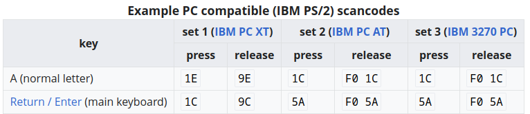
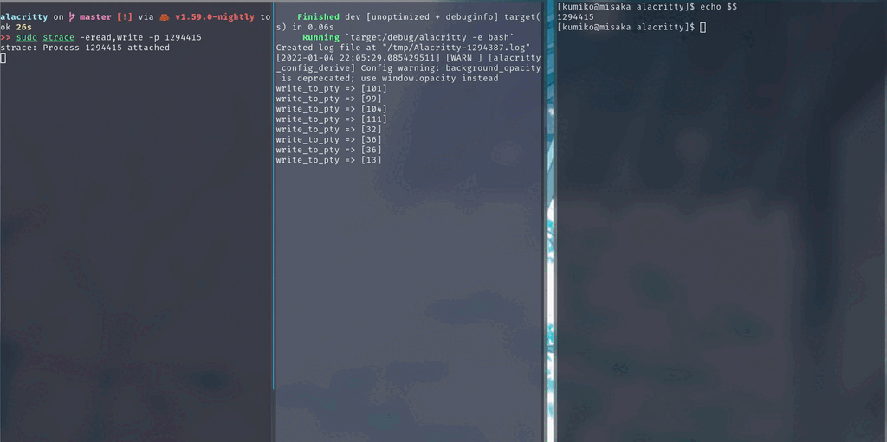

+++
title = "What happens when a key is pressed - (1)"
summary = ''
description = ""
categories = []
tags = []
date = 2022-01-04T15:12:22+08:00
draft = false
+++


![]


本文讲讲上图的这个东西，当你按下按键后会发生了什么。因为个人能力有限，本系列可能永远不会有下篇了


首先我们需要了解几个术语: Scancode, Keycode, Keysym


## Scancode/Keycode/Keysym

#### Scancode

>  Scancode 是键盘向计算机发送的数据，以报告哪些键被按下了。一个字节或字节序列被分配给键盘上的每个键。—— 引用自 [Wikipedia - Scancode](https://en.wikipedia.org/wiki/Scancode)


可以通过 `showkey --scancodes` 命令来查看，所按下的按键的 Scancode

```
press any key (program terminates 10s after last keypress)...
0x9c
0x10 0x90  # pressed and released q
0x1e 0x9e  # pressed and released a
0x2c 0xac  # pressed and released z
0x1c 0x9c  # pressed and released Enter
```

如果对数字很敏感，那么可能会发现

```
>>> 0x1e -0x10
14
>>> 0x2c - 0x1e
14
```

这个差值正式对应了 84 键键盘每一行键的数量(上图是 108 键的，去掉右边就是 84 键键盘)

#### Keycode

Keycode  由 kernel 进行转换，主要用于 Kernel 到 Userland 的 Input Event 中。所有的 KeyCode 可以在 `/usr/include/linux/input-event-codes.h` 中找到。同样的 `showkey --keycodes` 命令可以查看所按下的按键的 Keycode

```
press any key (program terminates 10s after last keypress)...
keycode  28 release
keycode  16 press    # Pressed q
keycode  16 release  # 
keycode  30 press    # Pressed a
keycode  30 release
keycode  44 press    # Pressed z
keycode  44 release
keycode  28 press    # Pressed Enter
keycode  28 release
```

对于 Scancode 和 Keycode 来说， 修饰键 `Shift` 和普通按键 `KEY_2` 这种是同等对待的。比如你按了 `Shift-KEY_2` ，你接收到的事件按照顺序应该是

1. PRESSED Shift
2. PRESSED KEY_2
3. RELEASED KEY_2
4. RELEASED Shift

1 和 2 还有 3 和 4 的顺序可能相反，视你到底哪个按键先被按下决定。所以到这一层为止，我们不知道 `Shift+KEY_2` 被按下后其实是一个 `@` 的


#### Keysym

基于 Keycode， X11 使用 Keysym 是对键帽上的符号进行编码，在这一层会根据键盘布局等信息来对按键进行转换。如果不是无刻键盘，可以看一下自己的键帽。定义的 Keysyms 集包括ISO拉丁文字符集（1-4）、片假名、阿拉伯文等。每个 Keycode 都有一个 Keysyms 的列表。可以通过 `xmodmap -pke` 命令查看

```
keycode  10 = 1 exclam 1 exclam
keycode  11 = 2 at 2 at
keycode  12 = 3 numbersign 3 numbersign
keycode  13 = 4 dollar 4 dollar
keycode  14 = 5 percent 5 percent
keycode  15 = 6 asciicircum 6 asciicircum
keycode  16 = 7 ampersand 7 ampersand
keycode  17 = 8 asterisk 8 asterisk
keycode  18 = 9 parenleft 9 parenleft
keycode  19 = 0 parenright 0 parenright
```

转换规则如下:

> 1. The numlock modifier is on and the second KeySym is a keypad KeySym. In this case, if the Shift modifier is on, or if the Lock modifier is on and is interpreted as ShiftLock, then the first KeySym is used, otherwise the second KeySym is used.
>
> 2. The Shift and Lock modifiers are both off. In this case, the first KeySym is used.
>
> 3. The Shift modifier is off, and the Lock modifier is on and is interpreted as CapsLock. In this case, the first KeySym is used, but if that KeySym is lowercase alphabetic, then the corresponding uppercase KeySym is used instead.
>
> 4. The Shift modifier is on, and the Lock modifier is on and is interpreted as CapsLock. In this case, the second KeySym is used, but if that KeySym is lowercase alphabetic, then the corresponding uppercase KeySym is used instead.
>
> 5. The Shift modifier is on, or the Lock modifier is on and is interpreted as ShiftLock, or both. In this case, the second KeySym is used. 


`Shift+KEY_2` 在这一层被解释成了 `XK_AT` 即我们的 `@`


---


下面由底至上进行说明。键盘根据接口可以分为 PS/2 和 USB 键盘。因为 USB 键盘走的是 USB 协议，讲起来还要说一遍 USB 协议。这里偷懒一下，讲一下古老的 PS/2 键盘。现在这种接口应该已经绝迹，但是有仿真兼容 PS/2 的，比如我 Laptop 的内置键盘


## Keyboard Hardware

首先是硬件层面，因为需要大量的图才能讲明白，不如这里放一个视频好了

https://www.youtube.com/watch?v=ewE8b7zzej0


## Linux Kernel

当按键被按下后，由 keyboard controller 来触发中断(Interrupt)

> A keyboard controller is a device that interfaces a keyboard to a computer. Its main function is to inform the computer when a key is pressed or released. When data from the keyboard arrives, the controller raises an interrupt (a keyboard interrupt) to allow the CPU to handle the input.  If a keyboard is a separate peripheral system unit (such as in most modern desktop computers), the keyboard controller is not directly attached to the keys but receives scancodes from a microcontroller embedded in the keyboard via some kind of serial interface. In this case, the controller usually also controls the keyboard's LEDs by sending data back to the keyboard through the wire.  —— 引用自 [Wikipedia Keyboard controller](https://en.wikipedia.org/wiki/Keyboard_controller_(computing))

比较经典的是 Intel 8042


此图引用自 ["8042"_PS/2_Controller](https://wiki.osdev.org/%228042%22_PS/2_Controller)


我们可以看到 Kernel 中 I8042 控制器使用的是 PMIO(Port Mapped IO)来读取的数据。其一共关联了 2 个 PORT，用于 3 种不同的用途。对于 PORT `0x64` 在读取的时候会被用作状态寄存器，在写入的时候则是当作命令寄存器来使用的

```c
// https://github.com/torvalds/linux/blob/v5.15/drivers/input/serio/i8042-io.h#L39
#define I8042_COMMAND_REG	0x64
#define I8042_STATUS_REG	0x64
#define I8042_DATA_REG		0x60

static inline int i8042_read_data(void)
{
	return inb(I8042_DATA_REG);
}
```

对于所有在 PMIO 中注册的 Port ，可以在 `/proc/ioports` 中查找

```shell
>> sudo cat /proc/ioports | grep keyboard
  0060-0060 : keyboard
  0064-0064 : keyboard
```

当 Interrupt 发生时，CPU 会查找 IDT(Interrupt Descriptor Table)。IDT 是一个数组，索引是中断号，值为 ISR(Interrupt Service Routine) 的地址。IDT 在初始化的时候通过 `LIDT` 汇编指令载入，实际上就是告诉 CPU 数组的内存地址。下面我们来看， I8042 控制器的 ISR 

```c
// https://github.com/torvalds/linux/blob/v.15/drivers/input/serio/i8042.c#L518
static irqreturn_t i8042_interrupt(int irq, void *dev_id)
{
    unsigned char str, data;
    // ...
    str = i8042_read_status();
    // ...
    data = i8042_read_data();
    // ...
    if (likely(serio && !filtered))
    	serio_interrupt(serio, data, dfl);
 out:
    return IRQ_RETVAL(ret);
}
```

此函数将它从硬件中读取的数据传递给上层，然后进一步处理。`serio` 是一个抽象层，结构体中挂载了很多不同的处理函数

```c
// https://github.com/torvalds/linux/blob/v5.15/drivers/input/serio/serio.c#L992
irqreturn_t serio_interrupt(struct serio *serio,
		unsigned char data, unsigned int dfl)
{
	unsigned long flags;
	irqreturn_t ret = IRQ_NONE;

	spin_lock_irqsave(&serio->lock, flags);

    if (likely(serio->drv)) {
        ret = serio->drv->interrupt(serio, data, dfl);
	} else if (!dfl && device_is_registered(&serio->dev)) {
		serio_rescan(serio);
		ret = IRQ_HANDLED;
	}

	spin_unlock_irqrestore(&serio->lock, flags);

	return ret;
}
```

在这里我们可以通过 [BCC](https://github.com/iovisor/bcc) 工具去截获这个函数的调用，然后看看 `data` 变量的值

```
>> sudo ./trace 'serio_interrupt(struct serio *serio, unsigned char data, unsigned int dfl) "data=0x%x" data'
[sudo] password for kumiko:
/virtual/main.c:22:57: warning: declaration of 'struct serio' will not be visible outside of this function [-Wvisibility]
int probe_serio_interrupt_1(struct pt_regs *ctx, struct serio *serio, unsigned char data, unsigned int dfl)
                                                        ^
1 warning generated.
PID     TID     COMM            FUNC             -
0       0       swapper/10      serio_interrupt  data=0x10
q0       0       swapper/10      serio_interrupt  data=0x90
0       0       swapper/10      serio_interrupt  data=0x1e
a0       0       swapper/10      serio_interrupt  data=0x9e
0       0       swapper/10      serio_interrupt  data=0x2c
z0       0       swapper/10      serio_interrupt  data=0xac
0       0       swapper/10      serio_interrupt  data=0x1c

0       0       swapper/10      serio_interrupt  data=0x9c

```

可以看到和我们之前的 `showkeys --scancode` 的结果是一致的

`ret = serio->drv->interrupt(serio, data, dfl)` 这里是调用的 driver 的 handler。比如我这里 laptop 的内置键盘是 AT Translated Set 2 keyboard 的。关于当前你的输入设备，可以通过 `/proc/bus/input/devices` 文件拿到

```
>> cat /proc/bus/input/devices
I: Bus=0011 Vendor=0001 Product=0001 Version=ab83
N: Name="AT Translated Set 2 keyboard"
P: Phys=isa0060/serio0/input0
S: Sysfs=/devices/platform/i8042/serio0/input/input2
U: Uniq=
H: Handlers=sysrq kbd leds event2
B: PROP=0
B: EV=120013
B: KEY=402000000 3803078f800d001 feffffdfffefffff fffffffffffffffe
B: MSC=10
B: LED=7
```

科普一下 AT Keyboard

>  AT Keyboard 也被称为 Model F keyboard ，是 IBM 在 1986 年推出的 US 标准键盘。最初的版本有 84 个键，但后来被 101 个键的强化键盘所取代。
>
> 最初的 IBM-PC 键盘，使用 "scan code set 1"。新的 AT 键盘使用不同的 scan code，即 "scan code set 2"。这种变化会给那些期望从键盘获得不同扫描代码的软件带来兼容性问题。为了避免兼容性问题，键盘控制器支持 translation mode。如果被启用，控制器将把 "scan code set 2" 转换成 "scan code set 1"。再后来又出现了  "scan code set 1"，同样支持  translation mode





AT Keyboard Driver  的结构定义如下 

```c
// https://github.com/torvalds/linux/blob/v5.15/drivers/input/keyboard/atkbd.c#L1390
static struct serio_driver atkbd_drv = {
	.driver		= {
		.name	= "atkbd",
	},
	.description	= DRIVER_DESC,
	.id_table	= atkbd_serio_ids,
	.interrupt	= atkbd_interrupt,
	.connect	= atkbd_connect,
	.reconnect	= atkbd_reconnect,
	.disconnect	= atkbd_disconnect,
	.cleanup	= atkbd_cleanup,
};

// 初始化向 serio 注册
static int __init atkbd_init(void)
{
	dmi_check_system(atkbd_dmi_quirk_table);

	return serio_register_driver(&atkbd_drv);
}
```

继续沿着 Interrupt 的调用逻辑向下走到 `atkbd_interrupt` 函数

```c
// https://github.com/torvalds/linux/blob/v5.15/drivers/input/keyboard/atkbd.c#L409
static irqreturn_t atkbd_interrupt(struct serio *serio, unsigned char data,
				   unsigned int flags)
{
	struct atkbd *atkbd = serio_get_drvdata(serio);
	struct input_dev *dev = atkbd->dev;
	unsigned int code = data;
	unsigned short keycode;
    
    // ...
	input_event(dev, EV_MSC, MSC_RAW, code);
    // ...
	code = atkbd_compat_scancode(atkbd, code);
	keycode = atkbd->keycode[code];
    // ...
	switch (keycode) {
    // ...        
	default:
		if (atkbd->release) {
			value = 0;  // 释放按键
			atkbd->last = 0;
		} else if (!atkbd->softrepeat && test_bit(keycode, dev->key)) {
			/* Workaround Toshiba laptop multiple keypress */
			value = time_before(jiffies, atkbd->time) && atkbd->last == code ? 1 : 2;
		} else {
			value = 1;  // 按下按键
			atkbd->last = code;
			atkbd->time = jiffies + msecs_to_jiffies(dev->rep[REP_DELAY]) / 2;
		}

		input_event(dev, EV_KEY, keycode, value);
		input_sync(dev);

		if (value && test_bit(code, atkbd->force_release_mask)) {
			input_event(dev, EV_MSC, MSC_SCAN, code);
			input_report_key(dev, keycode, 0);
			input_sync(dev);
		}
	}
	atkbd->release = false;
out:
	return IRQ_HANDLED;
}
```

此函数将 Scancode 转换成了 Keycode，并且生成设备输入事件，然后由 EventHandler 接手。这里的调用链很长，不一一展开了。

- `input_event`
- `input_handle_event`
- `input_pass_values`
- `input_to_handler`

```c
// https://github.com/torvalds/linux/blob/v5.15/drivers/input/input.c#L93
     
/*
 * Pass event first through all filters and then, if event has not been
 * filtered out, through all open handles. This function is called with
 * dev->event_lock held and interrupts disabled.
 */
static unsigned int input_to_handler(struct input_handle *handle,
			struct input_value *vals, unsigned int count)
{
	struct input_handler *handler = handle->handler;
	struct input_value *end = vals;
	struct input_value *v;

	if (handler->filter) {
		for (v = vals; v != vals + count; v++) {
			if (handler->filter(handle, v->type, v->code, v->value))
				continue;
			if (end != v)
				*end = *v;
			end++;
		}
		count = end - vals;
	}

	if (!count)
		return 0;

	if (handler->events)
		handler->events(handle, vals, count);
	else if (handler->event)
		for (v = vals; v != vals + count; v++)
			handler->event(handle, v->type, v->code, v->value);

	return count;
}
```

`evdev_handler` 是我们注册过的 `handler`。`Evdev` 是一种协议，Kernel 使用该协议将有关输入设备的信息和事件转发给用户空间。这不只是对鼠标和键盘，而是任何形式的设备，包括像摄像头和遥控装置。每个设备都以 `/dev/input/eventX` 的形式表示为设备节点，随着添加更多设备，数字 `X`会增加。拔下设备后设备节点将会被其他设备重新使用


`evdev_handler` 的定义如下:

```c
// https://github.com/torvalds/linux/blob/v5.15/drivers/input/evdev.c#L1420
static struct input_handler evdev_handler = {
	.event		= evdev_event,
	.events		= evdev_events,
	.connect	= evdev_connect,
	.disconnect	= evdev_disconnect,
	.legacy_minors	= true,
	.minor		= EVDEV_MINOR_BASE,
	.name		= "evdev",
	.id_table	= evdev_ids,
};

static int __init evdev_init(void)
{
	return input_register_handler(&evdev_handler);
}
```

`handler` 部分需要提供了两组接口，`events` 和 `event` ，分别用于事件的批量处理和单个处理。在打上事件的时间戳后，然后调用 `__pass_event` 写入 event。如果满足同步条件 (`event->type == EV_SYN && event->code == SYN_REPOR`)，那么通知用户态程序。并不是一个 event 一通知的，这个是有自己的 buffer 的。类似于我们写文件时候的 `write` 和 `sync`

```c
// https://github.com/torvalds/linux/blob/v5.15/drivers/input/evdev.c#L214
static void __pass_event(struct evdev_client *client,
			 const struct input_event *event)
{
	client->buffer[client->head++] = *event;
	client->head &= client->bufsize - 1;

	if (unlikely(client->head == client->tail)) {
		/*
		 * This effectively "drops" all unconsumed events, leaving
		 * EV_SYN/SYN_DROPPED plus the newest event in the queue.
		 */
		client->tail = (client->head - 2) & (client->bufsize - 1);

		client->buffer[client->tail] = (struct input_event) {
			.input_event_sec = event->input_event_sec,
			.input_event_usec = event->input_event_usec,
			.type = EV_SYN,
			.code = SYN_DROPPED,
			.value = 0,
		};

		client->packet_head = client->tail;
	}

	if (event->type == EV_SYN && event->code == SYN_REPORT) {
		client->packet_head = client->head;
		kill_fasync(&client->fasync, SIGIO, POLL_IN);  // 异步通知
	}
}
```

我们在用户态可以使用 `evtest` 命令来查看这些键盘输入事件

```
qEvent: time 1641182434.643340, type 4 (EV_MSC), code 4 (MSC_SCAN), value 10
Event: time 1641182434.643340, type 1 (EV_KEY), code 16 (KEY_Q), value 0
Event: time 1641182434.643340, -------------- SYN_REPORT ------------
Event: time 1641182435.077749, type 4 (EV_MSC), code 4 (MSC_SCAN), value 1e
Event: time 1641182435.077749, type 1 (EV_KEY), code 30 (KEY_A), value 1
Event: time 1641182435.077749, -------------- SYN_REPORT ------------
aEvent: time 1641182435.151109, type 4 (EV_MSC), code 4 (MSC_SCAN), value 1e
Event: time 1641182435.151109, type 1 (EV_KEY), code 30 (KEY_A), value 0
Event: time 1641182435.151109, -------------- SYN_REPORT ------------
Event: time 1641182435.474113, type 4 (EV_MSC), code 4 (MSC_SCAN), value 2c
Event: time 1641182435.474113, type 1 (EV_KEY), code 44 (KEY_Z), value 1
Event: time 1641182435.474113, -------------- SYN_REPORT ------------
zEvent: time 1641182435.553080, type 4 (EV_MSC), code 4 (MSC_SCAN), value 2c
Event: time 1641182435.553080, type 1 (EV_KEY), code 44 (KEY_Z), value 0
Event: time 1641182435.553080, -------------- SYN_REPORT ------------
Event: time 1641182436.234580, type 4 (EV_MSC), code 4 (MSC_SCAN), value 1c
Event: time 1641182436.234580, type 1 (EV_KEY), code 28 (KEY_ENTER), value 1
Event: time 1641182436.234580, -------------- SYN_REPORT ------------

Event: time 1641182436.329575, type 4 (EV_MSC), code 4 (MSC_SCAN), value 1c
Event: time 1641182436.329575, type 1 (EV_KEY), code 28 (KEY_ENTER), value 0
Event: time 1641182436.329575, -------------- SYN_REPORT ------------

```


## GUI Application

几番流转，事件暴露给了我么用户态的程序。X Server 位于操作系统内核和应用程序之间，它是一个 C/S 架构的程序。我们启动了一系列应用程序都是作为 Client 存在的，然后 Server 进行绘图，并且用户操作再传递会我们的应用程序。X Server 从 `/dev/input/*` 中读取 Keycode，然后根据用户配置转换成对应的 Keysym。键盘的输入事件会发送到用户当前聚焦的窗口。在这里我们可以通过 `xev` 命令来创建一个窗口然后敲几个按键看看能够收到哪些事件

```
>> xev -event keyboard -1
KeyPress event, serial 28, synthetic NO, window 0x4c00001, root 0x74c, subw 0x0, time 22697664, (306,1367), root:(2702,1432), state 0x0, keycode 24 (keysym 0x71, q), same_screen YES, XLookupString gives 1 bytes: (71) "q" XmbLookupString gives 1 bytes: (71) "q" XFilterEvent returns: False
KeyRelease event, serial 28, synthetic NO, window 0x4c00001, root 0x74c, subw 0x0, time 22697784, (306,1367), root:(2702,1432), state 0x0, keycode 24 (keysym 0x71, q), same_screen YES, XLookupString gives 1 bytes: (71) "q" XFilterEvent returns: False
KeyPress event, serial 28, synthetic NO, window 0x4c00001, root 0x74c, subw 0x0, time 22698856, (306,1367), root:(2702,1432), state 0x0, keycode 38 (keysym 0x61, a), same_screen YES, XLookupString gives 1 bytes: (61) "a" XmbLookupString gives 1 bytes: (61) "a" XFilterEvent returns: False
KeyRelease event, serial 28, synthetic NO, window 0x4c00001, root 0x74c, subw 0x0, time 22698992, (306,1367), root:(2702,1432), state 0x0, keycode 38 (keysym 0x61, a), same_screen YES, XLookupString gives 1 bytes: (61) "a" XFilterEvent returns: False
KeyPress event, serial 28, synthetic NO, window 0x4c00001, root 0x74c, subw 0x0, time 22699601, (306,1367), root:(2702,1432), state 0x0, keycode 52 (keysym 0x7a, z), same_screen YES, XLookupString gives 1 bytes: (7a) "z" XmbLookupString gives 1 bytes: (7a) "z" XFilterEvent returns: False
KeyRelease event, serial 28, synthetic NO, window 0x4c00001, root 0x74c, subw 0x0, time 22699720, (306,1367), root:(2702,1432), state 0x0, keycode 52 (keysym 0x7a, z), same_screen YES, XLookupString gives 1 bytes: (7a) "z" XFilterEvent returns: False
KeyPress event, serial 28, synthetic NO, window 0x4c00001, root 0x74c, subw 0x0, time 22700632, (306,1367), root:(2702,1432), state 0x0, keycode 36 (keysym 0xff0d, " XFilterEvent returns: Falsees: (0d) " gives 1 bytes: (0d) "
KeyRelease event, serial 28, synthetic NO, window 0x4c00001, root 0x74c, subw 0x0, time 22700736, (306,1367), root:(2702,1432), state 0x0, keycode 36 (keysym 0xff0d" XFilterEvent returns: FalseLookupString gives 1 bytes: (0d) "
```

需要注意这里的 Keycode 又是经过处理的，比我们在事件中的都大了 8:

>  The keycode X uses and the keycode the kernel uses are OFF BY 8 for  "historical reasons". So take 97 - 8 = 89 and use 89 with the  setkeycodes command (again as root):


下面我将通过  Alacritty 作为例子进行说明。为啥用着个呢？因为这是一个 Terminal ，里面还会涉及到 PTY 的问题。Alacritty 基于 Rust 的 OpenGL 库 [glutin](https://github.com/rust-windowing/glutin) 进行 GUI 开发的，glutin 则依赖 [winit](https://github.com/rust-windowing/winit) 来获取 X 下的 Keysym 消息(FFI 调用的 X11 的 C 库)。我们可以在 [winit/src/platform_impl/linux/x11/events.rs](https://github.com/rust-windowing/winit/blob/master/src/platform_impl/linux/x11/events.rs) 中找到对于 X Keysym 的处理。这里又转了一层，现在名字变成了 `VirtualKeyCode`

```rust
// https://github.com/alacritty/alacritty/blob/v0.9.0/alacritty/src/event.rs#L1235-L1252
    fn handle_event<T>(
        event: GlutinEvent<'_, Event>,
        processor: &mut input::Processor<T, ActionContext<'_, N, T>>,
    ) where
        T: EventListener,
    {
        match event {
            // ///
            GlutinEvent::WindowEvent { event, window_id, .. } => {
                match event {
                    // ...
                    WindowEvent::KeyboardInput { input, is_synthetic: false, .. } => {
                        processor.key_input(input);
                    },
                    WindowEvent::ModifiersChanged(modifiers) => {
                        processor.modifiers_input(modifiers)
                    },
                    WindowEvent::ReceivedCharacter(c) => processor.received_char(c),
                }
            }
        }
    }

```

对于键盘的输入这里拆分了三个事件，其中是有包含关系的。比如我在 Alacritty 中按了一个 `A` ，结果这里是会收到 2 条事件的， `KeyboardInput` 和 `ReceivedCharacter` 。看起来这是并非正交的的处理，通过原始的 `KeyboardInput` 应该能还原的样子，为什么 Alacritty 却在区别对待了呢？原因之一是因为我们没有考虑输入法这种程序。比如我在 Alacritty 中，切换到中文输入的话。Alacritty 是能够收到 `KeyboardInput` 事件的，而且这些事件都是 `RELEASED`。直到我在输入法中选择了候选词，这个时候才会收到 `ReceivedCharacter` 事件。

Alacritty 中对于 `KeyboardInput` 事件会匹配我们设置的 Keybinding；而对于 `ReceivedCharacter` 则会写入 PTY。PTY 是 Pseudo terminal，是新时代对于老物 TTY 的模拟。 PTY 总是成对出现的。一个是 master，一个是  slave。slave 那边交给比如 Bash 这样的 Shell。而 master 则由创建者持有，创建者一般是 Termianl 或者 ssh 这样的，子进程直接是 Shell 的程序。这个就和 PIPE 一样，全双工的，写 master， slave 就可以读出来，反之亦然


PTY 在 Alacritty 启动的时候创建，其实就是创建了一个 Shell 的子进程，然后将 STDIN/STDOUT/STDERR 设置为 PTY 的 slave FD

```rust
// https://github.com/alacritty/alacritty/blob/master/alacritty_terminal/src/tty/unix.rs#L140
#[cfg(not(target_os = "macos"))]
fn default_shell(pw: &Passwd<'_>) -> Program {
    Program::Just(env::var("SHELL").unwrap_or_else(|_| pw.shell.to_owned()))
}

/// Create a new TTY and return a handle to interact with it.
pub fn new(config: &PtyConfig, size: &SizeInfo, window_id: Option<usize>) -> Result<Pty> {
    let (master, slave) = make_pty(size.to_winsize());

    let mut buf = [0; 1024];
    let pw = get_pw_entry(&mut buf);

    let shell = match config.shell.as_ref() {
        Some(shell) => Cow::Borrowed(shell),
        None => Cow::Owned(default_shell(&pw)),
    };

    let mut builder = Command::new(shell.program());
    for arg in shell.args() {
        builder.arg(arg);
    }

    builder.stdin(unsafe { Stdio::from_raw_fd(slave) });
    builder.stderr(unsafe { Stdio::from_raw_fd(slave) });
    builder.stdout(unsafe { Stdio::from_raw_fd(slave) });
	// ... Set env
	// ... Close fd, reset signal handler
    match builder.spawn() {
        Ok(child) => {
            unsafe {
                // Maybe this should be done outside of this function so nonblocking
                // isn't forced upon consumers. Although maybe it should be?
                set_nonblocking(master);
            }
            let mut pty = Pty {
                child,
                file: unsafe { File::from_raw_fd(master) },
                token: mio::Token::from(0),
                signals,
                signals_token: mio::Token::from(0),
            };
            pty.on_resize(size);
            Ok(pty)
        },
        Err(err) => Err(Error::new(
            ErrorKind::NotFound,
            format!("Failed to spawn command '{}': {}", shell.program(), err),
        )),
    }
}
```

我们在 Alacritty 中的 Shell 进程中，查看自己的 FD，可以证明这一点

```
>> ls -alh /proc/self/fd
Permissions Size User   Date Modified    Name
lrwx------    64 kumiko 2022-01-04 20:34 0 -> /dev/pts/2
lrwx------    64 kumiko 2022-01-04 20:34 1 -> /dev/pts/2
lrwx------    64 kumiko 2022-01-04 20:34 2 -> /dev/pts/2
```


好了，到上面为止。我们发现数据还是在一路传递，Alacritty 是没有直接显示我们的输入字符的。因为是否回显的决定权在我们的 Shell 手里面。Shell 接收到字符后会触发一系列的行为，比如补全还有是否需要加上颜色。处理好的内容是一个带 ANSI escape code 的字节序列。通过 PTY 的 slave 传回 master，到 Alacritty 手里面，然后进行解析，之后就是画图的部分了


下面是一个简单的 Gif 来表现 Alacritty 到 Shell 的字符传递过程。左中右分别是 Bash 进程的 strace, Alacrity 的 Debug 日志, Bash 进程。输入 abcd 后回车然后 `Ctrl-L` 触发换页，可以看到 Bash 进程会给我们的是  ANSI escape code 分别是 

- `\33[K` :  清除行内的部分区域
- `\33[H`:  光标位置移动到 (1,1)
- `\33[2J` : 清除整个屏幕




### Reference

- [Linux terminals, tty, pty and shell](https://dev.to/napicella/linux-terminals-tty-pty-and-shell-192e)
- [How do keyboard input and text output work?](https://unix.stackexchange.com/questions/116629/how-do-keyboard-input-and-text-output-work/116630#116630)
- [Linux Input Subsystem userspace API](https://www.kernel.org/doc/html/v4.13/input/input.html)


    