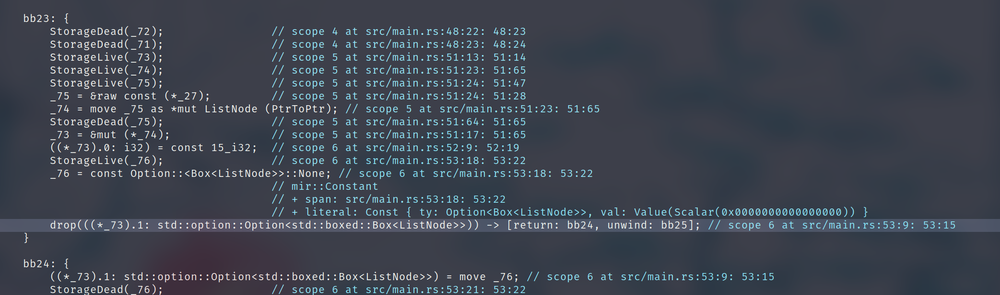
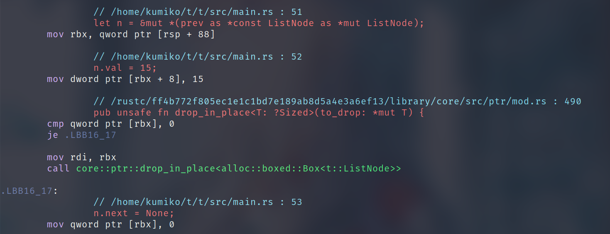

+++
title = "Drop is inserted automatically when mutable variables are re-assigned"
summary = ''
description = ""
categories = []
tags = []
date = 2023-03-13T12:18:00+08:00
draft = false
+++

我们知道在 Rust 中无法同时拥有 mutable reference 和 immmutable reference。但是我们是否可以通过 Rust 的 `unsafe` 来绕过这种限制呢? 下面是我最近遇到的一个例子，代码实现了一个简单的 LinkedList 数据解构，并且尝试通过双指针来找到中点，然后切分成两个 LinkedList。为了演示简单，这里省略掉循环解构，并简化为三个节点的 LinkedList。

<script src="https://gist.github.com/Hanaasagi/592ce539798ee7db5dd2ee531b1ef7b1.js"></script>

上面的代码会在 66 行 `println!("{:?}", slow.next);` 触发 segmentation fault。我已经直接将调试信息插入在代码中了，我们一起看一下

```
ListNode      size: 16
&ListNode     size: 8
Box<ListNode> size: 8

Address and memory bytes:
prev =====> 0x55c626f4daa0
c0 da f4 26 c6 55 00 00 00 00 00 00 00 00 00 00
slow =====> 0x55c626f4dac0
e0 da f4 26 c6 55 00 00 01 00 00 00 00 00 00 00
fast =====> 0x55c626f4dae0
00 00 00 00 00 00 00 00 02 00 00 00 00 00 00 00

----After changed----

Address and memory bytes:
prev =====> 0x55c626f4daa0
00 00 00 00 00 00 00 00 0f 00 00 00 00 00 00 00
slow =====> 0x55c626f4dac0
ad b5 96 7a c3 55 00 00 3a 84 0c 9b 4b 19 5b a2
fast =====> 0x55c626f4dae0
4d 6f 62 5c 05 00 00 00 3a 84 0c 9b 4b 19 5b a2
[1]    1083336 segmentation fault (core dumped)  cargo run
```

通过调试信息我们可以看到  

- `prev`, `slow`, `fast` 三个的内存地址并没有发生变化  
- `prev` 被成功修改掉了，`00 00 00 00 00 00 00 00` 对应变量 `next`，值`None`; `0f 00 00 00 00 00 00 00` 为 `val`，值为 15

这个是符合我们预期的。但是 `slow` 和 `fast` 的内容却被莫名其妙的修改掉了，这个便是导致我们访问 `slow.next` 的时候出现 segmentation fault 的直接原因。很明显我们的代码中并没有显式的去覆盖掉这些内存区域中的值。那么可以来思考一下这是谁做的？很容易想到这个就是 Rust Compiler 的一种行为。为此，我们来看一下 MIR


这里使用工具 [cargo-show-asm](https://github.com/pacak/cargo-show-asm) 输出 MIR 信息。


 </img>

简单说一下这段 MIR 的内容是什么：

根据上下文 `_27` 就是 `prev` 变量，然后通过强制转换得到了 `_73`。这个就是我们最后获得的变量 `n` ，然后我们对此变量的 0 号字段赋值 `15`。然后创建了 `_76`，这个就是我们的 `None`。接着重点来了，这里竟然会有 `drop` 出现

```
drop(((*_73).1: std::option::Option<std::boxed::Box<ListNode>>)) -> [return: bb24, unwind: bb25];
```

变量 `n` 的 1 号字段，就是我们的 `next`，他被 `drop` 掉了。如果成功的话会跳转到 `bb24`，异常则跳转到 `bb25`。对于 `bb24` 的第一行就是

```
((*_73).1: std::option::Option<std::boxed::Box<ListNode>>) = move _76;
```

将 `_76` 赋值到 `_73` 的 `next` 字段中。至此我们明白了，Rust Compiler 在这里去对 `slow` 进行了析构，因为这个过程是级联的，所以也影响到了 `fast`。再来对比一下汇编代码

 </img>

这边注释已经很详细了，由于 `core::ptr::drop_in_place` 的调用导致内存被释放，然后之后的函数调用之类的操作涉及了一些变量的内存分配，可能重新复用了这段内存，就导致内存被覆盖成“随机值”

那么为什么 Compiler 会插入这段代码呢？仔细想想也不难理解，因为在 Compiler 的视角中，mutable 的 ref 只能有一个呀。既然独占那么发生赋值行为的时候，上一个值就是没有被任何人引用到的，释放掉也是无可厚非的


那么是否有办法可以绕过这种情况呢？

- 第一种方式就是使用 `Rc<RefCell<T>>`。这种方式是万金油，但改的地方太多了

我们整理一下思路：关键点还是在于 mutable 和 赋值操作上，如果能够欺骗 Rust Compiler 这不是一个赋值操作，那么是不是就不可以了呢？比如下面这样，使用一个临时的值去替换，然后 `n.next = None` 就是 drop 的临时值，从而不影响有效的节点

```Rust
    unsafe {
        let n = &mut *(prev as *const ListNode as *mut ListNode);
        n.val = 15;
        n.next.insert(Box::new(ListNode::default()));
        n.next = None;
    }
```

纯属想多了，因为所谓的 `n.next.insert` 其实就是 `*self = Some(value);` 的包装而已。我们还是要从如何避免赋值这一行为进行思考，这里引出第二种方式

- 第二种方式就是直接写内存，但是这个和内存布局是由强相关的，比如 `struct` 上面有没有 `repr(C)` 就会导致内存布局的改变。所以实际上风险很高，不过可以借由创建一个新的节点然后按 bits 进行复制避免这个问题。这种方式能够 work 是因为我们没有直接使用 `n.next = None` 的形式，所以不会被插入 drop 代码

```Rust
    unsafe {
        let view = prev as *const _ as *mut u8;
        let data = [00, 00, 00, 00, 00, 00, 00, 00, 15, 00, 00, 00, 00, 00, 00, 00];
        for i in 0..(std::mem::size_of::<ListNode>() as isize) {
            *view.offset(i) = data[i as usize];
        }
    }

```

- 第三种方式，我们不直接去写内存，而是间接地借助 Rust 来写。Rust 提供了 [`std::mem::transmute`](https://doc.rust-lang.org/std/mem/fn.transmute.html) 函数来进行无限制类型转换。这种操作的前提是数据大小相同。比如像下面这样将 `Box` 类型抹去，直接替换成数组类型，就不会被插入 drop 代码了，因为对于数组来说赋值行为就会直接覆盖掉原来的值，这种操作本身就相当于 drop 的原来的数据

```Rust
    unsafe {
        struct Fake {
            pub val: i32,
            pub next: [u8; 8],
        }
        let n = std::mem::transmute::<*const ListNode, *mut Fake>(prev);
        (*n).val = 15;
        (*n).next = [0; 8];
    }
```

顺带一提，`std::mem::transmute` 是可以修改生命周期的，我们可以尝试延长生命周期来使得其不被 drop。不过我改来改去，代码越来越乱，感觉这种思路并不可行


- 第四种方式就是 `clone` 

```Rust
    let tmp = Box::new(slow.clone());
    slow = tmp.as_ref();
    let tmp = Box::new(fast.clone());
    fast = tmp.as_ref();
    unsafe {
        let n = &mut *(prev as *const ListNode as *mut ListNode);
        n.val = 15;
        n.next = None;
    }
```

上面的代码看似是创建了两个新的节点指向列表的剩余部分，但是我们在任意节点上调用 `clone` 都会复制一遍整个 Linkedlist，也就是说创建的是两个新的 Linkedlist，然后被 `slow` 和 `fast` 所指向。全部复制是因为 `ListNode` 结构中包含类型为 `Option<Box<ListNode>>` 的 `next`，导致整个 `clone` 操作是会持续下去的。上面的代码是复制了剩余部分的 Linkedlist 两遍。这种方式在 Linkedlist 很长的情况下，效果还没有 `Rc<RefCell<T>>` 好


- 第五种方式从 drop 的行为出发，比如自定义 drop，但是这个是需要上下文信息的。即重写 drop 函数后，需要了解到外部的信息来判断是否真正 drop，违反了设计原则。那么是否有其他方法告诉 Compiler 别 drop 呢？Rust 提供了 [`ManuallyDrop`](https://doc.rust-lang.org/stable/std/mem/struct.ManuallyDrop.html) 可以禁止自动调用

```Rust
use std::mem::ManuallyDrop;

#[derive(PartialEq, Eq, Clone, Debug, Default)]
pub struct ListNode {
    pub val: i32,
    pub next: Option<ManuallyDrop<Box<ListNode>>>,
}

fn test() {
    // ...
    unsafe {
        let n = &mut *(prev as *const ListNode as *mut ListNode);
        n.val = 15;
        n.next = None;
    }

}
```

注意这里我们给 `Box<ListNode>` 套上了 `ManuallyDrop`，但是本身它只是编译期的一种标识，类似于 `PhantomData` 这些，编译后是不会占用任何字节的。所以我们在 `*const` 到 `*mut` 转换的时候不需要任何改动。来看一下生成的汇编代码

 </img>

没有任何 drop 被插入。但是最大的缺点就是，这个容易泄漏。记住这个要用 `ManuallyDrop::drop` 而不是普通的 `drop` 去释放内存

- 第五种方式就是改变代码逻辑，比如可以使用中点 node 来作为 sentinel，遇到 sentinel 或者 `None` 就代表结束。这种方式看起来还是实际最可靠的


    