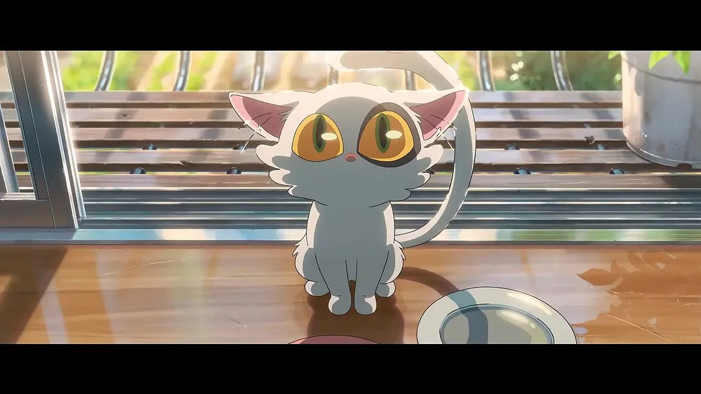

+++
title = "为什么我觉得 すずめの戸締まり 剧情很奇怪"
summary = ''
description = ""
categories = []
tags = []
date = 2023-03-24T15:57:50+08:00
draft = false
+++

2023/03/24 看了 《すずめの戸締まり》。以下是观后感，涉及剧透

个人评分(5分制)，

- 作画 5
- 音乐 4
- 故事 3

### 行动逻辑

首先剧情中人物的行动逻辑很有奇怪

第一个便是右大臣。解除了封印并将要石的责任转移到草太身上之后，完全可以逃离主角们的视野之外。为什么要引导主角们前往一个接一个门存在的地方。而且最后直接将喜欢女主角，想要住在其家中为理由强行进行感情氛围渲染，实在很突兀。一般这种初期反派，后面洗白，需要进行一些铺垫的。但是剧中没有体现，从东京事件后直接转弯。虽然可以使用它是一个猫，是一个随心所欲的神灵。被释放出来也想把另一个同伴也释放出来这种理由来搪塞过去，但是观影期间觉得很奇怪。哪怕加一点，右大臣被左大臣教训（我这里指的是有对白的那种，不是叼着就完事了）的情节，顺便解释一下它们两个的由来也是非常棒的

其次，男女主角相处时间太短了，感情来得太突然。剧中估算一下相处时间应该没超过五天。这个你也可以通过一见钟情这种理由来解释，因为最开始铃芽红红脸，然后去废墟是一切事件的开始。不过相较于剧中其他的水时间剧情，删减一些水剧情然后增加男女的共同经历是否更好一点呢。在我看来，铃芽是因为和草太相遇后看到了崭新的世界，获得了一种新的使命，并且能够拯救众人。这种精神上的兴奋感误以为成对草太的好感。另外最重要的一点，草太对铃芽抱有好感么？本篇完全是以铃芽的视角来写的，在草太眼中故事又是什么样子的呢？这里总结一下：我在某一天因为家族的使命来锁门，然后因为一个女孩子干扰导致变成了椅子。最初疑似由于负罪感，她和我一起旅行，帮助我成功锁上其他门，我们形成了默契的配合，好感度加加。但是变成椅子后我逐渐失去生命力，甚至因为这个事件错过了教师资格考试。在将死之际，我让他将我作为要石插入常世。本以为余生就此结束，但是最后被她拯救。那么我喜欢她么？这个在我眼中真的觉得好奇怪。剧情本身是问题，对草太的刻画不够也是很大的问题。其实这种双向的感情体现最好的就是在《你的名字》中

### 剧情掺水

再来就是水剧情的问题。个人认为最直接的就是芹泽这个人物，这部剧真的需要这么个人么？总结一下在剧中此人对故事情节的推动

1. 告诉铃芽，草太错过了重要的教师考试
2. 带铃芽回家乡

至于看豆瓣评论还有在嗑阿姨和芹泽的 CP 的，我真的无语了。这个人物完全可以没有的。删掉这个人物，剧情可以这样写。铃芽到达草太家中后看到日历上有教师考试的标记，然后发现事实。阿姨没有拒绝部下的陪同请求，让他开车载她去找铃芽，然后他们一起回家乡。至于可有可无的公路 cut 这种，也没有必要非要使用跑车的吧。怀旧音乐反而更适合大叔这种。省下的时间可以多描写男女主角，让整个旅途变长一点。

居酒屋帮忙这个也是一个很迷的桥段。这个阿姨难道看不出来她是高中生么？当然你也可以说这是一种特色，一种日常的轻松片段。毕竟在虚构的故事当中寻求真实的人脑袋可能是有问题的

这部片长总共 121分钟，比较一下历代作品

- 你的名字 106分钟
- 天气之子 112分钟
- 追逐繁星的孩子 116分钟

你觉得故事讲完整了么？

### 设定暧昧

不讨论时空悖论以及凳子为什么是三条腿这种。这些并不影响观感。但是剧情本身没讲清楚的还是又很多地方的：

1. 要石是否必须需要两块。当草太作为要石之后，整个日本只有一块要石的。虽然在故事后期，地震频发，但是是由于草太力量不足还是缺少一块要石所导致的，这个没有说明。假设要石必须两块，那么草太的爷爷行动逻辑就很奇怪。因为爷爷见面后显然是多数拯救派的面孔，那么对白的最开始应该是需要铃芽帮助她找到另一块要石才对。虽然心底具有柔情，但是只有一块要石没用的话，那么草太也是白牺牲。所以要石的必要数量出于一个混沌状态，爷爷的逻辑也因为年级大了处于混沌状态
2. 关于ミミズ ，首先我觉得这个设定非常有趣，地震是由于ミミズ 的坠落引发的，这是一个非常棒的 idea。但是ミミズ为什么会坠落，剧中没有给出答案。在东京事件的时候。ミミズ 如同德芙巧克力般丝滑得盘旋在上空的时候貌似具有一定的浮游能力。而且坠落的时候，貌似是地表出现的金色丝线将它拉向地面的。这个我现在凭借观影后的印象，并不是很确定每个场面都出现了这种金色的丝线。但是这个设定比较诡异？可能是具有额外的含义，但是看完很迷

设定方面可以借鉴一下其他影片的思路。出一个预告片，先是上古时代，ミミズ 被人们用要石封印，讲一下背景。然后镜头转到现代，两人相遇这样balabala 的

### 难以共鸣

这个是更加个人化的观点了。首先是这个片子的受众更倾向于在地震中有所失去的人，我不再其列。其次可能是年纪大了，已经无法看这种片子了。除了最后和小时候的自己相遇的片段，其他地方没有共鸣。而且让我觉得最感动的这部分剧情看似是附加的，因为常世是时空混乱的地方，所以遇见了小时候的自己。而影片的大部分的比重都是男女主角共同历险，通过封印来拯救人们免于地震。遇见了小时候的自己，只是一个插曲。而这个插曲却是让我觉得最感动的

虽然说了这么多废话，但是我还是**推荐**观看这部电影的。猫猫这么可爱，又有什么错呢？

 </img>
    