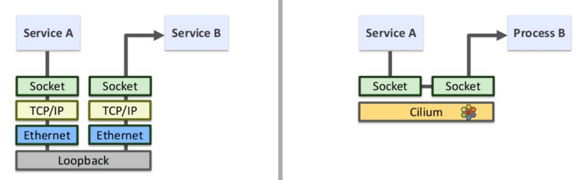

+++
title = "Redir your local socket with eBPF and aya-rs"
summary = ''
description = ""
categories = []
tags = []
date = 2023-04-02T04:43:34+08:00
draft = false
+++

本文是对于经典文章 [How to use eBPF for accelerating Cloud Native applications](https://cyral.com/blog/how-to-ebpf-accelerating-cloud-native/) 的一个练习。鉴于当前关于 Rust 构建 eBPF 程序的资料比较少，所以写了这篇文章来记录一下过程


截止 2023/04，使用 Rust 来构建 eBPF 除了手动进行 binding 的方法之外，主要选择是 

- [aya](https://github.com/aya-rs/aya): Aya is an eBPF library for the Rust programming language, built with a focus on developer experience and operability.    
- [redbpf](https://github.com/foniod/redbpf): Rust library for building and running BPF/eBPF modules    


这两个的功能和 API 都差不多，但是 redbpf 需要使用 LLVM 13 来构建。用下来 aya 的工具链完成度更好一点，但是缺点是文档内容很少。官方提供的文档 [aya-book](https://aya-rs.dev/book/) 里面仅仅只有 3 个 example，其他页面都是 WIP 的状态。不过好在代码模块化，浏览一下源代码大致可以上手


本文接下来通过 aya 来构建一个 eBPF 项目，实现绕过 loopback ，将数据直接发送到对方的 socket 中。当然此项目只是一个简化后的 demo


 </img>


如果你对于 eBPF 的知识比较陌生，可以查看

- [BPF 进阶笔记（一）：BPF 程序（BPF Prog）类型详解：使用场景、函数签名、执行位置及程序示例](https://arthurchiao.art/blog/bpf-advanced-notes-1-zh/)

本文中接下来使用到的函数，可以通过[bpf-helpers(7) - Linux manual page](https://man7.org/linux/man-pages/man7/bpf-helpers.7.html) 来查找对应名称的 C 函数获得参数及内容解释


### Create a eBPF project from templete

首先使用这个项目模版来创建项目

https://github.com/aya-rs/aya-template

生成后的项目结构大概是（xxx 为你的项目名称）

- xtask: 构建相关的逻辑。 `cargo xtask build-ebpf` 就是执行的 `cargo run --package xtask build-ebpf`。这个目录的代码可以直接不用看
- xxx-common: 用于存放被下面两个同时引用到的代码，之这个时候会给出例子
- xxx-ebpf: 用于存放 EBPF 代码，会被插入 Kernel
- xxx: 用户态代码，负责将 xxx-ebpf 载入，或者执行一些自定义逻辑


### Write eBPF Probe


首先我们需要指定载入的位置，在 C 中这个是通过 `__section("xxx")` 来指定的。在 aya 中，我们通过 marcos 来指定。所有的 marcos 都在 `aya_bpf::macros` 这个模块的下面，名字和 C 中的差不多。比如 `__section("sockops")` 就是 `#[sock_ops]` ，注意这里的下划线（在 aya 中的命名风格很奇怪，下面你还会发现一种新的命名）


在确定位置之后我们需要定义函数来编写逻辑。函数的签名需要匹配 C 中的签名。参数的类型可以从 `aya_bpf::programs` 模块下面来查找，以 `Context` 结尾的那些就是。比如 C 中的`bpf_sock_ops` 就对应 `SockOpsContext`

```rust
use aya_bpf::macros::sock_ops;
use aya_bpf::programs::SockOpsContext;

#[sock_ops]
pub fn bpf_sockmap(ctx: SockOpsContext) -> u32 {0}
```


这样我们的整体框架就编写完成了，下面来编写逻辑。我们首先需要提取 `SockOpsContext` 中的信息，然后存储到 `SockHash` 中。为此我们需要定义这个结构。`SockHash` 接受一个泛型参数来表示 KEY 的类型，VALUE 的类型则是 `bpf_sock_ops`，这个是无法改变的。如果你想要一个高定制化的 Hash 结构，那么可以使用 `SockMap` 和 `HashMap` 来解决

```rust
use aya_bpf::maps::SockHash;
use xxx_common::SockHashKey;

pub const CAPACITY: usize = 8192;

#[map]
static mut SOCKHASH: SockHash<SockHashKey> = SockHash::with_max_entries(CAPACITY as u32, 0);
```


此结构需要在用户态也去定义，建立一个双向的映射，所以需要通过 `#[map]` 宏来修饰。此宏的意思是映射，而不是 hashmap 中的 map。因为 Kernel 和 UserLand 都需要 `SockHashkey` 结构，这就需要用到 `common`  目录了。我们将 `SockHashKey` 放到此目录中

```rust
// xxx-common/src/lib.rs

#![no_std]

#[repr(C)]
#[derive(Debug, Clone, Copy)]
pub struct SockHashKey {
    pub sip4: u32,  // 源 IP
    pub dip4: u32,  // 目的 IP
    pub family: u8, // 协议类型
    pub pad1: u8,   // this padding required for 64bit alignment
    pub pad2: u16,  // else ebpf kernel verifier rejects loading of the program
    pub pad3: u32,
    pub sport: u32, // 源端口
    pub dport: u32, // 目的端口
}

#[cfg(feature = "user")]
unsafe impl aya::Pod for SockHashKey {}
```

这边这个 padding 可能是不需要的。我并不是很确定


继续来 `bpf_sockmap` 的逻辑。捕获到主动连接和被动连接的事件，然后判断是否是 `AF_INET` 。如果满足条件那调用`bpf_sock_ops_ipv4` 来存储到 Hash 结构中

```rust
#[sock_ops]
pub fn bpf_sockmap(ctx: SockOpsContext) -> u32 {
    if ctx.op() == BPF_SOCK_OPS_PASSIVE_ESTABLISHED_CB {
        if ctx.family() == 2 {
            info!(
                &ctx,
                "passive established sport {} dport {}",
                ctx.local_port(),
                unsafe { u32::from_be((*ctx.ops).remote_port) }
            );
            bpf_sock_ops_ipv4(ctx);
        }
        return 0;
    }
    if ctx.op() == BPF_SOCK_OPS_ACTIVE_ESTABLISHED_CB {
        if ctx.family() == 2 {
            info!(
                &ctx,
                "active established sport {} dport {}",
                ctx.local_port(),
                unsafe { u32::from_be((*ctx.ops).remote_port) }
            );
            bpf_sock_ops_ipv4(ctx);
        }
        return 0;
    }
    return 0;
}
```


这里需要特别强调字节序的问题， `local_port` 是主机字节序，而 `remote_port` 是网络字节序。`aya-rs` 并未对此进行处理，那个 `remote_port()` 函数就是直接返回的字段。我这里的处理比较直接，可能在某些奇怪的系统上面是不兼容的

```rust
fn bpf_sock_ops_ipv4(ctx: SockOpsContext) {
    let mut key = SockHashKey {
        sip4: ctx.local_ip4(),
        dip4: ctx.remote_ip4(),
        family: 1,
        pad1: 0,
        pad2: 0,
        pad3: 0,
        sport: unsafe { u32::from_be((*ctx.ops).local_port) },
        dport: ctx.remote_port(),
    };

    let ops = unsafe { ctx.ops.as_mut().unwrap() };
    let ret = unsafe { SOCKHASH.update(&mut key, ops, BPF_NOEXIST.into()) };

    ret.expect("SockHash error");
}
```


核心逻辑就是 `SOCKHASH.update` 了。此函数的作用就是根据 KEY 做 hash，然后将 socket 存储下来。参数可以参考文档

```
       long bpf_sock_hash_update(struct bpf_sock_ops *skops, struct
       bpf_map *map, void *key, u64 flags)

              Description
                     Add an entry to, or update a sockhash map
                     referencing sockets.  The skops is used as a new
                     value for the entry associated to key. flags is one
                     of:

                     BPF_NOEXIST
                            The entry for key must not exist in the map.

                     BPF_EXIST
                            The entry for key must already exist in the
                            map.

                     BPF_ANY
                            No condition on the existence of the entry
                            for key.

                     If the map has eBPF programs (parser and verdict),
                     those will be inherited by the socket being added.
                     If the socket is already attached to eBPF programs,
                     this results in an error.

              Return 0 on succ
```


接下来我们拦截 `sendmsg` 系统调用。这个部分关于 `aya-rs` 的相关知识前面已经涉及，便不再赘述了。主要说一下运行逻辑，这里拦截了调用后需要查找 `Hash` 结构。在 format 这个 key 的时候，需要注意 src 和 dst 是反着的。 A 向 B 建立了一个 TCP Connection，那么我们 `sock_ops` 那里的钩子记录的是两组 Key。一个是 active 的主动链接，是以 A 的视角格式化 key 的；另一个则是 B 的 passive 的被动链接，是以 B 的视角格式化 key 的。那么我们在 redirect 的时候，需要直接丢到对方的 socket 里，那么这里是以对方的视角查 socket

```rust
#[sk_msg]
pub fn bpf_redir(ctx: SkMsgContext) -> u32 {
    let mut key = unsafe {
        SockHashKey {
            sip4: (*ctx.msg).remote_ip4,
            dip4: (*ctx.msg).local_ip4,
            family: 1,
            pad1: 0,
            pad2: 0,
            pad3: 0,
            sport: (*ctx.msg).remote_port,
            dport: unsafe { u32::from_be((*ctx.msg).local_port) },
        }
    };

    let ret = unsafe { SOCKHASH.redirect_msg(&ctx, &mut key, BPF_F_INGRESS as u64) };

    if ret == 1 {
        info!(&ctx, "redirect_msg succeed");
    } else {
        info!(&ctx, "redirect_msg failed");
    }

    return sk_action::SK_PASS;
}
```

需要注意，这里就算查不到也要把流量放行。到此 eBPF 部分算是完成了


### Userland

我们基于项目模版生成的代码来改。因为我们定义了两个 probe，所以需要 load 和 attach 两次。这里最大的问题还是我们的 program 叫什么名字，比如 `sockops` 就是 `sockops` 但是 `sk_msg` 就变成了函数的名字。这里建议打印一下来看看

```rust
let program: &mut SockOps = bpf.program_mut("sockops").unwrap().try_into()?;
program.load()?;
let cgroup = std::fs::File::open("/sys/fs/cgroup")?;
program.attach(cgroup)?;

let sock_hash: SockHash<MapRefMut, SockHashKey> = SockHash::try_from(bpf.map_mut("SOCKHASH")?)?;
let program: &mut SkMsg = bpf.program_mut("bpf_redir").unwrap().try_into()?;
program.load()?;
program.attach(&sock_hash)?;

// ...
// detach before exit
```


不同的 probe 需要的参数也不一样。比如 `sockops` 就需要 attach cgroups，来拦截这个 cgroup 内所有进程的 socket。注意程序结束之后，需要 detach 的。或者你手动使用 bpftool 工具来手动 detach 也行


### Build and Test


构建和运行就和文档中默认的一样。验证可观测一下 loopback 的 rx 和 tx。最好起一个本地的 nginx 然后压测一下，对比效果很明显

```
watch -n 1 "cat /proc/net/dev"
```

关于性能测试可以参考此篇文章

-  [Lessons from using eBPF (and bypassing TCP/IP) for accelerating Cloud Native applications](https://cyral.com/blog/lessons-using-ebpf-accelerating-cloud-native/)


### BUGS

截止本文所写日期， aya-log 这个库是有问题的。建议 release build 的时候移除所有 `info!` 之类的。问题可以参考

- https://github.com/aya-rs/aya/issues/565
- https://github.com/aya-rs/aya/issues/513
    