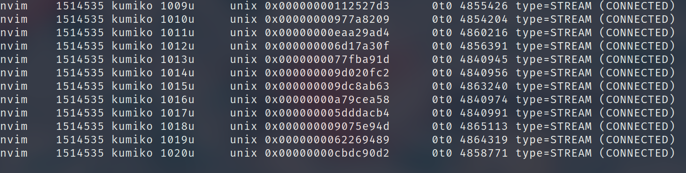

+++
title = "怎么又是你！ too many open files"
summary = ''
description = ""
categories = []
tags = []
date = 2023-04-24T14:25:12+08:00
draft = false
+++

整理一下前段时间的一个问题。我的 nvim 在某个时间段后就经常发生 `too many open files` 的问题，导致很多功能都无法正常工作，只能重启 nvim。自己用的笔记本，ulimit 这些参数都是没有改过的，默认值是 1024。一个 nvim 你要用 1024 个 fd，简直是开玩笑。这肯定是 fd 哪里没有合理 close 掉，导致泄漏了。这里分享一下排查经验，其实大部分都是靠直觉的。fd 一般就是 `open` `dup` `socket` 这些系统调用创建出来的，我们可以先来看一下这个进程有哪些 fd，根据类型来揣测一下是文件打开多了，还是网络连接多了


`lsof -p <pid>` 这条命令可以列出进程当前拥有的 fd


 </img>


一眼看去都是这种输出，百分之九十九就是这个出问题了。关于 lsof 命令的输出，有请 ChatGPT 出来讲解一下

- `nvim`：进程的名称
- `209543`：进程的 PID
- `kumiko`：进程的拥有者
- `988u`：文件描述符（file descriptor），是指向该文件的引用或指针，它用于标识打开文件的方式和位置。在这个例子中，文件描述符是 `988u`。
- `unix`：文件类型，这是一个 UNIX 域套接字（UNIX domain socket）。
- `0x00000000920f1c98`：文件标识符（file identifier），是一个唯一的值，用于标识文件。在这个例子中，文件标识符是 `0x00000000920f1c98`。
- `0t0`：文件的偏移量（offset），在这个例子中是 0。
- `1073592`：文件的节点号（inode number），是文件在文件系统中的唯一标识符。
- `type=STREAM`：套接字类型，是一个流套接字。
- `(CONNECTED)`：该套接字当前处于连接状态。

综上所述，这个输出表示进程 `nvim` 打开了一个 UNIX 域套接字，并且该套接字处于连接状态。通常来说，如果你想要更详细的信息，可以使用 lsof 命令的其他选项来获取更多的文件信息和进程信息


Unix Socket 这个用过的人都知道，基本的应用场景就是本机间的 C/S 架构，比如 docker；或者直接用在多进程的通信上。所以我们不妨看一下 nvim 底下有哪些进程

```
$ pstree 209542
nvim───nvim─┬─990*[curl]
            ├─language_server─┬─language_server───20*[{language_server}]
            │                 └─20*[{language_server}]
            ├─python3
            ├─rust-analyzer─┬─rust-analyzer-p
            │               └─30*[{rust-analyzer}]
            └─4*[{nvim}]

```


`990*[curl]` 的意思是有990 个 curl 进程，这可不得了，说不定是 spawn 之后没有 wait 结束的进程。但是上面我们看到 Unix Socket 的状态都是 CONNECTED 的，显然这些进程都是存活的。对于一个进程我们可以在 `/proc/<pid>` 目录获取所有的信息


 </img>


那么这个 curl 做了什么呢。curl 有一个好处就是，可以直接通过命令本身来重现信息，这个可以通过 `/proc/<pid>/cmdling` 来查看


```
$ cat -A /proc/388763/cmdline
/usr/bin/curl␀http://localhost:35033/exa.language_server_pb.LanguageServerService/Heartbeat␀--header␀Content-Type:·application/json␀-d@-␀

```

这行命令有一个关键信息就是 `exa.language_server_pb` ，所以我们只需要在代码中找到和此  URL 路径相关的位置就可以了。如果你使用的是 LazyVim 来管理插件，所有插件的代码在 `~/.local/share/nvim/lazy`


```
$ rg 'exa.lang'
codeium.vim/autoload/codeium/server.vim
69:      \ '/exa.language_server_pb.LanguageServerService/' . a:type
```


果然找到了，这个插件是一个 AI 补全插件 [codeium](https://codeium.com/)。回想一下好像差不多就是装了这个之后出现的问题。在 GitHub 的 repo 上搜了一下，竟然没有人遇到这个问题。正当我想要提交 issue 的时候，我试着自己 curl 了一下，想看看这个 API 返回的是啥。因为这里使用了 `-d@-` 参数，所以是从 stdin 读了数据的，必须要看代码才能知道发了什么。大概就是拼出了下面的这条命令，然后每 5 秒执行一次，逻辑上是没什么问题。要说缺点的话是没有设置 max-timeout，不过这个看起来就是一个 REST 请求，Server 或者 Client 主动断掉就可以了


```
/usr/bin/curl http://localhost:35033/exa.language_server_pb.LanguageServerService/Heartbeat --header "Content-Type: application/json"  -d '{"metadata": {"extension_name": "vim", "ide_name": "neovim", "api_key": "fe8b34f7-ac14-4388-86b9-8a26f6207e63", "extension_version": "1.2.3", "ide_version": "0.9.0"}}'
```

*P.S. api_key 是假的*


试着在外面的 Shell 里运行了一下，结果 hang 住了。连接没有断开，而且没有响应体的回显。这里凭直觉盲猜是这个本地的 35033 端口的 Server 又连接了远端的 API Server 然后中间哪里有问题。但很遗憾错了，我试着打印了一下 Server 返回的所有数据


```
$ /usr/bin/curl http://localhost:35033/exa.language_server_pb.LanguageServerService/Heartbeat --header "Content-Type: application/json"  -d '{"metadata": {"extension_name": "vim", "ide_name": "neovim", "api_key": "fe8b34f7-ac14-4388-86b9-8a26f6207e63", "extension_version": "1.2.3", "ide_version": "0.9.0"}}' -vv
* Uses proxy env variable http_proxy == 'http://127.0.0.1:7890'
*   Trying 127.0.0.1:7890...
* Connected to 127.0.0.1 (127.0.0.1) port 7890 (#0)
> POST http://localhost:35033/exa.language_server_pb.LanguageServerService/Heartbeat HTTP/1.1
> Host: localhost:35033
> User-Agent: curl/8.0.1
> Accept: */*
> Proxy-Connection: Keep-Alive
> Content-Type: application/json
> Content-Length: 166
>
< HTTP/1.1 200 OK
< Accept-Encoding: gzip
< Connection: keep-alive
< Content-Type: application/json
< Date: Mon, 24 Apr 2023 07:20:14 GMT
< Keep-Alive: timeout=4
< Proxy-Connection: keep-alive
< Vary: Origin
* no chunk, no close, no size. Assume close to signal end
<

```


这个 Response 是没有 `Content-Length` 的，显然不对了。你 Server 不告诉我返回多少字节，我们怎么知道读取完毕了呢？虽然这里设置了一个 `Keep-Alive: timeout=4` 但是 HTTP Response 本身都没有结束，理应是不会开始计时的。另外 curl 命令真的支持这个 Header 么？我在[代码](https://github.com/curl/curl/blob/master/lib/http.c)中找了一下发现好像没有处理这个 `keep-Alive` 的逻辑


不过还要注意一点，这个是走了本地代理的。那么去掉代理，是否正常呢。我又试了一下


```
$ /usr/bin/curl http://127.0.0.1:35033/exa.language_server_pb.LanguageServerService/Heartbeat --header "Content-Type: application/json"  -d '{"metadata": {"extension_name": "vim", "ide_name": "neovim", "api_key": "fe8b34f7-ac14-4388-86b9-8a26f6207e63", "extension_version": "1.2.3", "ide_version": "0.9.0"}}' -vv
*   Trying 127.0.0.1:35033...
* Connected to 127.0.0.1 (127.0.0.1) port 35033 (#0)
> POST /exa.language_server_pb.LanguageServerService/Heartbeat HTTP/1.1
> Host: 127.0.0.1:35033
> User-Agent: curl/8.0.1
> Accept: */*
> Content-Type: application/json
> Content-Length: 166
>
< HTTP/1.1 200 OK
< Accept-Encoding: gzip
< Content-Type: application/json
< Vary: Origin
< Date: Mon, 24 Apr 2023 07:37:11 GMT
< Content-Length: 2
<
* Connection #0 to host 127.0.0.1 left intact
{}%
```


有 `Content-Length`，响应正常解析。怪不得 GitHub 上面搜一下都没人遇到这个问题，实实在在体会到了一把小小的中国震撼。但是为什么呢？我尝试抓包看一下。链路分为两部分 curl => 7890 端口的代理 和 代理 =>  本地 35033 端口的 server。下面简称为 curl, proxy, server 


这里可以先看看 `netstat` 的信息，因为在 proxy 没有使用复用 TCP 连接的的情况下，每一个 curl 进程到 proxy，然后 proxy 都会建立一个新的 connection 到 35033 的 server 才对。所以两侧应该有相同的连接数目。这里就不截图了，结论是 proxy 到 server 的连接数目很少，这就说明了这侧的连接是可以正常关闭的。但是连接关闭了之后，代理理应也关闭和 curl 之间的连接才对！

抓一下 TCP 报文看一下。首先是 proxy 到 server 的链路 *这个图是后来补的，端口变为了 34723*


 </img>

然后下图是其中一个 HTTP Response 的数据


 </img>


Server 返回的 Response 的经过 gzip 的，原始长度 26，实际的长度为 2。至于为什么 gzip 了，那么因为这个 proxy 在 header 里面添加了一个 `Accept-Encoding: gzip` ，所以 Server 返回了 `gzip` 格式的数据。在我们不经过 proxy 的情况，直接 curl 返回的则是未经过 encoding 的数据


目测下来数据上正常，Server 的实现应该是正确的。再来看一下 curl 到 proxy 这条链路。发送了请求之后，没有一个绿色的 HTTP 数据出现。但是仔细分析 TCP 数据可以发现，其实后面的都是 HTTP Response 的一部分


 </img>


高亮的其实应该是 HTTP Response 的最后一个数据，就是那个 `{}` ，但是因为解析的问题导致 wireshark 无法分辨这个 http 是在这里结束。之后的报文就是漫长的 TCP Keep-Alive 了。而且我们可以看到第一个 Keep-Alive 的报文是从 7890 端口发到 curl 的，这个时候 proxy 应该知道和 server 间的 connection 是结束掉的，但是依旧傻傻的在 keep alive


综上所述，大概就是这个问题的来龙去脉了。环境信息如下：

-  Clash 1.15.1 linux amd64 with go1.20.3 unknown time
- curl 8.0.1 (x86_64-pc-linux-gnu) libcurl/8.0.1 OpenSSL/3.0.8 zlib/1.2.13 brotli/1.0.9 zstd/1.5.5 libidn2/2.3.4 libpsl/0.21.2 (+libidn2/2.3.4) libssh2/1.10.0 nghttp2/1.52.0


一个最小的复现代码是下面这样的，`curl` 一下这个 flask 的 server，一定会 hang 住


```Python
from flask import make_response, json
from flask import Flask
import gzip

app = Flask(__name__)


@app.route("/gzip")
def compress():
    very_long_content = [{"a": 1, "b": 2}, {"c": 3, "d": 4}]
    content = gzip.compress(json.dumps(very_long_content).encode("utf8"), 5)
    response = make_response(content)
    response.headers["Content-length"] = len(content)
    response.headers["Content-Encoding"] = "gzip"
    return response

```


    