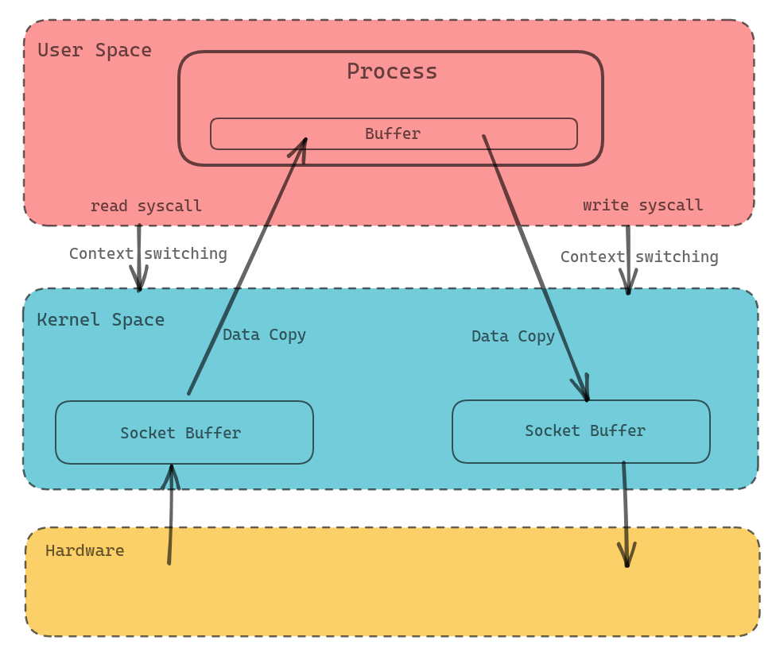
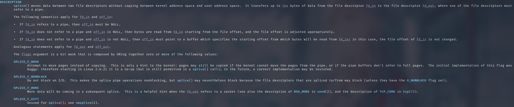
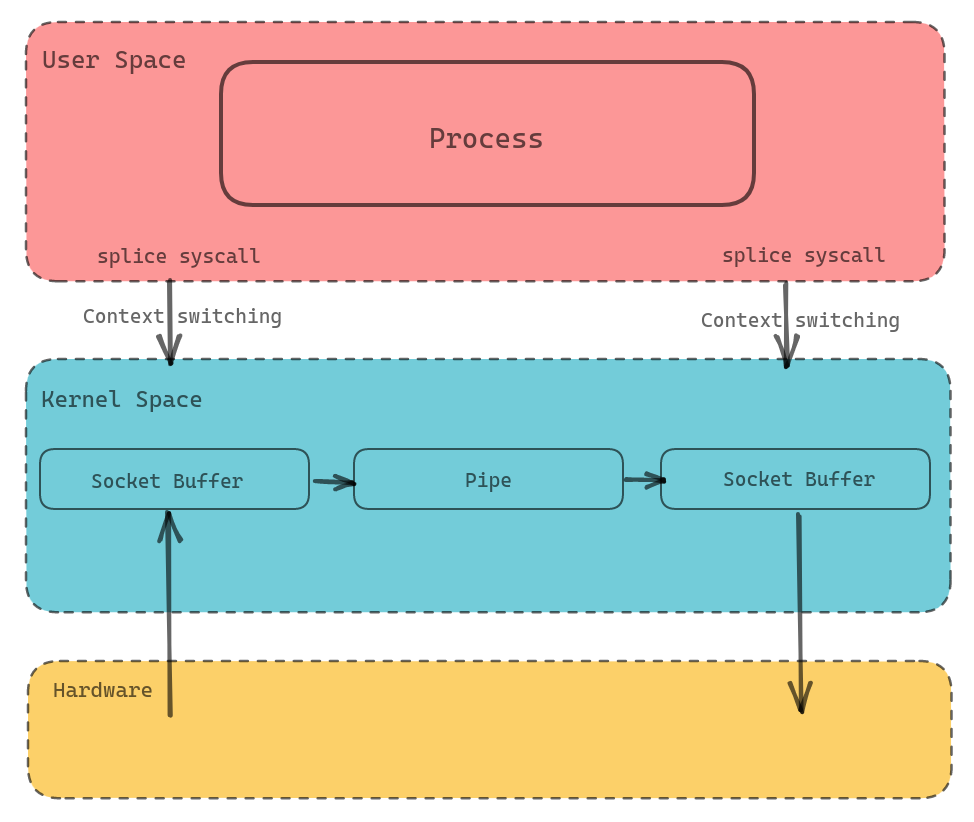
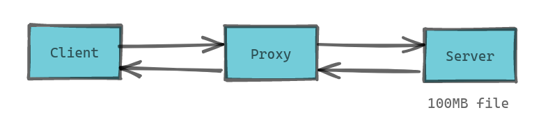

+++
title = "理解 Linux 中的 splice(2)"
summary = ''
description = ""
categories = []
tags = []
date = 2023-05-04T14:32:01+08:00
draft = false
+++

### 引言


通常我们在进行网络编程的时候，数据的传输过程如下图所示





在一些场景下这个没什么问题的，但是在某些特殊场景下可以优化这个传输过程。比如 Socks5 Proxy 在 CONNECT 之后，会直接透明传输 Client 到 Server 的流量。这个情况下就没有比较将数据从 Socket Buffer 中复制到 User Process 了，因为我们不需要对流量进行任何修改。所以更好的方法是直接在 Kernel 内转发掉。Linux 提供了 splice(2) 这个函数，这个其实是一个很老的东西了。我们首先来看 Linux 的 splice(2) 的函数签名

```c
ssize_t splice(int fd_in, off64_t *_Nullable off_in,
              int fd_out, off64_t *_Nullable off_out,
              size_t len, unsigned int flags);

```

再来看一下文档部分的说明


 </img>


注：在 Linux 6.2.13 版本， `SPLICE_F_MOVE` 这个 Flag 在 kernel 代码里面是没有用到的，设置和不设置是没有区别的。


`splice()` 是基于 Linux 的 pipe 实现的，所以 `splice()` 的两个入参文件描述符才要求必须有一个是 pipe。通过 splice(2) 进行进行转发后，我们的传输过程会变为下图所示





### splice(2) 源码分析

*Linux kernel 的代码使用的是 v6.3，引用到的代码遵循源代码协议 GPL 2.0。文中附上的代码因篇幅原因有所省略。*


当我们调用 splice  syscall 的时候，实际上调用的是内核中的 `do_splice` 函数。代码如下

```c
// https://github.com/torvalds/linux/blob/v6.3/fs/splice.c#L1114

/*
 * Determine where to splice to/from.
 */
long do_splice(struct file *in, loff_t *off_in, struct file *out,
	       loff_t *off_out, size_t len, unsigned int flags)
{
	struct pipe_inode_info *ipipe;
	struct pipe_inode_info *opipe;
    
	ipipe = get_pipe_info(in, true);
	opipe = get_pipe_info(out, true);

	if (ipipe && opipe) {
		// ...
		return splice_pipe_to_pipe(ipipe, opipe, len, flags);
	}

	if (ipipe) {
		// ...
		file_start_write(out);
		ret = do_splice_from(ipipe, out, &offset, len, flags);
		file_end_write(out);
        // ...
		return ret;
	}

	if (opipe) {
        // ...
		ret = splice_file_to_pipe(in, opipe, &offset, len, flags);
        // ...
		return ret;
	}

	return -EINVAL;
}

```


此函数根据参数的类型进行分发，如果均为 pipe 类型，那么会调用 `splice_pipe_to_pipe`。如果 `in` 端为 pipe 类型(另一端不是)，那么调用 `do_splice_from`，如果 `out` 端为 pipe，那么调用 `splice_file_to_pipe`。我们下面分析一下 `out` 为 pipe 类型， `in` 为 `socket` 类型的执行流程

```c
// https://github.com/torvalds/linux/blob/v6.3/fs/splice.c#L1094
long splice_file_to_pipe(struct file *in,
			 struct pipe_inode_info *opipe,
			 loff_t *offset,
			 size_t len, unsigned int flags)
{
	long ret;
	pipe_lock(opipe);
	ret = wait_for_space(opipe, flags);
	if (!ret)
		ret = do_splice_to(in, offset, opipe, len, flags);
	pipe_unlock(opipe);
	if (ret > 0)
		wakeup_pipe_readers(opipe);
	return ret;
}
```

```c
// https://github.com/torvalds/linux/blob/v6.3/fs/splice.c#L862
/*
 * Attempt to initiate a splice from a file to a pipe.
 */
static long do_splice_to(struct file *in, loff_t *ppos,
			 struct pipe_inode_info *pipe, size_t len,
			 unsigned int flags)
{
	// ... some check here
	return in->f_op->splice_read(in, ppos, pipe, len, flags);
}
```


省略掉一些参数和状态的合法性检查，最终会调用 `in->f_op->splice_read`。此函数对于不同的类型有着不同的实现，比如 `socket`  会调用 `sock_splice_read` 函数

```c
// https://github.com/torvalds/linux/blob/v6.3/net/socket.c#L1087
static ssize_t sock_splice_read(struct file *file, loff_t *ppos,
				struct pipe_inode_info *pipe, size_t len,
				unsigned int flags)
{
	struct socket *sock = file->private_data;

	if (unlikely(!sock->ops->splice_read))
		return generic_file_splice_read(file, ppos, pipe, len, flags);
	return sock->ops->splice_read(sock, ppos, pipe, len, flags);
}
```

这里不同协议的 socket 实现不同，取决于 `socket->ops` 中关联的函数指针。如果没有关联，那么调用的是 `generic_file_splice_read`

- 对于 AF_UNIX 协议，即 Unix domain socket，这里调用的是 `unix_stream_splice_read` 函数

- 对于 AF_STREAM 协议，即 TCP，这里调用的是 `tcp_splice_read`


下面对常用到的 TCP 协议的实现进行分析

```c
// https://github.com/torvalds/linux/blob/v6.3/net/ipv4/tcp.c#L769
/**
 *  tcp_splice_read - splice data from TCP socket to a pipe
 * @sock:	socket to splice from
 * @ppos:	position (not valid)
 * @pipe:	pipe to splice to
 * @len:	number of bytes to splice
 * @flags:	splice modifier flags
 *
 * Description:
 *    Will read pages from given socket and fill them into a pipe.
 *
 **/
ssize_t tcp_splice_read(struct socket *sock, loff_t *ppos,
			struct pipe_inode_info *pipe, size_t len,
			unsigned int flags)
{
	struct sock *sk = sock->sk;
	struct tcp_splice_state tss = {
		.pipe = pipe,
		.len = len,
		.flags = flags,
	};
	// ...
	lock_sock(sk);
	while (tss.len) {
		ret = __tcp_splice_read(sk, &tss);
        // ...
		tss.len -= ret;
		release_sock(sk);
		lock_sock(sk);
	}
	release_sock(sk);
	return ret;
}
```

```c
// https://github.com/torvalds/linux/blob/v6.3/net/ipv4/tcp.c#L746
static int __tcp_splice_read(struct sock *sk, struct tcp_splice_state *tss)
{
	/* Store TCP splice context information in read_descriptor_t. */
	read_descriptor_t rd_desc = {
		.arg.data = tss,
		.count	  = tss->len,
	};
	return tcp_read_sock(sk, &rd_desc, tcp_splice_data_recv);
}
```


核心逻辑位于 `tcp_read_sock` ，此函数接收一个 `read_descriptor_t` 类型的参数和一个 `sk_read_actor_t`。在此例中分别是我们的 `pipe` 和一个自定义 handler，此用于执行具体的逻辑，将 TCP 数据放入 pipe 中

```c
// https://github.com/torvalds/linux/blob/v6.3/net/ipv4/tcp.c#L1680
/*
 * This routine provides an alternative to tcp_recvmsg() for routines
 * that would like to handle copying from skbuffs directly in 'sendfile'
 * fashion.
 * Note:
 *	- It is assumed that the socket was locked by the caller.
 *	- The routine does not block.
 *	- At present, there is no support for reading OOB data
 *	  or for 'peeking' the socket using this routine
 *	  (although both would be easy to implement).
 */
int tcp_read_sock(struct sock *sk, read_descriptor_t *desc,
		  sk_read_actor_t recv_actor)
{
	struct sk_buff *skb;
	struct tcp_sock *tp = tcp_sk(sk);
	u32 seq = tp->copied_seq;
	u32 offset;
	int copied = 0;

	while ((skb = tcp_recv_skb(sk, seq, &offset)) != NULL) {
		if (offset < skb->len) {
			int used;
			size_t len;
            // ...
			len = skb->len - offset;
			used = recv_actor(desc, skb, offset, len);
			if (used <= 0) {
				if (!copied)
					copied = used;
				break;
			};
		}
	}
	tcp_rcv_space_adjust(sk);
	/* Clean up data we have read: This will do ACK frames. */
	if (copied > 0) {
		tcp_recv_skb(sk, seq, &offset);
		tcp_cleanup_rbuf(sk, copied);
	}
	return copied;
}
```

上面这段代码在循环中从 `skb_buf` 中不断读取 `skb` 然后调用 `recv_actor` (即我们传入的handler)。重点来看 `recv_actor`是如何处理数据的，此函数即 `tcp_splice_data_recv`


```c
// https://github.com/torvalds/linux/blob/v6.3/net/ipv4/tcp.c#L733
static int tcp_splice_data_recv(read_descriptor_t *rd_desc, struct sk_buff *skb,
				unsigned int offset, size_t len)
{
	struct tcp_splice_state *tss = rd_desc->arg.data;
	int ret;
	ret = skb_splice_bits(skb, skb->sk, offset, tss->pipe,
			      min(rd_desc->count, len), tss->flags);
	if (ret > 0)
		rd_desc->count -= ret;
	return ret;
}
```

```c
// https://github.com/torvalds/linux/blob/v6.3/net/core/skbuff.c#L2921
/*
 * Map data from the skb to a pipe. Should handle both the linear part,
 * the fragments, and the frag list.
 */
int skb_splice_bits(struct sk_buff *skb, struct sock *sk, unsigned int offset,
		    struct pipe_inode_info *pipe, unsigned int tlen,
		    unsigned int flags)
{
	struct partial_page partial[MAX_SKB_FRAGS];
	struct page *pages[MAX_SKB_FRAGS];
	struct splice_pipe_desc spd = {
		.pages = pages,
		.partial = partial,
		.nr_pages_max = MAX_SKB_FRAGS,
		.ops = &nosteal_pipe_buf_ops,
		.spd_release = sock_spd_release,
	};
	int ret = 0;
	__skb_splice_bits(skb, pipe, &offset, &tlen, &spd, sk);
	if (spd.nr_pages)
		ret = splice_to_pipe(pipe, &spd);
	return ret;
}
```

`skb_splice_bits` 函数主要分配了 page 结构，用于之后的映射。然后调用了 `__skb_splice_bits` 函数将 `skb` 的数据映射到 `spd` 中的 `pages` 上。最后如果映射的数量不为 0，那么调用 `splice_to_pipe` 函数，此函数也比较关键，不过我们先来看 `__skb_splice_bits`


```c
// https://github.com/torvalds/linux/blob/v6.3/net/core/skbuff.c#L2869
/*
 * Map linear and fragment data from the skb to spd. It reports true if the
 * pipe is full or if we already spliced the requested length.
 */
static bool __skb_splice_bits(struct sk_buff *skb, struct pipe_inode_info *pipe,
			      unsigned int *offset, unsigned int *len,
			      struct splice_pipe_desc *spd, struct sock *sk)
{
	int seg;
	struct sk_buff *iter;
	/* map the linear part :
	 * If skb->head_frag is set, this 'linear' part is backed by a
	 * fragment, and if the head is not shared with any clones then
	 * we can avoid a copy since we own the head portion of this page.
	 */
	if (__splice_segment(virt_to_page(skb->data),
			     (unsigned long) skb->data & (PAGE_SIZE - 1),
			     skb_headlen(skb),
			     offset, len, spd,
			     skb_head_is_locked(skb),
			     sk, pipe))
		return true;
	/*
	 * then map the fragments
	 */
	for (seg = 0; seg < skb_shinfo(skb)->nr_frags; seg++) {
		const skb_frag_t *f = &skb_shinfo(skb)->frags[seg];
		if (__splice_segment(skb_frag_page(f),
				     skb_frag_off(f), skb_frag_size(f),
				     offset, len, spd, false, sk, pipe))
			return true;
	}
	skb_walk_frags(skb, iter) {
		if (*offset >= iter->len) {
			*offset -= iter->len;
			continue;
		}
		/* __skb_splice_bits() only fails if the output has no room
		 * left, so no point in going over the frag_list for the error
		 * case.
		 */
		if (__skb_splice_bits(iter, pipe, offset, len, spd, sk))
			return true;
	}
	return false;
}
```

这里处理了整个 skb 的数据，包括每个分片的数据。最终都会调用一个类似 `virt_to_page` 的函数来将虚拟地址转换为页地址，然后通过 `__splice_segment` 函数填充数据。`linear` 是指 skb 的数据直接存储在 `skb-head` 到 `skb-end` 这个区间，`skb->data_len` 为 0。如果这个区间放不下，会有额外的 frag 指针指向对应的数据。所以这里处理起来比较复杂。如果你对于 skb 的数据结构抱有疑问，可以参考 http://vger.kernel.org/~davem/skb_data.html


我们继续来看 `__splice_segment` 函数

```c
// https://github.com/torvalds/linux/blob/v6.3/net/core/skbuff.c#L2830
static bool __splice_segment(struct page *page, unsigned int poff,
			     unsigned int plen, unsigned int *off,
			     unsigned int *len,
			     struct splice_pipe_desc *spd, bool linear,
			     struct sock *sk,
			     struct pipe_inode_info *pipe)
{
	if (!*len)
		return true;
	/* skip this segment if already processed */
	if (*off >= plen) {
		*off -= plen;
		return false;
	}
	/* ignore any bits we already processed */
	poff += *off;
	plen -= *off;
	*off = 0;
	do {
		unsigned int flen = min(*len, plen);
		if (spd_fill_page(spd, pipe, page, &flen, poff,
				  linear, sk))
			return true;
		poff += flen;
		plen -= flen;
		*len -= flen;
	} while (*len && plen);
	return false;
}
```

```c
// https://github.com/torvalds/linux/blob/v6.3/net/core/skbuff.c#L2803
/*
 * Fill page/offset/length into spd, if it can hold more pages.
 */
static bool spd_fill_page(struct splice_pipe_desc *spd,
			  struct pipe_inode_info *pipe, struct page *page,
			  unsigned int *len, unsigned int offset,
			  bool linear,
			  struct sock *sk)
{
	if (unlikely(spd->nr_pages == MAX_SKB_FRAGS))
		return true;
	if (linear) {
		page = linear_to_page(page, len, &offset, sk);
		if (!page)
			return true;
	}
	if (spd_can_coalesce(spd, page, offset)) {
		spd->partial[spd->nr_pages - 1].len += *len;
		return false;
	} 
	get_page(page);
	spd->pages[spd->nr_pages] = page;
	spd->partial[spd->nr_pages].len = *len;
	spd->partial[spd->nr_pages].offset = offset;
	spd->nr_pages++;
	return false;
}
```

上面的两个函数是映射的实现。`get_page `  让对应 page 的 `_count` 加一，以防释放掉。所以在这里其实就是拿了 page，构建号了 `spd` 结构数据。有了这个数据我们再来看 `splice_to_pipe` 函数


```c
// https://github.com/torvalds/linux/blob/v6.3/fs/splice.c#L182

/**
 * splice_to_pipe - fill passed data into a pipe
 * @pipe:	pipe to fill
 * @spd:	data to fill
 *
 * Description:
 *    @spd contains a map of pages and len/offset tuples, along with
 *    the struct pipe_buf_operations associated with these pages. This
 *    function will link that data to the pipe.
 *
 */
ssize_t splice_to_pipe(struct pipe_inode_info *pipe,
		       struct splice_pipe_desc *spd)
{
	unsigned int spd_pages = spd->nr_pages;
	unsigned int tail = pipe->tail;
	unsigned int head = pipe->head;
	unsigned int mask = pipe->ring_size - 1;
	int ret = 0, page_nr = 0;
	while (!pipe_full(head, tail, pipe->max_usage)) {
		struct pipe_buffer *buf = &pipe->bufs[head & mask];
		buf->page = spd->pages[page_nr];
		buf->offset = spd->partial[page_nr].offset;
		buf->len = spd->partial[page_nr].len;
		buf->private = spd->partial[page_nr].private;
		buf->ops = spd->ops;
		buf->flags = 0;
        
		head++;
		pipe->head = head;
		page_nr++;
		ret += buf->len;
		if (!--spd->nr_pages)
			break;
	}
	if (!ret)
		ret = -EAGAIN;
	return ret;
}
```

可以看到这里是复制的 `spd` 数据结构中的 page 指针到 `buf` 结构中，也就是说没有发生页的复制，而是采用的共享


### 在 tokio 上实现基于 splice(2) 的 copy_bidirectional

tokio 本身提供了 [`copy_bidirectional`](https://docs.rs/tokio/latest/tokio/io/fn.copy_bidirectional.html) 函数，用于将两个 stream 串联在一起。但是这个函数写死的 `BUF_SIZE` 为 8k，没法改。我们下面基于 `splice(2)` 来协议一样的。首先是借助 libc 来封装一下这个系统调用

```rust
#[inline]
fn splice(fd_in: RawFd, fd_out: RawFd, size: usize) -> isize {
    unsafe {
        libc::splice(
            fd_in,
            std::ptr::null_mut::<libc::loff_t>(),
            fd_out,
            std::ptr::null_mut::<libc::loff_t>(),
            size,
            libc::SPLICE_F_NONBLOCK,
        )
    }
}
```


因为 tokio 本身是 `NONBLOCK` 的，所以接下来的 Pipe 之类的数据也会设置 `NONBLOCK`。

```rust
#[repr(C)]
struct Pipe(RawFd, RawFd);

impl Pipe {
    fn new() -> Result<Self> {
        let mut pipe = std::mem::MaybeUninit::<[libc::c_int; 2]>::uninit();
        unsafe {
            if libc::pipe2(
                pipe.as_mut_ptr() as *mut libc::c_int,
                libc::O_CLOEXEC | libc::O_NONBLOCK,
            ) < 0
            {
                return Err(Error::last_os_error());
            }
            let [r_fd, w_fd] = pipe.assume_init();
            libc::fcntl(w_fd, libc::F_SETPIPE_SZ, PIPE_SIZE);
            Ok(Pipe(r_fd, w_fd))
        }
    }
}

impl Drop for Pipe {
    fn drop(&mut self) {
        unsafe {
            libc::close(self.0);
            libc::close(self.1);
        }
    }
}
```

因为 Rust 的 async task 是可以随时取消的，所以这里的 Pipe 最好在一个 task 里面用，不要跨 task 来处理，要不然可能数据的数据周期有问题。然后编写两个函数一个用于从 socket 读取数据到 pipe 的一端，另一个用于从 pipe 的另一端读取输入写入其他的 socket 就好了。因为篇幅限制，这里简单列一个 `read` 的实现


```rust
struct CopyBuffer<R, W> {
    read_done: bool,
    need_flush: bool,
    pos: usize,
    cap: usize,
    amt: u64,
    buf: Pipe,
    //
    _marker_r: PhantomData<R>,
    _marker_w: PhantomData<W>,
}

impl<R, W> CopyBuffer<R, W>
where
    R: Stream + Unpin,
    W: Stream + Unpin,
{
    fn poll_fill_buf(&mut self, cx: &mut Context<'_>, stream: &mut R) -> Poll<Result<usize>> {
        loop {
            ready!(stream.poll_read_ready_n(cx))?;

            let res = stream.try_io_n(Interest::READABLE, || {
                match splice(stream.as_raw_fd(), self.buf.write_fd(), usize::MAX) {
                    size if size >= 0 => Ok(size as usize),
                    _ => {
                        let err = Error::last_os_error();
                        match err.raw_os_error() {
                            Some(e) if e == libc::EWOULDBLOCK || e == libc::EAGAIN => {
                                Err(ErrorKind::WouldBlock.into())
                            }
                            _ => Err(err),
                        }
                    }
                }
            });
            match res {
                Ok(size) => {
                    if self.cap == size {
                        self.read_done = true;
                    }
                    self.cap = size;
                    return Poll::Ready(res);
                }
                Err(e) => {
                    if e.kind() == ErrorKind::WouldBlock {
                        continue;
                        // return Poll::Pending;
                    }

                    return Poll::Ready(Err(e));
                }
            }
        }
    }
```


剩下的基本上照着 tokio 本身的 `copy_bidirectional` 函数来抄就好了。完成品 https://github.com/Hanaasagi/tokio-splice


### Benchmark

简单测试了一下 1 并发的情况，主要是看吞吐量



#### 直连

```
  scenarios: (100.00%) 1 scenario, 1 max VUs, 1m30s max duration (incl. graceful stop):
           * default: 1 looping VUs for 1m0s (gracefulStop: 30s)


     data_received..................: 84 GB 1.4 GB/s
     data_sent......................: 89 kB 1.5 kB/s
     http_req_blocked...............: avg=209.86µs min=130.74µs med=176.55µs max=904.02µs p(90)=311.73µs p(95)=396.82µs
     http_req_connecting............: avg=135.41µs min=71.65µs  med=108.07µs max=843.88µs p(90)=193.86µs p(95)=268.66µs
     http_req_duration..............: avg=71.35ms  min=46.14ms  med=71.39ms  max=118.74ms p(90)=86.94ms  p(95)=92.28ms
       { expected_response:true }...: avg=71.35ms  min=46.14ms  med=71.39ms  max=118.74ms p(90)=86.94ms  p(95)=92.28ms
     http_req_failed................: 0.00% ✓ 0         ✗ 838
     http_req_receiving.............: avg=70.96ms  min=45.8ms   med=70.98ms  max=118.45ms p(90)=86.54ms  p(95)=91.92ms
     http_req_sending...............: avg=61.96µs  min=28.63µs  med=56.67µs  max=577.72µs p(90)=86.47µs  p(95)=104.09µs
     http_req_tls_handshaking.......: avg=0s       min=0s       med=0s       max=0s       p(90)=0s       p(95)=0s
     http_req_waiting...............: avg=323.45µs min=174.46µs med=294.97µs max=960.73µs p(90)=442.61µs p(95)=572.61µs
     http_reqs......................: 838   13.948076/s
     iteration_duration.............: avg=71.67ms  min=46.37ms  med=71.71ms  max=118.97ms p(90)=87.35ms  p(95)=92.54ms
     iterations.....................: 838   13.948076/s
     vus............................: 1     min=1       max=1
     vus_max........................: 1     min=1       max=1

```


#### copy_bidirectional

```
  scenarios: (100.00%) 1 scenario, 1 max VUs, 1m30s max duration (incl. graceful stop):
           * default: 1 looping VUs for 1m0s (gracefulStop: 30s)


     data_received..................: 61 GB 1.0 GB/s
     data_sent......................: 64 kB 1.1 kB/s
     http_req_blocked...............: avg=200.48µs min=119.63µs med=172.57µs max=1.18ms   p(90)=277.57µs p(95)=347.66µs
     http_req_connecting............: avg=127.21µs min=71.02µs  med=106.85µs max=1.03ms   p(90)=175.8µs  p(95)=214.9µs
     http_req_duration..............: avg=98.63ms  min=68.7ms   med=99.37ms  max=139.45ms p(90)=116.96ms p(95)=120.9ms
       { expected_response:true }...: avg=98.63ms  min=68.7ms   med=99.37ms  max=139.45ms p(90)=116.96ms p(95)=120.9ms
     http_req_failed................: 0.00% ✓ 0         ✗ 607
     http_req_receiving.............: avg=98.02ms  min=68.2ms   med=98.79ms  max=138.67ms p(90)=116.18ms p(95)=120.34ms
     http_req_sending...............: avg=58.65µs  min=29.05µs  med=53.77µs  max=206.03µs p(90)=79.22µs  p(95)=93.51µs
     http_req_tls_handshaking.......: avg=0s       min=0s       med=0s       max=0s       p(90)=0s       p(95)=0s
     http_req_waiting...............: avg=555.83µs min=292.77µs med=513.33µs max=1.31ms   p(90)=749.03µs p(95)=859µs
     http_reqs......................: 607   10.104426/s
     iteration_duration.............: avg=98.94ms  min=68.95ms  med=99.73ms  max=139.7ms  p(90)=117.22ms p(95)=121.2ms
     iterations.....................: 607   10.104426/s
     vus............................: 1     min=1       max=1
     vus_max........................: 1     min=1       max=1
```


#### splice(2) copy_bidirectional

```
  scenarios: (100.00%) 1 scenario, 1 max VUs, 1m30s max duration (incl. graceful stop):
           * default: 1 looping VUs for 1m0s (gracefulStop: 30s)


     data_received..................: 80 GB 1.3 GB/s
     data_sent......................: 85 kB 1.4 kB/s
     http_req_blocked...............: avg=198.7µs  min=128.01µs med=174.11µs max=1.15ms   p(90)=264.65µs p(95)=340.27µs
     http_req_connecting............: avg=126.37µs min=75µs     med=107.27µs max=1.05ms   p(90)=164.14µs p(95)=215.64µs
     http_req_duration..............: avg=74.81ms  min=50.15ms  med=74.55ms  max=115.09ms p(90)=92.36ms  p(95)=96.53ms
       { expected_response:true }...: avg=74.81ms  min=50.15ms  med=74.55ms  max=115.09ms p(90)=92.36ms  p(95)=96.53ms
     http_req_failed................: 0.00% ✓ 0         ✗ 799
     http_req_receiving.............: avg=74.22ms  min=49.47ms  med=74.02ms  max=114.63ms p(90)=91.74ms  p(95)=95.99ms
     http_req_sending...............: avg=57.56µs  min=29.54µs  med=53.56µs  max=193.73µs p(90)=76.61µs  p(95)=89.05µs
     http_req_tls_handshaking.......: avg=0s       min=0s       med=0s       max=0s       p(90)=0s       p(95)=0s
     http_req_waiting...............: avg=537.72µs min=292.42µs med=507.88µs max=1.64ms   p(90)=669.33µs p(95)=784.68µs
     http_reqs......................: 799   13.307762/s
     iteration_duration.............: avg=75.12ms  min=50.37ms  med=74.81ms  max=115.48ms p(90)=92.64ms  p(95)=96.79ms
     iterations.....................: 799   13.307762/s
     vus............................: 1     min=1       max=1
     vus_max........................: 1     min=1       max=1

```


### 结论


首先 `splice(2)`  的使用场景有限，很多场景不能用，比如做不同协议中转的时候。而且另外这个 pipe 可以考虑做一个 pool 来复用
    