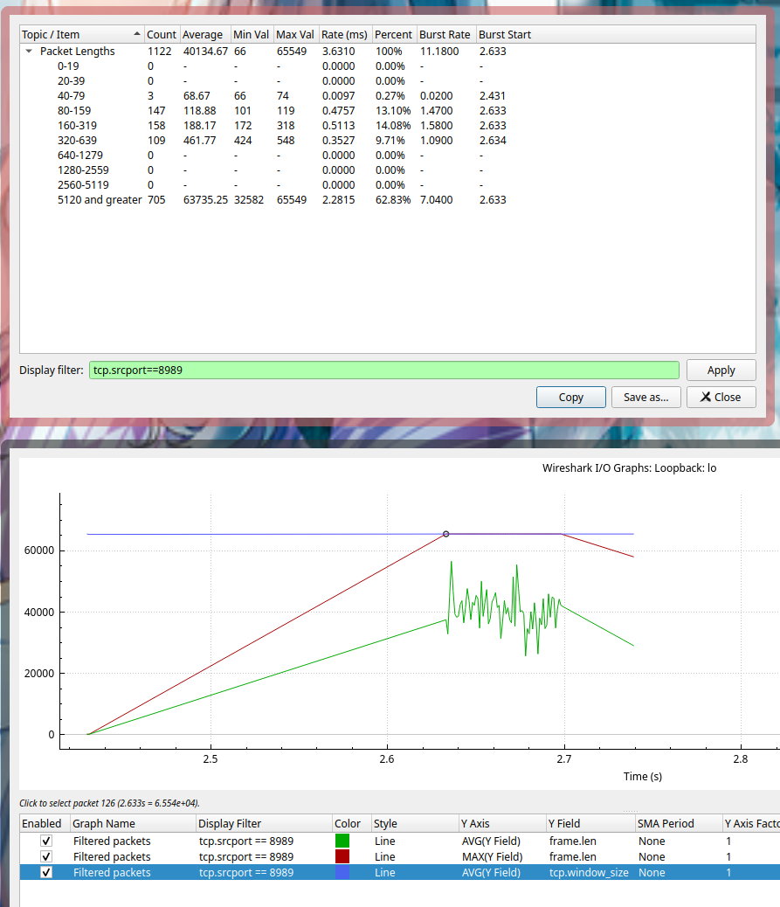

+++
title = "理解 Linux 中的 splice(2) - 补充篇"
summary = ''
description = ""
categories = []
tags = []
date = 2023-05-06T15:51:02+08:00
draft = false
+++


接上文 [理解 Linux 中的 splice(2)](https://blog.dreamfever.me/2023/05/04/li-jie-linux-zhong-de-splice-2/)，本篇来探讨一下 `splice` 的几个参数配置


### `SPLICE_F_MORE`


`splice` 系统调用的 flag 参数可以为一下几个的组合

- `SPLICE_F_MOVE` ：一个实际上没有被使用的参数
- `SPLICE_F_NONBLOCK` ：非阻塞，需要传入的文件描述符也为非阻塞模式才能生效
- `SPLICE_F_MORE`：提示在后续的splice操作中会传输更多的数据，在 `fd_out` 是 socket 的时候会有帮助
- `SPLICE_F_GIFT` ：`splice` 中没有用到的参数


除了 `SPLICE_F_MORE` 外，其他的应该不难理解。接下来说一下这个参数的意义。实验环境延续上文，使用 `splice` 来构筑一个 TCP Proxy，通过 curl 命令来下载 Server 端的大小为 100MB 的文件，中间 Proxy 会使用 `splice` 来将 Client 的 data 写入 pipe，然后再从 pipe 中读取 data 转发到 Server 中；反向过程的数据也是一样处理的


首先我们在写入 socket 的时候设置一个这个 `SPLICE_F_MORE` 来做一下 benchmark。测试的系统配置如下， MTU 65536


```
$ cat /proc/sys/net/ipv4/tcp_rmem
4096    131072  6291456

$ cat /proc/sys/net/ipv4/tcp_wmem
4096    16384   4194304
```

```
const PAGE_SIZE: usize = 4096;  // 机器的 PAGE_SIZE 大小
const PIPE_SIZE: usize = PAGE_SIZE * 16;  // pipe 的 buffer size
const READ_SIZE: usize = PAGE_SIZE * 16;  // 从 socket 到 pipe 时 splice 的 len 参数
const WRITE_SIZE: usize = PAGE_SIZE * 16;  // 从 pipe 到 socket 时 splice 的 len 参数
```


不设置 `SPLICE_F_MORE` ：（测试工具为 k6，参数为 30s，1 VU，每次请求不复用 TCP 连接）

```
     data_received..................: 41 GB 1.4 GB/s
     data_sent......................: 44 kB 1.5 kB/s
```

设置 `SPLICE_F_MORE` 后：

```
     data_received..................: 11 GB 367 MB/s
     data_sent......................: 12 kB 389 B/s
```


可以看到传输性能明显下降了大约 4 倍。那么为什么呢？我们来看一下代码，调用路径和上一篇文章中提到的类似，这里只摘录一下关键的部位

```c
// https://github.com/torvalds/linux/blob/v6.3/fs/splice.c#L1114
/*
 * Determine where to splice to/from.
 */
long do_splice(struct file *in, loff_t *off_in, struct file *out,  
           loff_t *off_out, size_t len, unsigned int flags)
           
// https://github.com/torvalds/linux/blob/v6.3/fs/splice.c#L851
/*
 * Attempt to initiate a splice from pipe to file.
 */
static long do_splice_from(struct pipe_inode_info *pipe, struct file *out,
			   loff_t *ppos, size_t len, unsigned int flags)
			   
// https://github.com/torvalds/linux/blob/v6.3/fs/splice.c#L832
/**
 * generic_splice_sendpage - splice data from a pipe to a socket
 * @pipe:	pipe to splice from
 * @out:	socket to write to
 * @ppos:	position in @out
 * @len:	number of bytes to splice
 * @flags:	splice modifier flags
 *
 * Description:
 *    Will send @len bytes from the pipe to a network socket. No data copying
 *    is involved.
 *
 */
ssize_t generic_splice_sendpage(struct pipe_inode_info *pipe, struct file *out,
				loff_t *ppos, size_t len, unsigned int flags)
{
	return splice_from_pipe(pipe, out, ppos, len, flags, pipe_to_sendpage);
}
```


`pipe_to_sendpage` 是处理数据用的 handler，会将 pipe 的数据写入 socket 中

```c
// https://github.com/torvalds/linux/blob/v6.3/fs/splice.c#L438
/*
 * Send 'sd->len' bytes to socket from 'sd->file' at position 'sd->pos'
 * using sendpage(). Return the number of bytes sent.
 */
static int pipe_to_sendpage(struct pipe_inode_info *pipe,
			    struct pipe_buffer *buf, struct splice_desc *sd)
{
	struct file *file = sd->u.file;
	loff_t pos = sd->pos;
	int more;

	if (!likely(file->f_op->sendpage))
		return -EINVAL;

	more = (sd->flags & SPLICE_F_MORE) ? MSG_MORE : 0;

	if (sd->len < sd->total_len &&
	    pipe_occupancy(pipe->head, pipe->tail) > 1)
		more |= MSG_SENDPAGE_NOTLAST;

	return file->f_op->sendpage(file, buf->page, buf->offset,
				    sd->len, &pos, more);
}
```


通过这个函数我们可以看到，如果设置了 `SPLICE_F_MORE` 那么会追加 `MSG_MORE` flag；如果当前 pipe 中还有其他的 page，则追加 `MSG_SENDPAGE_NOTLAST` flag。


首先来看 `MSG_MORE` 的作用，熟悉 TCP 的应该已经知道了这个标志表示调用者有更多的数据要发送。在 TCP socket 中，该标志用于获取与 `TCP_CORK` 相同的效果，不同之处在于该标志可以在每次调用时设置。顾名思义 `TCP_CORK` 就是给 TCP 发送数据的时候加了一个木塞子。往这个 socket 写入的数据都会聚集起来。虽然堵上了塞子，但是数据总得发送，取决于:


- 程序取消设置 TCP_CORK 这个选项
- socket 聚集的数据大于一个 MSS 的大小
- 自从堵上塞子写入第一个字节开始，已经经过 200ms
- socket 被关闭了


接下来我们通过流量分析来看一下数据，工具使用的是 wireshark，抓取的 client 到 proxy 的数据。proxy 的端口是 8989，下图都已经过滤好了，只显示了 8989 到 client 的流量，也就是那 100 MB 的文件


在不设置 `SPLICE_F_MORE` 的情况下


设置 `SPLICE_F_MORE` 的情况下





可能会有人觉得上图为什么有一条固定斜率的斜线，其实这个地方是没有流量的，只是 wireshark 在画图的时候会将散点连接起来。横轴一小格表示 20 ms，这个时间区间大概是  2.43 到 2.64  左右，正好有相当于 200ms 的空白。所以在每次请求的时候我们都浪费了 200 ms 的时间，等待数据的大小到达 MTU 65535。但是由于 TCP 本身的慢启动机制，导致每次都很难快速填满，从而会造成一个停等的状态


综上所述，使用 `SPLICE_F_MORE` 的时候需要考虑数据的上下行传输速率还有自身配置的 MTU 大小，配置不当会起反作用


### `SPLICE_F_NONBLOCK`

这个参数一般不会用错，但是这里还是提一下把。从一个问题入手，如果我的 pipe 没有设置 `O_NONBLOCK` flag，然后我在 `splice` 的时候传入的参数有 `SPLICE_F_NONBLOCK` 的，那么这个会阻塞么？我们直接来看代码


```c
// https://github.com/torvalds/linux/blob/v6.3/fs/splice.c#L1094
long splice_file_to_pipe(struct file *in,
			 struct pipe_inode_info *opipe,
			 loff_t *offset,
			 size_t len, unsigned int flags)
{
	long ret;

	pipe_lock(opipe);
	ret = wait_for_space(opipe, flags);
	if (!ret)
		ret = do_splice_to(in, offset, opipe, len, flags);
	pipe_unlock(opipe);
	if (ret > 0)
		wakeup_pipe_readers(opipe);
	return ret;
}

```


主要看一下 `wait_for_space` 的实现

```c
// https://github.com/torvalds/linux/blob/v6.3/fs/splice.c#L1073
static int wait_for_space(struct pipe_inode_info *pipe, unsigned flags)
{
	for (;;) {
		if (unlikely(!pipe->readers)) {
			send_sig(SIGPIPE, current, 0);
			return -EPIPE;
		}
		if (!pipe_full(pipe->head, pipe->tail, pipe->max_usage))
			return 0;
		if (flags & SPLICE_F_NONBLOCK)
			return -EAGAIN;
		if (signal_pending(current))
			return -ERESTARTSYS;
		pipe_wait_writable(pipe);
	}
}
```


在循环里面，如果 `pipe_full` 条件为真，那么接下来判断的是此次调用是否有 `SPLICE_F_NONBLOCK`  flag，根本没有理会 pipe 自己的 flag。所以其实不需要 pipe 去设置 `O_NONBLOCK` 只需要在每次调用 `splice` 的时候写对就可以了


### 关于 Pipe buf size

第三个问题我们来研究一下 Pipe 的 buffer size，下面会简称为 BUF_SIZE。此值的上限定义在 `/proc/sys/fs/pipe-max-size` 中

```
>> cat /proc/sys/fs/pipe-max-size
1048576
```

这个值正好是 256 个 PAGE_SIZE 的大小

```
>> getconf PAGESIZE
4096
```


为什么呢，其实结合上一篇文章涉及的一些代码片段就可以理解。Pipe 其实管理的是 Page 的数组，正确理解应该是一个环形数组。既然管理的单位是 Page，那么我们有可能将大小设置为 2048 (4096 /2) 么，或者设置为 12288(4096 * 3) 么。我们带着问题来看一下


`fcntl` 函数在通过 `F_SETPIPE_SZ` 设置 BUF_SIZE 成功后会返回当前的大小，做一下实验

```
PIPE_SIZE = 2048 => return 4096
PIPE_SIZE = 4096 => return 4096
PIPE_SIZE = 8192 => return 8192
PIPE_SIZE = 12288 => return 16384
PIPE_SIZE = 16384 => return 16384
PIPE_SIZE = 20480 => return 32768
```


很显然这个参数并不是随便设置的，而且也不是 `PAGE_SIZE` 的整数倍，必须要 `PAGE_SIZE` 的 `2^n` 倍才行，如果不足那么向上靠拢。这个算法是不是很眼熟，在 hashmap 扩容的时候经常用到。此部分的实现可以参考

```c
// https://github.com/torvalds/linux/blob/v6.3/fs/pipe.c#L1385
// https://github.com/torvalds/linux/blob/v6.3/fs/pipe.c#L1317

/*
 * Allocate a new array of pipe buffers and copy the info over. Returns the
 * pipe size if successful, or return -ERROR on error.
 */
static long pipe_set_size(struct pipe_inode_info *pipe, unsigned long arg)
{
	unsigned long user_bufs;
	unsigned int nr_slots, size;
	long ret = 0;

	size = round_pipe_size(arg);
	nr_slots = size >> PAGE_SHIFT;

	/*
	 * If trying to increase the pipe capacity, check that an
	 * unprivileged user is not trying to exceed various limits
	 * (soft limit check here, hard limit check just below).
	 * Decreasing the pipe capacity is always permitted, even
	 * if the user is currently over a limit.
	 */
	if (nr_slots > pipe->max_usage &&
			size > pipe_max_size && !capable(CAP_SYS_RESOURCE))
		return -EPERM;

	user_bufs = account_pipe_buffers(pipe->user, pipe->nr_accounted, nr_slots);

	if (nr_slots > pipe->max_usage &&
			(too_many_pipe_buffers_hard(user_bufs) ||
			 too_many_pipe_buffers_soft(user_bufs)) &&
			pipe_is_unprivileged_user()) {
		ret = -EPERM;
		goto out_revert_acct;
	}

	ret = pipe_resize_ring(pipe, nr_slots);
	if (ret < 0)
		goto out_revert_acct;

	pipe->max_usage = nr_slots;
	pipe->nr_accounted = nr_slots;
	return pipe->max_usage * PAGE_SIZE;

out_revert_acct:
	(void) account_pipe_buffers(pipe->user, nr_slots, pipe->nr_accounted);
	return ret;
}
```


在这里我们可以看到还有条件被参与计算 `too_many_pipe_buffers_hard` 和 `too_many_pipe_buffers_soft`。此参数可以通过下面两个文件进行配置

```
>> cat /proc/sys/fs/pipe-user-pages-hard
0

>> cat /proc/sys/fs/pipe-user-pages-soft
16384
```


### splice 的 len 参数和 pipe buf size 的关系

最后一个问题，在上一篇文章中，我们看到在从 socket buffer 到 pipe 做数据映射的时候，定义了 `splice_pipe_desc` 类型的结构体 `spd`，其中 `pages` 指针数组的大小是 `MAX_SKB_FRAGS`。

```c
// https://github.com/torvalds/linux/blob/v6.3/net/core/skbuff.c#L2921
/*
 * Map data from the skb to a pipe. Should handle both the linear part,
 * the fragments, and the frag list.
 */
int skb_splice_bits(struct sk_buff *skb, struct sock *sk, unsigned int offset,  
            struct pipe_inode_info *pipe, unsigned int tlen,
            unsigned int flags)
{
    struct partial_page partial[MAX_SKB_FRAGS];
    struct page *pages[MAX_SKB_FRAGS];
    struct splice_pipe_desc spd = {
        .pages = pages,
        .partial = partial,
        .nr_pages_max = MAX_SKB_FRAGS,
        .ops = &nosteal_pipe_buf_ops,
        .spd_release = sock_spd_release,
    };
    int ret = 0;
    __skb_splice_bits(skb, pipe, &offset, &tlen, &spd, sk);
    if (spd.nr_pages)
        ret = splice_to_pipe(pipe, &spd);
    return ret;
}
```


然后在复制 page 地址的时候，这里有两个条件会结束循环

1. `pipe_full(head, tail, pipe->max_usage)`
2. `spd->nr_pages == 0` 


```c
// https://github.com/torvalds/linux/blob/v6.3/fs/splice.c#L182

/**
 * splice_to_pipe - fill passed data into a pipe
 * @pipe:    pipe to fill
 * @spd:    data to fill
 *
 * Description:
 *    @spd contains a map of pages and len/offset tuples, along with
 *    the struct pipe_buf_operations associated with these pages. This
 *    function will link that data to the pipe.
 *
 */
ssize_t splice_to_pipe(struct pipe_inode_info *pipe,  
               struct splice_pipe_desc *spd)
{
    unsigned int spd_pages = spd->nr_pages;
    unsigned int tail = pipe->tail;
    unsigned int head = pipe->head;
    unsigned int mask = pipe->ring_size - 1;
    int ret = 0, page_nr = 0;
    while (!pipe_full(head, tail, pipe->max_usage)) {
        struct pipe_buffer *buf = &pipe->bufs[head & mask];
        buf->page = spd->pages[page_nr];
        buf->offset = spd->partial[page_nr].offset;
        buf->len = spd->partial[page_nr].len;
        buf->private = spd->partial[page_nr].private;
        buf->ops = spd->ops;
        buf->flags = 0;

        head++;
        pipe->head = head;
        page_nr++;
        ret += buf->len;
        if (!--spd->nr_pages)
            break;
    }
    if (!ret)
        ret = -EAGAIN;
    return ret;
}
```


`nr_pages` 的值是不会超过 `MAX_SKB_FRAGS` 的。在我的系统中，这个大小是

```
>> sysctl net.core.max_skb_frags
net.core.max_skb_frags = 17
```


那么是否意味着即使我们对 Pipe 的 buf size 设置的非常大，但是我们每次调用 splice 的时候都无法超过 69632(17 * 4096) 呢？我们可以做一下实验


```
const PAGE_SIZE: usize = 4096;
const PIPE_SIZE: usize = PAGE_SIZE * 32;
const READ_SIZE: usize = PAGE_SIZE * 32;
const WRITE_SIZE: usize = PAGE_SIZE * 32;
```


通过 strace 来截获系统调用，可以发现这个返回的值是可以大于 69632 的


 </img>


为什么呢？因为在 splice 的最开始的地方 `tcp_splice_read` 这里使用了一个循环来判断是否达到我们传入的 len 参数的大小。当 kernel 中一轮 `splice_to_pipe` 结束后，如果没有达到我们要求的大小，且 pipe 还有剩余的空间。那么这里是会重复上述流程的。而且这里在每一轮结束后都会释放 socket 的锁，使得 `ksoftirqd` 有机会来传送数据到 socket buffer


```c
// https://github.com/torvalds/linux/blob/v6.3/net/ipv4/tcp.c#L769
/**
 *  tcp_splice_read - splice data from TCP socket to a pipe
 * @sock:    socket to splice from
 * @ppos:    position (not valid)
 * @pipe:    pipe to splice to
 * @len:    number of bytes to splice
 * @flags:    splice modifier flags
 *
 * Description:
 *    Will read pages from given socket and fill them into a pipe.
 *
 **/
ssize_t tcp_splice_read(struct socket *sock, loff_t *ppos,  
            struct pipe_inode_info *pipe, size_t len,
            unsigned int flags)
{
    struct sock *sk = sock->sk;
    struct tcp_splice_state tss = {
        .pipe = pipe,
        .len = len,
        .flags = flags,
    };
    // ...
    lock_sock(sk);
    while (tss.len) {
        ret = __tcp_splice_read(sk, &tss);
        // ...
        tss.len -= ret;
        release_sock(sk);
        lock_sock(sk);
    }
    release_sock(sk);
    return ret;
}
```


### Reference

推荐阅读下面这篇文章

- [How fast are Linux pipes anyway?](https://mazzo.li/posts/fast-pipes.html)


    