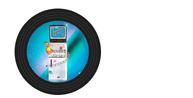

+++
title = "如何在 README 显示正在听的音乐"
summary = ''
description = ""
categories = []
tags = []
date = 2023-05-20T15:03:44+08:00
draft = false
+++

以网易云音乐为例，效果如下


*P.S. 如果上面是白色的，代表我没有在听歌，不过文章末尾我放了一个静态的可以参考*


### 数据怎么获取

简单说一下几种思路：

1. 网易云音乐 API，参考这个 Repo [Binaryify/NeteaseCloudMusicApi](https://github.com/Binaryify/NeteaseCloudMusicApi)，里面有一个 「[获取用户播放记录](https://neteasecloudmusicapi-docs.4everland.app/#/?id=获取用户播放记录)」 的接口。此接口返回的并不是直接的一个播放历史，而是需要你根据数量过滤。你需要在两次请求间隔中 diff 一下，如果哪首歌播放次数增加了，那么就是最近在听的
2. 如果你在用第三方客户端，可以直接 fork 改代码进行数据埋点。或者看看客户端里面有没有播放行为相关的日志
3. 改 hosts 文件，然后起一个  tunnel 来劫持 packet，还原一下流量


需要注意的是，触发播放的时候有可能不会发请求 mp3 流的，取决与本地是否有缓存。只要你拿到一个 song id，你就可以通过 API 拿专辑封面之类的信息

### 绘制黑胶唱片 SVG

因为要在 README 中显示动态的结果，那么最好就是嵌入多媒体资源，我们可以通过后端服务对于同一个 URL 返回不同的内容。接下来我们来时使用 SVG 绘制一个黑胶唱片的图片。关于 SVG，资料可以直接在 MDN 中找到


#### 绘制唱片外边框

第一步我们来画圆。首先我们先创建一个 SVG 元素


```
<svg xmlns="http://www.w3.org/2000/svg" width="200" height="200" viewBox="0 0 200 200">
  
</svg>
```

在这里我们通过 `width="200" height="200"` 定义了一个 SVG 图形的大小。`viewBox="0 0 200 200"` 用于截取 SVG 指定的区域然后缩放到整个 SVG 大小，这里不关键。SVG 中有一些预定义的形状：矩形 `<rect>`，圆形 `<circle>`，椭圆 `<ellipse>` 等等

我们来向 SVG 中添加一个圆形

```
<svg xmlns="http://www.w3.org/2000/svg" width="200" height="200" viewBox="0 0 200 200">
  <circle cx="100" cy="100" r="86" fill="#1F1F1F" />
</svg>
```

效果如下

<div>
<svg xmlns="http://www.w3.org/2000/svg" width="200" height="200" viewBox="0 0 200 200">
  <circle cx="100" cy="100" r="86" fill="#1F1F1F" />
</svg>
</div>


- `cx` 和 `cy` 属性定义圆点的 x 和 y 坐标
- `r` 属性定义圆的半径


为了模拟唱片中的纹路，我们可以多添加几个不同半径的同心圆形，让其叠加显示


```
<svg xmlns="http://www.w3.org/2000/svg" width="200" height="200" viewBox="0 0 200 200">
      <circle cx="100" cy="100" r="86" fill="#1F1F1F" />
      <circle cx="100" cy="100" r="79" fill="#3A3A3A" />
      <circle cx="100" cy="100" r="78" fill="#1F1F1F" />
      <circle cx="100" cy="100" r="74" fill="#3A3A3A" />
      <circle cx="100" cy="100" r="73" fill="#1F1F1F" />
      <circle cx="100" cy="100" r="69" fill="#3A3A3A" />
      <circle cx="100" cy="100" r="68" fill="#1F1F1F" />
</svg>
```

效果如下

<div>
<svg xmlns="http://www.w3.org/2000/svg" width="200" height="200" viewBox="0 0 200 200">
      <circle cx="100" cy="100" r="86" fill="#1F1F1F" />
      <circle cx="100" cy="100" r="79" fill="#3A3A3A" />
      <circle cx="100" cy="100" r="78" fill="#1F1F1F" />
      <circle cx="100" cy="100" r="74" fill="#3A3A3A" />
      <circle cx="100" cy="100" r="73" fill="#1F1F1F" />
      <circle cx="100" cy="100" r="69" fill="#3A3A3A" />
      <circle cx="100" cy="100" r="68" fill="#1F1F1F" />
</svg>

</div>


#### 添加专辑封面


网易云音乐的专辑封面的 URL 类似下面这个

```
https://p2.music.126.net/sZWouKjMg7eFCsWC5l8IYQ==/109951165714669526.jpg?param=130y130
```

这里这个 `param=130y130` 是返回图片的大小。如果要在 GitHub SVG svg，我们不能直接嵌入 URL，而是要嵌入 base64 编码后的图片内容，否则会有域问题。GitHub 中所有嵌入的图片都是会被 camo.github 这个代理的，你可以点开你的 README 中的图片看一下，并不是原始的 URL。这里我们为了演示方便，先使用 URL 作为示例，后面再改


另外图片都是矩形的，我们需要进行剪裁

```
 <clipPath id="circle-clip">
    <circle cx="100" cy="100" r="61.8" />
  </clipPath>
  <image href="https://p2.music.126.net/sZWouKjMg7eFCsWC5l8IYQ==/109951165714669526.jpg?param=140y140" x="30" y="30" width="140" height="140"  />
```

在 `<clipPath>` 元素内部，我们使用 `<circle>` 元素来定义一个裁剪路径，半径为 61.8，它将用于将图片裁剪成圆形。然后，在 `<image>` 元素中，我们添加了一个 `clip-path` 属性，它的值为 `url(#circle-clip)`，指向之前定义的裁剪路径。这样，图片将会根据裁剪路径进行裁剪并填充到黑胶唱片的区域中。详情参考文档 https://developer.mozilla.org/zh-CN/docs/Web/SVG/Element/clipPath

`x="30" y="30"` 指定了起始位置，即图片左上顶点的座标。因为我们指定的 SVG 是 200 * 200 的，所以图片的宽度需要为 140，以满足
`(200 / 2) - 30 == (140 - 30) / 2`  的式子，这样会让图片居中。效果类似下图




#### 旋转动画


`<animateTransform>` 元素是 SVG 中用于创建动画的元素，参考文档 https://developer.mozilla.org/zh-CN/docs/Web/SVG/Element/animateTransform


```
<animateTransform
  attributeName="transform"
  type="rotate"
  from="0 0 0"
  to="360 0 0"
  dur="10s"
  repeatCount="indefinite"
/>
```

- `type`: 指定要应用的变换类型
- `from` 和 `to` 用于变换的起始和结束。根据所选的变换类型提供相应的值
- `dur`: 完成一轮变换需要的时间，用于控制速度
- `repeatCount`: 指定动画的重复次数


#### Base64 图片编码

通过 `xlink` 可以添加 base64 编码支持。`${albumData}` 这里是一个 JavaScript 里的变量，你替换掉就好了

```
<image
  xlink:href="data:image/gif;base64,${albumData}"
  x="30"
  y="30"
  width="140"
  height="140"
  clip-path="url(#circle-clip)"
/>
```

使用 `xlink` 的时候不要忘了添加 `xmlns:xlink="http://www.w3.org/1999/xlink"`，否则显示 SVG 的时候会报错。效果如下，这个是一个静态嵌入的版本，右键可以查看所有源码。我稍微加了一点外圈的渐变效果，有没有区别不大


<div>

    <svg
      xmlns="http://www.w3.org/2000/svg"
      xmlns:xlink="http://www.w3.org/1999/xlink"
      width="200"
      height="200"
      viewBox="0 0 200 200"
    >
      <title>無窮プラトニック</title>
      <defs>
        <radialGradient
          id="gradient"
          cx="50%"
          cy="50%"
          r="50%"
          fx="50%"
          fy="50%"
        >
          <stop offset="90%" stop-color="#3A3A3A" stop-opacity="0.7" />
          <stop offset="100%" stop-color="#1F1F1F" stop-opacity="0.65" />
        </radialGradient>
      </defs>

      <circle cx="100" cy="100" r="90" fill="url(#gradient)" />
      <circle cx="100" cy="100" r="86" fill="#1F1F1F" />
      <circle cx="100" cy="100" r="79" fill="#3A3A3A" />
      <circle cx="100" cy="100" r="78" fill="#1F1F1F" />
      <circle cx="100" cy="100" r="74" fill="#3A3A3A" />
      <circle cx="100" cy="100" r="73" fill="#1F1F1F" />
      <circle cx="100" cy="100" r="69" fill="#3A3A3A" />
      <circle cx="100" cy="100" r="68" fill="#1F1F1F" />
      <clipPath id="circle-clip">
        <circle cx="100" cy="100" r="61.8" />
      </clipPath>
      <animateTransform
        attributeName="transform"
        type="rotate"
        from="0 0 0"
        to="360 0 0"
        dur="10s"
        repeatCount="indefinite"
      />
      <image
        xlink:href="data:image/gif;base64,/9j/4AAQSkZJRgABAQEASABIAAD/2wBDAAgGBgcGBQgHBwcJCQgKDBQNDAsLDBkSEw8UHRofHh0aHBwgJC4nICIsIxwcKDcpLDAxNDQ0Hyc5PTgyPC4zNDL/2wBDAQkJCQwLDBgNDRgyIRwhMjIyMjIyMjIyMjIyMjIyMjIyMjIyMjIyMjIyMjIyMjIyMjIyMjIyMjIyMjIyMjIyMjL/wAARCAB4AHgDASIAAhEBAxEB/8QAGwAAAgMBAQEAAAAAAAAAAAAAAAYDBAUCBwH/xAA5EAACAQMDAgQDBgQGAwEAAAABAgMABBEFEiExQQYTUWEicYEUFTKRobEHI2OiFkJiwdHwNENSsv/EABgBAQEBAQEAAAAAAAAAAAAAAAABAgME/8QAIBEBAQEAAwEAAgMBAAAAAAAAAQARAiExEgNBE2FxUf/aAAwDAQACEQMRAD8A8boruKPzZAmcZ71oS6M8ShjOpB/01m2oe2ZRV46dtbDzAD121c0/w9JqBk2XCqExyU6/rVDfI8g9sWjj3rTfRnSdovNB2ttyFPNSR6JIMyrOAUIIzH37d6lRLIyPWjIp/Nppt5qWruUaJL22FvZoYB/Kb4TuPPqvUc4JqFPDkZe3Zbjcy2Mlsy+RgF8MAwOefxD8qSRsr2PI60ce9ehXHh/7VbaNbrKoktoHikDQ4DE45HJz0P8A3NUP8A3E18yG9jjVgXB8onHPTrVxzZJlFbt94aeyu5YDdK5jYrkIRnH1rLuLTyJvLMgbjOcYqTSrUVKIv9QqzBprT8pINvrjpStRoqa4tzbzNGW3bQDnHrRSXVihe7VV6kHH5VvyvI0PlMqccZ5rF0ltupRNtLYzwPlTRHZyXTrglTIwwn14pc+RrEEdgukGSeFGlJ2Kx65PA/5qKytbgl0gkZecHaetM0ngK2SFWvdRitwGGCjcFvTnqflVS2g+49TmspMyNGB+FeSOx+RqnIXGy8EFsVLeVZ2iLAy5yAf8x9KriZWEfwtnsEQlm79K19URDBJMEKmWVU3FfiAJ5IB613eWmsaNqlraTJF51whMcicFl25Iz6461l5Y9WjcpXltbi8s3t9xCyjJI4xWgJ7ZFljMzER7sDZ0PzrDvNUMdlNELUwTuvO0DJOc8fPFWjqhk0m4eWBAowzhhht5Hb55rfrrDl1MNraXAaK4WNXyN2GbHBArTtYriXUBJPEiRiPaArZ5zSrbeKHtLCKNREW2gs8hyV454702LqlrYw2Z1C5SJ7kfCxHwk4B6jp1FHT21/kia9GDq97g8CRv3pP1JR9sY+igfpTXfXSX9/eTR7lWSZyuRjIycGlu+RW1Mx9CxQZPQZAqUBHGz/KJXd8RQHBPYGtOwDRhWQgkjqab1sNIg002PlySxlwxOMMzAdaybyFbK+2Lb+TF5Y2LjnHqfepiWuKLLOqZ+3TbgM7V6CivmqNm/l4HIX6cUUq+1nw5pl7qurLBYbTOELAFwpI74z1xTDOupaJqETzygpHJnICkkAjPw+vNcfw+jW41NvJjgiu7dN0cxchmzwRgnHT2rvX/E02pPNZywQ7Y3KiRevBOc4696yrtMnqWwF/eQajYJLc2yRFU80bQwODnBwAfcUqaxruky34e4spJFhQo7vkvuB4Uc89+ffvTB/DsT3nhy+Nxeq1skpjjjI3OhAHQnoDkYFK15oUmp+Ir2002NJIUlKGQECMEYBOfnmsmPTaVOyZ9JTR9Y1m3eK7hmjSIFrY5bZnIZgTj4vwjHPQ+tad1b2M8qTac6Nc2jhVupIlZe2cDJIGCfTrSFqWiP4ZtY7jznZA4ExU4JO4HAHcHFWL/xah1qC/0e3eODCtJGWKrMwGMkdAQOM+1XKTJ4usrOxgTUG8g6g0gUJIc4HfKgk8DFIccl1q88WmwFVwxIGcA49T6elX7Dxaw8QNeapbW7WsjHKGP4o/Tb6/XNYP25bfVzd2XmRosu6N2OWVc98e1XipR4m6Tx/hfTbTw5OL2F21R8LEEDEBj3JxjHOPpWclxqmrvaaCkEcd3p+QEIIZ8LjvwMD/mnC81KKfwTI4lkiMlvv88tyRjADeoGeh9uuKW9VnXStZ8O6zBI0cZiCS3UMm5mIGMt2Jx274NNXqvF+Ucl+eG9jcxSK0Dr1Ujp+dZ99bzC9EpAyxGAOecYpwOpQeLp5gu9dUjiMu52BSVUXnBx1+lK4hWRVjkk2KeVdeRx86g3pfn8p/d6Jpfh/UEFtJcokkkeGe227hgdRu5H1Pr0rE8SWtxPerqt5JCGvD5axW/xImzgqW9RjHvg+lR6D4ibSfMtpGnkhmA29MqRznB68kk/Slu61fUbpG065ucQpcmUxqF27ySSQfmT370dXbj8/wAblka0mzVJF4/CvQ57UVxqJWS9d94C4AHftRWyw+0Vjxdoe4z+1XpQIpTMOcqQQP3qpYIDKX3YZRwDV8qJG5zz14pZTuetN0uXTNDhOlXV3DfXlqpvHXbLCjEydAcfEFjbleh4yeKpWWo3fhDW5NMmmN7YCQGSRISmCwGWUHtyMg9fY1rWGtzafbRWX3ptnt0jWQte5EefN6nBBCmUBsE42r2BIxtb1a4vNbtpr64Nxbu6MYjKrAFCA0Zx0I9+PiyCRzUwmtf8UWH31fvAw1FHBP2ONbceWyqRlmbdgFsjqRtxg9RWNo3hdn167s5J3aytHCzMU2uzEA7QpPB6g844yOor0fWb/wAIX8TwrLBJczF5kxMMjdtPwE5HJXBz6HtXlt/csPENzeaXdTlSy7LhpMs+FAPOBkZBAOOQKf5H+41/QrO2S9vLW8mlS3vRZtGYApGUZgwIYg/hI6CoNL0G0v7e0W5vVgmvJCkC+cEH4tg3ZQ4y3qaaLDw3d3nhu4tZE8yS7uFuluvNHlI6hl2nHL53NkgYBHGetLi6XLpWvRxXrRQC1lSSRgwI2hgfhA6k9h+eKCeRH29D0HQo9T0S00/Up5ZFljEUu05bOcHB9iOPkKQdWtb+xhl0N7wy21vIJBGv4WyMhvyP70waF4u1GXxLYQW8MSW7XQJYRlmVN+eTnA96VtR1PUtQmL6leT3L5PMh6HuAO3yodVe7iPNlBHexX1nG2CVVJwZOeMbfryK5juVfyYpGUkHlkUHb9K+S6Np4jLrrELuFyIxBKCT6ZK4FTQ3MUGiXFgFjYzYCgJhkw6uSzY+IHbgDtzTLXH8jxmrw/wCHNLv20l59RuTLfu2y3igMm3EhQEkHhcryTWH420tbPWUuI7eWCO6j3+XMBuDDhgcE9eD9a2PCfiPUNPijXzo2S3KCCAhQXwfw57Akj4j74yag8VaLrscEV1q17DcKzfDHGSAhI5wMenep4xXl7Is6CUPLJncFx19OlFR3r/zPLRgyAA5Hc0VqzcWf/kr8j+1NPh/RJteu5oIpNnlxeYSVz3Ax+tKURIkBHWvSv4fXkenaHrepEM88QGF/0qpYfmf2qcnCoa2NF4amu9SubCKW3Z7ZsMSSB7kcdjxWa9kLO6khdcSRMUI9CDUmha/JYeIIL6eRtryETn1VvxH/AH+lbfjexFtejVIJ43gu8NtB5zjqPUHrmpveUeLkrXBt4LhMBypXeQQMF+eB7dPerltcWkqIsZkVljO9CBw3OMeq9P1rJuZTLHyASvINcRv8KyJ8Ei/5gevzFas/LenaF4ptrPTbTT5UkDIxHmHG1cknPr3rK1+0W01OW4XeUlIkjJAxuyCwP64+lJ9tqkjbxKoJBwNoxTtpU7eIPDVzbKhe6t8LGvc//P8AuKwny7aN5GN6XaxWL29rfQqFzFvQgAYDAE9K8l8T2zw3OoXckEwR5C8RIG1iW6H2xWv4l1i20/w/Y6Kl1511bsNxhb8G0EHJ+vHypTu9du72wazklZ4iwYlxk8e9Tjxfa8napGvm2NxeLBKYYWRSwI4Y+vt7/KrNhave23mxbdqtggtyK0/DWo2cOg3lpMsbNJKR5bsFDKVAzz8qybUjS9Te3ldTDIBhwwIHoTjp711sDMGk6eqanZvcPCkazKXJboAaeNemmntbj7KolkC7V6EDPU+9KtvpUs0avHNasrDIImBz+VMOkW9zanyppY3ixhQMkj6+lc+R+7ocv1eMX9rLZXslvPE0UiYyjdRxmitvx2MeL7sdcLH/APkUVs7sy6gy1allql5p9tcQ20xSO4BWRcZ3DGP2rMQDIJYAVLnKgLyB1o1P+X3gDqamF3I8UcMkrNHGCEUnIUHsKrg9QwI444611s+EH96WmGHJFfbfyvs8ofd5o/AB0+tGC5+EEgd64Fs4lLkN8qUHe7tUwCQOM805/wAPLm3tdUvXnkMQFuXyWG3apyfqP+aThEw52kV8ZSG2ngEc+9TNquV/U777z1O5vSm3zn3Ko4Cr2GB7YqFOIyT1PAzUalhhQetdOxJwOg4FUj31TJExRX4VGbbvPTNcyRgOyF1fBwGXofcVwZGKgAEKO2TjNAY9xmrW+J/Lftz3q6LlrW5Sa2mbdGQ6vkjBHPSqT5ZT04HWo7WF5YiQ5XJ64zSz51d67qUmr6xPfTRrG8m0FVOQMAD/AGoqpcxiGcoDnAByaKlKcWqx3SoJI5RtyQrZxx096sC2jHQYrOhk8mUPtzjtVk6hnrFn60tcUrrbnVFY5CDC4GK4MYPU/Sq33jxgxf3c18+8P6f91K6VoIB0rvmqX3h/T/WhdQAcF4iUByQp5x3qzSu49q+PCHAyMY9DWxNY2AvtbggnVo7C1EsL+cuJpPhOB6jBbpzkVSxGotXdGEU9i84bzBzIoY7fzC8e9KfRZ6xTKzENtBBXPsamgjWFXBAfcMZYdPlV69FlbWWkTDeGu4GklzKDtYYxgY4HJ9fpWRJqCrI6rHlQSAd3UUh812O18+VY40LOeig9a4ECk/Fng9M1UGqFTkREH1DUfef9H+6ldK/5a4AOcDoM9KmQRLbmMRDfn4XB6D0xWV96Y/8AT/dXX3t/R/upPovuqXUbolsLaNXjbc0w/E4I6H/vpRVG4m8+dpNu3OOM5oqWGiooopSKKKKSKKKKSMD0/SjC+nXrxRRSRhR0HJ9qOKKKSKKKKSKKKKSKKKKS/9k="
        x="30"
        y="30"
        width="140"
        height="140"
        clip-path="url(#circle-clip)"
      />
    </svg>
    
</div>
    