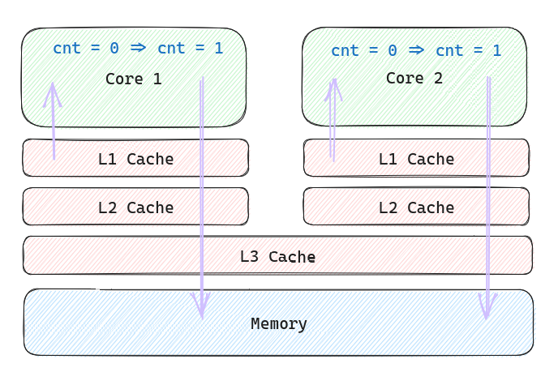

+++
title = "锁匠的自我修养"
summary = ''
description = ""
categories = []
tags = []
date = 2023-06-23T15:06:04+08:00
draft = false
+++

本文讲一下锁(Lock)，主要围绕互斥锁 (Mutex)。使用互斥锁是为了安全地访问临界区域 (critical section)。临界区域指的是一块对公共资源进行访问/修改的程序片段。这个是来自 WiKi 的定义，但是这种定义太模糊了，在这篇文章中我们会从头来理解这一起。不过，在一切开始之前我们先说明一下实验环境

## 环境/术语约定

- 本文所有的代码的实验环境如下
  - CPU: AMD Ryzen 7 5800H
  - gcc (GCC) 13.1.1 20230429
  - Linux 6.3.8-arch1-1
  - 多核环境
- 术语约定
  - Mutex，为广义的互斥同步，spinlock 也算做互斥锁的一种
  - Atomic 也算作一种同步手段

加锁(比如 Mutex)这一个行为的本质就是在约束执行顺序，使得程序本身在外部输入相同的情况下，即便在多线程环境下，运行也能够得到相同的结果。

- 1）首先它保证了编译器不会将 `lock` 和 `unlock` 之间的代码不会移出这个范围，并且 CPU 也不会通过乱序执行来将这部分指令移动到范围之外。也就是说，你通过 Lock 来获得了 memory order/barrier。这约束了线程自身的指令执行顺序。

- 2）取决于锁本身的实现，借助内存中的某个值，约束线程之间的执行顺序(多读单写，或者互斥)

为什么我们需要约束线程的执行顺序？因为线程本身是无序的，或者说它是取决于 Kernel 调度的，我们无法去控制，所以我们想要通过这种手段去使无序变得有序(相对有序)，来符合我们代码逻辑中的顺序。这里的顺序主要指内存的访问/修改顺序

从数据结构来描述，所谓的锁可以是一个 bit。当它是 1 的时候表示上锁，当它是 0 的时候表示未上锁。从算法角度，我们需要解决同步问题，即当多个线程同时访问这个 bit 的时候，如果大家都看到这个是 0，那么都想置为 1 来上锁，这个操作只能有一个线程成功。当我们想确保只有一个线程成功的时候，又需要靠锁来帮助。这听起来已经是一个套娃问题了。没错我们在这里需要一个最底层的硬件实现来保证有一个最小粒度的互斥，比如 CPU 指令的`lock` 前缀，或者本身就是 atomic 的指令

我知道这里的叙述还是很抽象，什么是 atomic 什么又是 `lock` 指令 ，下面通过具体的代码来研究一下，一点一点剖析这些概念，遇到问题解决问题

## 多线程计数器

经典案例，多线程去 incr 一个 counter，C 语言代码如下

```
#include <stdio.h>


int main(void)
{
    int cnt;
    cnt = cnt + 1;
}
```

看一下对应的汇编代码 https://godbolt.org/z/n8j68T8Md

```
main:
		; 1)
        push    rbp
        ; 2)
        mov     rbp, rsp
        ; 3)
        add     DWORD PTR [rbp-4], 1
        ; 4)
        mov     eax, 0
        ; 5)
        pop     rbp
        ; 6)
        ret
```

这里介绍一下上面的汇编指令，之后也会涉及到

1）`push rbp`：将当前栈帧指针 `rbp` 的值压入栈中。这是为了保存调用函数之前的栈帧，以便在函数返回时恢复。

2）`mov rbp, rsp`：将当前栈顶指针 `rsp` 的值复制到栈帧指针 `rbp` 中。这将创建一个新的栈帧，将 `rbp` 设置为指向当前函数的栈帧的起始位置。

5）`pop rbp`：将之前保存在栈中的栈帧指针 `rbp` 的值弹出到 `rbp` 寄存器。这将恢复调用函数之前的栈帧。

6）`ret`：返回指令，用于从当前函数返回到调用函数的位置。

这 4 条是函数调用所需要的汇编代码，以后不再分析。我们主要来看

3）`add DWORD PTR [rbp-4], 1`：将 `[rbp-4]` 内存位置的值加上 1。`DWORD PTR` 表示操作的是一个双字（32 位）数据，`[rbp-4]` 表示距离 `rbp` 指针向下偏移 4 字节的位置。

我们再向下探索，当执行指令`add DWORD PTR [rbp-4], 1`时

1. CPU 首先计算出内存地址`[rbp-4]`，即根据 rbp 寄存器的值和偏移量 4 计算得到要操作的内存地址。
2. CPU 从内存中读取位于`[rbp-4]`地址处的 DWORD（双字）值，将其加载到寄存器。
3. CPU 将读取的 DWORD 值与常数 1 相加。
4. 计算结果存储回内存，即将相加的结果写回到`[rbp-4]`地址处。

这是一个概括的 Read-Modify-Write 过程，实际上来说可以是下图这样的。但我们先不考虑 Cache，有没有 Cache 这个例子都会有问题



_此图读取的箭头也可以从 L3 Cache 开始画，或者 Memory 开始画_

单看 R-M-W 操作本身是没有问题的。但是将这一段放到代码整体中就出现了问题。编程本质就是告诉计算机一段逻辑，而在这里我们的沟通上出现了问题。编译器和 CPU 显然没有理解，我们真实的意图中暗含着希望它们能够排他的运行。只要两个线程在两个核心上同时读取，修改然后写入，那么 counter 的值就是 +1 而不是 +2。

所以在这里我们需要额外地告诉编译器这些信息。这里可以使用之前提到的最小粒度的互斥，它是由 CPU 保证的，一种硬件上的互斥。如何使用这种互斥呢，在 C 中我们可以通过 Atomic 相关的函数，例如

https://godbolt.org/z/8vbx8z3E1

```c
#include <stdio.h>
#include <stdatomic.h>

int main(void)
{
    atomic_int cnt;
    atomic_fetch_add_explicit(&cnt, 1, memory_order_relaxed);
}
```

_P.S. 这里不需要 `atomic_int` 你可以使用 `int`，但是必须使用 `atomic_fetch_add_explicit` 函数_

生成的汇编代码如下

```
main:
        push    rbp
        mov     rbp, rsp
        ; start
        lock add        DWORD PTR [rbp-4], 1
        mov     eax, 0
        ; end
        pop     rbp
        ret
```

通过与之前的代码进行 diff，你可以看到唯一有区别的地方就是 `lock` 前缀

```
        add     DWORD PTR [rbp-4], 1
        // replace to
        lock add        DWORD PTR [rbp-4], 1
```

`lock` 前缀做了什么？它可以确保 CPU 在操作期间对适当的 Cache Line 具有独占权，并提供某些额外的顺序保证，避免竞态条件和数据不一致性。有些 CPU 是通过锁总线来实现的，有些是通过 MESI 实现的


_此图读取的箭头也可以从 L3 Cache 开始画_

关于 `lock` 前缀可以参考一下资料

- [What does the "lock" instruction mean in x86 assembly?](https://stackoverflow.com/questions/8891067/what-does-the-lock-instruction-mean-in-x86-assembly)
- [x86 LOCK question on multi-core CPUs](https://stackoverflow.com/questions/3339141/x86-lock-question-on-multi-core-cpus)

在这里提到了 CacheLine。这个就比 Web 系统中，在 Database 前面加了一层 Redis，然后 Process 内也加了 in memory 的 cache 一样，目的就是通过空间换时间，加速访问。根据局部性原理，每次会填充一块内存区间到 Cache 中，加快 CPU 的执行效率。读一次内存和读一次 Cache 时间差的很多，期间可以让 CPU 执行很多指令了

我们可以看一下 AMD Ryzen 7 5800 Series 的架构

 </img>

_数据来源 https://www.techpowerup.com/review/amd-ryzen-7-5800x/3.html_

在上图中没有直接体现出来 L1/L2/L3 Cache 字样。Cache 在一般情况下分为 3 级，分别是 L1, L2 和 L3。由于我们的代码是由 2 部分组成：指令和数据。所以有可能会分为指令高速缓存(Instruction Cache，简称 I-Cache)和数据高速缓存(Data Cache，简称 D-Cache)。从上图可以看到 L1 分成了这两部分，各 8 路 32K。然后 L2 是 I-Cache 和 D-Cache 连在一起的，一共 8 路 512K。在上图中没有体现 L3 Cache，但是实际上是存在的。下面是我机器上 `lscpu` 结果的部分截取

```
Caches (sum of all):
  L1d:                   256 KiB (8 instances)
  L1i:                   256 KiB (8 instances)
  L2:                    4 MiB (8 instances)
  L3:                    16 MiB (1 instance)

```

其实你可以把 CPU 这套东西理解为一个分布式系统，在这里加了 Cache 后一定会有一致性问题(Cache Coherence)。比如，读自己的写，最终一致性巴拉巴拉。为了解决这个问题，引入了 MESI 协议，这个只是一种常见的解决方法。关于 MESI，这里不深入地去写了，因为已经有人整理的很好了。下面这篇文章介绍了 MESI，还有内存屏障

- [CPU 缓存一致性协议](https://icefrozen.github.io/article/why-memory-barriers-1/): 十分推荐
- [理解 Memory Order](http://intheworld.win/2021/07/10/%E7%90%86%E8%A7%A3memory-order/)

这个页面有在线动画可以来体验 MESI

- [VivioJS - MESI Cache Coherency Protocol](https://www.scss.tcd.ie/Jeremy.Jones/VivioJS/caches/MESIHelp.htm)

回到正题，我们已经了解了通过 Atomic 来进行原子的 Read-Modify-Write 操作，上面的示例是一个 `atomic_fetch_add_explicit` 的加法操作。还有一组 API `atomic_compare_exchange_strong` 我们在之后构建锁的时候会涉及

## Atomic

那么，如果是对于一个变量多读单写是否需要借助 Atomic 等同步手段呢？这里的 Atomic 指的是上文中用于并发环境线程安全的 Atomic Operation，而不是数据库理论 ACID 中的 Atomic(原子性)，虽然它们有相似性。

这也是一个经典问题，这个常见于生产者消费者模型场景，或者用于修改一个 loop 线程的 flag 的场景中。有些人会在这里谈论什么对值的变化是否敏感。对值变化敏感的场景就是，当我修改完成一个变量的时候，另一个变量要能够立即看到这次修改，不能读到旧的值。但是我们知道在 N 个指令后，一定是会读到最新的值的。由于我们无法控制线程的调度顺序，所以这个“立即”大部分情况沦为一种空谈，一种例外场景是在 spin

这个问题其实可以分为三个方面

- 原子性
- 可见性/一致性
- 指令/内存顺序

先来谈论原子性。我们知道在计算机的内存寻址和访问层面，最小的单位是字节。位操作通常是通过对字节进行位运算来实现的，而不是直接对单独的 bit 进行操作。也就是说我们不会出现写了 4 个 bit 后，另一个线程读取到了这个中间态。那么我们在多线程环境中，多读单写一个 Bool 类型(U8, I8)的变量，是否需要加锁？

从目前搜索到的答案来说是要的

- [When do I really need to use atomic instead of bool? ](https://stackoverflow.com/questions/16320838/when-do-i-really-need-to-use-atomicbool-instead-of-bool)

- [Can a bool read/write operation be not atomic on x86? ](https://stackoverflow.com/questions/14624776/can-a-bool-read-write-operation-be-not-atomic-on-x86)

> There are three separate issues that "atomic" types in C++11 address:
>
> 1. tearing: a read or write involves multiple bus cycles, and a thread switch occurs in the middle of the operation; this can produce incorrect values.
> 2. cache coherence: a write from one thread updates its processor's cache, but does not update global memory; a read from a different thread reads global memory, and doesn't see the updated value in the other processor's cache.
> 3. compiler optimization: the compiler shuffles the order of reads and writes under the assumption that the values are not accessed from another thread, resulting in chaos.
>
> Using `std::atomic<bool>` ensures that all three of these issues are managed correctly. Not using `std::atomic<bool>` leaves you guessing, with, at best, non-portable code.

但是我还是想在这里讲一下自己的思考。对于一个 bool 类型的变量赋值，汇编代码如下所示

```
        mov     BYTE PTR [rbp-1], 1
```

这个首先是仅用一条指令就可以完成的赋值操作。而且 bool 类型是在 64 位环境下是对齐的，并且这个值的大小是最小单位了，无法跨 CacheLine。另外从 CPU clock cycles 的视角来看，参考这个 [PDF](https://www.agner.org/optimize/instruction_tables.pdf) 中的表格，上面这条指令在 AMD ZEN3 中 Reciprocal throughput 为 0.5。也就是说一线程在一个 clock cycle 中可以批量执行掉 2 条这样的指令。在 Inter Ice Lake 中，这条指令的 Reciprocal throughput 为 1。还有几个常用的就不列举了，反正没有超过 1 的。显然我认为这里是绝对不会看到一个修改中的状态的，你只能读到 `true` 或者 `false`，绝对没有第三种可能，所以它满足原子性

再来看 cache coherence。这个视你代码逻辑而定，比如一个线程不停地检查 `stop_flag` 是否被设置为 `true`的场景，这个完全是可以容易修改非立即可见。反正只要修改最终落入内存，另一个线程从内存读取来就可以了，这个经过一个 Kernel 的调度，线程换到另一个 CPU 核心中就满足条件了。总之，就是改了值之后，多读到几次旧的值也不影响你之后的逻辑的情况。这里场景的需求是最终一致性即可

最后再来看编译器优化，这个没办法，你要确保生成的汇编代码是 OK 的。当我们没有任何显式的约束时，编译器可能会调整代码的顺序，CPU 也可能对指令重排序。导致意料之外的结果。在下一章节会给出一个例子，证明这一点。当然这个也要视你的编程语言而定，比如 Python，这里不会出问题的。而在 C/C++/Zig 等，你需要向编译器强调顺序，比如我在之后会提到的 `MFENCE`

循序渐进，我们再来分析一下同样的场景下，从 bool 类型换成一个 i32 是否存在问题。理论上在 64 位处理器中貌似都是可以的。但是如果你在 64 位处理器中去修改一个 128 bit 的变量，那么是无法保证原子的，因为变成了两条指令

综上所述，在你

- 容忍 Cache 造成的临时读取不一致
- 确定编译器和 CPU 乱序后没有额外影响

这个锁是可以不加的。但你最好看完下一个章节的内容，了解完什么是乱序后在做决定

## 执行顺序

CPU 会按照一定规则对机器指令和内存之间的交互重新排序执行，只要不改变单线程的执行结果。另外其实编译器也会做这个事情，比如

```
a = x
b = x
```

这种编译器可能会变成，因为 a 和 b 是相等的。

```
a = x
b = a
```

但是如果这里 x 的值在随时变化，那么其实 a 和 b 是不相等的

我们来看一段代码，这也是一个经典的示例。最初来源应该是 [Intel x86/64 Architecture Specification](https://software.intel.com/en-us/articles/intel-sdm?iid=tech_vt_tech+64-32_manuals)，示例修改于 [Memory reordering: Can loads be reordered with earlier stores to different but encompassing location?](https://stackoverflow.com/questions/11816998/memory-reordering-can-loads-be-reordered-with-earlier-stores-to-different-but-e) 中的代码

```c
#include <stdio.h>
#include <stdatomic.h>
#include <threads.h>
#include <unistd.h>
#include <assert.h>

int a = 0, b = 0;
int x = 0, y = 0;

int f1(void * thr_data) {
  a = 1;
  x = b;
}

int f2(void * thr_data) {
  b = 1;
  y = a;
}

int main(void) {
  long long i = 0;
  while (1) {
    i += 1;
    a = 0;
    b = 0;
    x = 0;
    y = 0;

    thrd_t thr[2];
    thrd_create( & thr[0], f1, NULL);
    thrd_create( & thr[1], f2, NULL);
    for (int n = 0; n < 2; ++n) {
      thrd_join(thr[n], NULL);
    }

    if (x == 0 && y == 0) {
      printf("i = %d, x = %d, y = %d, a = %d, b = %d\n", i, x, y, a, b);
      break;
    } else {}
  }
}
```

我们在一个 Dead Loop 中每次重置变量的值，然后创建两个线程去交叉修改这些变量，注意 `x` 和 `y` 是依赖于另一个线程修改的值的。等待线程结束，我们比对 `x` 和 `y` 的值。通过时序分析我们可以得到如下结果

 </img>

但是实际上你可以发现结果存在 `x = 0` 且 `y = 0` 的情况

```
i = 137697, x = 0, y = 0, a = 1, b = 1
```

出现这种情况的原因是 Intel x86/64 处理器和大多数处理器系列一样，支持按照一定规则对机器指令和内存之间的交互重新排序执行，只要不改变单线程的执行顺序就行。 特别是允许处理器延迟写内存，结果导致指令执行的顺序可以是下面这种情况:

```
Thread 1
  x = b;
  a = 1;


Thread 2
  y = a;
  b = 1;
```

但是我们并不能百分之百断定这个是由于 CPU 指令乱序执行导致的。因为执行顺序是 CPU 自己的“喜好”，我们观测的永远是结果。也有其他方式导致此结果，比如编译器对此进行了优化，生成的汇编就和代码顺序不一致。对于编译器 `f1` 函数中

```
x = b
a = 1
```

这两行代码顺序换掉，并不影响结果的。不过在上例中由于我们是 `137697` 次才出现一次，那么应该和编译器关联不大，否则每一次都有问题

关于 CPU 的指令重排问题，可以参考下面的资料

- [Digital Design & Computer Arch. - Lecture 16: Out-of-Order Execution (ETH Zürich, Spring 2021)](https://www.youtube.com/watch?v=-WCvolqYNkA)

- [Computer Architecture Out-of-order Execution](https://iis-people.ee.ethz.ch/~gmichi/asocd/addinfo/Out-of-Order_execution.pdf)

我们来看一下汇编层级的代码

```
a = 1;
x = b;

        mov     DWORD PTR a[rip], 1
        mov     eax, DWORD PTR b[rip]
        mov     DWORD PTR x[rip], eax
```

```
b = 1;
y = a;

        mov     DWORD PTR b[rip], 1
        mov     eax, DWORD PTR a[rip]
        mov     DWORD PTR y[rip], eax
```

假设两个线程分别在不同的 CPU 核心上执行，那么对于每个 CPU 来说。`a = 1` 和 `x = b` 的顺序是无所谓的，每个 CPU 核心并不知道对方 CPU 正在依赖其中的某一个变量，所以允许产生乱序

我们来看一些解决方法，目前互联网上很多说对于这个示例代码是可以加 `volatile` 来解决的。就是改成像下面这样

```
volatile int a = 0;
volatile int b = 0;
volatile int x = 0;
volatile int y = 0;
```

但是不幸的是，这个在我的笔记本电脑上并不成立。而且我通过查看汇编代码，发现生成的代码并没有任何差异。

- 无 `volatile`: https://godbolt.org/z/MYTzo4E85

- 有 `volatile`: https://godbolt.org/z/WGx8a5zhW

参考 [ Should `volatile` Acquire Atomicity and Thread Visibility Semantics? ](http://web.archive.org/web/20180120044239/http://www.open-std.org/jtc1/sc22/wg21/docs/papers/2006/n2016.html) 中的内容。这篇文章的作者是 Hans Boehm，就是 Boehm garbage collector 的发明者，所以我认为还是比较权威的

1. 至少在 2006 年，`volatile` 在 Atomic 和可见性方面没有任何帮助
2. 不同平台可能存在差异

考古结束，我们再来看一下最新的 [volatile type qualifier](https://en.cppreference.com/w/c/language/volatile)，在 "Uses of volatile" 章节中已经点明不适合多线程环境

> Note that volatile variables are not suitable for communication between threads; they do not offer atomicity, synchronization, or memory ordering. A read from a volatile variable that is modified by another thread without synchronization or concurrent modification from two unsynchronized threads is undefined behavior due to a data race.

所以其实可以认为 `volatile` 的改法是错误的。这里也可以参考 Java 中和 C++ 中 `volatile` 的不同

- [What's the difference of the usage of volatile between C/C++ and C#/Java?](https://stackoverflow.com/questions/19923352/whats-the-difference-of-the-usage-of-volatile-between-c-c-and-c-java)

我们再来看另一种改法，使用 `asm volatile("": : :"memory");`。很多资料这么说

> 它只是插入了一个空指令""，什么也没做。其实不然，这句话的关键在最后的"memory" clobber，它告诉编译器：这条指令（其实是空的）可能会读取任何内存地址，也可能会改写任何内存地址。那么编译器会变得保守起来，它会防止这条 fence 命令上方的内存访问操作移到下方，同时防止下方的操作移到上面，也就是防止了乱序，是我们想要的结果。
>
> 但这还没完，这条命令还有另外一个副作用：它会让编译器把所有缓存在寄存器中的内存变量 flush 到内存中，然后重新从内存中读取这些值。

```c
int a = 0;
int b = 0;
int x = 0;
int y = 0;

int f1(void * thr_data) {
  a = 1;
  asm volatile("": : :"memory");
  x = b;
}

int f2(void * thr_data) {
  b = 1;
  asm volatile("": : :"memory");
  y = a;
}


```

本地测试下来并没有解决问题。下面这句话的真实性存疑

> 缓存在寄存器中的内存变量 flush 到内存中，然后重新从内存中读取这些值。

参考 StackOverflow 中的这个问题 [Working of `__asm__ __volatile__ ("" : : : "memory"`)](https://stackoverflow.com/questions/14950614/working-of-asm-volatile-memory) 的第一个回答

> t should be noted that this is only compile time memory barrier to avoid compiler to reorder memory accesses, as it puts no extra hardware level instructions to flush memories or wait for load or stores to be completed. CPUs can still reorder memory accesses if they have the architectural capabilities and memory addresses are on `normal` type instead of `strongly ordered` or `device`

这里提到

> it puts no extra hardware level instructions to flush memories or wait for load or stores to be completed.

所以这个明确也是错误的。可以通过汇编代码来进行实证

- 无 `asm volatile("": : :"memory")`: https://godbolt.org/z/Y69YxfPd7
- 有 `asm volatile("": : :"memory")`: https://godbolt.org/z/ncrsdvhzq

汇编代码完全一样，所以这个只是作用于编译器的，防止生成后的汇编顺序改变。

那么我们应该怎么改?

第一种使用 `mfence`，参考 [MFENCE — Memory Fence](https://www.felixcloutier.com/x86/mfence.html)

1. `mfence` 指令之前发出的所有加载和存储指令在 `mfence` 指令之后的加载和存储指令之前变得全局可见
2. `mfence` 指令不会序列化指令流，它只保证加载和存储指令的顺序

除此之外还有 `sfence` 和 `lfence` 指令

代码如下

```c
int f1(void * thr_data) {
  a = 1;
  asm volatile("mfence":::"memory");
  // 等价于        mfence
  x = b;
}

int f2(void * thr_data) {
  b = 1;
  asm volatile("mfence":::"memory");
  y = a;
}

```

第二种我们可以通过 `xchg` 来解决这个问题，[XCHG — Exchange Register/Memory With Register](https://www.felixcloutier.com/x86/xchg)

> If a memory operand is referenced, the processor’s locking protocol is automatically implemented for the duration of the exchange operation, regardless of the presence or absence of the LOCK prefix or of the value of the IOPL.

```c
int f1(void * thr_data) {
  a = 1;
  asm volatile("xchg %0, %1" : "+r"(a), "+m"(a)::"memory", "cc");
  // 等价于         xchg eax, DWORD PTR a[rip]
  x = b;
}

int f2(void * thr_data) {
  b = 1;
  asm volatile("xchg %0, %1" : "+r"(b), "+m"(b)::"memory", "cc");
  y = a;
}

```

第三种通过 `lock` 前缀，比如

```c
int f1(void * thr_data) {
  asm volatile("lock add %[value], %[a]" : [a] "=m" (a) : [value] "r" (1));
  // 等价于        mov     eax, 1
  //              lock add eax, DWORD PTR a[rip]
  x = b;
}

int f2(void * thr_data) {
  asm volatile("lock add %[value], %[b]" : [b] "=m" (b) : [value] "r" (1));
  y = a;
}

```

第四种，将两个线程绑定到一个 CPU 核心上，这里就不展开了。我们来看一个通过 Atomic 来做的方法

```c
int f1(void * thr_data) {
  atomic_store_explicit(&a, 1, memory_order_seq_cst);
  x = b;
}

int f2(void * thr_data) {
  atomic_store_explicit(&b, 1, memory_order_seq_cst);
  y = a;
}
```

有两个函数可以进行 Atomic Store，用原子的方式替换目标变量的值

- `atomic_store`，默认使用 `memory_order_seq_cst`
- `atomic_store_explicit`，`order` 参数必须是 `memory_order_relaxed`、`memory_order_release` 或 `memory_order_seq_cs`t 之一

这里我故意通过 `atomic_store_explicit` 而不是 `atomic_store` 是因为我会在下一章节讲一个 memory order 的问题。我们看一下这段代码生成的汇编

```
atomic_store_explicit(&a, 1, memory_order_seq_cst);
x = b;

        mov     QWORD PTR [rbp-8], OFFSET FLAT:a
        mov     DWORD PTR [rbp-12], 1
        mov     eax, DWORD PTR [rbp-12]
        mov     edx, eax
        mov     rax, QWORD PTR [rbp-8]
        xchg    edx, DWORD PTR [rax]
        mov     eax, DWORD PTR b[rip]
        mov     DWORD PTR x[rip], eax
```

核心还是使用了 `xchg` 的指令

不同的处理器，可能指令是不一样的。所以最好使用 Atomic API 来做，这样可以进行适配兼容

## Memory Order

这里使用 C++ 来做例子，参考 [std::memory_order](https://en.cppreference.com/w/cpp/atomic/memory_order)，包括以下几种选项

1. `memory_order_relaxed`: 最轻松的内存序，不提供任何同步语义。操作可以以任意顺序执行，没有对其他线程的可见性保证。
2. `memory_order_acquire`: 用于获取操作（读取操作），确保对其他线程的读取和写入操作的可见性。该操作前的读取操作不能被重排序到该操作之后，确保所需的数据的可见性。
3. `memory_order_release`: 用于释放操作（写入操作），确保对其他线程的写入操作的可见性。该操作后的写入操作不能被重排序到该操作之前，确保对其他线程的修改的可见性。
4. `memory_order_acq_rel`: 同时具有获取和释放操作的特性，即确保前面的读取操作不会与后面的写入操作重排序，并确保后面的写入操作不会与前面的读取操作重排序。
5. `memory_order_seq_cst`: 顺序一致性内存序，提供最强的内存顺序保证。所有操作都按照全局顺序执行，并且提供了对其他线程操作的最严格的可见性保证。

Memory Order 的出现并不是为了直接地解决线程安全问题，而是约束了编译器的重排和 CPU 的乱序问题。我们知道编译器和 CPU 会保证单线程环境下即使重排，执行的最终结果也是正确的。但是这个在多线程下就无法保证了，编译器不知道你的这个函数 `f1`, `f2` 是分别在不同线程中调用，所以它还会固执地进行优化。比如 Rust 的编译器在多线程中，也需要靠 `Sync` 和 `Send` 这样的 trait 来让程序员手动标记。所以有了 Memory Order 这种，我们需要告诉编译器额外的信息，约束这些指令的顺序，从而有序地访问 Memory

比如拿 `memory_order_release` 举例

```
a = 1
b = 2
```

比如上面这段代码，可以变成

```
b = 2
a = 1
```

但是我们如果对 `a = 1` 进行 `memory_order_release` 约束，那么 `b = 2` 是无法先于 `a = 1` 执行的。这样就确保了另一个线程在读取到 `a = 1` 时，`b` 的值为 `2` 么？错，因为另一个线程执行的时候如果不加任何约束是可以将

```
c = a
d = b
```

变成

```
d = b
c = a
```

也就是说读取 `b` 后读取 `a` ，这样读取到的 `b` 的值还是错的。所以这个线程需要对于读取的顺序进行约束，需要使用 `memory_order_acquire` 来解决。如果不知道该选什么，那么一律 `memory_order_seq_cst` 就可以了 :)

虽然我们有了 Atomic，但它的使用场景有限，比如对于 Counter 我们可以这样做。如果我们想要对多条指令，多个内存访问进行同步，那么就需要一种粒度更大的措施来保护。你可以发现，比如在 Python 中

```
Atomic -> pthread_mutex -> Python threading.lock
						-> Python asyncio.lock

```

自下向上，每一个层级都有自己的 Mutex 实现，这是就是因为粒度的原因。Atomic 中无论 CAS 还是别的都是对于一个内存地址来进行原子性的操作，你无法对多个地址进行原子性操作。所以我们下面来构筑一个 Mutex

## Build a mutex from zero

之后的代码决定使用 Zig 来实现，编译环境为 0.11.0-dev.3312+ab37ab33c

还是回到本文最开始的示例，多线程去 incr 一个 counter。虽然已经知道可以使用 Atomic 来做，但我们这里换一种思路。Zig 的代码实现如下

```c
const std = @import("std");

var counter: usize = 0;

pub fn main() !void {
    var threads: [100]std.Thread = undefined;

    for (&threads) |*handle| {
        handle.* = try std.Thread.spawn(.{}, struct {
            fn thread_fn() !void {
                // 1 nanoseconds
                std.time.sleep(1);
                for (0..100) |_| {
                    counter += 1;
                }
            }
        }.thread_fn, .{});
    }

    for (threads) |handle| {
        handle.join();
    }

    std.debug.print("counter => {d}\n", .{counter});
}
```

这里在线程启动的时候先通过 sleep 让出调度，避免一下子执行完了。结果可能为 10000 或者 10000 以下的数字。

### CAS Spinlock

`compareAndSwap` 为我们提供了一个原子的 Read-Compare-Write 操作。我们可以通过一个额外的整型变量 `flag` 来作为锁的数据结构。约定值为 `1` 的时候为上锁，`0` 的时候为未上锁的状态。所以可以使用如下的代码来实现一个 Mutex

```c
const std = @import("std");

var counter: usize = 0;
var flag = std.atomic.Atomic(u8).init(0);

pub fn main() !void {
    var threads: [100]std.Thread = undefined;

    for (&threads) |*handle| {
        handle.* = try std.Thread.spawn(.{}, struct {
            fn thread_fn() !void {
                // 1 nanoseconds
                std.time.sleep(1);
                for (0..100) |_| {
                    while (true) {
                        // https://ziglang.org/documentation/master/#cmpxchgStrong
                        if (flag.compareAndSwap(0, 1, .SeqCst, .SeqCst) == null) {
                            counter += 1;
                            _ = flag.store(0, .SeqCst);
                            break;
                        }
                    }
                }
            }
        }.thread_fn, .{});
    }

    for (threads) |handle| {
        handle.join();
    }

    std.debug.print("counter => {d}\n", .{counter});
}
```

核心点还是在对于 `compareAndSwap` 的利用上，只有一个线程能成功将 `flag` 变量从 `0 ` 修改为 `1`。其他线程只能在 Loop 中不断的尝试此操作，导致忙等。因为其他线程在这一过程中保持执行，所以这种锁比较适合用于 critical section 执行时间比较短，竞争程度低的情景。

假设我们在 critical section 有消耗比较重的操作，比如一次 syscall，让线程被切换到了内核态。

```c
                        if (flag.compareAndSwap(0, 1, .AcqRel, .Monotonic) == null) {
                            // 1 nanoseconds
                            std.time.sleep(1);
                            counter += 1;
                            _ = flag.store(0, .Release);
                            break;
                        }
```

可以显著的观测到 CPU 使用率被打满的情况，而且整个程序的执行速度明显被拖慢了，这个就是锁争用的代价，足足用了一分多才执行完毕。一会儿会介绍改进的方式。

```
$ time zig build run
counter => 10000
zig build run  1076.76s user 0.58s system 1567% cpu 1:08.73 total
```

除了 `compareAndSwap` 这种 API，我们还可以使用其他的方式来做。只要我们符合 Mutex 的基本理论:

- A way to atomically convey a state change between threads (the 'locked' state)
- memory barriers to enforce memory operations protected by the mutex to stay inside the protected area.

比如下面这种实现

```c
var flag = std.atomic.Atomic(bool).init(false);

fn lock() void {
    while (flag.swap(true, .Release)) {
        std.atomic.fence(.Acquire);
    }
}

fn unlock() void {
    std.atomic.fence(.Release);
    flag.store(false, .Release);
}
```

这里 Zig 的 `swap` 等价于 C++ 中的 `exchange`，

> Atomically replaces the underlying value with `desired` (a read-modify-write operation). Memory is affected according to the value of `order`.

返回的值为修改之前的值

这里的的逻辑是利用了 `swap` 调用返回的是修改前的旧值。当一个线程上锁成功的时候，此调用会返回 `false`，所以拿到锁的线程会退出这个循环，然后执行其他代码。其他未上锁成功的线程得到的返回值为 `true`，会陷入循环不断检查这个值。虽然上面代码你把 `std.atomic.fence` 去掉也没问题，但是还是应该加一下的。

另外，理论上这种写法的性能比上面的 `compareAndSwap` 低，因为 `swap` 会一直修改变量的值，即使是从 `true` 到 `true` 的修改。这个会导致 Cache 的 Invalid，多线程下几个 CPU 核心会不停的互相 invalid。这里可以通过尝试先读取 `flag` 的值然后再 `swap`

除了上面提到的两种实现，还存在

- ticket spinlokc
- q-spinlock

有兴趣可以自己 Google

### Futex

下面我们探讨 Spinlock 中的忙等问题。为了解决忙等，可以先临时这样改一下

```c
                    while (true) {
                        // https://ziglang.org/documentation/master/#cmpxchgStrong
                        if (flag.compareAndSwap(0, 1, .SeqCst, .SeqCst) == null) {
                            // 1 nanoseconds
                            std.time.sleep(1);
                            counter += 1;
                            _ = flag.store(0, .SeqCst);
                            break;
                        }
                        try std.Thread.yield();
                    }

```

`std.Thread.yield` 的底层实现为 [sched_yield(2)](https://man7.org/linux/man-pages/man2/sched_yield.2.html) 系统调用，这个会让出调度。但是这里只是缓解了一下问题，因为我们无法控制 kernel 再次调度线程的时机。会导致 未成功拿到锁 -> 让出 -> 唤醒 -> 未成功 -> .... 这样的场景。或者当锁被释放了，但是此时没有任何其他的线程是 Running 状态，然后当前线程又拿到锁，上面的代码退化成单线程。当然我不否认这中情况和代码实现有关系，但是通常情况下我们希望有一个准确的机制，来在恰当的时机唤醒我们

Linux 提供了 Futex 系统调用，推荐阅读这篇文章来深入了解 [A futex overview and update](https://lwn.net/Articles/360699/)。实现代码如下

```c
const unlocked = 0b00;
const locked = 0b01;
const contended = 0b11;

var flag: std.atomic.Atomic(u32) = std.atomic.Atomic(u32).init(unlocked);

fn lock() void {
    if (!lockFast()) {
        lockSlow();
    }
}

fn lockFast() bool {
    return flag.tryCompareAndSwap(unlocked, locked, .Acquire, .Monotonic) == null;
}

fn lockSlow() void {
    @setCold(true);
    if (flag.load(.Monotonic) == contended) {
        Futex.wait(&flag, contended);
    }
    while (flag.swap(contended, .Acquire) != unlocked) {
        Futex.wait(&flag, contended);
    }
}

fn unlock() void {
    const state = flag.swap(unlocked, .Release);

    if (state == contended) {
        Futex.wake(&flag, locked);
    }
}
```

这里增加了一个新的状态 `contended` 表示有其他线程在等待这个锁。`lockFast()` 这一段去掉也可以，只是为了做一个快速路径。 主要看 `lockSlow()`，在上锁的时候我们检查一下 `flag` 的值，如果已经有其他线程在等待了，那么我们通过 `futex` 调用陷入休眠，直到此值不为 `contended` 被唤醒。具体分析一下这里的流程

1. 已知我们会有多个线程在 `flag` 的值被修改为非 `contended` 时被唤醒
2. 此时 `flag` 的值在数学角度中可以为 `locked` 或者 `unlocked`，这里是一个差集。但是根据全局代码，我们就没有设置过 `locked`，故不存在
3. 由于 `swap` 的原子性，这里调用后拿到的返回值可以为
   1. `unlocked` : 成功获取到锁
   2. `contended`: 其他线程获取到锁
4. 拿到锁的线程执行其它代码，未拿到的继续通过 `futex` 来等待 `flag` 的值不为 `contended`

`unlock()` 执行后，首先修改 `flag` 的值为 `unlocked` ，然后唤醒其中一个线程。

这个 Mutex 的实现就是当前 Zig 0.11 中的实现。稍微总结一下 Spinlock 和这种利用 Futex 的 Mutex。Spinlock 对于短时间内保持线程在 CPU 上是有意义的；这样可以确保线程持续运行。不过这种做法的折衷之处在于它消耗 CPU 周期而没有取得进展。因此，在某个时刻，为了避免浪费资源，通过进行上下文切换并让线程休眠是合理的选择

(全文完，建议阅读 Reference 部分)

## Reference

- [谈谈 C/C++ 中的 volatile](https://liam.page/2018/01/18/volatile-in-C-and-Cpp/)
- [A futex overview and update](https://lwn.net/Articles/360699/)
- [How Do Locks Lock?](http://www.moserware.com/2008/09/how-do-locks-lock.html)
- [请问，多个线程可以读一个变量，只有一个线程可以对这个变量进行写，到底要不要加锁？](https://www.zhihu.com/question/31325454)
- [Digital Design & Computer Arch. - Lecture 16: Out-of-Order Execution (ETH Zürich, Spring 2021)](https://www.youtube.com/watch?v=-WCvolqYNkA)
- [Computer Architecture Out-of-order Execution](https://iis-people.ee.ethz.ch/~gmichi/asocd/addinfo/Out-of-Order_execution.pdf)
- [X86/GCC memory fence 的一些见解](https://zhuanlan.zhihu.com/p/41872203)
- [CppCon 2017: Fedor Pikus “C++ atomics, from basic to advanced. What do they really do?”](https://www.youtube.com/watch?v=ZQFzMfHIxng)
- [内存一致性模型-TSO ](https://zhuanlan.zhihu.com/p/141655129)
- [X86 平台 volatile 与 StoreLoad 乱序描述与验证](https://zhuanlan.zhihu.com/p/588255275)
- [Hardware Memory Models](https://research.swtch.com/hwmm)
- [Let's Talk Locks!](https://www.youtube.com/watch?v=7OpCf6f_BAM)
- [Myths Programmers Believe about CPU Caches](https://software.rajivprab.com/2018/04/29/myths-programmers-believe-about-cpu-caches/)
- [Memory Barriers in .NET](https://afana.me/archive/2015/07/10/memory-barriers-in-dot-net.aspx/)
- [CppCon 2014: Herb Sutter "Lock-Free Programming (or, Juggling Razor Blades), Part I"](https://www.youtube.com/watch?v=c1gO9aB9nbs)
- [Lists of instruction latencies, throughputs and micro-operation breakdowns for Intel, AMD,](https://www.agner.org/optimize/instruction_tables.pdf)
- [Memory Reordering Caught in the Act](https://preshing.com/20120515/memory-reordering-caught-in-the-act/)

    