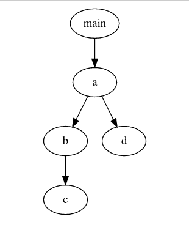

+++
title = '新人也能懂的调试方法 03 - 使用 pstack'
summary = ''
description = ""
categories = []
tags = []
date = 2023-11-25T18:30:20+09:00
draft = false

+++


## 序言

本篇主要说明一下 pstack 的使用，并附上一个 dead loop 的调试过程


## pstack 基本使用


pstack 的安装参考 https://github.com/peadar/pstack。命令参数如下：

- `-a` 显示函数参数的值
- `-j` 以 JSON 格式输出
- `-p` 。。。不用管
- `-s` 不显示堆栈对应的代码位置
- `-t` 关联 pthread 和 LWP
- `-v` 详细信息
- `-b` 每 n 秒执行一次，可以不用借助 `watch` 命令了，而且这个支持小数的
- `-D` 以 JSON 格式输出 ELF 文件的 DWARF 调试信息
- `-d` 以 JSON 格式输出 ELF 文件的 ELF 信息


比如下面的代码

```zig
noinline fn c() void {}
noinline fn b() void {
    c();
}

noinline fn d() void {}

noinline fn a() void {
    while (true) {
        b();
        d();
    }
}

pub fn main() void {
    a();
}

```


执行 `pstack -b 1 <PID>` 后会看到

```
process: /proc/3041304/mem
thread: 0, lwp: 3041304, type: 0
#0  0x00000000002202d0 in a()+16 in /home/kumiko/zig/tmp/XXX/zig-out/bin/XXX at main.zig:11
#1  0x000000000021e6e9 in main()+8 in /home/kumiko/zig/tmp/XXX/zig-out/bin/XXX at main.zig:16
#2  inlined            in callMain at start.zig:564
#2  inlined            in initEventLoopAndCallMain at start.zig:508
#2  inlined            in callMainWithArgs at start.zig:458
#2  0x000000000021df93 in posixCallMainAndExit()+1186 in /home/kumiko/zig/tmp/XXX/zig-out/bin/XXX at start.zig:414
#3  0x000000000021dae2 in _start()+17 in /home/kumiko/zig/tmp/XXX/zig-out/bin/XXX at start.zig:243
#4  0x0000000000000001 no information for frame

process: /proc/3041304/mem
thread: 0, lwp: 3041304, type: 0
#0  0x000000000024eee1 in c()+1 in /home/kumiko/zig/tmp/XXX/zig-out/bin/XXX at fmt.zig:1997
#1  0x0000000000221bb9 in b()+8 in /home/kumiko/zig/tmp/XXX/zig-out/bin/XXX at main.zig:3
#2  0x00000000002202cb in a()+10 in /home/kumiko/zig/tmp/XXX/zig-out/bin/XXX at main.zig:10
#3  0x000000000021e6e9 in main()+8 in /home/kumiko/zig/tmp/XXX/zig-out/bin/XXX at main.zig:16
#4  inlined            in callMain at start.zig:564
#4  inlined            in initEventLoopAndCallMain at start.zig:508
#4  inlined            in callMainWithArgs at start.zig:458
#4  0x000000000021df93 in posixCallMainAndExit()+1186 in /home/kumiko/zig/tmp/XXX/zig-out/bin/XXX at start.zig:414
#5  0x000000000021dae2 in _start()+17 in /home/kumiko/zig/tmp/XXX/zig-out/bin/XXX at start.zig:243
#6  0x0000000000000001 no information for frame

process: /proc/3041304/mem
thread: 0, lwp: 3041304, type: 0
#0  0x0000000000221bc0 in d()+0 in /home/kumiko/zig/tmp/XXX/zig-out/bin/XXX at main.zig:3
#1  0x00000000002202d0 in a()+15 in /home/kumiko/zig/tmp/XXX/zig-out/bin/XXX at main.zig:11
#2  0x000000000021e6e9 in main()+8 in /home/kumiko/zig/tmp/XXX/zig-out/bin/XXX at main.zig:16
#3  inlined            in callMain at start.zig:564
#3  inlined            in initEventLoopAndCallMain at start.zig:508
#3  inlined            in callMainWithArgs at start.zig:458
#3  0x000000000021df93 in posixCallMainAndExit()+1186 in /home/kumiko/zig/tmp/XXX/zig-out/bin/XXX at start.zig:414
#4  0x000000000021dae2 in _start()+17 in /home/kumiko/zig/tmp/XXX/zig-out/bin/XXX at start.zig:243
#5  0x0000000000000001 no information for frame

```


在没有递归的情况下，每一次输出的堆栈信息可以合并成一颗树的形式，而它们的最近公共祖先就是可能死循环的地方





## 实战 dead loop


示例 [bun#6651](https://github.com/oven-sh/bun/pull/6651)，使用 bun 1.0.7 来运行会发现无法输出 buffer 中的内容

```javascript
console.log(process.pid);
const buffer = Buffer.alloc(5);
buffer.write("\xF0\x9F\x98\xAD\xFF");
console.log(buffer);

// node.js output
// <Buffer c3 b0 c2 9f 00>
```


发现输出进程号 `2792045` 后，没有后续的输出，程序也没有退出。我们可以大胆猜测一下这是为什么

1. `console.log` 有 bug，无法输出 `buffer`，或者它输出了一个空字符串
2. `buffer.write` 卡住了，没有返回
3. `Buffer.alloc` 在分配空间的时候出现了问题


可以通过最简单的插入`console.log` 定位到是 `buffer.write` 没有返回。通过 `strace` 来观测一下这个进程的 syscall

```
>> sudo strace -f -p 2792045
strace: Process 2792045 attached
```


没有任何的输出，也就是说它没有执行任何的 syscall。再来结合一下进程的状态

```
>> pidstat -u -p 2792045 1 5
Linux 6.6.2-arch1-1 (misaka)    11/23/2023      _x86_64_        (16 CPU)

11:15:34 PM   UID       PID    %usr %system  %guest   %wait    %CPU   CPU  Command
11:15:35 PM  1000   2792045  100.00    0.00    0.00    0.00  100.00     2  bun-debug
11:15:36 PM  1000   2792045  100.00    0.00    0.00    0.00  100.00     2  bun-debug
11:15:37 PM  1000   2792045  100.00    0.00    0.00    0.00  100.00     2  bun-debug
11:15:38 PM  1000   2792045  100.00    0.00    0.00    0.00  100.00     2  bun-debug
11:15:39 PM  1000   2792045  100.00    0.00    0.00    0.00  100.00     2  bun-debug
Average:     1000   2792045  100.00    0.00    0.00    0.00  100.00     -  bun-debug

```


单核 CPU 被打满，而且全部在用户态，那么应该存在一个循环的逻辑。比如 spin lock 死锁了，一直挂在 CPU 上；或者就是循环条件一致不成立，而且这个循环应该是纯计算的，不涉及 syscall；递归问题可以暂时排除，因为运行一段时间后也没有爆栈


这里通过 pstack 来打印一下栈帧，通过多次执行可以发现， 1 号栈帧一致是同一个

```
>> sudo pstack -b 1 2792045 | grep "string_immutable.zig:2059"
#1  0x000055fa430344f6 in copyLatin1IntoUTF8__anon_95202()+53 in /home/kumiko/zig/bun/build/bun-debug at string_immutable.zig:2059
#1  0x000055fa430344f6 in copyLatin1IntoUTF8__anon_95202()+53 in /home/kumiko/zig/bun/build/bun-debug at string_immutable.zig:2059
#1  0x000055fa430344f6 in copyLatin1IntoUTF8__anon_95202()+53 in /home/kumiko/zig/bun/build/bun-debug at string_immutable.zig:2059
#1  0x000055fa430344f6 in copyLatin1IntoUTF8__anon_95202()+53 in /home/kumiko/zig/bun/build/bun-debug at string_immutable.zig:2059
#1  0x000055fa430344f6 in copyLatin1IntoUTF8__anon_95202()+53 in /home/kumiko/zig/bun/build/bun-debug at string_immutable.zig:2059
#1  0x000055fa430344f6 in copyLatin1IntoUTF8__anon_95202()+53 in /home/kumiko/zig/bun/build/bun-debug at string_immutable.zig:2059
```


根据对应的文件行号，翻看代码。然后将 `\xF0\x9F\x98\xAD\xFF` 这个值带入脑内走一下逻辑就知道哪里有问题了


dead loop 的出现原因多种多样，大部分是逻辑 bug。调试的方法和工具并不固定。本文涉及的问题相对来说容易调试，因为调用路径简单，而且数据本身也不长。之后在讲解万金油 LLDB 的时候会展开讲讲如何打印变量，如何 watch 内存

