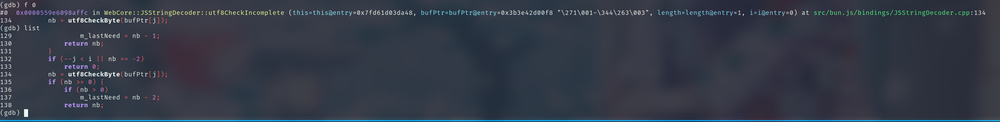

+++
title = '新人也能懂的调试方法 04 - LLDB 基本使用'
summary = ""
description = ""
categories = ["debug"]
tags = []
date = 2023-12-03T13:00:00+09:00
draft = false

+++


## 序言

本节来讲一下调试器的使用，用的是 LLDB 作为示例。如果你要使用 GDB， 那么可以参考 [GDB to LLDB command map](https://lldb.llvm.org/use/map.html) 这篇文章，里面有对应命令的映射。通过调试器我们可以

- 调试程序的控制流
- 查看内存状态
- ...


正好上一节 [新人也能懂的调试方法 03 - 使用 pstack](http://127.0.0.1:1313/posts/2023-11-25-how-to-debug-03-pstack/)，中涉及到了栈帧(Stack frame)。作为补充，在本节先来展开讲一下这个的内存布局


## 理解栈帧


### 函数调用

下面是一段 Intel 语法的汇编代码，涉及了一次函数调用，用于求两个数之和，然后返回。相当于 `c = a + b`

```nasm
SECTION .data
SECTION .text
    global main

two_sum:
        push    rbp
        mov     rbp, rsp
        ; not neccessary
        mov     rdx, rdi
        mov     rax, rsi
        ; add rax and rdx, store the result to rax
        add     rax, rdx
        pop     rbp
        ret
main:
        push    rbp
        mov     rbp, rsp
        ; we allocate 24 bytes for stack variables
        ; variable a use 8 bytes
        ; variable b use 8 bytes
        sub     rsp, 24
        ; a = 0x01
        mov     QWORD [rbp-8], 0x01
        ; b = 0x10
        mov     QWORD [rbp-16], 0x10
        ; passing arguments
        mov     rsi, QWORD [rbp-16]
        mov     rdi, QWORD [rbp-8]
        ; call two_sum
        call    two_sum
        ; store return value to stack
        ; c = two_sum(a, b)
        mov     QWORD [rbp-24], rax
        leave
        ret
```


编译成二进制可以使用下面的命令

```
>> nasm -f elf64 -g two_sum.asm && clang -g two_sum.o -o a.out
```


一个基础的函数调用涉及到

1. 函数的地址
2. 参数传递
3. 返回值传递


当函数调用的时候，每个参数都被压入栈中，然后调用函数。被调用的函数从栈中获取参数执行操作，并将结果保存到寄存器中，最后将结果返回。这是一个通常的做法，但是在 x64 中，当参数少于7个时， 参数从左到右放入寄存器: `rdi`, `rsi`, `rdx`, `rcx`, `r8`, `r9`。多于 7 个的时候才会通过栈来传递


### 栈帧变化


我们跟随汇编指令来看一下栈帧的变化

#### 1）

```asm
main:
        push    rbp
        mov     rbp, rsp
```


第一步我们将 `rbp` 存储下来，然后 `rsp` 自动指向了新的栈顶，通过赋值使 `rbp` 等于 `rsp`

```
           高地址
           
           +----------------+
           | Stack Before   |
           +----------------+
           |                |
           |      ...       |
           |                |
           +----------------+
           |      RBP       |
RSP -----> +----------------+     <----- RBP

			低地址
```


#### 2）

```asm
main:
        sub     rsp, 24
        mov     QWORD [rbp-8], 0x01
        mov     QWORD [rbp-16], 0x10
```


这一步我们是为变量在栈上开辟了空间，一个格子这里 64 bit，相当于 8 个字节。无论你是否在分支中定义的变量，都会放到起始处。比如你在一个很难被跑到的 `if` 分支中写了一个很大的数组，那么其实也会调用时直接分配好对应长度的空间。所以在这里是 `sub rsp, 24` 而不是 `sub rsp, 16`，因为这是 3 个变量的空间。


```
           +----------------+
           | Stack Before   |
           +----------------+
           |                |
           |      ...       |
           |                |
           +----------------+
           |      RBP       |
           +----------------+     <----- RBP
           |      0x01      |     <----- QWORD [rbp- 8] (a)
           +----------------+
           |      0x10      |     <----- QWORD [rbp-16] (b)
           +----------------+
           |                |     <----- QWORD [rbp-24] (c)
RSP -----> +----------------+
```


#### 3)

```assembly
main:
        mov     rsi, QWORD [rbp-16]
        mov     rdi, QWORD [rbp-8]
        call    two_sum
```


按照调用约定，我们将参数放到对应的寄存器中，这个对于栈帧没有影响。然后执行 `call two_sum`，`call` 将其返回地址压入堆栈，再把被调用过程的地址复制到 `rip`。反过来的操作就是 `ret`


```
           +----------------+
           |      RBP       |
           +----------------+     <----- RBP
           |      0x01      |     <----- QWORD [rbp- 8] (a)
           +----------------+
           |      0x10      |     <----- QWORD [rbp-16] (b)
           +----------------+
           |                |     <----- QWORD [rbp-24] (c)
           +----------------+
           | return address |
RSP -----> +----------------+

```


#### 4）

```asm
two_sum:
        push    rbp
        mov     rbp, rsp
        ; not neccessary
        mov     rdx, rdi
        mov     rax, rsi
        ; add rax and rdx, store the result to rax
        add     rax, rdx
```


接着执行 `two_sum` ，因为这相当于一个新的栈帧，所以我们继续 `push rbp` 然后修改 `rbp` 成 `rsp`的。剩下的几个指令是用于计算加法的，不涉及堆栈变化


```

           +----------------+     <----- main
           |      RBP       |
           +----------------+
           |      0x01      |     <----- QWORD [rbp- 8] (a)
           +----------------+
           |      0x10      |     <----- QWORD [rbp-16] (b)
           +----------------+
           |                |     <----- QWORD [rbp-24] (c)
           +----------------+
           | return address |
           +----------------+     <----- two_sum
           |      RBP       |
RSP -----> +----------------+     <----- RBP
```


#### 5)


在 `two_sum` 的返回时，我们需要还原调用环境，将上一个栈帧中的 `rbp` 恢复，然后将 `main` 函数的下一条指令的地址加载回来


```asm
two_sum:
        pop     rbp
        ret
```


```
           +----------------+     <----- main
           |      RBP       |
           +----------------+
           |      0x01      |     <----- QWORD [rbp- 8] (a)
           +----------------+
           |      0x10      |     <----- QWORD [rbp-16] (b)
           +----------------+
           |                |     <----- QWORD [rbp-24] (c)
RSP -----> +----------------+
```


#### 6)

最后我们将函数调用的结果赋值到 `rbp-24`  的位置，然后 `main` 函数结束

```asm
        mov     QWORD [rbp-24], rax
        leave
        ret
```

对于 `leave` 指令相当于

- `mov rsp, rbp`
- `pop rbp`

这样就消毁了我们的`main` 的栈帧。因为 `pop rbp` 我们必须要通过 `rsp` 修改栈顶的位置。其实这里也可以直接 `add` 指令把 `rsp` 加回去的，主要是要让 `ret` 的返回地址是对的，所以 `rsp` 的改动是必须的


## LLDB 的基本使用


*P.S. 以下 LLDB Console 中显示的地址是会变化的，请以自己的 LLDB 中显示的结果为准*


### 分析 two_sum 的执行结果

跟随上面的汇编示例，我们来看一下如何使用 LLDB。毕竟对于上面的汇编代码，没有任何输出，我们也不知道是否计算的正确。


我可以通过 lldb 来加载一个二进制文件

```
>> lldb a.out
(lldb) target create "a.out"
Current executable set to '/tmp/a.out' (x86_64).
```


通过 r 可以执行二进制文件，`r` 的后面可以添加参数。比如 `bun install @~39/empty` 可以直接 `r install @~39/empty`

```
(lldb) r
Process 734753 launched: '/tmp/a.out' (x86_64)
Process 734753 exited with status = 17 (0x00000011)
```


我们可以看到这个进程的 exit code 是 17。这个值恰好是 `17 = 0x10 + 0x01` ，这个是为什么呢？因为 `rax` 寄存器通常用于返回值，它就这样作为 main 的返回值被传回去了。我们可以通过 `xor` 来归零使得这个进程的 exit code 变为 0

```asm
main:
        ; ...
        xor     rax, rax
        leave
        ret

```


通常我们调试的时候需要添加断点，这个可以有两种办法

1. 通过 lldb 载入后直接通过 `breakpoint` 及其子命令来设置管理断点

```
(lldb) breakpoint set --name main
Breakpoint 1: where = a.out`main + 1, address = 0x000000000000113a
(lldb) breakpoint set --name two_sum
Breakpoint 2: where = a.out`two_sum + 1, address = 0x0000000000001121
(lldb) breakpoint list
(lldb) breakpoint disable 1
(lldb) breakpoint enable 1
(lldb) breakpoint delete 1
(lldb) breakpoint delete 2

```

2. 通过软中断进行断点。在代码中插入 `int 0x03`，也常被叫做`CC`断点。这个为啥叫做 `CC` 呢，`objdump` 一下看看这指令的字节表示就明白了

比如在 `call two_sum` 的前面进行断点

```asm
main:
        int     0x03
        call    two_sum

```

编译后再次执行这个文件会 `[1]    830886 trace trap (core dumped)  ./a.out`

这个时候可以通过 `coredumpctl debug` 来加载最近一次 `coredump` 文件。这个是 systemd 的一个配置，如果没有产生 coredump 文件，那么需要配置一下，这个自己 Google 一下就好。默认的调试器是 GDB，不过可以通过 `--debugger lldb` 来切换成 lldb


这里选择在对应的行号后设置断点后直接运行 

```
(lldb) source list -f two_sum.asm
(lldb) source list -l 25 -c 10
   25           mov     QWORD [rbp-16], 0x10
   26           ; passing arguments
   27           mov     rsi, QWORD [rbp-16]
   28           mov     rdi, QWORD [rbp-8]
   29           ; call two_sum
   30           call    two_sum
   31           ; store return value to stack
   32           ; c = two_sum(a, b)
   33           mov     QWORD [rbp-24], rax
   34           leave
(lldb) breakpoint set -l 33
Breakpoint 1: where = a.out`main + 37, address = 0x0000000000001154
(lldb) r
Process 2116056 launched: '/tmp/a.out' (x86_64)
Process 2116056 stopped
* thread #1, name = 'a.out', stop reason = breakpoint 1.1
    frame #0: 0x0000555555555154 a.out`main at two_sum.asm:33
   30           call    two_sum
   31           ; store return value to stack
   32           ; c = two_sum(a, b)
-> 33           mov     QWORD [rbp-24], rax
   34           leave
   35           ret
```


我们在 `mov     QWORD [rbp-24], rax` 这里停下了，那么这行我们有没有执行呢，答案是没有的。我们可以通过寄存器中的值然后读取到 `rbp-24` 这个位置来看一下

```
(lldb) register read rbp
     rbp = 0x00007fffffffd910
(lldb) memory read "0x00007fffffffd910 - 24" --count 1
0x7fffffffd8f8: 40                                               @
(lldb) n
Process 2116056 stopped
* thread #1, name = 'a.out', stop reason = step over
    frame #0: 0x0000555555555158 a.out`main at two_sum.asm:34
   31           ; store return value to stack
   32           ; c = two_sum(a, b)
   33           mov     QWORD [rbp-24], rax
-> 34           leave
   35           ret
(lldb) memory read "0x00007fffffffd910 - 24" --count 1
0x7fffffffd8f8: 11                                               .

```


在执行了这一行后，可以看到值被修改成了 `0x11` 。


### 其他常用操作


最常见的是 `bt`，可以对于调用栈进行回溯。将断点打在第 8 行，重新运行后

```
(lldb) bt
* thread #1, name = 'a.out', stop reason = breakpoint 2.1
  * frame #0: 0x0000555555555124 a.out`two_sum at two_sum.asm:9
    frame #1: 0x0000555555555154 a.out`main at two_sum.asm:30
    frame #2: 0x00007ffff7dd5cd0 libc.so.6`___lldb_unnamed_symbol3187 + 128
    frame #3: 0x00007ffff7dd5d8a libc.so.6`__libc_start_main + 138
    frame #4: 0x0000555555555045 a.out`_start + 37
```


可以通过 `f` 来选择栈帧，这里可以看到上一个栈帧，我们停留在了 `call two_sum` 上

```
(lldb) f 1
frame #1: 0x0000555555555154 a.out`main at two_sum.asm:30
   27           mov     rsi, QWORD [rbp-16]
   28           mov     rdi, QWORD [rbp-8]
   29           ; call two_sum
-> 30           call    two_sum
   31           ; store return value to stack
   32           ; c = two_sum(a, b)
   33           mov     QWORD [rbp-24], rax
```


查看进程所有的内存区域，这个等同于 `cat /proc/<PID>/maps`

```
(lldb) memory region --all
[0x00007ffffffdd000-0x00007ffffffff000) rw- [stack]

```


在每一个栈帧的看是的地方，LLDB 会输出一个十六进制，比如 0 号栈帧的 `0x0000555555555124`。我们可以指定参数来查看一下

```
(lldb) memory region 0x0000555555555124
[0x0000555555555000-0x0000555555556000) r-x /tmp/a.out PT_LOAD[1]

```


这个涉及到 ELF 如何被加载的，通常不做 pwn 或者热更新代码之类的，不用管这个的。所有不再本篇章进行展开了，参考 [ELF 文件解析 3-段](https://zhuanlan.zhihu.com/p/389408697)


我们读取 `0x0000555555555124` 向高地址延伸的 32 个 byte

```
(lldb) memory read 0x0000555555555124
0x555555555124: 48 89 fa 48 89 f0 48 01 d0 5d c3 55 48 89 e5 48  H..H..H..].UH..H
0x555555555134: 83 ec 18 48 c7 45 f8 01 00 00 00 48 c7 45 f0 10  ...H.E.....H.E..
```


这个数据是什么呢，这个是我们的代码段。我们可以通过 `--format i` 的参数来显示汇编。这里正好是我们断点处的下面两行

```
(lldb) memory read 0x0000555555555124 --format i
    0x555555555124: 48 89 fa  other       movq   %rdi, %rdx
    0x555555555127: 48 89 f0  other       movq   %rsi, %rax
```


LLDB 默认 AT 语法，扼要可以显示成 Intel 语法的

```
(lldb) settings set target.x86-disassembly-flavor intel
(lldb) memory read 0x0000555555555154 --format i
->  0x555555555154: 48 89 45 e8  other       mov    qword ptr [rbp - 0x18], rax
    0x555555555158: c9           other       leave
    0x555555555159: c3           return      ret
    0x55555555515a: 00 00        other       add    byte ptr [rax], al
```


那我们想要看 stack 的信息该怎么做呢，这个可以通过 `rbp` 寄存器来查找。虽然寄存器是当前的一种状态，但是在 LLLDB 等调试器中可以获取到对应栈帧时的值，

```
(lldb) f 1
(lldb) register read rbp
     rbp = 0x00007fffffffd910
(lldb) f 0
(lldb) register read rbp
     rbp = 0x00007fffffffd8e8
(lldb) expr 0x00007fffffffd910 - 0x00007fffffffd8e8
(long) $4 = 40
```


可以看到是变化的，LLDB 会自动帮我们更新。栈的地址空间是从高地址到低地址。40 个字节的偏移量，正好是 3 个变量还有返回地址和 `rbp` 这五个。我们来读取一下 `a` 和 `b` 的值


所以这里应该是 `rbp` 减去对应的偏移量

```
(lldb) f 1
(lldb) register read rbp
     rbp = 0x00007fffffffdaa0
(lldb) register read rbp
     rbp = 0x00007fffffffd910
(lldb) memory read --count 1 "0x00007fffffffd910 - 8"
0x7fffffffd908: 01                                               .
(lldb) memory read --count 1 "0x00007fffffffd910 - 16"
0x7fffffffd900: 10                                               .
```


同理 `rsp` 也是一样的。因为我们对于 `rsp` 减去了 24。预留了 3 个 8 字节变量的空间，所以这里的 `rsp` 是 `0x00007fffffffd8f8`

```
(lldb) register read rsp
     rsp = 0x00007fffffffd8f8
(lldb) memory read --count 1 0x00007fffffffd8f8
0x7fffffffd8f8: 40                                               @
(lldb) memory read --count 1 "0x00007fffffffd8f8 + 8"
0x7fffffffd900: 10                                               .
(lldb) memory read --count 1 "0x00007fffffffd8f8 + 16"
0x7fffffffd908: 01                                               .                                          .
```

_P.S. 顺便一提这里可以通过连续的使用回车自动向高地址的方向来查看内存空间的值_


最后来一个有用的`watch` 。这个可以自动检查内存的变化，比如下面来检测 `rbp-24` 这个地址的变化

```
(lldb) breakpoint set --fullname main
Breakpoint 4: where = a.out`main + 1, address = 0x0000555555555130
(lldb) r
(lldb) n
(lldb) register read rbp
     rbp = 0x00007fffffffd910
(lldb) expr 0x00007fffffffd910 - 24
(long) $12 = 140737488345336
(lldb) watchpoint set expression  -- 140737488345336
Watchpoint created: Watchpoint 1: addr = 0x7fffffffd8f8 size = 8 state = enabled type = w
    new value: 140737354032960
(lldb) c
Process 2264198 resuming

Watchpoint 1 hit:
old value: 140737354032960
new value: 17
Process 2264198 stopped
* thread #1, name = 'a.out', stop reason = watchpoint 1
    frame #0: 0x0000555555555158 a.out`main at two_sum.asm:34
   31           ; store return value to stack
   32           ; c = two_sum(a, b)
   33           mov     QWORD [rbp-24], rax
-> 34           leave
   35           ret
```


## 实战

这次选用一个比较简单的，仅作为一个 coredump 的调试示例 [bun#3562](https://github.com/oven-sh/bun/issues/3562)

在 segmentation fault 之后，我们通过 `coredumpctl debug` 进行分析




可以看到发生 segmentation fault 时的栈帧，然后定位到 `src/bun.js/bindings/JSStringDecoder.cpp` 的 134 行。通过打印变量的方式得到 `j` 是一个非常大的值，这个会导致数组的越界访问，但是越界访问不一定会导致 segmentation fault。需要注意这个因果关系。

往前翻代码逻辑，看 `j` 是怎么计算出来的。

```cpp
uint8_t JSStringDecoder::utf8CheckIncomplete(uint8_t* bufPtr, uint32_t length, uint32_t i)
{
    uint32_t j = length - 1;
    if (j < i)
        return 0;
    int8_t nb = utf8CheckByte(bufPtr[j]);
    if (nb >= 0) {
        if (nb > 0)
            m_lastNeed = nb - 1;
        return nb;
    }
    if (--j < i || nb == -2)
        return 0;
    nb = utf8CheckByte(bufPtr[j]);
    // ...
}
```


这里当 `length` 为 1 时会导致 `j` 为 `0` ，如果在第一次 `utf8CheckByte` 后没有让函数返回，那么会执行 `--j`。`j` 的类型是 `uint32_t` ，这里会发生值的下溢出，得到 `uint32_t` 的最大值。这里会去读取栈空间或者堆空间，或者 mmap 之类的区域中的一个地址的值，取决于 `bufPtr` 所在的位置。因为这个数字是 4294967295，相当于 4G。如果 `bufPtr` 是一个栈上的数据，那么根据栈增长方向，这个是相当于沿着栈帧向调用方进行回溯，Linux 通常一个 stack 默认是 8192kbytes 的，所以大概率在 stack 的范围外面了。如果是在堆上，那么不一定的，有很多因素，比如内存分配器等，下面是一个不会 fault 的示例，环境是 x64 GCC/libc malloc


```c
#include <stdio.h>
#include <stdlib.h>
#include <stdint.h>

int main() {
    uint8_t* bufPtr = NULL;
    size_t chunk_size = 100 * 1024 * 1024;  // 100MB
    uint8_t* chunks[42];

    for (size_t i = 0; i <= 42; ++i) {
        uint8_t* chunk = (uint8_t*)malloc(chunk_size);
        chunks[i] = chunk;
        if (chunk == NULL) {
            printf("Memory allocation failed.\n");
            return 1;
        }
        if (i == 41) {
            bufPtr = chunk;
        }
    }
    for (size_t i = 2; i < 42; ++i) {
        free(chunks[i]);
    }

    uint32_t j = 0;
    j -= 1;
    uint8_t value = bufPtr[j];

    printf("Value at bufPtr[%x]: %u\n", j, value);
    return 0;
}
```


## 扩展阅读

- [深入浅出GNU X86-64 汇编](https://www.cnblogs.com/lsgxeva/p/11176000.html)
