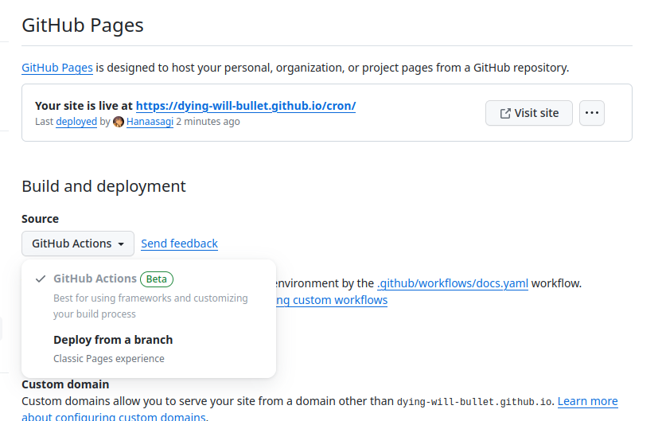

+++
title = "为 Zig 项目构建在线文档"
summary = ""
description = ""
categories = [""]
tags = []
date = 2023-12-05T21:00:00+09:00
draft = false

+++


环境 zig 0.12.0-dev.1773+8a8fd47d2。在 `build.zig` 中添加如下代码

```zig
    // Docs
    const docs_step = b.step("docs", "Emit docs");
    const docs_install = b.addInstallDirectory(.{
        .source_dir = lib.getEmittedDocs(),
        .install_dir = .prefix,
        .install_subdir = "docs",  // 文档位置
    });
    docs_step.dependOn(&docs_install.step);
```


命令行中执行，构建本地文档，生成在 `zig-out/docs/` 目录下

```
zig build docs
```


参考静态页面的部署方式，通过 Action 将文档部署到 GitHub Page。首先在 Settings 中切换 Source 成 GitHub Actions





然后在项目的 `.github/workflows` 目录中添加新的 YAML

```yaml
on:
  push:
    branches: ["master"]
  workflow_dispatch:

permissions:
  pages: write
  contents: read
  id-token: write

concurrency:
  group: pages
  cancel-in-progress: false

jobs:
  build:
    runs-on: ubuntu-latest

    steps:
      - name: Check out repository
        uses: actions/checkout@v3
      - name: Setup Zig
        uses: goto-bus-stop/setup-zig@v2
      - name: Generate docs
        run: |
          zig build docs
      - name: Setup Pages
        uses: actions/configure-pages@v4
      - name: Upload artifact
        uses: actions/upload-pages-artifact@v2
        with:
          path: zig-out/docs/

  deploy:
    needs: build
    runs-on: ubuntu-latest
    environment:
      name: github-pages
      url: ${{ steps.deployment.outputs.page_url }}
    steps:
      - name: Deploy to GitHub Pages
        id: deployment
        uses: actions/deploy-pages@v3
```
