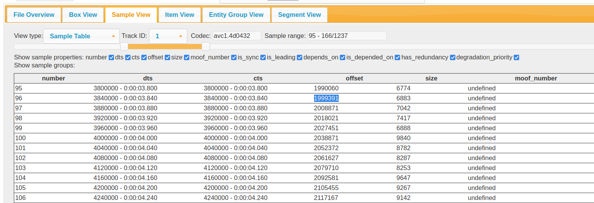
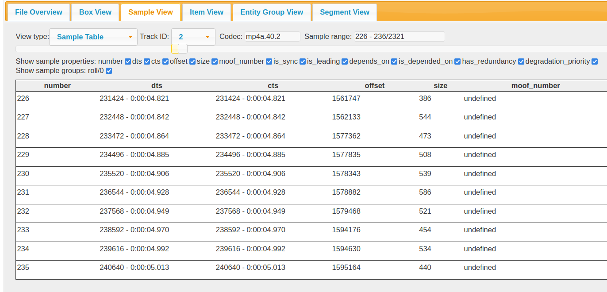

+++
title = "排查 FFmpeg 请求过多的问题"
summary = ""
description = ""
categories = [""]
tags = ["FFmpeg"]
date = 2024-06-09T07:29:53+09:00
draft = false

+++


最近遇到一个问题， FFmpeg 处理视频的时候，有些情况会变得非常慢，而且会打出去很多网络请求


## Repro

实验环境如下:

- FFmpeg 6.0
- 视频[文件地址](https://drive.google.com/file/d/1fyq_AGVY52pfNGRjk82flpRvKDVZVBwk/view?usp=sharing)


因为这是一个 23 年版本的 FFmpeg，如果本地 FFmpeg 版本比这个高，可以选择使用镜像来复现这个问题

```shell
$ docker pull linuxserver/ffmpeg:6.0-cli-ls104

# 需要覆盖 entrypoint 进入 Bash
$ docker run -it --rm --entrypoint bash linuxserver/ffmpeg:6.0-cli-ls104
```


下载文件之后，本地启动一个支持 HTTP 206 的静态文件服务器，然后执行

```shell
$ ffmpeg -i http://192.168.0.106:8000/input.mp4 -ss 23 -t 11.0 -y output.mp4
```


就可以观察到效果。或者也可以直接使用这个视频的下载连接作为 `-i` 的输入参数

```shell
$ ffmpeg -i "https://drive.usercontent.google.com/download?id=1fyq_AGVY52pfNGRjk82flpRvKDVZVBwk&export=download" -ss 23 -t 11.0 -y output.mp4
```


我们能够直观地发现 FFmpeg 在很长一段时间内命令行是没有任何回显的。通过 `strace` 来查看

```
[pid  1397] connect(5, {sa_family=AF_INET, sin_port=htons(7890), sin_addr=inet_addr("192.168.0.106")}, 16) = -1 EINPROGRESS (Operation now in progress)
[pid  1397] connect(3, {sa_family=AF_INET, sin_port=htons(7890), sin_addr=inet_addr("192.168.0.106")}, 16) = -1 EINPROGRESS (Operation now in progress)
[pid  1397] connect(5, {sa_family=AF_INET, sin_port=htons(7890), sin_addr=inet_addr("192.168.0.106")}, 16) = -1 EINPROGRESS (Operation now in progress)
[pid  1397] connect(3, {sa_family=AF_INET, sin_port=htons(7890), sin_addr=inet_addr("192.168.0.106")}, 16) = -1 EINPROGRESS (Operation now in progress)
[pid  1397] connect(5, {sa_family=AF_INET, sin_port=htons(7890), sin_addr=inet_addr("192.168.0.106")}, 16) = -1 EINPROGRESS (Operation now in progress)
```


系统在短时间内发起了大量的 `connect` syscall，而且连接的是同一个目的服务器。借助 wireshark 进行抓包，可以发现都是一次性的 TCP 连接，传输的是带有 `Range`  Header 的 HTTP 报文，这说明在不断通过 offset 来从服务端拉取指定的文件片段。`Header` 中存在的 `Connection: close`，也解释了这些 TCP 连接为什么都是一次性传输完就关闭的


上面这些我们也可以通过增加日志等级来看到详细情况，在上面的命令尾部增加`-loglevel trace -report` 即可。截取部分的输出如下

```
[http @ 0x631f32c295c0] header='HTTP/1.1 206 Partial Content'
[http @ 0x631f32c295c0] http_code=206
[http @ 0x631f32c295c0] header='Connection: close'
[http @ 0x631f32c295c0] header='Content-Length: 21655396'
[http @ 0x631f32c295c0] header='Accept-Ranges: bytes'
[http @ 0x631f32c295c0] header='Cache-Control: public, max-age=31536000'
[http @ 0x631f32c295c0] header='Content-Range: bytes 1860527-23515922/23515923'
[http @ 0x631f32c295c0] header='Content-Type: video/mp4'
[http @ 0x631f32c295c0] header='Date: Sun, 09 Jun 2024 08:46:46 GMT'
[http @ 0x631f32c295c0] header='Last-Modified: Sat, 25 May 2024 03:48:51 GMT'
[http @ 0x631f32c295c0] header='Vary: accept-encoding'
[http @ 0x631f32c295c0] header=''
[mov,mp4,m4a,3gp,3g2,mj2 @ 0x631f32c28cc0] stream 0, sample 89, dts 3560000
[mov,mp4,m4a,3gp,3g2,mj2 @ 0x631f32c28cc0] stream 1, sample 213, dts 4522667
[tcp @ 0x733338060e80] Original list of addresses:
[tcp @ 0x733338060e80] Address 192.168.0.106 port 7890
[tcp @ 0x733338060e80] Interleaved list of addresses:
[vost#0:0/libx264 @ 0x631f32c32140] cur_dts is invalid [init:0 i_done:0 finish:0] (this is harmless if it occurs once at the start per stream)
[h264 @ 0x631f33499f40] nal_unit_type: 1(Coded slice of a non-IDR picture), nal_ref_idc: 2
[tcp @ 0x733338060e80] Address 192.168.0.106 port 7890
[tcp @ 0x733338060e80] Starting connection attempt to 192.168.0.106 port 7890
[tcp @ 0x733338060e80] Successfully connected to 192.168.0.106 port 7890
[http @ 0x631f32c295c0] request: GET http://192.168.0.106:8000/input.mp4 HTTP/1.1
User-Agent: Lavf/60.3.100
Accept: */*
Range: bytes=1525530-
Connection: close
Host: 192.168.0.106:8000
Icy-MetaData: 1


[http @ 0x631f32c295c0] header='HTTP/1.1 206 Partial Content'
[http @ 0x631f32c295c0] http_code=206
[http @ 0x631f32c295c0] header='Connection: close'
[http @ 0x631f32c295c0] header='Content-Length: 21990393'
[http @ 0x631f32c295c0] header='Accept-Ranges: bytes'
[http @ 0x631f32c295c0] header='Cache-Control: public, max-age=31536000'
[http @ 0x631f32c295c0] header='Content-Range: bytes 1525530-23515922/23515923'
[http @ 0x631f32c295c0] header='Content-Type: video/mp4'
[http @ 0x631f32c295c0] header='Date: Sun, 09 Jun 2024 08:46:46 GMT'
[http @ 0x631f32c295c0] header='Last-Modified: Sat, 25 May 2024 03:48:51 GMT'
[http @ 0x631f32c295c0] header='Vary: accept-encoding'
[http @ 0x631f32c295c0] header=''
[mov,mp4,m4a,3gp,3g2,mj2 @ 0x631f32c28cc0] stream 0, sample 89, dts 3560000
[mov,mp4,m4a,3gp,3g2,mj2 @ 0x631f32c28cc0] stream 1, sample 214, dts 4544000
[mov,mp4,m4a,3gp,3g2,mj2 @ 0x631f32c28cc0] stream 0, sample 89, dts 3560000
[mov,mp4,m4a,3gp,3g2,mj2 @ 0x631f32c28cc0] stream 1, sample 215, dts 4565333
[vost#0:0/libx264 @ 0x631f32c32140] cur_dts is invalid [init:0 i_done:0 finish:0] (this is harmless if it occurs once at the start per stream)
[tcp @ 0x733338008a00] Original list of addresses:
[tcp @ 0x733338008a00] Address 192.168.0.106 port 7890
[vost#0:0/libx264 @ 0x631f32c32140] cur_dts is invalid [init:0 i_done:0 finish:0] (this is harmless if it occurs once at the start per stream)
[tcp @ 0x733338008a00] Interleaved list of addresses:
[tcp @ 0x733338008a00] Address 192.168.0.106 port 7890
[tcp @ 0x733338008a00] Starting connection attempt to 192.168.0.106 port 7890
[tcp @ 0x733338008a00] Successfully connected to 192.168.0.106 port 7890
[http @ 0x631f32c295c0] request: GET http://192.168.0.106:8000/input.mp4 HTTP/1.1
User-Agent: Lavf/60.3.100
Accept: */*
Range: bytes=1870837-
Connection: close
Host: 192.168.0.106:8000
Icy-MetaData: 1
```


这样的请求日志里面足足出现了 1585 次。但是我们的视频本身只有 **23515923** bytes 这么大，也就是 22MB。继续观察日志，可以发现在静态服务器的每次响应中其实都返回了完整的文件数据，参考 `Content-Length`。但是 FFmpeg 并没有选择读取所有的内容进入自己的缓冲区


## MP4 文件结构


对于这个问题，我们首先需要了解一些 MP4 的知识，一搜一大片，这里不再展开

- [mp4封装格式各box类型讲解及IBP帧计算](https://www.cnblogs.com/ailumiyana/p/12907363.html)


一番了解之后，可以知道 `moov` 这个区块存储了元数据信息。我们需要通过一些工具对于此视频进行分析，当然你也可以借助 `ffprobe` 去做这个事情。用到的工具如下:

- [MP4Box.js / ISOBMFF Box Structure Viewer](https://gpac.github.io/mp4box.js/test/filereader.html)
- [Online MP4 file parser](https://www.onlinemp4parser.com/)


此视频的 Box 排列如上图，可以看到 `moov` 被放到了最后，也就是说需要 seek 到 `moov` 的位置之后才能正确的处理 `mdat` 里面的数据。而对于 Web 来说，就需要 Range Header 了。我们可以搜到很多资料来证明 `moov` 放到前面是更好的排列顺序

- [从天猫某活动视频不必要的3次请求说起](https://www.zhangxinxu.com/wordpress/2018/12/video-moov-box/)

- https://github.com/google/ExoPlayer/issues/6635
- [在线短视频秒播优化之视频文件格式之MP4文件Moov box的位置](https://segmentfault.com/a/1190000012477812)


如果想要修复这种排列的问题，可以使用 FFmpeg 的 `-movflags faststart` 参数


但是，我们遇到的问题并不完全一致。翻到日志最开始的两个请求

```
Opening an input file: http://192.168.0.106:8000/input.mp4.
[NULL @ 0x55f26e6b2ac0] Opening 'http://192.168.0.106:8000/input.mp4' for reading
[http @ 0x55f26e6b3400] Setting default whitelist 'http,https,tls,rtp,tcp,udp,crypto,httpproxy,data'
[tcp @ 0x55f26e6b6300] Original list of addresses:
[tcp @ 0x55f26e6b6300] Address 192.168.0.106 port 7890
[tcp @ 0x55f26e6b6300] Interleaved list of addresses:
[tcp @ 0x55f26e6b6300] Address 192.168.0.106 port 7890
[tcp @ 0x55f26e6b6300] Starting connection attempt to 192.168.0.106 port 7890
[tcp @ 0x55f26e6b6300] Successfully connected to 192.168.0.106 port 7890
[http @ 0x55f26e6b3400] request: GET http://192.168.0.106:8000/input.mp4 HTTP/1.1
User-Agent: Lavf/60.3.100
Accept: */*
Range: bytes=0-
Connection: close
Host: 192.168.0.106:8000
Icy-MetaData: 1


[http @ 0x55f26e6b3400] header='HTTP/1.1 200 OK'
[http @ 0x55f26e6b3400] http_code=200
[http @ 0x55f26e6b3400] header='Connection: close'
[http @ 0x55f26e6b3400] header='Content-Length: 23515923'
[http @ 0x55f26e6b3400] header='Accept-Ranges: bytes'
[http @ 0x55f26e6b3400] header='Cache-Control: public, max-age=31536000'
[http @ 0x55f26e6b3400] header='Content-Type: video/mp4'
[http @ 0x55f26e6b3400] header='Date: Mon, 10 Jun 2024 05:17:40 GMT'
[http @ 0x55f26e6b3400] header='Last-Modified: Sat, 25 May 2024 03:48:51 GMT'
[http @ 0x55f26e6b3400] header='Vary: accept-encoding'
[http @ 0x55f26e6b3400] header=''
Probing mov,mp4,m4a,3gp,3g2,mj2 score:100 size:2048
[mov,mp4,m4a,3gp,3g2,mj2 @ 0x55f26e6b2ac0] Format mov,mp4,m4a,3gp,3g2,mj2 probed with size=2048 and score=100
[mov,mp4,m4a,3gp,3g2,mj2 @ 0x55f26e6b2ac0] type:'ftyp' parent:'root' sz: 32 8 23515923
[mov,mp4,m4a,3gp,3g2,mj2 @ 0x55f26e6b2ac0] ISO: File Type Major Brand: isom
[mov,mp4,m4a,3gp,3g2,mj2 @ 0x55f26e6b2ac0] type:'free' parent:'root' sz: 8 40 23515923
[mov,mp4,m4a,3gp,3g2,mj2 @ 0x55f26e6b2ac0] type:'mdat' parent:'root' sz: 23492883 48 23515923
[tcp @ 0x55f26e6b6e40] Original list of addresses:
[tcp @ 0x55f26e6b6e40] Address 192.168.0.106 port 7890
[tcp @ 0x55f26e6b6e40] Interleaved list of addresses:
[tcp @ 0x55f26e6b6e40] Address 192.168.0.106 port 7890
[tcp @ 0x55f26e6b6e40] Starting connection attempt to 192.168.0.106 port 7890
[tcp @ 0x55f26e6b6e40] Successfully connected to 192.168.0.106 port 7890
[http @ 0x55f26e6b3400] request: GET http://192.168.0.106:8000/input.mp4 HTTP/1.1
User-Agent: Lavf/60.3.100
Accept: */*
Range: bytes=23492923-
Connection: close
Host: 192.168.0.106:8000
Icy-MetaData: 1


[http @ 0x55f26e6b3400] header='HTTP/1.1 206 Partial Content'
[http @ 0x55f26e6b3400] http_code=206
[http @ 0x55f26e6b3400] header='Connection: close'
[http @ 0x55f26e6b3400] header='Content-Length: 23000'
[http @ 0x55f26e6b3400] header='Accept-Ranges: bytes'
[http @ 0x55f26e6b3400] header='Cache-Control: public, max-age=31536000'
[http @ 0x55f26e6b3400] header='Content-Range: bytes 23492923-23515922/23515923'
[http @ 0x55f26e6b3400] header='Content-Type: video/mp4'
[http @ 0x55f26e6b3400] header='Date: Mon, 10 Jun 2024 05:17:40 GMT'
[http @ 0x55f26e6b3400] header='Last-Modified: Sat, 25 May 2024 03:48:51 GMT'
[http @ 0x55f26e6b3400] header='Vary: accept-encoding'
[http @ 0x55f26e6b3400] header=''

```


可以看到，第一个请求是 `Range: bytes=0-`，而第二个请求则是 `Range: bytes=23492923-`。这个偏移量正好是 `moov` 的位置，也就是说 FFmpeg 在第二个请求就能够拿到视频的元信息，那么问题到底处在哪里呢


##  `interleaved_read` option

乍看陷入僵局，但是好在升级 FFmpeg 就会解决这个问题。并且可以缩小到 `n6.0.1` 和 `n6.1` 两个 tag 之间，只要二分法找到这个 commit 就可以知道为啥了


一番体力活之后，`a8d9da4c8b574dab4f35f4b6802f52b1bc0156cc` 是一个相关的 commit。其引入了一个 `interleaved_read` 的选项

```
Author: Zhao Zhili <quinkblack@foxmail.com>
Date:   Tue Sep 12 01:03:58 2023 +0800

    avformat/mov: add interleaved_read option

    For badly interleaved files, interleave packets from multiple tracks
    at the demuxer level can trigger seeking back and forth, which can be
    dramatically slow depending on the protocol. Demuxer level interleave
    can be useless sometimes, e.g., reading mp4 via http and then
    transcoding/remux to DASH. Disable this option when you don't need the
    demuxer level interleave, and want to avoid the IO penalizes.

    Co-authored-by: Derek Buitenhuis <derek.buitenhuis@gmail.com>
    Signed-off-by: Zhao Zhili <zhilizhao@tencent.com>

```

https://man.archlinux.org/man/ffmpeg-all.1#interleaved_read

> ​    Interleave packets from multiple tracks at demuxer level. For badly interleaved files, this prevents playback issues caused by large gaps between packets in different tracks, as MOV/MP4 do not have packet placement requirements. However, this can cause excessive seeking on very badly interleaved files, due to seeking between tracks, so disabling it may prevent I/O issues, at the expense of playback.


相关代码如下

https://github.com/FFmpeg/FFmpeg/blob/94f2274a8b61438572f0873ccf430e55ce0e0e2b/libavformat/mov.c#L9767-L9795

```c
static AVIndexEntry *mov_find_next_sample(AVFormatContext *s, AVStream **st)
{
    AVIndexEntry *sample = NULL;
    int64_t best_dts = INT64_MAX;
    int i;
    MOVContext *mov = s->priv_data;
    int no_interleave = !mov->interleaved_read || !(s->pb->seekable & AVIO_SEEKABLE_NORMAL);
    for (i = 0; i < s->nb_streams; i++) {
        AVStream *avst = s->streams[i];
        FFStream *const avsti = ffstream(avst);
        MOVStreamContext *msc = avst->priv_data;
        if (msc->pb && msc->current_sample < avsti->nb_index_entries) {
            AVIndexEntry *current_sample = &avsti->index_entries[msc->current_sample];
            int64_t dts = av_rescale(current_sample->timestamp, AV_TIME_BASE, msc->time_scale);
            uint64_t dtsdiff = best_dts > dts ? best_dts - (uint64_t)dts : ((uint64_t)dts - best_dts);
            av_log(s, AV_LOG_TRACE, "stream %d, sample %d, dts %"PRId64"\n", i, msc->current_sample, dts);
            if (!sample || (no_interleave && current_sample->pos < sample->pos) ||
                ((s->pb->seekable & AVIO_SEEKABLE_NORMAL) &&
                 ((msc->pb != s->pb && dts < best_dts) || (msc->pb == s->pb && dts != AV_NOPTS_VALUE &&
                 ((dtsdiff <= AV_TIME_BASE && current_sample->pos < sample->pos) ||
                  (dtsdiff > AV_TIME_BASE && dts < best_dts)))))) {
                sample = current_sample;
                best_dts = dts;
                *st = avst;
            }
        }
    }
    return sample;
}
```


我们不妨试一下 `interleaved_read` 参数的影响。因为这个是后来加入的，所以我直接在当前的 master 上编译测试了，使用的 commit 为 `94f2274a8b61438572f0873ccf430e55ce0e0e2b`

```
$ ./ffmpeg -interleaved_read 0 -i http://192.168.0.106:8000/input.mp4 -ss 23 -t 11.0 -y output.mp4 -loglevel trace 2>&1 | grep "Content-Length" | wc -l
3

content/posts/2024-06-09-poor-performance-of-ffmpeg-i-url on  master [$!?] took 5s
$ ./ffmpeg -interleaved_read 1 -i http://192.168.0.106:8000/input.mp4 -ss 23 -t 11.0 -y output.mp4 -loglevel trace 2>&1 | grep "Content-Length" | wc -l
73
```


那么什么是 interleaved 呢？

在理想情况下，一个交错良好的 MP4 文件会将音频和视频数据包按照时间顺序紧密地排列在一起。例如，先存储N毫秒的视频样本，然后是N毫秒的音频样本，接着是N毫秒的视频样本，依此类推。通常，交错的样本会在一个交错窗口内进行分组。交错可以减少磁盘访问次数，降低播放缓冲区的需求，并且支持渐进式下载和播放

```
[视频包1] [音频包1] [视频包2] [音频包2] [视频包3] [音频包3] ...
```


交错不良的文件可能会将同一种类型的数据包集中在一起，而不是按照时间顺序交错排列。例如：

```
[视频包1] [视频包2] [视频包3] ... [音频包1] [音频包2] [音频包3] ...
```

在这种情况下，如果播放器要播放视频，它可能需要先读取大量的视频数据包，然后再跳转到音频数据包的位置。这会导致频繁的前后寻址操作，尤其是在从 HTTP 等网络流读取文件时，会导致大量的 HTTP range 请求，从而降低性能。


这部分可以参考 [深入理解MP4视频文件裁剪原理[上]](https://cloud.tencent.com/developer/article/2406632)


我们再来观察日志，`Range` 的确是在来回的跳动。`1562133` 到 `1999391` 再到 `1577362`，成前后跳跃形式前进

```
[mov,mp4,m4a,3gp,3g2,mj2 @ 0x5de5f3be6cc0] stream 0, sample 96, dts 3840000
[mov,mp4,m4a,3gp,3g2,mj2 @ 0x5de5f3be6cc0] stream 1, sample 227, dts 4821333
[tcp @ 0x79b9e0008000] Original list of addresses:
[tcp @ 0x79b9e0008000] Address 192.168.0.106 port 7890
[tcp @ 0x79b9e0008000] Interleaved list of addresses:
[vost#0:0/libx264 @ 0x5de5f3bf0140] cur_dts is invalid [init:0 i_done:0 finish:0] (this is harmless if it occurs once at the start per stream)
[tcp @ 0x79b9e0008000] Address 192.168.0.106 port 7890
[tcp @ 0x79b9e0008000] Starting connection attempt to 192.168.0.106 port 7890
[h264 @ 0x5de5f4a04ac0] nal_unit_type: 1(Coded slice of a non-IDR picture), nal_ref_idc: 2
[tcp @ 0x79b9e0008000] Successfully connected to 192.168.0.106 port 7890
[http @ 0x5de5f3be75c0] request: GET http://192.168.0.106:8000/input.mp4 HTTP/1.1
User-Agent: Lavf/60.3.100
Accept: */*
Range: bytes=1562133-
Connection: close
Host: 192.168.0.106:8000
Icy-MetaData: 1


[mov,mp4,m4a,3gp,3g2,mj2 @ 0x5de5f3be6cc0] stream 0, sample 96, dts 3840000
[mov,mp4,m4a,3gp,3g2,mj2 @ 0x5de5f3be6cc0] stream 1, sample 228, dts 4842667
[tcp @ 0x79b9e0056f80] Original list of addresses:
[tcp @ 0x79b9e0056f80] Address 192.168.0.106 port 7890
[vost#0:0/libx264 @ 0x5de5f3bf0140] cur_dts is invalid [init:0 i_done:0 finish:0] (this is harmless if it occurs once at the start per stream)
[tcp @ 0x79b9e0056f80] Interleaved list of addresses:
[tcp @ 0x79b9e0056f80] Address 192.168.0.106 port 7890
[tcp @ 0x79b9e0056f80] Starting connection attempt to 192.168.0.106 port 7890
[tcp @ 0x79b9e0056f80] Successfully connected to 192.168.0.106 port 7890
[http @ 0x5de5f3be75c0] request: GET http://192.168.0.106:8000/input.mp4 HTTP/1.1
User-Agent: Lavf/60.3.100
Accept: */*
Range: bytes=1999391-
Connection: close
Host: 192.168.0.106:8000
Icy-MetaData: 1


[mov,mp4,m4a,3gp,3g2,mj2 @ 0x5de5f3be6cc0] stream 0, sample 97, dts 3880000
[mov,mp4,m4a,3gp,3g2,mj2 @ 0x5de5f3be6cc0] stream 1, sample 228, dts 4842667
[tcp @ 0x79b9e0004ac0] Original list of addresses:
[h264 @ 0x5de5f3c177c0] nal_unit_type: 1(Coded slice of a non-IDR picture), nal_ref_idc: 2
[vost#0:0/libx264 @ 0x5de5f3bf0140] cur_dts is invalid [init:0 i_done:0 finish:0] (this is harmless if it occurs once at the start per stream)
[tcp @ 0x79b9e0004ac0] Address 192.168.0.106 port 7890
[tcp @ 0x79b9e0004ac0] Interleaved list of addresses:
[tcp @ 0x79b9e0004ac0] Address 192.168.0.106 port 7890
[tcp @ 0x79b9e0004ac0] Starting connection attempt to 192.168.0.106 port 7890
[tcp @ 0x79b9e0004ac0] Successfully connected to 192.168.0.106 port 7890
[http @ 0x5de5f3be75c0] request: GET http://192.168.0.106:8000/input.mp4 HTTP/1.1
User-Agent: Lavf/60.3.100
Accept: */*
Range: bytes=1577362-
Connection: close
Host: 192.168.0.106:8000
Icy-MetaData: 1
```


通过工具查看这些 sample 的偏移量，我们可以确认音频数据和视频数据的排列的确有问题。音频在某个区间塞进了很多数据，同一个时刻的视频数据的偏移量被挤到了很后面







## 结论

当我们通过 `-i` 将 URL 作为输入的时候，要考虑

1. `moov` 信息是否排列最前面。如果在文件，会至少多一次请求
2. 文件中视频数据和音频数据的交错排列是否理想。如果不理想会导致 FFmpeg 频繁请求文件服务


升级 FFmpeg 到 6.1.1 以上这个问题会改善很多


## Reference

- [mp4封装格式各box类型讲解及IBP帧计算](https://www.cnblogs.com/ailumiyana/p/12907363.html)
- [从天猫某活动视频不必要的3次请求说起](https://www.zhangxinxu.com/wordpress/2018/12/video-moov-box/)

- [在线短视频秒播优化之视频文件格式之MP4文件Moov box的位置](https://segmentfault.com/a/1190000012477812)
- [interleaved_read)](https://man.archlinux.org/man/ffmpeg-all.1#interleaved_read)
- [深入理解MP4视频文件裁剪原理[上]](https://cloud.tencent.com/developer/article/2406632)
- [what-makes-a-mp4-streamable](https://superuser.com/questions/1753260/what-makes-a-mp4-streamable)

