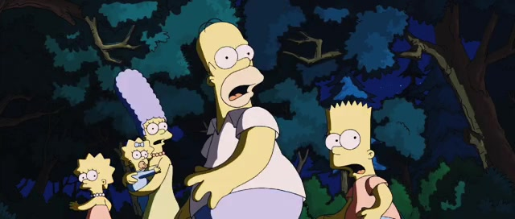

+++

title = "FFmpeg 抽帧指南"
summary = ""
description = ""
categories = [""]
tags = ["FFmpeg"]
date = 2024-06-16T11:38:59+09:00
draft = false

+++

## 环境准备

视频示例使用 https://www.h264info.com/clips.html 中的 "The Simpsons Movie – 720p Trailer"，时长为 `00:02:17.30`。下载后重命名为 input.mp4

## 抽取首帧

```shell
$ ffmpeg -i input.mp4 -frames:v 1 -update 1 -y first.png
```

- `-frames:v 1`: 指定只提取一个视频帧
- `-update 1`: 更新现有的输出文件，而不是创建新的文件

如果想要 jpg 格式的图片，可以尝试

```shell
$ ffmpeg -i input.mp4 -frames:v 1 -qscale:v 2 -update 1 -y first.jpg
```

- `-qscale:v 2`: 设置输出图像的质量参数。对于不同的编码器不一样，以 mp4 来说，值的范围是 `[1, 31]`，1 表示最高质量/最大文件大小，31 表示最低质量/最小文件大小

如果想要缩放大小，可以使用 `scale` 滤镜。这里缩小为宽为`640`，高度保持等比拉伸的新图片

```shell
$ ffmpeg -i input.mp4 -frames:v 1 -vf "scale=640:-1"  -qscale:v 2 -update 1 -y first.jpg
```


可以看到抽取出来的第一帧图片是绿色背景的免责声明。作为一个视频图片来说，显然不是我们想要的效果

### 抽取自定义区间

```shell
$ ffmpeg -ss 00:00:30 -i input.mp4 -frames:v 1 -vf "scale=640:-1"  -qscale:v 2 -update 1 -y first-2.jpg
```

- `-ss 00:00:030` 指定时间偏移量为 30 秒开始


## 抽取尾帧

既然能抽取首帧，我们也能够抽取尾帧。一种方式是通过时间偏移，另一种方式如下

```shell
$ ffmpeg -sseof -1 -i input.mp4 -vf "scale=640:-1"  -qscale:v 2 -update 1 -y last.jpg
```

- `-sseof` 选项用于从文件末尾指定偏移时间来开始处理。`-sseof` 是 "start seek from end of file" 的缩写

这条命令从最后一秒开始遍历，写入同一个文件，这样最后一次写入的数据就是最后一帧了。但是我们可以发现效果不尽人意


这是因为源视频在 2:16 之后是存在黑帧的。视频尾部出现黑帧是比较常见的问题，比如使用剪辑软件或者 AE 去导出的时候。对于这种视频我们也是可以通过滤镜过滤的

## 过滤黑帧

```shell
$ ffmpeg -sseof -1 -i input.mp4 -vf "blackframe=amount=0:threshold=32,metadata=select:key=lavfi.blackframe.pblack:value=50:function=less,scale=640:-1" -qscale:v 2 -update 1 -y last-2.jpg

```

- `blackframe` 这个滤镜输出的每一行包含检测到的帧的帧编号、黑色程度的百分比。他会将数据导出到 `lavfi.blackframe.pblack`。文档参考 https://ffmpeg.org/ffmpeg-filters.html#blackframe

  - `amount`：必须低于阈值的像素的百分比，默认为 98
  - `threshold`, `thresh`：被认为是黑色的像素值的阈值，默认为 32

- `metadata`: 通过 `lavfi.blackframe.pblack` 的数据挑选值小于 50 的数据。文档参考 https://ffmpeg.org/ffmpeg-filters.html#metadata_002c-ametadata

抽取出来的图片如下


## 抽取关键帧

关键帧（Keyframe）是视频编码中的一种特殊帧，也称为I帧（Intra-frame）。在视频压缩中，视频帧通常分为三种类型：I帧、P帧（Predicted frame）和B帧（Bi-directional predicted frame）。

- **关键帧（I帧）**：关键帧是视频序列中的重要帧，它不依赖于其他帧来进行解码，而是独立编码的完整图像帧。在视频解码时，解码器可以通过解码一个关键帧来独立地显示该帧，无需任何其他帧的信息。因此，关键帧对于视频的快速随机访问非常重要，比如拖动进度条到任意时间点或者快速跳转到视频的某一部分。
- **预测帧（P帧）**：预测帧依赖于前一个关键帧或预测帧进行解码，它只包含与前一帧之间的差异信息（运动向量、变化的像素等）。解码器需要先解码前一帧或预测帧，然后应用差异信息来生成预测帧的完整图像。
- **双向预测帧（B帧）**：双向预测帧依赖于前后两个关键帧或预测帧进行解码，它包含了与前一帧和后一帧之间的差异信息。解码器需要先解码前一帧和后一帧，然后应用这些差异信息来生成双向预测帧的完整图像。

关键帧通常出现在视频的场景切换、运动剧烈变化或者时间间隔较长的位置，它们帮助视频解码器恢复完整图像并确保视频的质量和稳定性。视频编码器会根据一定的策略和算法自动选择关键帧的位置，以便在保证视频质量的同时尽可能地减小视频文件的大小


关键帧的类型为 `I` ，可以直接通过 `select` 进行提取

```shell
$ mkdir -p ./frames
$ ffmpeg -i input.mp4 -vf "select=eq(pict_type\,I)" -vsync vfr -f image2 ./frames/frame_%04d.png
```

这个视频会抽取出来 48 个关键帧图片


## 均匀抽帧


按照每秒进行抽帧，可以用于视频轴上的缩略图


```shell
$ ffmpeg -i input.mp4 -r 1 -f image2 ./frames/frame_%04d.png
```

- `-r 1` 每一秒取一次图片


这个视频会抽取出来 139 张图片


## 转场抽帧

为了更好的生成封面图我们可以通过抽取转场帧来随机一个


```shell
$ ffmpeg -i input.mp4 -filter:v "select='gt(scene,0.25)'" -vsync vfr -y ./frames/thumbnail_%04d.png
```

- `select='gt(scene,0.25)'`: 通过 `select` 滤镜来筛选场景变化。`gt(scene,0.25)` 表示筛选出场景变化程度大于0.25的帧。`scene`是一种场景检测器，它会计算帧与帧之间的差异，当差异超过指定的阈值时，认为发生了场景变化


## 抽帧失败问题


### 自定义时间范围导致抽帧失败


样例视频如下

<video src="./bad-case.mp4" controls="controls" width="480" height="270"></video>


当我们尝试通过 `-sseof -1` 来抽取尾帧的时候

```shell
$ ffmpeg -sseof -1 -i bad-case.mp4 -update 1 -y bad-case-last.png
```


会发现如下的报错，且无法得到输出文件

```
[out#0/image2 @ 0x5e51d1a26cc0] Output file is empty, nothing was encoded(check -ss / -t / -frames parameters if used)
frame=    0 fps=0.0 q=0.0 Lsize=N/A time=N/A bitrate=N/A speed=N/A
```


遇到这种情况我们不妨先对视频文件进行分析，打开 [MP4Box.js / ISOBMFF Box Structure Viewer](https://gpac.github.io/mp4box.js/test/filereader.html)


或者也可以通过 ffprobe 进行排查

```shell
$ ffprobe -show_streams -of json -i bad-case.mp4 | jq '[.streams[] | {duration: .duration, codec_name: .codec_name}]'

[
  {
    "duration": "10.760000",
    "codec_name": "h264"
  },
  {
    "duration": "13.641633",
    "codec_name": "aac"
  }
]
```


可以发现文件本身的音频长度是大于视频的，所以通过 `-sseof -1` 我们无法获得任何的视频帧，因为它早在 `10.76` 的时候就已经结束了。下面的脚本可以解决这个问题


```bash
#!/bin/bash
input_file="input.mp4"
video_duration=$(ffprobe -v error -select_streams v:0 -show_entries stream=duration -of default=noprint_wrappers=1:nokey=1 "$input_file")

start_time=$(echo "$video_duration - 1" | bc)

ffmpeg -ss $start_time -i $input_file -update 1 -y output.png
```

*P.S. 经过一番搜索，无论是用 `trim` 滤镜还是分离 v 和 a 的方式，都不能很有效的在一条 ffmpeg 命令内完成。或许有更好的方法，欢迎交流*


## 几种方式的效果对比


按照时间裁剪了 5 秒的视频，我们可以看一下效果

```shell
$ ffmpeg -sseof -31 -t 5 -i input.mp4 -vf "scale=640:-1" -y ./sample.mp4
```


<video src="./sample.mp4" controls="controls" width="640" height="272"></video>


### 转场抽帧


```shell
$ ffmpeg -i sample.mp4 -filter:v "select='gt(scene,0.3)',scale=640:-1" -vsync vfr -qscale:v 2 -y ./scene/thumbnail_%04d.jpg
```


### 均匀抽帧


```shell
$ ffmpeg -i sample.mp4 -r 1 -f image2 -qscale:v 2 -y ./ratio/thumbnail_%04d.jpg
```





### 关键帧抽帧


```shell
$ ffmpeg -i sample.mp4 -vf "select=eq(pict_type\,I)" -vsync vfr -f image2 -qscale:v 2 -y ./keyframes/thumbnail_%04d.jpg
```


