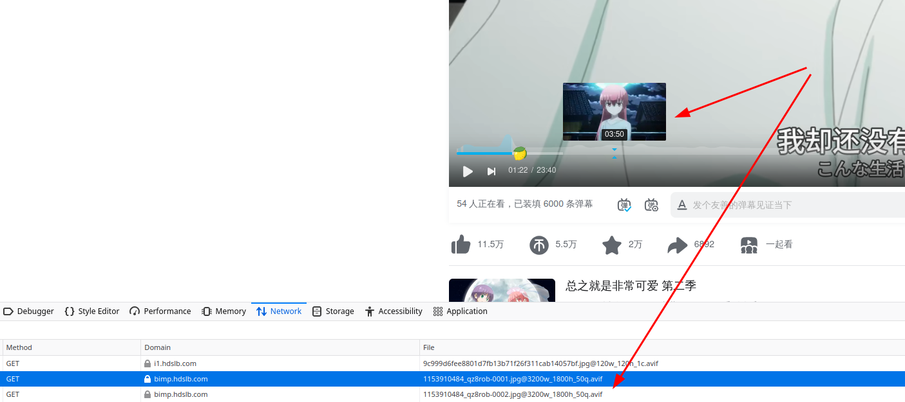

+++
title = "WEB 端视频时间轴预览图的实现思路"
summary = ""
description = ""
categories = []
tags = ["FFmpeg"]
date = 2024-07-07T11:39:30+09:00
draft = false

+++


## 时间轴预览图实现

简单看一下 bilibili 的实现。在鼠标首次移动到时间轴上时，获取到一个 avif 格式的雪碧图，它包含了鼠标所指位置附近的预览画面。在鼠标沿着时间滑动的时候，会根据判断是否需要请求新的雪碧图





时长 23:40 秒的视频，拉取的雪碧图一共两张，每张是 10x10 的布局。应该有一个数据是让前端拿到视频的预览信息，可以定位到预览图在哪个 URL 的几行几列，后端则负责雪碧图的生成


- https://bimp.hdslb.com/videoshotpvhdboss/1153910484_qz8rob-0001.jpg@3200w_1800h_50q.avif


- https://bimp.hdslb.com/videoshotpvhdboss/1153910484_qz8rob-0002.jpg@3200w_1800h_50q.avif


## FFmpeg 生成雪碧图

我们来看一下通过 FFmpeg 如何在后端生成雪碧图。

测试视频还是使用 https://www.h264info.com/clips.html 中的 “The Simpsons Movie – 720p Trailer”，下载后重命名为 input.mp4


### 按照时间切割

通过指定 `fps=1` ，可以每秒取一帧。`tile=10x10` 告诉 FFmpeg 我们的雪碧图格式是什么样子的。`-q:v 20` 来控制生成图的质量，这个参数越小质量则越高。我们可以发现 bilibili 的雪碧图 URL 后面有一个 50q 的参数，这个应该是质量 loss 50% 的意思。如果用 OSS 的话，一般是支持动态拿到不同质量的图的


```shell
$ ffmpeg -i input.mp4 -vf "fps=1,scale=320:-1,tile=10x10" -q:v 20 time-linear-%02d.jpg
```


一共生成了 136 张图，效果如下


因为 1 秒一个图，一张雪碧图的时间范围是 1 分 40 秒，这种对于短视频来说还好。但对于长视频来说就太多了


### 关键帧

关键帧可以有效的避免生成雪碧图数量过多的问题

```shell
$ ffmpeg -skip_frame nokey -i input.mp4 -vsync vfr -vf "scale=320:-1,tile=10x10" -q:v 20 key-frame-%02d.jpg
```


效果如下


这里一共生成了 48 张图，最后是一张黑色的。如果使用这种，那么还需要告诉前端时间的信息，这点可以通过加入 `showinfo` 来 grep 到 FFmpeg 截取日志


```shell
$ ffmpeg -skip_frame nokey -i input.mp4 -vsync vfr -vf "showinfo,scale=320:-1,tile=10x10" -q:v 20 key-frame-%02d.jpg 2>&1 | grep "showinfo" | grep "duration_time"
```


部分日志如下

```
[Parsed_showinfo_0 @ 0x7e2d0c003d40] n:   0 pts:   1001 pts_time:0.0417083 duration:   1001 duration_time:0.0417083 fmt:yuv420p cl:left sar:0/1 s:1280x544 i:P iskey:1 type:I checksum:C627E3A8 plane_checksum:[1A3FA0BC B3F301D6 734F4116] mean:[93 108 91] stdev:[26.4 4.2 7.7]
[Parsed_showinfo_0 @ 0x7e2d0c003d40] n:   1 pts: 141141 pts_time:5.880875 duration:   1001 duration_time:0.0417083 fmt:yuv420p cl:left sar:0/1 s:1280x544 i:P iskey:1 type:I checksum:2AB765A2 plane_checksum:[10FCA9F3 0A0E6B5A 6F755046] mean:[91 121 132] stdev:[75.5 8.3 8.6]
[Parsed_showinfo_0 @ 0x7e2d0c003d40] n:   2 pts: 256256 pts_time:10.677333 duration:   1001 duration_time:0.0417083 fmt:yuv420p cl:left sar:0/1 s:1280x544 i:P iskey:1 type:I checksum:0D78B354 plane_checksum:[CFC05B20 A4B5EE5F C5ED69C6] mean:[64 123 133] stdev:[28.0 5.4 5.7]

```


这里的 `pts_time` 就是时间戳信息，`n` 则是小图的索引。有了两个数据就可以确定时间轴上应该显示的图片了


### 转场


转场则是另一个手段


```shell
$ ffmpeg -i input.mp4 -filter:v "select='gt(scene,0.2)',showinfo,scale=320:-1,tile=10x10" -vsync vfr -q:v 20  -y scene-%02d.jpg
```


通过 `select` 滤镜来筛选场景变化。`gt(scene,0.25)` 表示筛选出场景变化程度大于 0.2 的帧。这个参数可以自己进行调整


时间信息还是通过 `showinfo` 在日志中提取即可
