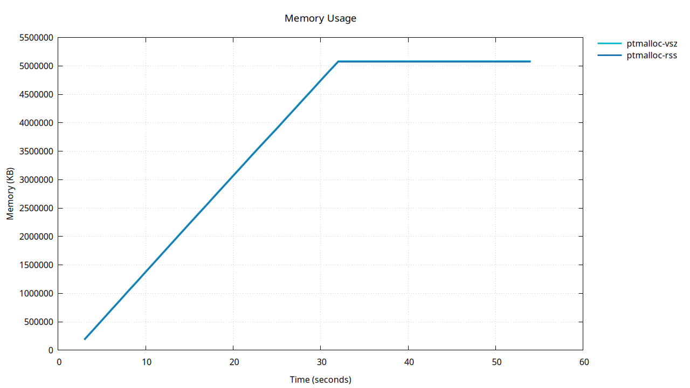
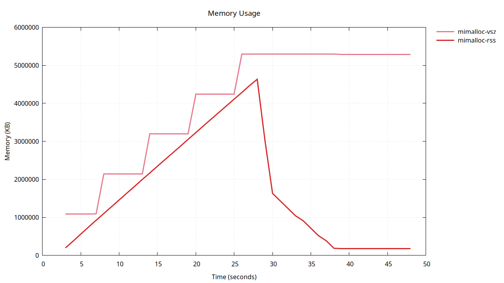
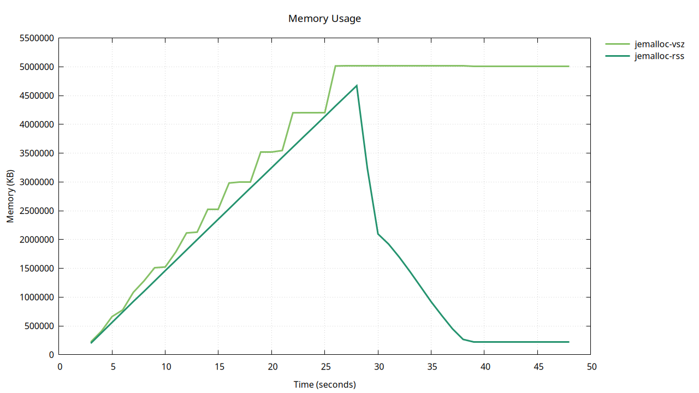
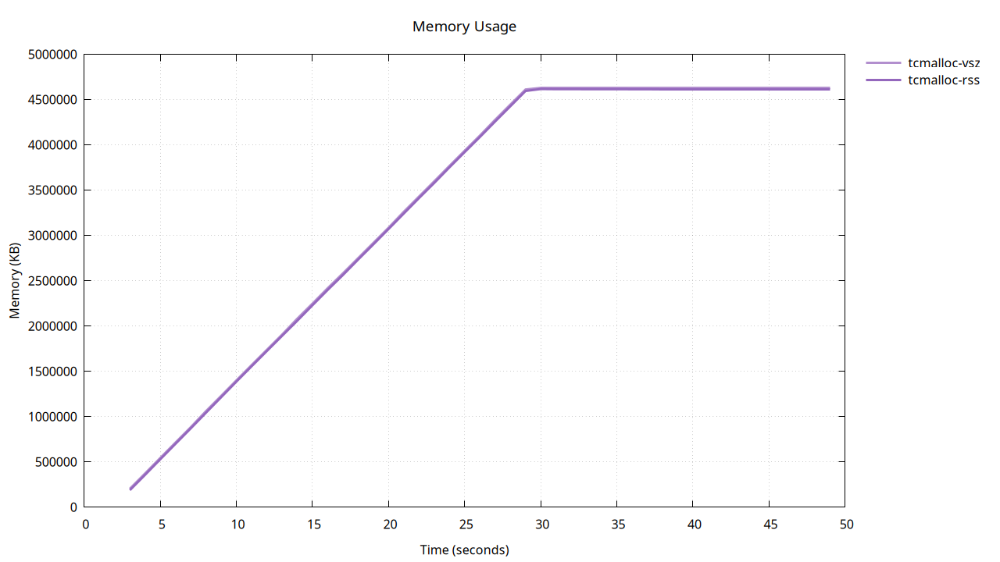
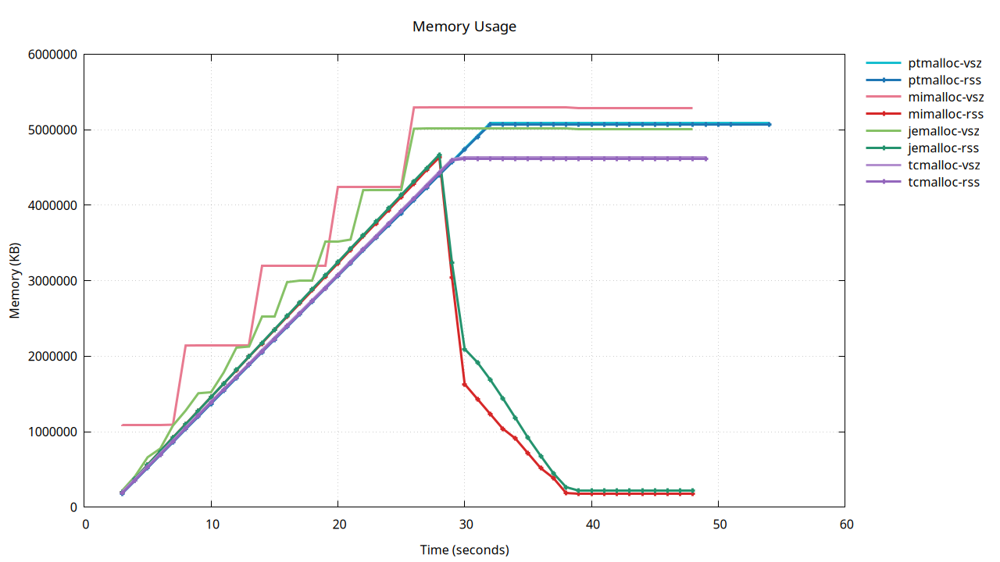

+++
title = "不同 Memory Allocator 对于 Python 的影响"
summary = ''
description = ""
categories = []
tags = []
date = 2024-07-14T03:29:11+09:00
draft = false

+++


## 实验环境


- Linux 6.9.7-arch1-1 x86_64 unknown
- Python 3.12.4
- httpx 0.27.0
- glibc-2.39+r52+gf8e4623421-1
- mimalloc 2.1.7
- jemalloc 5.3.0-4
- gperftools 2.15-1


测试 Python 代码 `t.py`

```python
import time
import httpx
import gc
import asyncio


async def make_async_client():
    async with httpx.AsyncClient() as client:
        await asyncio.sleep(10)


async def main(n):
    tasks = []
    for _ in range(n):
        tasks.append(asyncio.create_task(make_async_client()))
    print(f"Creating {n} contexts, sleeping 10 secs")
    await asyncio.wait(tasks)


asyncio.run(main(2000))
print("Finished run")
gc.collect()
time.sleep(10)
```


指标收集及分析脚本 `perf.sh`

```bash
#!/bin/bash

set -e

echo "======== Using ptmalloc ========"
pidstat -r 1 -e python t.py | tee ptmalloc.txt
awk '!/Command/ && /^[0-9]/ { print NR-1, $7, $8 }' ptmalloc.txt > ptmalloc.dat

echo "======== Using mimalloc ========"
LD_PRELOAD=/usr/lib/libmimalloc.so pidstat -r 1 -e python t.py | tee mimalloc.txt
awk '!/Command/ && /^[0-9]/ { print NR-1, $7, $8 }' mimalloc.txt > mimalloc.dat

echo "======== Using jemalloc ========"
LD_PRELOAD=/usr/lib/libjemalloc.so pidstat -r 1 -e python t.py | tee jemalloc.txt
awk '!/Command/ && /^[0-9]/ { print NR-1, $7, $8 }' jemalloc.txt > jemalloc.dat

echo "======== Using tcmalloc ========"
LD_PRELOAD=/usr/lib/libtcmalloc.so pidstat -r 1 -e python t.py | tee tcmalloc.txt
awk '!/Command/ && /^[0-9]/ { print NR-1, $7, $8 }' tcmalloc.txt > tcmalloc.dat

echo "======== Generating image ========"
gnuplot <<- EOF
    set terminal pngcairo size 1280,720 enhanced font 'Verdana,12'
    set output 'memory_usage.png'
    set title 'Memory Usage' font 'Verdana,14'
    set xlabel 'Time (seconds)' font 'Verdana,12'
    set ylabel 'Memory (KB)' font 'Verdana,12'
    set grid
    set key outside right top vertical Left reverse noenhanced autotitles nobox
    set format y "%.0f"  # Disable scientific notation on the Y-axis

    # Define line styles with distinct and distinguishable colors for each allocator
    set style line 1 lc rgb '#17becf' lt 2 lw 3   # ptmalloc-vsz
    set style line 2 lc rgb '#1f77b4' lt 1 lw 3   # ptmalloc-rss
    set style line 3 lc rgb '#e87a90' lt 1 lw 3   # mimalloc-vsz
    set style line 4 lc rgb '#d62728' lt 1 lw 3   # mimalloc-rss
    set style line 5 lc rgb '#86c166' lt 1 lw 3   # jemalloc-vsz
    set style line 6 lc rgb '#24936e' lt 1 lw 3   # jemalloc-rss
    set style line 7 lc rgb '#b28fce' lt 1 lw 3   # tcmalloc-vsz
    set style line 8 lc rgb '#9467bd' lt 1 lw 3   # tcmalloc-rss

    plot 'ptmalloc.dat' using 1:2 title 'ptmalloc-vsz' with lines ls 1, \
         'ptmalloc.dat' using 1:3 title 'ptmalloc-rss' with linespoints ls 2, \
         'mimalloc.dat' using 1:2 title 'mimalloc-vsz' with lines ls 3, \
         'mimalloc.dat' using 1:3 title 'mimalloc-rss' with linespoints ls 4, \
         'jemalloc.dat' using 1:2 title 'jemalloc-vsz' with lines ls 5, \
         'jemalloc.dat' using 1:3 title 'jemalloc-rss' with linespoints ls 6, \
         'tcmalloc.dat' using 1:2 title 'tcmalloc-vsz' with lines ls 7, \
         'tcmalloc.dat' using 1:3 title 'tcmalloc-rss' with linespoints ls 8
EOF

# ptmalloc
gnuplot <<- EOF
    set terminal pngcairo size 1280,720 enhanced font 'Verdana,12'
    set output 'ptmalloc_usage.png'
    set title 'Memory Usage' font 'Verdana,14'
    set xlabel 'Time (seconds)' font 'Verdana,12'
    set ylabel 'Memory (KB)' font 'Verdana,12'
    set grid
    set key outside right top vertical Left reverse noenhanced autotitles nobox
    set format y "%.0f"  # Disable scientific notation on the Y-axis

    # Define line styles with distinct and distinguishable colors for each allocator
    set style line 1 lc rgb '#17becf' lt 2 lw 3   # ptmalloc-vsz
    set style line 2 lc rgb '#1f77b4' lt 1 lw 3   # ptmalloc-rss

    plot 'ptmalloc.dat' using 1:2 title 'ptmalloc-vsz' with lines ls 1, \
         'ptmalloc.dat' using 1:3 title 'ptmalloc-rss' with lines ls 2
EOF

# mimalloc
gnuplot <<- EOF
    set terminal pngcairo size 1280,720 enhanced font 'Verdana,12'
    set output 'mimalloc_usage.png'
    set title 'Memory Usage' font 'Verdana,14'
    set xlabel 'Time (seconds)' font 'Verdana,12'
    set ylabel 'Memory (KB)' font 'Verdana,12'
    set grid
    set key outside right top vertical Left reverse noenhanced autotitles nobox
    set format y "%.0f"  # Disable scientific notation on the Y-axis

    # Define line styles with distinct and distinguishable colors for each allocator
    set style line 3 lc rgb '#e87a90' lt 1 lw 3   # mimalloc-vsz
    set style line 4 lc rgb '#d62728' lt 1 lw 3   # mimalloc-rss

    plot 'mimalloc.dat' using 1:2 title 'mimalloc-vsz' with lines ls 3, \
         'mimalloc.dat' using 1:3 title 'mimalloc-rss' with lines ls 4
EOF

# jemalloc
gnuplot <<- EOF
    set terminal pngcairo size 1280,720 enhanced font 'Verdana,12'
    set output 'jemalloc_usage.png'
    set title 'Memory Usage' font 'Verdana,14'
    set xlabel 'Time (seconds)' font 'Verdana,12'
    set ylabel 'Memory (KB)' font 'Verdana,12'
    set grid
    set key outside right top vertical Left reverse noenhanced autotitles nobox
    set format y "%.0f"  # Disable scientific notation on the Y-axis

    # Define line styles with distinct and distinguishable colors for each allocator
    set style line 5 lc rgb '#86c166' lt 1 lw 3   # jemalloc-vsz
    set style line 6 lc rgb '#24936e' lt 1 lw 3   # jemalloc-rss

    plot 'jemalloc.dat' using 1:2 title 'jemalloc-vsz' with lines ls 5, \
         'jemalloc.dat' using 1:3 title 'jemalloc-rss' with lines ls 6
EOF

# tcmalloc
gnuplot <<- EOF
    set terminal pngcairo size 1280,720 enhanced font 'Verdana,12'
    set output 'tcmalloc_usage.png'
    set title 'Memory Usage' font 'Verdana,14'
    set xlabel 'Time (seconds)' font 'Verdana,12'
    set ylabel 'Memory (KB)' font 'Verdana,12'
    set grid
    set key outside right top vertical Left reverse noenhanced autotitles nobox
    set format y "%.0f"  # Disable scientific notation on the Y-axis

    # Define line styles with distinct and distinguishable colors for each allocator
    set style line 7 lc rgb '#b28fce' lt 1 lw 3   # tcmalloc-vsz
    set style line 8 lc rgb '#9467bd' lt 1 lw 3   # tcmalloc-rss

    plot 'tcmalloc.dat' using 1:2 title 'tcmalloc-vsz' with lines ls 7, \
         'tcmalloc.dat' using 1:3 title 'tcmalloc-rss' with lines ls 8
EOF
```


## 实验数据整理


### ptmalloc





```
Linux 6.9.7-arch1-1 (misaka) 	07/14/2024 	_x86_64_	(16 CPU)

11:19:33 PM   UID       PID  minflt/s  majflt/s     VSZ     RSS   %MEM  Command
11:19:34 PM  1000   1371652  42658.00      0.00  192996  181832   0.64  python
11:19:35 PM  1000   1371652  42120.00      0.00  360984  350408   1.23  python
11:19:36 PM  1000   1371652  42675.00      0.00  531352  520776   1.82  python
11:19:37 PM  1000   1371652  42797.00      0.00  703136  691912   2.42  python
11:19:38 PM  1000   1371652  42134.00      0.00  871256  860488   3.01  python
11:19:39 PM  1000   1371652  43097.00      0.00 1044244 1032904   3.61  python
11:19:40 PM  1000   1371652  41693.00      0.00 1210644 1199688   4.20  python
11:19:41 PM  1000   1371652  43110.00      0.00 1382592 1372104   4.80  python
11:19:42 PM  1000   1371652  42101.00      0.00 1551604 1540424   5.39  python
11:19:43 PM  1000   1371652  42716.00      0.00 1722108 1711176   5.98  python
11:19:44 PM  1000   1371652  42269.00      0.00 1891772 1880264   6.58  python
11:19:45 PM  1000   1371652  42609.00      0.00 2061744 2050632   7.17  python
11:19:46 PM  1000   1371652  42382.00      0.00 2230916 2220232   7.76  python
11:19:47 PM  1000   1371652  41985.00      0.00 2399540 2388168   8.35  python
11:19:48 PM  1000   1371652  41882.00      0.00 2566596 2555720   8.94  python
11:19:49 PM  1000   1371652  42507.00      0.00 2737212 2725704   9.53  python
11:19:50 PM  1000   1371652  41967.00      0.00 2904684 2893640  10.12  python
11:19:51 PM  1000   1371652  42338.00      0.00 3074636 3062728  10.71  python
11:19:52 PM  1000   1371652  41857.00      0.00 3241712 3230152  11.30  python
11:19:53 PM  1000   1371652  42472.00      0.00 3411176 3400136  11.89  python
11:19:54 PM  1000   1371652  41825.00      0.00 3579032 3567432  12.48  python
11:19:55 PM  1000   1371652  41078.00      0.00 3743048 3731656  13.05  python
11:19:56 PM  1000   1371652  40901.00      0.00 3907212 3895240  13.62  python
11:19:57 PM  1000   1371652  42574.00      0.00 4077180 4065608  14.22  python
11:19:58 PM  1000   1371652  41831.00      0.00 4244008 4232904  14.80  python
11:19:59 PM  1000   1371652  42326.00      0.00 4413956 4402248  15.39  python
11:20:00 PM  1000   1371652  41624.00      0.00 4580108 4568776  15.98  python
11:20:01 PM  1000   1371652  42549.00      0.00 4750852 4738888  16.57  python
11:20:02 PM  1000   1371652  41809.00      0.00 4917676 4906184  17.16  python
11:20:03 PM  1000   1371652  42026.00      0.00 5085948 5074248  17.74  python
11:20:04 PM  1000   1371652      0.00      0.00 5085948 5074248  17.74  python
11:20:05 PM  1000   1371652      0.00      0.00 5085948 5074248  17.74  python
11:20:06 PM  1000   1371652      0.00      0.00 5085948 5074248  17.74  python
11:20:07 PM  1000   1371652      0.00      0.00 5085948 5074248  17.74  python
11:20:08 PM  1000   1371652      0.00      0.00 5085948 5074248  17.74  python
11:20:09 PM  1000   1371652      0.00      0.00 5085948 5074248  17.74  python
11:20:10 PM  1000   1371652      0.00      0.00 5085948 5074248  17.74  python
11:20:11 PM  1000   1371652      0.00      0.00 5085948 5074248  17.74  python
11:20:12 PM  1000   1371652      0.00      0.00 5085948 5074248  17.74  python
11:20:13 PM  1000   1371652      0.00      0.00 5085948 5074248  17.74  python
11:20:14 PM  1000   1371652      0.00      0.00 5085948 5074248  17.74  python
11:20:15 PM  1000   1371652      0.00      0.00 5085948 5074248  17.74  python
11:20:16 PM  1000   1371652      0.00      0.00 5085948 5074248  17.74  python
11:20:17 PM  1000   1371652      0.00      0.00 5085948 5074248  17.74  python
11:20:18 PM  1000   1371652      0.00      0.00 5085948 5074248  17.74  python
11:20:19 PM  1000   1371652      0.00      0.00 5085948 5074248  17.74  python
11:20:20 PM  1000   1371652      0.00      0.00 5085948 5074248  17.74  python
11:20:21 PM  1000   1371652      0.00      0.00 5085948 5074248  17.74  python
11:20:22 PM  1000   1371652      0.00      0.00 5085948 5074248  17.74  python
Creating 2000 contexts, sleeping 10 secs
Finished run
11:20:23 PM  1000   1371652      0.00      0.00 5085948 5074248  17.74  python

Average:     1000   1371652  25313.18      0.00 3622178 3610745  12.63  python

```


### mimalloc




```
Linux 6.9.7-arch1-1 (misaka) 	07/14/2024 	_x86_64_	(16 CPU)

11:20:23 PM   UID       PID  minflt/s  majflt/s     VSZ     RSS   %MEM  Command
11:20:24 PM  1000   1374948   5082.00      0.00 1091020  197580   0.69  python
11:20:25 PM  1000   1374948    207.00      0.00 1091020  376236   1.32  python
11:20:26 PM  1000   1374948    213.00      0.00 1092044  561032   1.96  python
11:20:27 PM  1000   1374948    210.00      0.00 1092044  743800   2.60  python
11:20:28 PM  1000   1374948    225.00      0.00 1093068  924500   3.23  python
11:20:29 PM  1000   1374948    206.00      0.00 2141644 1101104   3.85  python
11:20:30 PM  1000   1374948    204.00      0.00 2142668 1279740   4.48  python
11:20:31 PM  1000   1374948    207.00      0.00 2142668 1458396   5.10  python
11:20:32 PM  1000   1374948    206.00      0.00 2142668 1637040   5.72  python
11:20:33 PM  1000   1374948    203.00      0.00 2143692 1813636   6.34  python
11:20:34 PM  1000   1374948    207.00      0.00 2143692 1994340   6.97  python
11:20:35 PM  1000   1374948    204.00      0.00 3193292 2168884   7.58  python
11:20:36 PM  1000   1374948    219.00      0.00 3193292 2347524   8.21  python
11:20:37 PM  1000   1374948    205.00      0.00 3194316 2524124   8.83  python
11:20:38 PM  1000   1374948    204.00      0.00 3194316 2698668   9.44  python
11:20:39 PM  1000   1374948    203.00      0.00 3195340 2875264  10.05  python
11:20:40 PM  1000   1374948    204.00      0.00 3195340 3053912  10.68  python
11:20:41 PM  1000   1374948    203.00      0.00 4244940 3230620  11.30  python
11:20:42 PM  1000   1374948    223.00      0.00 4244940 3409272  11.92  python
11:20:43 PM  1000   1374948    203.00      0.00 4245964 3585864  12.54  python
11:20:44 PM  1000   1374948    205.00      0.00 4245964 3760412  13.15  python
11:20:45 PM  1000   1374948    201.00      0.00 4246988 3937008  13.77  python
11:20:46 PM  1000   1374948    203.00      0.00 4246988 4111556  14.38  python
11:20:47 PM  1000   1374948    200.00      0.00 5295564 4286096  14.99  python
11:20:48 PM  1000   1374948    208.00      0.00 5296588 4466816  15.62  python
11:20:49 PM  1000   1374948    307.00      0.00 5297612 4633540  16.20  python
11:20:50 PM  1000   1374948      0.00      0.00 5297612 3039052  10.63  python
11:20:51 PM  1000   1374948      0.00      0.00 5297612 1630476   5.70  python
11:20:52 PM  1000   1374948      0.00      0.00 5297612 1433996   5.01  python
11:20:53 PM  1000   1374948      0.00      0.00 5297612 1237388   4.33  python
11:20:54 PM  1000   1374948      0.00      0.00 5297612 1040844   3.64  python
11:20:55 PM  1000   1374948      0.00      0.00 5297612  909708   3.18  python
11:20:56 PM  1000   1374948      0.00      0.00 5297612  713100   2.49  python
11:20:57 PM  1000   1374948      0.00      0.00 5297612  516620   1.81  python
11:20:58 PM  1000   1374948      0.00      0.00 5297612  385420   1.35  python
11:20:59 PM  1000   1374948      0.00      0.00 5297612  187404   0.66  python
11:21:00 PM  1000   1374948      0.00      0.00 5291468  181356   0.63  python
11:21:01 PM  1000   1374948      0.00      0.00 5291468  181356   0.63  python
11:21:02 PM  1000   1374948      0.00      0.00 5291468  181356   0.63  python
11:21:03 PM  1000   1374948      0.00      0.00 5291468  181356   0.63  python
11:21:04 PM  1000   1374948      0.00      0.00 5291468  181356   0.63  python
11:21:05 PM  1000   1374948      0.00      0.00 5291468  181356   0.63  python
11:21:06 PM  1000   1374948      0.00      0.00 5291468  181356   0.63  python
11:21:07 PM  1000   1374948      0.00      0.00 5291468  181356   0.63  python
11:21:08 PM  1000   1374948      0.00      0.00 5291468  181356   0.63  python
11:21:09 PM  1000   1374948      0.00      0.00 5291468  181356   0.63  python
Creating 2000 contexts, sleeping 10 secs
Finished run

Average:     1000   1374948    225.26      0.00 4016054 1654012   5.78  python

```


### jemalloc



```
Linux 6.9.7-arch1-1 (misaka) 	07/14/2024 	_x86_64_	(16 CPU)

11:21:09 PM   UID       PID  minflt/s  majflt/s     VSZ     RSS   %MEM  Command
11:21:10 PM  1000   1378094   6594.00      0.00  221064  197580   0.69  python
11:21:11 PM  1000   1378094    638.00      0.00  407432  377932   1.32  python
11:21:12 PM  1000   1378094   1055.00      0.00  661384  560004   1.96  python
11:21:13 PM  1000   1378094    326.00      0.00  777096  741160   2.59  python
11:21:14 PM  1000   1378094   1056.00      0.00 1082248  923204   3.23  python
11:21:15 PM  1000   1378094    744.00      0.00 1279880 1097828   3.84  python
11:21:16 PM  1000   1378094   1177.00      0.00 1509256 1278352   4.47  python
11:21:17 PM  1000   1378094    758.00      0.00 1522568 1459212   5.10  python
11:21:18 PM  1000   1378094   1092.00      0.00 1784712 1637292   5.73  python
11:21:19 PM  1000   1378094   1182.00      0.00 2113416 1817780   6.36  python
11:21:20 PM  1000   1378094    901.00      0.00 2127752 1997156   6.98  python
11:21:21 PM  1000   1378094    956.00      0.00 2521992 2176732   7.61  python
11:21:22 PM  1000   1378094   1176.00      0.00 2521992 2355184   8.24  python
11:21:23 PM  1000   1378094   1173.00      0.00 2980744 2533620   8.86  python
11:21:24 PM  1000   1378094    677.00      0.00 2998152 2714176   9.49  python
11:21:25 PM  1000   1378094   1160.00      0.00 2998152 2892556  10.12  python
11:21:26 PM  1000   1378094   1173.00      0.00 3523464 3068880  10.73  python
11:21:27 PM  1000   1378094   1170.00      0.00 3523464 3247308  11.36  python
11:21:28 PM  1000   1378094    821.00      0.00 3544968 3426392  11.98  python
11:21:29 PM  1000   1378094   1010.00      0.00 4200328 3604140  12.60  python
11:21:30 PM  1000   1378094   1171.00      0.00 4201352 3782556  13.23  python
11:21:31 PM  1000   1378094   1165.00      0.00 4201352 3958884  13.84  python
11:21:32 PM  1000   1378094   1171.00      0.00 4202376 4137292  14.47  python
11:21:33 PM  1000   1378094   1130.00      0.00 5013384 4317628  15.10  python
11:21:34 PM  1000   1378094    695.00      0.00 5014408 4494132  15.72  python
11:21:35 PM  1000   1378094   1159.00      0.00 5014408 4670440  16.33  python
11:21:36 PM  1000   1378094    323.00      0.00 5015432 3235940  11.32  python
11:21:37 PM  1000   1378094      0.00      0.00 5015432 2095984   7.33  python
11:21:38 PM  1000   1378094      0.00      0.00 5015432 1919404   6.71  python
11:21:39 PM  1000   1378094      0.00      0.00 5015432 1693456   5.92  python
11:21:40 PM  1000   1378094      0.00      0.00 5015432 1444060   5.05  python
11:21:41 PM  1000   1378094      0.00      0.00 5015432 1182132   4.13  python
11:21:42 PM  1000   1378094      0.00      0.00 5015432  918052   3.21  python
11:21:43 PM  1000   1378094      0.00      0.00 5015432  679028   2.37  python
11:21:44 PM  1000   1378094      0.00      0.00 5015432  449244   1.57  python
11:21:45 PM  1000   1378094      0.00      0.00 5015432  265336   0.93  python
11:21:46 PM  1000   1378094      0.00      0.00 5010312  223924   0.78  python
11:21:47 PM  1000   1378094      0.00      0.00 5010312  223924   0.78  python
11:21:48 PM  1000   1378094      0.00      0.00 5010312  223924   0.78  python
11:21:49 PM  1000   1378094      0.00      0.00 5010312  223924   0.78  python
11:21:50 PM  1000   1378094      0.00      0.00 5010312  223924   0.78  python
11:21:51 PM  1000   1378094      0.00      0.00 5010312  223924   0.78  python
11:21:52 PM  1000   1378094      0.00      0.00 5010312  223924   0.78  python
11:21:53 PM  1000   1378094      0.00      0.00 5010312  223924   0.78  python
11:21:54 PM  1000   1378094      0.00      0.00 5010312  223924   0.78  python
11:21:55 PM  1000   1378094      0.00      0.00 5010312  223924   0.78  python
Creating 2000 contexts, sleeping 10 secs
Finished run

Average:     1000   1378094    687.96      0.00 3700104 1730202   6.05  python

```


### TCMalloc




```
Linux 6.9.7-arch1-1 (misaka) 	07/14/2024 	_x86_64_	(16 CPU)

11:21:55 PM   UID       PID  minflt/s  majflt/s     VSZ     RSS   %MEM  Command
11:21:56 PM  1000   1381522  42759.00      0.00  203716  188060   0.66  python
11:21:57 PM  1000   1381522  42324.00      0.00  372676  357276   1.25  python
11:21:58 PM  1000   1381522  42469.00      0.00  543684  529136   1.85  python
11:21:59 PM  1000   1381522  42712.00      0.00  713668  699888   2.45  python
11:22:00 PM  1000   1381522  42484.00      0.00  882628  869872   3.04  python
11:22:01 PM  1000   1381522  42172.00      0.00 1059780 1042664   3.65  python
11:22:02 PM  1000   1381522  42444.00      0.00 1228740 1214344   4.25  python
11:22:03 PM  1000   1381522  42485.00      0.00 1399748 1386368   4.85  python
11:22:04 PM  1000   1381522  42341.00      0.00 1568708 1555712   5.44  python
11:22:05 PM  1000   1381522  42002.00      0.00 1736644 1723776   6.03  python
11:22:06 PM  1000   1381522  41966.00      0.00 1904580 1891456   6.61  python
11:22:07 PM  1000   1381522  41774.00      0.00 2080708 2058496   7.20  python
11:22:08 PM  1000   1381522  42256.00      0.00 2247620 2229568   7.80  python
11:22:09 PM  1000   1381522  42268.00      0.00 2417604 2398784   8.39  python
11:22:10 PM  1000   1381522  41126.00      0.00 2581444 2563264   8.96  python
11:22:11 PM  1000   1381522  42153.00      0.00 2749380 2733808   9.56  python
11:22:12 PM  1000   1381522  41899.00      0.00 2917316 2901488  10.15  python
11:22:13 PM  1000   1381522  41946.00      0.00 3085252 3071324  10.74  python
11:22:14 PM  1000   1381522  41687.00      0.00 3261380 3242044  11.34  python
11:22:15 PM  1000   1381522  42076.00      0.00 3429316 3412556  11.93  python
11:22:16 PM  1000   1381522  41748.00      0.00 3597252 3579468  12.52  python
11:22:17 PM  1000   1381522  42576.00      0.00 3767236 3751776  13.12  python
11:22:18 PM  1000   1381522  42035.00      0.00 3935172 3919840  13.71  python
11:22:19 PM  1000   1381522  41681.00      0.00 4102084 4086496  14.29  python
11:22:20 PM  1000   1381522  41743.00      0.00 4276164 4257648  14.89  python
11:22:21 PM  1000   1381522  42056.00      0.00 4444100 4425840  15.48  python
11:22:22 PM  1000   1381522  41730.00      0.00 4611012 4594724  16.07  python
11:22:23 PM  1000   1381522   5521.00      0.00 4633540 4616012  16.14  python
11:22:24 PM  1000   1381522      0.00      0.00 4633540 4614612  16.14  python
11:22:25 PM  1000   1381522      0.00      0.00 4633540 4614452  16.14  python
11:22:26 PM  1000   1381522      0.00      0.00 4633540 4614284  16.14  python
11:22:27 PM  1000   1381522      0.00      0.00 4633540 4614108  16.14  python
11:22:28 PM  1000   1381522      0.00      0.00 4633540 4613924  16.14  python
11:22:29 PM  1000   1381522      0.00      0.00 4633540 4613732  16.13  python
11:22:30 PM  1000   1381522      0.00      0.00 4633540 4613532  16.13  python
11:22:31 PM  1000   1381522      0.00      0.00 4633540 4613324  16.13  python
11:22:32 PM  1000   1381522      0.00      0.00 4633540 4613324  16.13  python
11:22:33 PM  1000   1381522      0.00      0.00 4631492 4611108  16.13  python
11:22:34 PM  1000   1381522      0.00      0.00 4631492 4611108  16.13  python
11:22:35 PM  1000   1381522      0.00      0.00 4631492 4611108  16.13  python
11:22:36 PM  1000   1381522      0.00      0.00 4631492 4611108  16.13  python
11:22:37 PM  1000   1381522      0.00      0.00 4631492 4611108  16.13  python
11:22:38 PM  1000   1381522      0.00      0.00 4631492 4611108  16.13  python
11:22:39 PM  1000   1381522      0.00      0.00 4631492 4611108  16.13  python
11:22:40 PM  1000   1381522      0.00      0.00 4631492 4611108  16.13  python
11:22:41 PM  1000   1381522      0.00      0.00 4631492 4611108  16.13  python
11:22:42 PM  1000   1381522      0.00      0.00 4631492 4611108  16.13  python
Creating 2000 contexts, sleeping 10 secs
Finished run

Average:     1000   1381522  24307.09      0.00 3356765 3339108  11.68  python

```


tcmalloc 这里可能需要开启后台线程，来调用 `tcmalloc::MallocExtension::ReleaseMemoryToSystem`

https://github.com/google/tcmalloc/blob/master/docs/gperftools.md#differences-from-googles-implementation-of-tcmalloc


### 横向对比图




