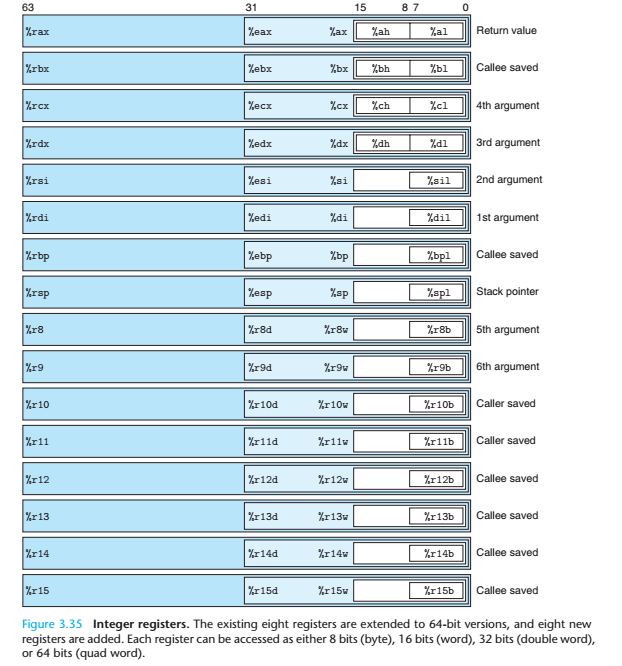

+++
title = "实现 Brainfuck x64 Compiler"
summary = ""
description = ""
categories = [""]
tags = []
date = 2024-08-31T18:00:00+09:00
draft = false

+++


接着来水一篇，介绍如何实现一个 Compiler，将 Brainfuck 代码编译成 x64 ELF 文件。关于解析文件的部分，之前的文章已经介绍了，这里不做赘述。我们直接来看如何编译


运行环境

- Linux 6.10.7-arch1-1 x86_64 unknown
- gcc (GCC) 14.2.1 20240805
- NASM version 2.16.03 compiled on May  4 2024


## 生成 x64 指令


可以参考上上篇文章，我们对于 Brainfuck 操作码的定义如下

```c
typedef enum {
    INCREMENT_PTR,
    DECREMENT_PTR,
    INCREMENT_VAL,
    DECREMENT_VAL,
    OUTPUT_VAL,
    INPUT_VAL,
    LOOP_BEGIN,
    LOOP_END
} OpcodeType;

typedef struct Opcode {
    OpcodeType type;
    size_t operand;
} Opcode __attribute__((aligned(8)));
```


按照实现 Python Transpiler 的思路，我们可以首先思考一下用到哪些寄存器，围绕这些寄存器会有哪些汇编指令


下面的 PDF 可以快速帮我们回顾 x64 汇编指令

- https://cs.brown.edu/courses/cs033/docs/guides/x64_cheatsheet.pdf

- https://www.felixcloutier.com/x86/


x64 各个寄存器的用途如下，其实只要我们不用到会被自动写入的那几个寄存器即可




我们这里假定使用

- `rsi` 用作 `stack[ptr]` 中的 `ptr`


第一步我们首先在栈上分配空间，然后清零

```asm
sub rsp, 0x0200		; 高地址向低地址增长，这里先给一个 512 bytes
mov rsi, rsp		; rsi 指向起始地址


; https://www.cs.uaf.edu/2017/fall/cs301/lecture/10_06_string_inst.html
mov rcx, 0x0200 	; 重复次数
xor al,  al			; 清零
mov rdi, rsp		; 起始地址
rep stosb			; 将 al 中的字节写入 [rdi] 中，重复 ecx 次 
```


对于汇编获取对应的十六进制，我们可以先写入文件，类似这样

```asm
; example.s
global _start

_start:
    sub rsp, 0x0200
    mov rsi, rsp

    mov rcx, 0x0200
    xor al,  al
    mov rdi, rsp
    rep stosb
```


然后执行 

```bash
nasm -f elf64 -l output.txt example.s
```


我们便可以得到 output.txt

```
     1                                  global _start
     2
     3                                  _start:
     4 00000000 4881EC00020000              sub rsp, 0x0200
     5 00000007 4889E6                      mov rsi, rsp
     6
     7 0000000A B900020000                  mov rcx, 0x0200
     8 0000000F 30C0                        xor al,  al
     9 00000011 4889E7                      mov rdi, rsp
    10 00000014 F3AA                        rep stosb
```


左边便是汇编指令的十六进制。将这段十六进制写入 ELF 中就可以初始化 Brainfuck 程序的内存空间


下面我们来看操作码的部分。遇到 `INCREMENT_PTR` / `DECREMENT_PTR`，视操作数的位数，我们有不同的情况。一般来说 Brainfuck 的指令的操作数都是 1，但是我们之前合并过连续的指令，所以操作数会变大


比如操作数在 255 以内

```
     4 00000000 4883C60F                    add rsi, 0x0F
     5 00000004 4883EE0F                    sub rsi, 0x0F
```


操作数大于 255

```
     4 00000000 4881C6FFFF0000              add rsi, 0xFFFF
     5 00000007 4881EEFFFF0000              sub rsi, 0xFFFF
```


可以看到操作数的大小会影响指令的，所以这里要判断一下，不要混了 `0x4883C6` 和 `0x4881C6`


对于 `    INCREMENT_VAL` / `DECREMENT_VAL` ，虽然我们之前合并过指令，但是这里的操作数不会大于 255 的。因为 Brainfuck 在栈上的变量都是 8bit 的，所以合法的 Brainfcuk 并不会重复`+` 或者 `-`  256 次，因为这本身就是溢出的。

```
     4 00000000 800600                      add byte [rsi], 0
     5 00000003 802E00                      sub byte [rsi], 0
```


`OUTPUT_VAL` 和 `INPUT_VAL` 需要利用 syscall 来调用 `write` 和 `read`。syscall 的编号可以在这个页面  https://x64.syscall.sh/ 进行查找


我们会用到如下的 3 个 syscall

|  NR  | SYSCALL NAME | references | RAX  |   ARG0 (rdi)    |   ARG1 (rsi)    |  ARG2 (rdx)  | ARG3 (r10) | ARG4 (r8) | ARG5 (r9) |
| :--: | :----------: | :--------: | :--: | :-------------: | :-------------: | :----------: | :--------: | :-------: | :-------: |
|  0   |     read     |  man/ cs/  |  0   | unsigned int fd |    char *buf    | size_t count |     -      |     -     |     -     |
|  1   |    write     |  man/ cs/  |  1   | unsigned int fd | const char *buf | size_t count |     -      |     -     |     -     |
|  60  |     exit     |  man/ cs/  |  3C  | int error_code  |        -        |      -       |     -      |     -     |     -     |


通过汇编调用 syscall 的示例

```asm
     1                                  global _start
     2
     3                                  _start:
     4                                      ; read
     5 00000000 BF00000000                  mov rdi, 0      ; stdin 的 fd 默认为 0
     6 00000005 BA01000000                  mov edx, 1      ; count
     7 0000000A B800000000                  mov rax, 0      ; 系统调用编号
     8 0000000F 0F05                        syscall
     9
    10                                      ; write
    11 00000011 BF01000000                  mov rdi, 1      ; stdout 的 fd 默认为 1
    12 00000016 BA01000000                  mov edx, 1      ; count
    13 0000001B B801000000                  mov rax, 1      ; 系统调用编号
    14 00000020 0F05                        syscall
    15
    16                                      ; exit
    17 00000022 4831FF                      xor rdi, rdi     ; exit code 0
    18 00000025 B83C000000                  mov rax, 0x3C
    19 0000002A 0F05                        syscall

```


最后是跳转指令相关的两个

```
     4 00000000 803E00                      cmp [rsi], byte 0   ; 比较值是否为 0
     5 00000003 0F84(FF000000)              jz 0xFF         ; 如果为 0 那么跳转
     6 00000009 E9(FF000000)                jmp 0xff        ; 无条件跳转
```


上面我们完成了所有 Brainfuck 代码到对应的 x64 的直接映射。但是如果想要成为一个可执行文件，那么还需要生成一个 ELF 的 Header


## 生成 ELF

ELF 是 Linux 系统上常见的可执行文件格式，它描述了可执行文件、目标代码、共享库等的二进制布局。一个ELF文件由以下三部分组成：

- ELF头(ELF header) - 描述文件的主要特性：类型，CPU架构，入口地址，现有部分的大小和偏移等等；
- 程序头表(Program header table) - 列举了所有有效的段(segments)和他们的属性。 程序头表需要加载器将文件中的节加载到虚拟内存段中；
- 节头表(Section header table) - 包含对节(sections)的描述。


关于 ELF 的详细信息可以参考此文 https://xinqiu.gitbooks.io/linux-inside-zh/content/Theory/linux-theory-2.html。对于二进制我们可以通过 `readelf -a <binary>` 命令来查看


在 C 中可以引入 `<elf.h>` 头文件，里面有 elf 相关数据结构的定义。一个 syscall read 的示例如下

```c
#include <stdio.h>
#include <stdint.h>
#include <elf.h>
#include <sys/stat.h>

void write_elf(uint8_t* code, size_t code_len, FILE* fd) {
    uint64_t entry = 0x400000 + sizeof(Elf64_Ehdr) + sizeof(Elf64_Phdr);

    Elf64_Ehdr ehdr = {
        .e_ident = {
            ELFMAG0,
            ELFMAG1,
            ELFMAG2,
            ELFMAG3,
            ELFCLASS64,
            ELFDATA2LSB,
            EV_CURRENT,
            ELFOSABI_SYSV,
        },
        .e_type = ET_EXEC,
        .e_machine = EM_X86_64,
        .e_version = EV_CURRENT,
        .e_entry = entry,
        .e_phoff = sizeof(Elf64_Ehdr),
        .e_ehsize = sizeof(Elf64_Ehdr),
        .e_phentsize = sizeof(Elf64_Phdr),
        .e_phnum = 1,
    };

    Elf64_Phdr phdr = {
        .p_type = PT_LOAD,
        .p_flags = PF_X | PF_R,
        .p_offset = sizeof(Elf64_Ehdr) + sizeof(Elf64_Phdr),
        .p_vaddr = entry,
        .p_filesz = code_len,
        .p_memsz = code_len,
        .p_align = 0,
    };

    fwrite(&ehdr, sizeof(ehdr), 1, fd);
    fwrite(&phdr, sizeof(phdr), 1, fd);
    fwrite(code, code_len, 1, fd);
}

int main() {
    uint8_t code[] = {
        // read syscall
        0xBF, 0x00, 0x00, 0x00, 0x00,	// mov rdi, 0
        0xBA, 0x01, 0x00, 0x00, 0x00,   // mov edx, 1
        // 0x48, 0xbe, 0x00, 0x00, 0x00, 0x00, 0x00, 0x00, 0x00, 0x00,  // TODO rsi
        0xB8, 0x00, 0x00, 0x00, 0x00,  	// mov rax, 0
        0x0F, 0x05,                    	// syscall

        // exit syscall
        0x48, 0x31, 0xFF,        		// xor rdi,
        0xB8, 0x3C, 0x00, 0x00, 0x00,   // mov rax, 0x3C
        0x0F, 0x05                   	// syscall
    };

    FILE* fd = fopen("test.out", "wb");
    if (fd) {
        write_elf(code, sizeof(code), fd);
        fchmod(fileno(fd), 0755);
        fclose(fd);
    } else {
        perror("fopen");
    }

    return 0;
}

```


将两步组合起来就可以，编写调试的时候建议 TDD，把每一条的指令转换正确，然后测试跳转。因为我们没有生成 debug symbol，用 lldb 调起来挺费劲的。完整的代码在 https://github.com/Hanaasagi/kaleido/blob/master/brainfuck/compiler.c
