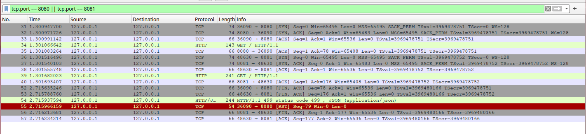
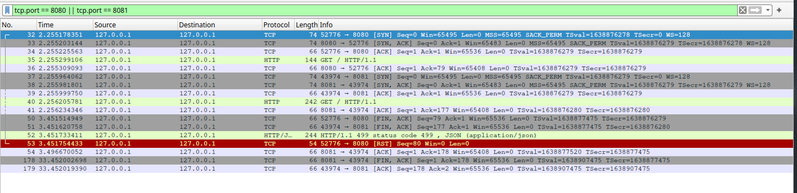
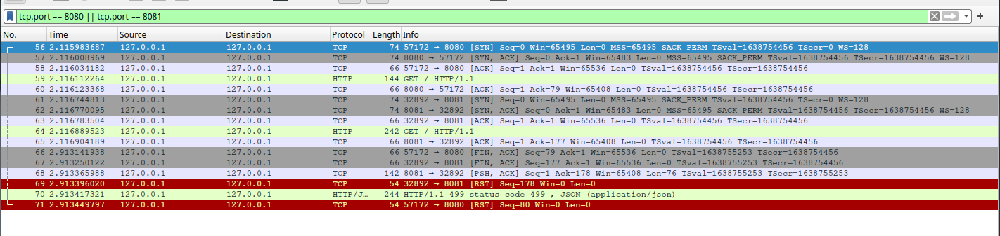

+++
title = "HTTP Status Code 499"
summary = ""
description = ""
categories = [""]
tags = []
date = 2024-09-12T17:10:00+09:00
draft = false

+++

本文是一个关于 HTTP Status 499 的实验

## 实验搭建

首先我们创建一个 HTTP Server，模拟我们的业务应用。为了方便，通过 `sleep` 来故意制造 slow response。代码如下，使用的是 Go 的 echo 框架

```golang
package main

import (
	"context"
	"fmt"
	"github.com/labstack/echo/v4"
	"github.com/labstack/echo/v4/middleware"
	"net/http"
	"time"
)

func TimeoutMiddleware(timeout time.Duration) echo.MiddlewareFunc {
	return func(next echo.HandlerFunc) echo.HandlerFunc {
		return func(c echo.Context) error {
			ctx, cancel := context.WithTimeout(c.Request().Context(), timeout)
			defer cancel()

			req := c.Request().WithContext(ctx)
			c.SetRequest(req)

			done := make(chan error, 1)
			go func() {
				done <- next(c)
			}()

			select {
			case err := <-done:
				return err
			case <-ctx.Done():
				fmt.Println("Request canceled or timed out")
				return ctx.Err()
			}
		}
	}
}

func main() {
	e := echo.New()

	e.Use(middleware.Logger())
	e.Use(TimeoutMiddleware(5 * time.Second))

	e.GET("/", func(c echo.Context) error {
		time.Sleep(10 * time.Second)
		return c.String(http.StatusOK, "Hello world!")
	})

	e.Logger.Fatal(e.Start(":8081"))
}

```

其次我们需要一个 Proxy，可以使用 Nginx，也可以继续使用 echo。代码如下

```golang
package main

import (
	"github.com/labstack/echo/v4"
	"github.com/labstack/echo/v4/middleware"
	"net/url"
)

func main() {
	e := echo.New()

	e.Use(middleware.Logger())
	upstreamURL, err := url.Parse("http://localhost:8081")
	if err != nil {
		e.Logger.Fatal(err)
	}

	target := &middleware.ProxyTarget{
		URL: upstreamURL,
	}
	e.Use(middleware.Proxy(middleware.NewRoundRobinBalancer([]*middleware.ProxyTarget{target})))

	e.Logger.Fatal(e.Start(":8080"))
}

```

等待 Proxy 和 Server 启动，我们通过 curl 来观察客户端断开时候的行为。下图上方为 server，下方为 proxy


可以发现在 curl 终止后，proxy 报出来了 499，而 server 则是 500 context canceled

## 网络报文分析

通过 wireshark 抓包来分析一下这个时序


通过这张图可以得知

- curl 源端口为 49636，经过 3 次握手（29 - 31）后，和监听 8080 端口的 Proxy 建立连接，发送 HTTP Request
- Proxy 使用 43804 端口向上游监听 8081 端口的 Server 建立连接 (34 - 36) 后，转发请求
- 编号 41 是一个 FIN, ACK 的报文，curl 想要主动关闭连接。在 Proxy 收到后，编号 42 是一个由 Proxy 向 Server 发送的 Fin
- Proxy 识别到客户端主动关闭，响应 499 status code 报文
- curl 进程已经退出（`close(socket_fd)`），收到 499 后，RST 被自动发送会给 Proxy。同理 Proxy 和 Server 之间的 500 报文和 RST

## 常见疑问

我们可以整理一下，然后得出下面的问题

### 为什么需要 Status Code 499

其中一个原因便是，我们需要记录每一次请求，比如请求日志。HTTP 是 Request 和 Response 的，当客户端主动关闭的时候，我们现在有可能没有一个 Response Header，所以并没有 status code。为了能够识别这种情况，自己定义一个错误码。这个最初好像是 Nginx 这么玩的，后来成为了不成文的标准

### 为什么 curl 在发送 FIN 之后，Proxy 要继续发送 HTTP Response 呢

这种行为**取决于具体实现**，可以发送也可以不发送。发送的原因是因为 TCP 是全双工的，双方都可以主动断开连接。在 TCP 协议中，当客户端发送 FIN 之后，代表客户端不会发送数据。并不意味着无法继续接收数据。但是我们在代码中往往都是通过 `close` 操作 socket 的，这个不仅会导致关闭连接，还是释放 fd。如果在这个 fd 上继续调用 `read` 那么会得到一个 `EBADF`。数据在这种情况是无法读出的。不过 `shutdown` 有额外的 flag，可以来精细控制

实现代码如下，替换掉实验中的 `curl`

```c
#include <stdio.h>
#include <string.h>
#include <sys/socket.h>
#include <arpa/inet.h>
#include <unistd.h>

#define SERVER_IP "127.0.0.1"
#define SERVER_PORT 8080

int main() {
    int sock;
    struct sockaddr_in server;
    char request[] = "GET / HTTP/1.1\r\nHost: localhost\r\nConnection: close\r\n\r\n";
    char response[4096];
    int bytes_received;

    sock = socket(AF_INET, SOCK_STREAM, 0);
    if (sock == -1) {
        perror("Socket creation failed");
        return 1;
    }

    server.sin_family = AF_INET;
    server.sin_port = htons(SERVER_PORT);
    server.sin_addr.s_addr = inet_addr(SERVER_IP);

    if (connect(sock, (struct sockaddr *)&server, sizeof(server)) < 0) {
        perror("Connection failed");
        close(sock);
        return 1;
    }

    printf("Connected to %s:%d\n", SERVER_IP, SERVER_PORT);

    if (send(sock, request, strlen(request), 0) < 0) {
        perror("Send failed");
        close(sock);
        return 1;
    }

    printf("HTTP GET request sent\n");

    if (shutdown(sock, SHUT_WR) < 0) {
        perror("Shutdown failed");
        close(sock);
        return 1;
    }

    printf("Shutdown SHUT_WR called\n\n");

    while ((bytes_received = recv(sock, response, sizeof(response) - 1, 0)) > 0) {
        response[bytes_received] = '\0';
        printf("Received: %s", response);
    }

    if (bytes_received < 0) {
        perror("Receive failed");
    } else if (bytes_received == 0) {
        printf("Connection closed by server\n");
    }

    close(sock);

    return 0;
}

```

运行结果，和网络报文如下

```
Connected to 127.0.0.1:8080
HTTP GET request sent
Shutdown SHUT_WR called
Received: HTTP/1.1 499 status code 499
Content-Type: application/json
Date: Thu, 12 Sep 2024 12:01:14 GMT
Content-Length: 57
Connection: close

{"message":"client closed connection: context canceled"}
Connection closed by server

```


在 `shutdown(sock, SHUT_WR)` 后，我们发送了 `FIN`。然后通过循环等待 server 的 499 返回，最后调用了 `close`。可以看到这次少了一条 RST 记录，多了一个完整的四次挥手。所以仅仅凭一个客户端的 Fin 我们无法判断对方是 `close` 还是 `shutdown(sock, SHUT_WR)`，这个 499 的响应还是发回去比较好。不过在实践中，大部分客户端是不会去接收这个 499 的，因此 499 都集中出现在 Proxy 端的日志中

### 为什么 Server 会 500

Server 的 500 来源于我们在 echo 通过中间件的方式捕获了 Context 的 Cancel 错误，然后直接抛出。对于其他语言来说，比如 Python 很有可能 Server 端的日志是一个 200。最常见的就是 Nginx 499 + uwsgi + Django 的部署方式。这是因为同步的处理方式，使得我们的线程陷入的是业务逻辑的处理当中，而在 10s 的超时后，我们的响应是可以成功的写入 socket buffer 的。这也就造成了 Proxy 499，Server 200 的现象。比如使用下面的 Go 代码替换 Server

```go
package main

import (
	"github.com/labstack/echo/v4"
	"github.com/labstack/echo/v4/middleware"
	"net/http"
	"time"
)

func main() {
	e := echo.New()
	e.Use(middleware.Logger())
	e.GET("/", func(c echo.Context) error {
		time.Sleep(10 * time.Second)
		return c.String(http.StatusOK, "Hello, World!")
	})
	e.Logger.Fatal(e.Start(":8081"))
}

```

这个 Server 会在 curl 已经被停止后，依旧苦苦等待 10s，然后输出 200 的响应，最终换来一个 RST。对于 GET 请求来说这可能就是浪费资源了，但是 POST 请求它是有副作用的。取消还是继续执行我们业务逻辑需要商榷，而且最好有一个幂等的考虑


### 不同语言/框架下抓包结果是一致的么

不一致，取决于如何处理 socket。我们拿 Node.js 再来举例子，使用下面的代码替换 Server

```javascript
import http from "node:http";
import * as timers from "node:timers";

const server = http.createServer((req, res) => {
  const timer = timers.setTimeout(() => {
    console.log("timer");
    res.statusCode = 200;
    res.setHeader("Content-Type", "text/plain");
    res.end("Hello World");
  }, 10_000);

  req.on("close", () => {
    console.log("Emit close event");
  });
  req.on("error", () => {
    console.log("Emit error event");
  });

  req.on("aborted", () => {
    console.log("Emit aborted event");
    console.log("req.socket.closed", req.socket.closed);
    console.log("res.socket.closed", res.socket.closed);
    timers.clearTimeout(timer);
    res.statusCode = 500;
    res.setHeader("Content-Type", "text/plain");
    res.end("client Aborted");
  });
});

server.listen(8081, "0.0.0.0", () => {
  console.log("server is running on :8081");
});
```

在 Node.js v22.8.0 下，这个程序的输出结果是

```
Emit aborted event
req.socket.closed true
res.socket.closed true
Emit error event
Emit close event
```

_有趣的是，你无法通过 Bun 1.1.26 和 deno 1.46.0 复现这个场景_

在接收到 `aborted` 事件的时候，从输出可以发现我们的 socket 读写端都已经关闭。即使我们可以继续通过 `res.end` 等 API 写入 HTTP Body，但这些都会被丢弃。我们可以看一下在 Node.js 服务下的抓包结果，这里出现了完整的四次挥手（实际为三次，因为 FIN+ACK 合并了一次），但是没有我们的 HTTP 500 的响应发送给 Proxy



也可以结合 `NODE_DEBUG=*` 开启 Node.js 本身的 `debug` 日志，能够发现

```
NET 550231: _final: not ended, call shutdown()
STREAM 550231: endReadableNT
NET 550231: afterShutdown destroyed=false
NET 550231: destroy
NET 550231: close
NET 550231: close handle
NET 550231: has server
NET 550231: SERVER _emitCloseIfDrained
NET 550231: SERVER handle? true   connections? 0
NET 550231: emit close
HTTP 550231: server socket close
```

### Proxy 和 Server 间为什么有的进行了正常挥手，有的则是 RST 呢

从上面可以发现，我们虽然使用同一个 Proxy，但是对于 Node.js 和 Go Server 抓包的结果是不一致的

- Node.js: 正常进行四次挥手
- Go echo Server: RST

这行为之间的差异来自于取决于如何处理 socket。我们可以通过一个 naive C server 来看一下

```c
#include <arpa/inet.h>
#include <netinet/in.h>
#include <stdio.h>
#include <stdlib.h>
#include <string.h>
#include <sys/socket.h>
#include <unistd.h>

#define PORT 8081
#define BUFFER_SIZE 2048

int main()
{
    int listen_fd, conn_fd;
    struct sockaddr_in address;
    int addrlen = sizeof(address);
    char buffer[BUFFER_SIZE] = { 0 };
    char* http_response = "HTTP/1.1 200 OK\r\n"
                          "Content-Type: text/plain\r\n"
                          "Content-Length: 12\r\n\r\n"
                          "Hello World";

    if ((listen_fd = socket(AF_INET, SOCK_STREAM, 0)) == 0) {
        perror("socket failed");
        exit(EXIT_FAILURE);
    }

    address.sin_family = AF_INET;
    address.sin_addr.s_addr = INADDR_ANY;
    address.sin_port = htons(PORT);

    if (bind(listen_fd, (struct sockaddr*)&address, sizeof(address)) < 0) {
        perror("bind failed");
        close(listen_fd);
        exit(EXIT_FAILURE);
    }

    if (listen(listen_fd, 3) < 0) {
        perror("listen failed");
        close(listen_fd);
        exit(EXIT_FAILURE);
    }

    printf("Server listening on port %d\n", PORT);

    if ((conn_fd = accept(listen_fd, (struct sockaddr*)&address, (socklen_t*)&addrlen)) < 0) {
        perror("accept failed");
        close(listen_fd);
        exit(EXIT_FAILURE);
    }

    printf("Client connected\n");

    ssize_t valread = read(conn_fd, buffer, BUFFER_SIZE);
    printf("Received data: %s\n", buffer);

    char tcp_buffer[BUFFER_SIZE];
    ssize_t size = recv(conn_fd, tcp_buffer, BUFFER_SIZE, MSG_PEEK);
    printf("Recv size: %ld\n", size);

    /* if (size == 0) {
        printf("Send resp body to client\n");
        send(conn_fd, http_response, strlen(http_response), 0);
    } */

    sleep(30);

    printf("Close socket\n");
    close(conn_fd);
    close(listen_fd);

    return 0;
}


```

#### 保留注释代码: 通过抓包可以发现四次挥手



注意观察时间，我们在

- 编号 54 报文是一个空的 ACK = 178 回复的是编号 51，Seq = 177 的 FIN 报文。代表 Server 端确认了 Proxy => Server 流向的关闭
- 30 秒之后，编号 178 报文是 Server 发送的 FIN + ACK。它的 ACK 同样为 178。代表 Server 想要关闭 Server => Proxy 流向数据，这个对应代码是 `close(conn_fd)`
- 编号 179 报文是 Proxy 对于 Server 的回复，表示确认关闭

#### 取消注释代码: 产生 RST



编号 68 是我们发送会去的响应。观察时间，在 30 秒后没有任何报文，这是因为在收到 RST 之后 socket 在协议栈被自动关闭。我们调用 `close(conn_fd)` 后只是释放了描述符

## 小结

如果遇到 499 可以看一下响应时间，如果过短那么需要看一下 Client 到 Proxy 的问题；如果过长，那么需要排查一下 Server 的超时问题
