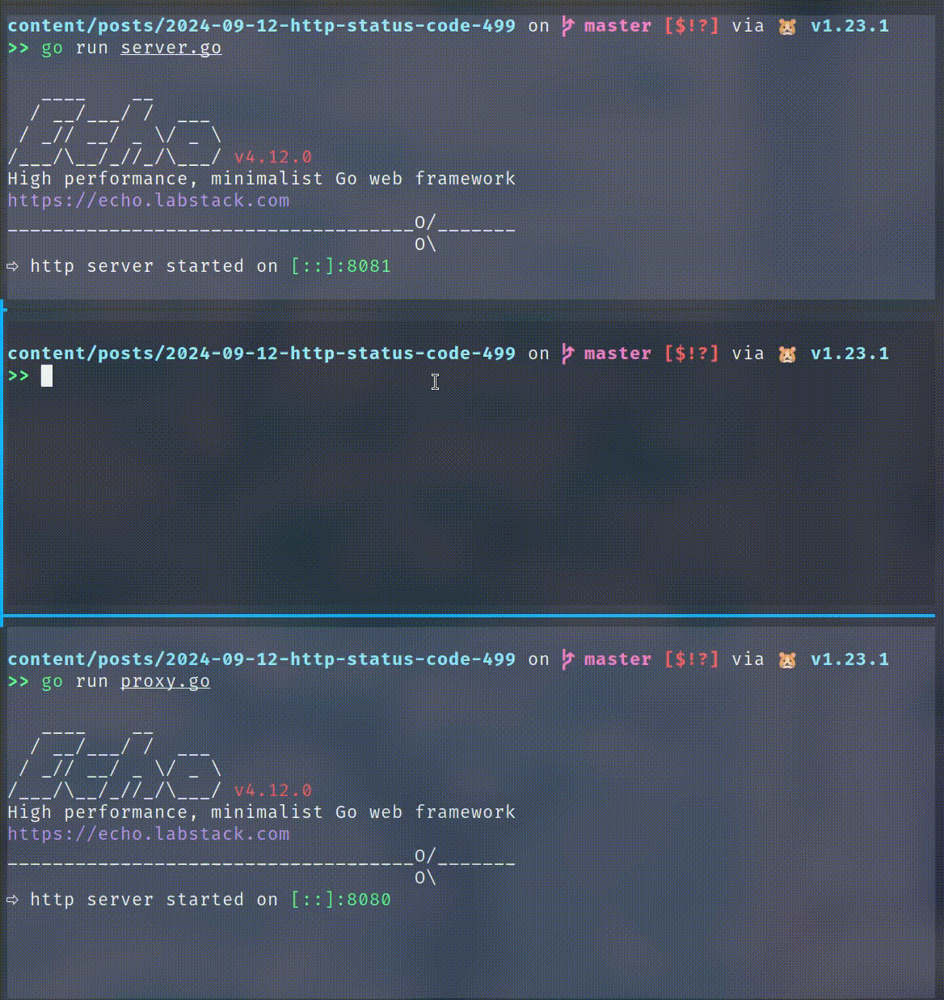
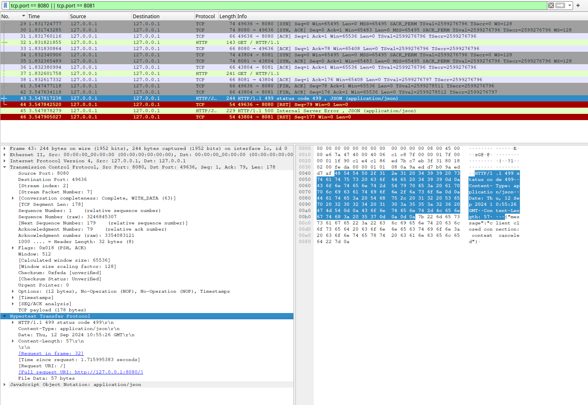
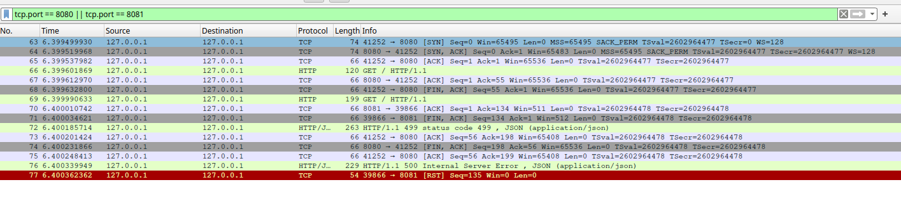

+++
title = "HTTP Status Code 499"
summary = ""
description = ""
categories = [""]
tags = []
date = 2024-09-12T17:10:00+09:00
draft = false

+++

## 实验

首先我们创建一个 HTTP Server，模拟我们的业务应用。为了方便，通过 `sleep` 来故意制造 slow response。代码如下，使用的是 Go 的 echo 框架

```golang
package main

import (
	"context"
	"fmt"
	"github.com/labstack/echo/v4"
	"github.com/labstack/echo/v4/middleware"
	"net/http"
	"time"
)

func TimeoutMiddleware(timeout time.Duration) echo.MiddlewareFunc {
	return func(next echo.HandlerFunc) echo.HandlerFunc {
		return func(c echo.Context) error {
			ctx, cancel := context.WithTimeout(c.Request().Context(), timeout)
			defer cancel()

			req := c.Request().WithContext(ctx)
			c.SetRequest(req)

			done := make(chan error, 1)
			go func() {
				done <- next(c)
			}()

			select {
			case err := <-done:
				return err
			case <-ctx.Done():
				fmt.Println("Request canceled or timed out")
				return ctx.Err()
			}
		}
	}
}

func main() {
	e := echo.New()

	e.Use(middleware.Logger())
	e.Use(TimeoutMiddleware(5 * time.Second))

	e.GET("/", func(c echo.Context) error {
		time.Sleep(10 * time.Second)
		return c.String(http.StatusOK, "Hello world!")
	})

	e.Logger.Fatal(e.Start(":8081"))
}

```

其次我们需要一个 Proxy，可以使用 Nginx，也可以继续使用 echo。代码如下

```golang
package main

import (
	"github.com/labstack/echo/v4"
	"github.com/labstack/echo/v4/middleware"
	"net/url"
)

func main() {
	e := echo.New()

	e.Use(middleware.Logger())
	upstreamURL, err := url.Parse("http://localhost:8081")
	if err != nil {
		e.Logger.Fatal(err)
	}

	target := &middleware.ProxyTarget{
		URL: upstreamURL,
	}
	e.Use(middleware.Proxy(middleware.NewRoundRobinBalancer([]*middleware.ProxyTarget{target})))

	e.Logger.Fatal(e.Start(":8080"))
}

```

等待 Proxy 和 Server 启动，我们通过 curl 来观察客户端断开时候的行为。下图上方为 server，下方为 proxy



可以发现在 curl 终止后，proxy 报出来了 499，而 server 则是 500 context canceled

## 网络报文分析

可以分析一下这个时序



通过这张图可以得知

- curl 源端口为 49636，经过 3 次握手（29 - 31）后，和监听 8080 端口的 Proxy 建立连接，发送 HTTP Request
- Proxy 使用 43804 端口向上游监听 8081 端口的 Server 建立连接 (34 - 36) 后，转发请求
- 编号 41 是一个 FIN, ACK 的报文，curl 想要主动关闭连接。在 Proxy 收到后，编号 42 是一个由 Proxy 向 Server 发送的 Fin
- Proxy 识别到客户端主动关闭，响应 499 status code 报文
- curl 进程已经退出，收到 499 后，RST 被自动发送会给 Proxy。同理 Proxy 和 Server 之间的 500 报文和 RST

我们可以整理一下，然后得出下面的问题

### 为什么需要 Status Code 499

其中一个原因便是，我们需要记录每一次请求，比如请求日志。HTTP 是 Request 和 Response 的，当客户端主动关闭的时候，我们现在有可能没有一个 Response Header，所以并没有 status code。为了能够识别这种情况，自己定义一个错误码。这个最初好像是 Nginx 这么玩的，后来成为了不成文的标准

### 为什么 curl 在发送 FIN 之后，Proxy 要继续发送 HTTP Response 呢

因为 TCP 是全双工的，双方都可以主动断开连接。在 TCP 协议中，当客户端发送 FIN 之后，代表客户端不会发送数据。并不意味着无法继续接收数据。但是我们在代码中往往都是通过 `close` 操作 socket 的，这个不仅会导致关闭连接，还是释放 fd。如果在这个 fd 上继续调用 `read` 那么会得到一个 `EBADF`。数据在这种情况是无法读出的。不过 `shutdown` 有额外的 flag，可以来精细控制

实现代码如下

```c
#include <stdio.h>
#include <string.h>
#include <sys/socket.h>
#include <arpa/inet.h>
#include <unistd.h>

#define SERVER_IP "127.0.0.1"
#define SERVER_PORT 8080

int main() {
    int sock;
    struct sockaddr_in server;
    char request[] = "GET / HTTP/1.1\r\nHost: localhost\r\nConnection: close\r\n\r\n";
    char response[4096];
    int bytes_received;

    sock = socket(AF_INET, SOCK_STREAM, 0);
    if (sock == -1) {
        perror("Socket creation failed");
        return 1;
    }

    server.sin_family = AF_INET;
    server.sin_port = htons(SERVER_PORT);
    server.sin_addr.s_addr = inet_addr(SERVER_IP);

    if (connect(sock, (struct sockaddr *)&server, sizeof(server)) < 0) {
        perror("Connection failed");
        close(sock);
        return 1;
    }

    printf("Connected to %s:%d\n", SERVER_IP, SERVER_PORT);

    if (send(sock, request, strlen(request), 0) < 0) {
        perror("Send failed");
        close(sock);
        return 1;
    }

    printf("HTTP GET request sent\n");

    if (shutdown(sock, SHUT_WR) < 0) {
        perror("Shutdown failed");
        close(sock);
        return 1;
    }

    printf("Shutdown SHUT_WR called\n\n");

    while ((bytes_received = recv(sock, response, sizeof(response) - 1, 0)) > 0) {
        response[bytes_received] = '\0';
        printf("Received: %s", response);
    }

    if (bytes_received < 0) {
        perror("Receive failed");
    } else if (bytes_received == 0) {
        printf("Connection closed by server\n");
    }

    close(sock);

    return 0;
}

```

运行结果，和网络报文如下

```
Connected to 127.0.0.1:8080
HTTP GET request sent
Shutdown SHUT_WR called
Received: HTTP/1.1 499 status code 499
Content-Type: application/json
Date: Thu, 12 Sep 2024 12:01:14 GMT
Content-Length: 57
Connection: close

{"message":"client closed connection: context canceled"}
Connection closed by server

```



在 `shutdown(sock, SHUT_WR` 后，我们发送了 `FIN`。然后通过循环等待 server 的 499 返回，最后调用了 `close`。可以看到这次少了一条 RST 记录，多了一个完整的四次挥手。所以仅仅凭一个客户端的 Fin 我们无法判断对方是 `close` 还是 `shutdown(sock, SHUT_WR)`，这个 499 的响应还是发回去比较好。不过在实践中，大部分客户端是不会去接收这个 499 的，因此 499 都在 Proxy 端的日志中

### 为什么 Server 会 500

Server 的 500 来源于我们在 echo 通过中间件的方式捕获了 Context 的 Cancel 错误，然后直接抛出。对于其他语言来说，比如 Python 很有可能 Server 端的日志是一个 200。最常见的就是 Nginx 499 + uwsgi + Django 的部署方式。这是因为同步的处理方式，使得我们的线程陷入的是业务逻辑的处理当中，而在 10s 的超时后，这个 socket 还可能依旧是只关闭了读取，而未关闭写入的情况。我们可以成功的将 Response 写入。这就造成了 Proxy 400，Server 200 的怪事。我们也可以通过 Go 的 echo 来模拟

```go
package main

import (
	"github.com/labstack/echo/v4"
	"github.com/labstack/echo/v4/middleware"
	"net/http"
	"time"
)

func main() {
	e := echo.New()
	e.Use(middleware.Logger())
	e.GET("/", func(c echo.Context) error {
		time.Sleep(10 * time.Second)
		return c.String(http.StatusOK, "Hello, World!")
	})
	e.Logger.Fatal(e.Start(":8081"))
}

```

这个 Server 会在 curl 已经被停止后，依旧苦苦等待 10s，然后输出 200 的响应。对于 GET 请求来说这可能就是浪费资源了，但是 POST 请求它是有副作用的。取消还是继续执行我们业务逻辑需要商榷，而且最好有一个幂等的考虑


