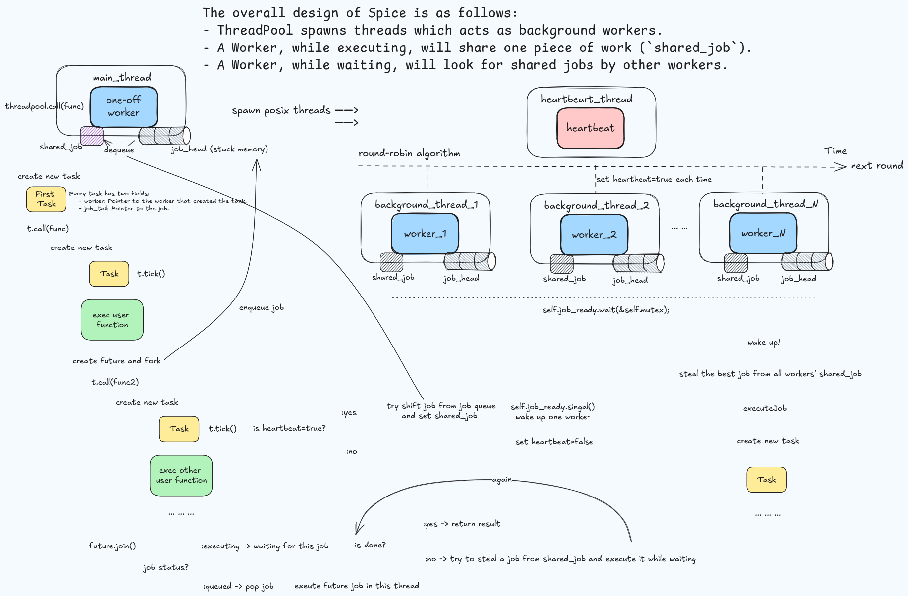

+++
title = "Spice 源码剖析"
summary = ""
description = ""
categories = ["source-code-reading"]
tags = ["scheduling", "concurrent", "zig", "parallelism", "heartbeat-scheduling"]
date = 2024-10-19T13:55:00+09:00
draft = false

+++


快要年底了，看些开源项目的代码沉淀一下。本篇文章是关于 Spice 的源码分析。

- 项目地址: https://github.com/judofyr/spice
- commit sha: `6d2d66529c0923da27c26347c9efa3eed75aa976`


快速掌握 Spice 可以从 https://github.com/judofyr/spice/blob/main/examples/zig-parallel-example/main.zig 这个 demo 开始


## 原理概述

总体上 Spice 的逻辑可以概括如下图




## 细节分析

项目代码只有 500 来行，核心 API 是 `Task.call()`、`Future.fork()`、`Future.join()`。我们下面直接来看一下核心的数据结构


### ThreadPool

```zig
pub const ThreadPool = struct {
    allocator: std.mem.Allocator,
    mutex: std.Thread.Mutex = .{},
    /// List of all workers.
    workers: std.ArrayListUnmanaged(*Worker) = .{},
    /// List of all background workers.
    background_threads: std.ArrayListUnmanaged(std.Thread) = .{},
    /// The background thread which beats.
    heartbeat_thread: ?std.Thread = null,
    /// A pool for the JobExecuteState, to minimize allocations.
    execute_state_pool: std.heap.MemoryPool(JobExecuteState),
    /// This is used to signal that more jobs are now ready.
    job_ready: std.Thread.Condition = .{},
    /// This is used to wait for the background workers to be available initially.
    workers_ready: std.Thread.Semaphore = .{},
    /// This is set to true once we're trying to stop.
    is_stopping: bool = false,

    /// A timer which we increment whenever we share a job.
    /// This is used to prioritize always picking the oldest job.
    time: usize = 0,

    heartbeat_interval: usize,
}
```


三个变量用于同步:

- `mutex`: 结构体级别的互斥锁，对于 Spice 自己而言相当于全局互斥了。大部分都依赖这个
- `job_ready`: 条件变量，用于通知有新的任务可用
- `workers_ready`: 信号量，用于等待后台工作线程的初始化


两类线程:

- `background_threads`: 一组工作线程，用于实际执行任务
- `heartbeat_thread`: 用于心跳的后台线程


这里使用  `ArrayListUnmanaged` 而不是`ArrayList` 的原因是因为 `ArrayListUnmanaged` 不会将 `Allocator` 存储在结构体本身中，而是需要将 `Allocator` 在每一个相关的方法中显式传入。因为我们在 `ThreadPool` 中已经存储了 `allocator`，那么对于内部嵌套的这些数据结构就可以使用这种 `Unmanaged` 的类型，算是 Zig 的一个小技巧


看一下核心方法

```zig
    /// Starts the thread pool. This should only be invoked once.
    pub fn start(self: *ThreadPool, config: ThreadPoolConfig) void {
        const actual_count = config.background_worker_count orelse (std.Thread.getCpuCount() catch @panic("getCpuCount error")) - 1;

        self.heartbeat_interval = config.heartbeat_interval;
        self.background_threads.ensureUnusedCapacity(self.allocator, actual_count) catch @panic("OOM");
        self.workers.ensureUnusedCapacity(self.allocator, actual_count) catch @panic("OOM");

        for (0..actual_count) |_| {
            const thread = std.Thread.spawn(.{}, backgroundWorker, .{self}) catch @panic("spawn error");
            self.background_threads.append(self.allocator, thread) catch @panic("OOM");
        }

        self.heartbeat_thread = std.Thread.spawn(.{}, heartbeatWorker, .{self}) catch @panic("spawn error");

        // Wait for all of them to be ready:
        for (0..actual_count) |_| {
            self.workers_ready.wait();
        }
    }

```


`start` 方法会

1. 根据配置来启动指定数量的 `background_threads`，线程执行的函数是 `backgroundWorker`
2. 启动 `heartbeat_thread`，线程执行的函数是 `heartbeatWorker`
3. 借助信号量 `workers_ready`，等待所有 worker 就绪


这里使用 `ensureUnusedCapacity` 也是一个非常常见的优化。通过一次扩容，避免之后 `append` 中产生多次扩容的情况


关于全局互斥锁的 `mutex`，作者有特别的解释:

> 如果你查看 Spice 的代码库，会发现每个线程池都有一个全局互斥锁，并且这个锁被频繁锁定。你可能会立即反应过来：“哦不，全局互斥锁太糟糕了”，并且你可能会试图替换它。
>
> 然而，除非你被阻塞，否则全局互斥锁并没有问题。只有在两个条件发生时你才会被阻塞：
>
> 1. 一个线程长时间持有锁。
> 2. 有多个线程同时尝试获取锁。
>
> 在 Spice 中，这两种情况都不会发生。心跳机制确保通常只有一个线程在执行心跳操作。此外，在持有锁期间不执行用户代码。我们只是在保护简单的内存读写操作，这些操作会以常量时间完成。


#### backgroundWorker()

```zig
    fn backgroundWorker(self: *ThreadPool) void {
        var w = Worker{ .pool = self };
        var first = true;

        self.mutex.lock();
        defer self.mutex.unlock();

        self.workers.append(self.allocator, &w) catch @panic("OOM");

        // We don't bother removing ourselves from the workers list of exit since
        // this only happens when the whole thread pool is destroyed anyway.

        while (true) {
            if (self.is_stopping) break;

            if (self._popReadyJob()) |job| {
                // Release the lock while executing the job.
                self.mutex.unlock();
                defer self.mutex.lock();

                w.executeJob(job);

                continue; // Go straight to another attempt of finding more work.
            }

            if (first) {
                // Register that we are ready.
                self.workers_ready.post();
                first = false;
            }

            self.job_ready.wait(&self.mutex);
        }
    }
```


每一个 `background_thread` 在启动的时候会创建一个 `Worker` 对象，追加到 `ThreadPool` 对象的 `wokers` 中。提升到 `ThreadPool`界别，可以使其对所有线程可见，相当于共享内存。


特别地，在第一次执行的时候会修改信号量 `wokers_ready` 。如果 `_popReadyJob()` 找到一个可以执行的任务，它会释放 `mutex`，然后执行任务。并且这里是用尽最大努力执行直到当前没有任务的策略。没有任务时，通过 `self.job_ready.wait(&self.mutex)`，线程会等待条件变量 `job_ready` ，直到有新任务到来。`mutex`在 `wait` 操作内会自动释放，当线程被唤醒时会重新获取


总结一下这个函数的临界区:

- 初始化时，线程将自己添加到 `workers` 列表中、结构体级别状态修改
- 从任务队列中获取任务 `self._popReadyJob`
- 条件锁被唤醒时


这是一个中规中矩的线程池的实现，我们再来看 `_popReadyJob`

```zig
    /// Finds a job that's ready to be executed.
    fn _popReadyJob(self: *ThreadPool) ?*Job {
        var best_worker: ?*Worker = null;

        for (self.workers.items) |other_worker| {
            if (other_worker.shared_job) |_| {
                if (best_worker) |best| {
                    if (other_worker.job_time < best.job_time) {
                        // Pick this one instead if it's older.
                        best_worker = other_worker;
                    }
                } else {
                    best_worker = other_worker;
                }
            }
        }

        if (best_worker) |worker| {
            defer worker.shared_job = null;
            return worker.shared_job;
        }

        return null;
    }

```


这里是一个 O(n) 的循环，通过比较 `job_time` 来选择一个最佳的 worker，然后取下他的 `shared_job`并返回。O(n) 并无问题，因为数量级是 CPU core 相等的，无需优化


#### heartbeatWorker()

```zig
    fn heartbeatWorker(self: *ThreadPool) void {
        // We try to make sure that each worker is being heartbeat at the
        // fixed interval by going through the workers-list one by one.
        var i: usize = 0;

        while (true) {
            var to_sleep: u64 = self.heartbeat_interval;

            {
                self.mutex.lock();
                defer self.mutex.unlock();

                if (self.is_stopping) break;

                const workers = self.workers.items;
                if (workers.len > 0) {
                    i %= workers.len;
                    workers[i].heartbeat.store(true, .monotonic);
                    i += 1;
                    to_sleep /= workers.len;
                }
            }

            std.time.sleep(to_sleep);
        }
    }

```


周期性心跳的实现，用的是 round robin 算法。`to_sleep` 是按 worker 的数量均摊的。`interval` 不变，worker 越多的情况下 `sleep` 时间会越少。这个线程的目的是定期将对应 `worker` 的 `heartbeat` 字段原子性置为 `true`。只有当这个字段为 `true` 的时候才会允许 worker 去设置 `shared_job` ，参考后面 `tick()` 和  `heartbeat()` 函数的实现。


核心思想是本地进行调度，并且频率较低，每 100 微秒左右，希望每个线程查看其本地工作队列，并将工作发送给不同的线程。低频率是消除总体开销的关键。如果我们每 100 微秒才执行一次调度，那么我们实际上可以花费 100 纳秒，但只引入 0.1% 的开销。


操作系统本身支持信号，但这些信号很难处理。用户代码会在任意点被暂停，并且很难安全地继续运行。因此，Spice 使用了一种协作式的方法：每当使用 `Task.call()` 时，会自动调用 `tick()` 。在没有发生心跳的情况下，这个函数必须非常高效。这毕竟是常见情况（因为心跳大约每 100 微秒才发生一次）。

```zig
    pub inline fn tick(self: *Task) void {
        if (self.worker.heartbeat.load(.monotonic)) {
            self.worker.pool.heartbeat(self.worker);
        }
    }
```


```zig
    fn heartbeat(self: *ThreadPool, worker: *Worker) void {
        @setCold(true);

        self.mutex.lock();
        defer self.mutex.unlock();

        if (worker.shared_job == null) {
            if (worker.job_head.shift()) |job| {
                // Allocate an execute state for it:
                const execute_state = self.execute_state_pool.create() catch @panic("OOM");
                execute_state.* = .{
                    .result = undefined,
                };
                job.setExecuteState(execute_state);

                worker.shared_job = job;
                worker.job_time = self.time;
                self.time += 1;

                self.job_ready.signal(); // wake up one thread
            }
        }

        worker.heartbeat.store(false, .monotonic);
    }

```


值得注意的是，这里使用了 `inline` 和 `@setCold(true)` 标记，用于分支编译优化。


#### call()

相当于入口函数，用于产生根任务

```zig
    pub fn call(self: *ThreadPool, comptime T: type, func: anytype, arg: anytype) T {
        // Create an one-off worker:

        var worker = Worker{ .pool = self };
        {
            self.mutex.lock();
            defer self.mutex.unlock();

            self.workers.append(self.allocator, &worker) catch @panic("OOM");
        }

        defer {
            self.mutex.lock();
            defer self.mutex.unlock();

            for (self.workers.items, 0..) |worker_ptr, idx| {
                if (worker_ptr == &worker) {
                    _ = self.workers.swapRemove(idx);
                    break;
                }
            }
        }

        var t = worker.begin();
        return t.call(T, func, arg);
    }

```


其会创建一个临时的 worker ，因为我们当前的线程在 spice 中也可以视为一种工作线程，所以需要对应的一个 worker。此函数会在根任务执行完毕后返回


### Worker / Task

background thread 是物理上的执行单元，worker 则是逻辑上的执行单元。而 Task 是用户任务  。三者间的关系是 1:1:N

```zig
pub const Worker = struct {
    pool: *ThreadPool,
    job_head: Job = Job.head(),

    /// A job (guaranteed to be in executing state) which other workers can pick up.
    shared_job: ?*Job = null,
    /// The time when the job was shared. Used for prioritizing which job to pick up.
    job_time: usize = 0,

    /// The heartbeat value. This is set to `true` to signal we should do a heartbeat action.
    heartbeat: std.atomic.Value(bool) = std.atomic.Value(bool).init(true),

    pub fn begin(self: *Worker) Task {
        std.debug.assert(self.job_head.isTail());

        return Task{
            .worker = self,
            .job_tail = &self.job_head,
        };
    }

    fn executeJob(self: *Worker, job: *Job) void {
        var t = self.begin();
        job.handler.?(&t, job);
    }
};


pub const Task = struct {
    worker: *Worker,
    job_tail: *Job,

    pub inline fn tick(self: *Task) void {
        if (self.worker.heartbeat.load(.monotonic)) {
            self.worker.pool.heartbeat(self.worker);
        }
    }

    pub inline fn call(self: *Task, comptime T: type, func: anytype, arg: anytype) T {
        return callWithContext(
            self.worker,
            self.job_tail,
            T,
            func,
            arg,
        );
    }
};

// The following function's signature is actually extremely critical. We take in all of
// the task state (worker, last_heartbeat, job_tail) as parameters. The reason for this
// is that Zig/LLVM is really good at passing parameters in registers, but struggles to
// do the same for "fields in structs". In addition, we then return the changed value
// of last_heartbeat and job_tail.
fn callWithContext(
    worker: *Worker,
    job_tail: *Job,
    comptime T: type,
    func: anytype,
    arg: anytype,
) T {
    var t = Task{
        .worker = worker,
        .job_tail = job_tail,
    };
    t.tick();
    return @call(.always_inline, func, .{
        &t,
        arg,
    });
}

```


每一个 worker 包含双向链表的头，每一个 Task 关联了创建这个 Task 的 worker 还有一个链表末尾的指针。job 是可以出队然后提升为 `shared_job` 的，这会导致此 job 对于其他的 worker 可见并且发生窃取。窃取者会创建一个新的 Task 关联上自己的 worker 还有这个 job，参考 `executeJob` 的实现


### Job

你可能会问为什么有了 `Task` 怎么又来一个 `Job`。我们的用户函数每调用一次 `call()`  的 API，便会产生一个 `Task`。但只有当我们使用 `fork` 的时候才会创建 `Job`，它代表一个需要被并发执行的任务

```zig
pub const JobState = enum {
    pending,
    queued,
    executing  ,
};

const max_result_words = 4;
const JobExecuteState = struct {
    done: std.Thread.ResetEvent = .{},
    result: ResultType,

    const ResultType = [max_result_words]u64;

    fn resultPtr(self: *JobExecuteState, comptime T: type) *T {
        if (@sizeOf(T) > @sizeOf(ResultType)) {
            @compileError("value is too big to be returned by background thread");
        }

        const bytes = std.mem.sliceAsBytes(&self.result);
        return std.mem.bytesAsValue(T, bytes);
    }
};


// This struct gets placed on the stack in _every_ frame so we're very cautious
// about the size of it. There's three possible states, but we don't use a union(enum)
// since this would actually increase the size.
//
// 1. pending: handler is null. a/b is undefined.
// 2. queued: handler is set. prev_or_null is `prev`, next_or_state is `next`.
// 3. executing: handler is set. prev_or_null is null, next_or_state is `*JobExecuteState`.

const Job = struct {
    handler: ?*const fn (t: *Task, job: *Job) void,
    prev_or_null: ?*anyopaque,
    next_or_state: ?*anyopaque,
}
```


`Job` 是一个双向链表的数据结构。提供了一些操作函数来操作：

- `head()`: 返回一个新的空 `Job`，用于表示队列的头
- `pending()`: 返回一个新的 `Job`，状态为 `pending`
- `state()`: 返回状态
- `isTail()`: 判断 `Job` 是否为队列的尾部（即没有下一个 `Job`）
- `getExecuteState()`: 获取 `Job` 的执行状态，前提是 `Job` 处于执行状态
- `setExecuteState()`: 设置 `Job` 的执行状态，前提是 `Job` 处于执行状态
- `push()` /`pop()` / `shift()`: 元素操作函数


和通常的实现不同，这个结构的实现是经过特殊优化的，用了两个透明指针和一个函数指针。第一点它的数据是存在 Stack 上的，第二点为了减小体积，通过字段的特殊值来实现了状态枚举。可以看一下 `state()` 函数的实现


```
    pub fn state(self: Job) JobState {
        if (self.handler == null) return .pending;
        if (self.prev_or_null != null) return .queued;
        return .executing;
    }
```

- **pending**: `handler` 为 `null`，表示 `Job` 尚未准备好执行。此时 `prev_or_null` 和 `next_or_state` 无意义
- **queued**: `handler` 已设置且 `prev_or_null` 不为 `null`，表示 `Job` 在队列中等待执行。`prev_or_null` 和 `next_or_state` 的类型为 `Job`
- **executing**: `handler` 已设置且 `prev_or_null` 为 `null`，表示 `Job` 当前正在执行。`next_or_state` 此时类型为`JobExecuteState`（后面会讲为啥）


另外一个优化是使用了 sentinel 节点来减少分支。在典型的双向链表中，追加操作通常是这样的：

```rust
pub fn append(list: *Self, new_node: *Node) void {
    if (list.last) |last| {
        // 插入到最后一个节点之后。
        list.insertAfter(last, new_node);
    } else {
        // 空链表。
        list.prepend(new_node);
    }
}
```

注意，这里有一个条件：如果链表是空的，我们需要进行特殊处理。然而，大多数时候链表当然不会是空的。为了消除这个条件判断，可以确保链表永远不会为空。定义了一个特殊节点，它总是代表链表的开始。尾指针将从一开始就指向这个头节点。这样，`push()` 和 `pop()` 操作就完全没有分支判断


### Future

执行结果的占位

```zig
pub fn Future(comptime Input: type, Output: type) type {
    return struct {
        const Self = @This();

        job: Job,
        input: Input,

        pub inline fn init() Self {
            return Self{ .job = Job.pending(), .input = undefined };
        }

        /// Schedules a piece of work to be executed by another thread.
        /// After this has been called you MUST call `join` or `tryJoin`.
        pub inline fn fork(
            self: *Self,
            task: *Task,
            comptime func: fn (task: *Task, input: Input) Output,
            input: Input,
        ) void {
            const handler = struct {
                fn handler(t: *Task, job: *Job) void {
                    const fut: *Self = @fieldParentPtr("job", job);
                    const exec_state = job.getExecuteState();
                    const value = t.call(Output, func, fut.input);
                    exec_state.resultPtr(Output).* = value;
                    exec_state.done.set();
                }
            }.handler;
            self.input = input;
            self.job.push(&task.job_tail, handler);
        }

        /// Waits for the result of `fork`.
        /// This is only safe to call if `fork` was _actually_ called.
        /// Use `tryJoin` if you conditionally called it.
        pub inline fn join(
            self: *Self,
            task: *Task,
        ) ?Output {
            std.debug.assert(self.job.state() != .pending);
            return self.tryJoin(task);
        }

        /// Waits for the result of `fork`.
        /// This function is safe to call even if you didn't call `fork` at all.
        pub inline fn tryJoin(
            self: *Self,
            task: *Task,
        ) ?Output {
            switch (self.job.state()) {
                .pending => return null,
                .queued => {
                    self.job.pop(&task.job_tail);
                    return null;
                },
                .executing => return self.joinExecuting(task),
            }
        }

        fn joinExecuting(self: *Self, task: *Task) ?Output {
            @setCold(true);

            const w = task.worker;
            const pool = w.pool;
            const exec_state = self.job.getExecuteState();

            if (pool.waitForJob(w, &self.job)) {
                const result = exec_state.resultPtr(Output).*;
                pool.destroyExecuteState(exec_state);
                return result;
            }

            return null;
        }
    };
}

```


`future` 在初始化之后，其对应的 `job` 的状态默认为 `pending`。当调用 `future.fork()` 的时候，`job` 的状态会变成 `queued` 。在调用 `future.join()` 的时候，对于当前不同的状态有不同的行为

- `pending` : 理论上当前不会是这个状态
- `queued`: 直接取出任务，返回 `null` 。通常这里会让当前的线程去执行
- `executing` : 如果任务被置为 shared_job 但是没有被取走，那么返回当前任务。如果任务被取走且未执行结束，那么利用此线程执行尝试执行更多任务，直到指定任务结束


这里的这个优化非常有意思，一个 fork/join 程序由一组并行执行的代码块组成，当它们完成时，join 操作完成:

```javascript
join(
  fork { code1 }
  fork { code2 }
  fork { code3 }
)
```

在 Spice 中，这表示为：

```javascript
job1 = fork { code1 }  // 放入队列
job2 = fork { code2 }  // 放入队列

code3 // 立即运行

if (job2.isExecuting()) {
  // 该任务已被另一个线程拾取，等待它完成。
  job2.wait()
} else {
  code2
}

if (job1.isExecuting()) {
  // 该任务已被另一个线程拾取，等待它完成。
  job1.wait()
} else {
  code1
}
```

注意，`code1` 和 `code2` 在函数内部被重复了。这实际上是好事。大多数情况下，任务不会被其他线程拾取。在这种情况下，我们的程序会很好地转化为顺序版本（尽管是反向顺序），只带有一些非常可预测的分支。这对代码优化器友好（例如，它可以内联函数调用），对 CPU 也很友好


根据这个我们也可以理解为什么 Spice 使用了 `execute_state_pool` 这种小对象的内存池，因为这个 `state` 不是必须的，排队但是没有执行的 `job` 就不需要这个，通过直接复用指针字段 `next_or_state`。这样可以避免使用 `Union` 导致的栈上额外内存占用。简言之，将不常用的字段移动到二级结构中，然后通过指针引用


但是这里直接复用 `next_or_state` 不会有问题么？因为 `next_or_state` 是透明指针，且这里会在不同时刻指向两种类型 `Job`, `JobExecuteState`，我们在代码中也没有使用比如 tagged pointer 这类技巧标注类型。其实是没有问题的，这个和逻辑流程有关系。当我们的 job 是 `execute` 的状态时，他的 `next_or_state` 一定是没有意义的。因为 job 来源于 `shared_job`，而 `shared_job` 来自于其他 worker 的 `shift()` 操作，它本身是尾部的


最后我们来看一下 `waitForJob`


```zig
    /// Waits for (a shared) job to be completed.
    /// This returns `false` if it turns out the job was not actually started.
    fn waitForJob(self: *ThreadPool, worker: *Worker, job: *Job) bool {
        const exec_state = job.getExecuteState();

        {
            self.mutex.lock();
            defer self.mutex.unlock();

            if (worker.shared_job == job) {
                // This is the job we attempted to share with someone else, but before someone picked it up.
                worker.shared_job = null;
                self.execute_state_pool.destroy(exec_state);
                return false;
            }

            // Help out by picking up more work if it's available.
            while (!exec_state.done.isSet()) {
                if (self._popReadyJob()) |other_job| {
                    self.mutex.unlock();
                    defer self.mutex.lock();

                    worker.executeJob(other_job);
                } else {
                    break;
                }
            }
        }

        exec_state.done.wait();
        return true;
    }

```


如果这个 job 已经被推到 `shared_job` 上了，那么取下。否则在等待 job 执行完成的期间尝试执行其他任务，逻辑和 `backgroundWorker` 类似


## Reference

- https://www.andrew.cmu.edu/user/mrainey/heartbeat/heartbeat.html
- https://github.com/judofyr/spice/blob/main/README.md
- https://github.com/judofyr/spice/tree/main/examples/zig-parallel-example
