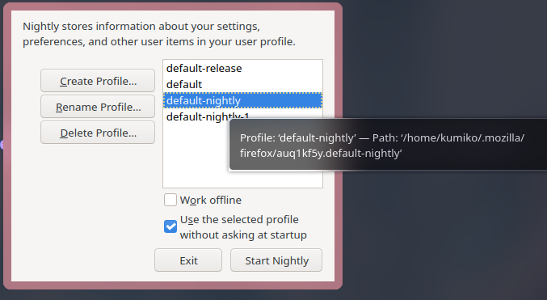

+++
title = "Firefox 恢复 Profile 数据"
summary = ""
description = ""
categories = []
tags = []
date = 2024-10-20T01:00:00+09:00
draft = false

+++

在最近的一次更新后，我的 Firefox-Nightly 又阵亡了。之前遇到过但是没有记录恢复方法，所以现在记录一下。

Nightly 在一定机率下更新后会新创建一个 Profile，导致启动一个全新的没有经过任何配置的浏览器。

而且在浏览器的设置页面是没法手动去修改 Profile 的 :(

解决方法:

1. 找到最近的一个 Profile。目录位置是 `~/.mozilla/firefox`，可以通过看修改时间或者目录大小来寻找
2. 关闭当前的 Nightly，然后执行 `firefox-nightly --ProfileManager` 重新勾选正确的即可
