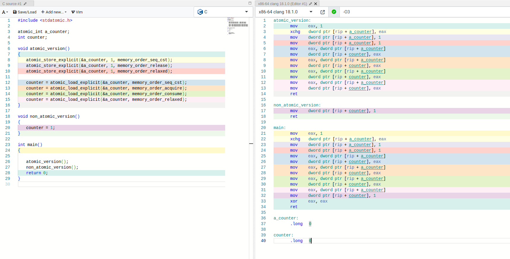
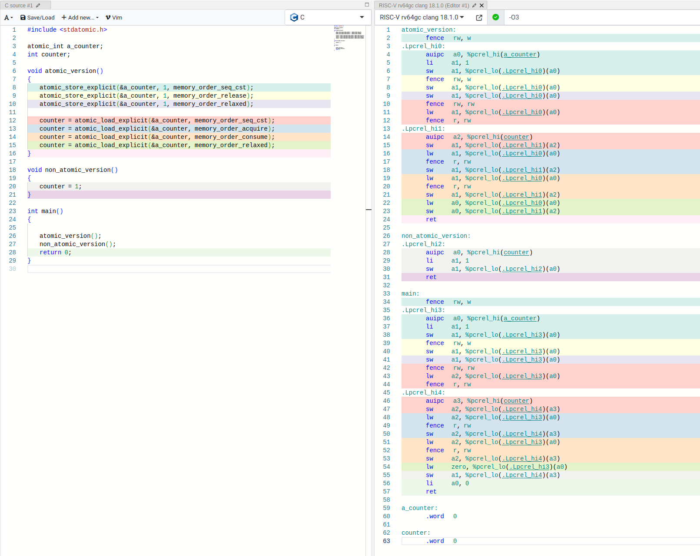

+++
title = "libxev 源码阅读 - MPSC Queue"
summary = ""
description = ""
categories = ["source-code-reading"]
tags = ["zig", "queue", "concurrent", "lock free", "atomic", "libxev"]
date = 2024-11-03T05:32:07+09:00
draft = false

+++


- 项目地址:  https://github.com/mitchellh/libxev

- commit-sha: `b8d1d93e5c899b27abbaa7df23b496c3e6a178c7`

  

本文先来看一下代码中使用到的 MPSC Queue，代码非常短，只提供了基本的 `push()` 和 `pop()`，但是有助于我们复习 Atomic 和 Memory Order


## 源码


原项目代码中的 `head` 和 `tail` 的定义和通常队列的定义是相反的，这里是经过修改之后的代码。下文均使用此代码进行分析说明

```zig
pub fn Intrusive(comptime T: type) type {
    return struct {
        const Self = @This();

        /// Head is the front of the queue and tail is the back of the queue.
        head: *T,
        tail: *T,
        stub: T,

        /// Initialize the queue. This requires a stable pointer to itself.
        /// This must be called before the queue is used concurrently.
        pub fn init(self: *Self) void {
            self.head = &self.stub;
            self.tail = &self.stub;
            self.stub.next = null;
        }

        /// Push an item onto the queue. This can be called by any number
        /// of producers.
        pub fn push(self: *Self, v: *T) void {
            @atomicStore(?*T, &v.next, null, .unordered);
            const prev = @atomicRmw(*T, &self.tail, .Xchg, v, .acq_rel);  // [1]
            // [2]
            @atomicStore(?*T, &prev.next, v, .release);  // [3]
        }

        /// Pop the first in element from the queue. This must be called
        /// by only a single consumer at any given time.
        pub fn pop(self: *Self) ?*T {
            var head = @atomicLoad(*T, &self.head, .unordered);
            var next_ = @atomicLoad(?*T, &head.next, .acquire);
            if (head == &self.stub) {
                const next = next_ orelse return null;
                @atomicStore(*T, &self.head, next, .unordered);
                head = next;
                next_ = @atomicLoad(?*T, &head.next, .acquire);
            }

            if (next_) |next| {
                @atomicStore(*T, &self.head, next, .release);
                head.next = null;
                return head;
            }

            const tail = @atomicLoad(*T, &self.tail, .unordered);
            if (head != tail) return null;
            self.push(&self.stub);

            next_ = @atomicLoad(?*T, &head.next, .acquire);
            if (next_) |next| {
                @atomicStore(*T, &self.head, next, .unordered);
                head.next = null;
                return head;
            }

            return null;
        }
    };
}
```


libxev 里面的这段代码是从 C++ 翻译过来的，原作者是 Dmitry Vyukov，这个 Queue 的实现也被称为 Vyukov Queue 或 DV-MPSC。值得注意，这个 Queue **不是 lock-free 的 Queue**。对于 Zig 不熟悉的可以看原始的 C++ 版本。代码在 https://www.1024cores.net/home/lock-free-algorithms/queues/intrusive-mpsc-node-based-queue


根据原作者 Dmitry Vyukov 在 Blog 中所写的，这个实现的优缺点如下:

> 优点：
>
> + 侵入式(Intrusive)。不需要额外的内部节点。
>
> + wait-free 且快速的生产者。在多生产者的非分布式队列中，最多只需要一个 XCHG 操作。
>
> + 极快的消费者。在快速路径上，它无需任何原子操作，每批节点只需要执行一次 XCHG 操作来获取“最后一个元素”。
>
> + 不需要反转节点顺序。因此，弹出操作始终是 O(1) 时间复杂度。
>
> + 没有 ABA 问题。
>
> + 不需要 PDR（生产者/消费者注册）。可以直接使用该算法，无需线程注册/注销、定期活动、延迟垃圾回收等操作。
>
> 缺点：
>
> - `push()` 函数对消费者是阻塞的。即，如果生产者在标记为 [2] 的地方阻塞，消费者也会被阻塞。幸运的是，窗口非常小。生产者必须恰好在 [2] 处阻塞。实际上，这个缺点只是在与完全无锁算法相比时存在。在大多数情况下，它仍然比基于锁的算法要好得多。


作者还有一个 non-intrusive 的版本在 https://www.1024cores.net/home/lock-free-algorithms/queues/non-intrusive-mpsc-node-based-queue


##  Intrusive and Non-Intrusive

Intrusive 和 Non-Intrusive 这个两个术语，用过 Boost 的人应该不会陌生。Boost 的文档中也有相关介绍，参考 https://www.boost.org/doc/libs/1_81_0/doc/html/intrusive/intrusive_vs_nontrusive.html


这里简单总结一下，比如在我们一个链表的容器类型下:

1. Intrusive 不需要定义一个 `Node` 类型，直接使用的 `T` 类型，但是需要我们的 `T` 具有 `next` ，这就是所谓的"侵入性"。不过这样的好处就是用户拥有最大的权限去控制内存分配和布局。但每一个元素的生命周期需要用户管理
2. Non-Intrusive 内部有一个额外的 `Node` 类型，类似我们通常的链表定义


|                                    | **侵入式容器(Intrusive)** | **非侵入式容器(Non-intrusive)** |
| ---------------------------------- | ------------------------- | ------------------------------- |
| **内存管理**                       | 外部管理                  | 内部通过分配器管理              |
| **插入/删除时间**                  | 更快                      | 较慢                            |
| **内存局部性**                     | 更好                      | 较差                            |
| **同一个对象可插入多个容器**       | 是                        | 否                              |
| **异常保证**                       | 更好                      | 较差                            |
| **从值计算迭代器的时间复杂度**     | 常数时间                  | 非常数时间                      |
| **插入/删除的可预测性**            | 高                        | 低                              |
| **内存使用**                       | 最小                      | 大于最小                        |
| **按值插入对象并保留多态行为**     | 是                        | 否（切片）                      |
| **需要修改插入值的定义**           | 是                        | 否                              |
| **容器可复制**                     | 否                        | 是                              |
| **插入对象的生命周期管理者**       | 用户（更复杂）            | 容器（较简单）                  |
| **无需使用容器即可破坏容器不变量** | 更容易                    | 较难（仅对指针容器）            |
| **线程安全分析**                   | 更复杂                    | 较简单                          |


## 为什么 Zig 版本用了 Atomic


对比 C++ 版本和 Zig 版本，我们可以发现 Zig 的代码多了很多 `@atomicLoad` 和 `@atomicStore` 的原子操作；而 C++ 版本则仅仅使用了一处  `XCHG`。这个是因为 Zig 的实现是有做跨平台处理的，我们可以对比下面两个平台对于不同 memory order 下生成的汇编 (Clang 18.1.0)


### x86-64 下的汇编




### RISC-V 64bit 下的汇编




可以看到在 x86-64 下对于 `@atomicStore` 的 `relaxed` 和 `release` 内存顺序在生成的汇编上是没有任何区别的，并且都为 1 条汇编指令，且与通常的非原子变量的赋值 `counter = 1` 是相同的。但是在 `seq_cst` 上是生成的 `XCHG` 汇编，这个会隐式的有一个 `LOCK`。在这个 Queue 的实现上我们不需要 `seq_cst`，所以说在 x86-64 平台我们可以不是用 `@atomicStore`


而对于在 `@atomicLoad` ，这几种内存序在生成的汇编上是没有任何区别的。所以我们同样也可以使用基本的赋值去编写代码


关于原子操作的生成汇编，这里有一篇 C++ 11 的文章可以参考 https://www.cl.cam.ac.uk/~pes20/cpp/cpp0xmappings.html


## 细节分析

队列的数据结构如下图，基于单向链表，保存头尾指针


```

flowchart TD
    subgraph Node_State
        direction LR
        D[stub] -->|.next| E[a]
        E[a] -->|.next| F[b]
        F[b] -->|.next| G[c]
        G[c] -->|.next| H[d]
        H[d] -->|.next| L[null]
    end

    subgraph Queue_State
        direction TB
        A[Queue] -->|.head| C[stub]
        A -->|.tail| B[d]
    end

```


下面对核心函数 `push()` 和 `pop()` 进行分析


### `push()`

函数的代码一共三行


```zig
@atomicStore(?*T, &v.next, null, .unordered);
```

将 `v.next` 设置为 `null`。这里使用了 `unordered`，因为 `v` 是新入队的节点，它此时还没有被链接到队列中，因此不需要和其他线程进行同步或顺序保证


```zig
const prev = @atomicRmw(*T, &self.tail, .Xchg, v, .acq_rel);
```


通过 `@atomicRmw` 操作，将 `v` 和 `self.tail` 进行原子交换。这里使用了 `.acq_rel`，因为这是一个读-修改-写操作，（RMW）操作，需要同时满足 acquire 和 release 语义：

- 确保当前线程在读取 `self.tail` 的值之前，之前的读操作不会被重排，从而确保在读-改-写操作之前的所有更改对当前线程可见。

- 确保当前线程在写入 `self.tail` 之后，后续的写操作不会被重排至此操作之前。这样 `self.tail` 被更新，其他线程在读取该值时可以看到当前线程在此更新之前所做的所有更改


参考 https://en.cppreference.com/w/cpp/atomic/memory_order

> - `memory_order_acq_rel`
>
> A read-modify-write operation with this memory order is both an ***acquire** operation* and a ***release** operation*. No memory reads or writes in the current thread can be reordered before the ***load***, nor after the ***store***. All writes in other threads that release the same atomic variable are visible before the modification and the modification is visible in other threads that ***acquire*** the same atomic variable.


```
@atomicStore(?*T, &prev.next, v, .release);
```


将 `prev.next` 设置为 `v`。这里使用 `release` 是为了确保在 `prev.next` 被设置之前，所有当前线程与该入队元素相关的修改（例如将 `v.next` 设置为 `null`）已经完成。并且可以确保 `prev.next` 修改后被其他线程可见


> - `memory_order_release`
>
> A ***store*** operation with this memory order performs the ***release** operation*: no reads or writes in the current thread can be reordered after this  ***store***. All writes in the current thread are visible in other threads  that ***acquire*** the same atomic variable (see [Release-Acquire ordering](https://en.cppreference.com/w/cpp/atomic/memory_order#Release-Acquire_ordering) below) and writes that carry a dependency into the atomic variable  become visible in other threads that ***consume*** the same atomic (see [Release-Consume ordering](https://en.cppreference.com/w/cpp/atomic/memory_order#Release-Consume_ordering) below).


### `pop()`


```zig
var head = @atomicLoad(*T, &self.head, .unordered);
```

MPSC 的场景下，消费者只有一个。而 `push()` 操作并没有对 `head` 进行过任何修改，所以这里可以安全的使用 `unordered` 来读取 `self.head`。


```zig
var next_ = @atomicLoad(?*T, &head.next, .acquire);
if (head == &self.stub) {
    const next = next_ orelse return null;
    @atomicStore(*T, &self.head, next, .unordered);
    head = next;
    next_ = @atomicLoad(?*T, &head.next, .acquire);
}

```


1. 当队列为初始状态时，`head == &self.stub` 且 `next_ == null` ，会直接在 if block 的第一行返回
2. 当队列存在元素且第一次 pop 的时候，`head == &self.stub` 且 `next_` 指向当前队首的元素。此时会触发 `self.head` 向后移动一个元素。因为只有消费者线程修改 `self.head`，所以这里可以 `unordered` 。之后重新对变量 `head` 和 `next_` 进行赋值修正。


这里对于`.next`  的读取都是用的 `.acquire` 是照应 `push()` 函数的第三行的 `.release`。因为它们可能读写相同的数据


经过这个 `if` 后我们队列的状态如下图所示

```

flowchart TD
    subgraph Node_State
        direction LR
        D[stub] -->|.next| E[a]
        E[a] -->|.next| F[b]
        F[b] -->|.next| G[c]
        G[c] -->|.next| H[d]
        H[d] -->|.next| L[null]
    end

    subgraph Queue_State
        direction TB
        A[Queue] -->|.head| C[a]
        A -->|.tail| B[d]
    end
    
    subgraph Variable
        direction TB
        M[head] --> J[a]
        N[next_] --> K[b]
    end

```


在下一个 `if` 分支判断 `next_` 是否为 `null`

```zig
if (next_) |next| {
    @atomicStore(*T, &self.head, next, .release);
    head.next = null;
    return head;
}

```

如果当前 `head` 存在后继元素，那么向后移动，并返回 `head`。如下图


```

flowchart TD
    subgraph Node_State
        direction LR
        D[stub] -->|.next| E[a]
        E[a] -->|.next| M[null]
        F[b] -->|.next| G[c]
        G[c] -->|.next| H[d]
        H[d] -->|.next| L[null]
    end

    subgraph Queue_State
        direction TB
        A[Queue] -->|.head| C[b]
        A -->|.tail| B[d]
    end


```


如果 `next_` 为 `null`，那么说明我们的 `head` 已经指向了队列的尾部，如下图

```

flowchart TD
    subgraph Node_State
        direction LR
        H[d] -->|.next| L[null]
    end

    subgraph Queue_State
        direction TB
        A[Queue] -->|.head| C[d]
        A -->|.tail| B[d]
    end


```


在最后一部分代码中，我们处理了这种情况

```zig
const tail = @atomicLoad(*T, &self.tail, .unordered);
if (head != tail) return null;  // [4]
self.push(&self.stub);

next_ = @atomicLoad(?*T, &head.next, .acquire);
if (next_) |next| {
    @atomicStore(*T, &self.head, next, .unordered);
    head.next = null;
    return head;
}

return null;

```

如果当前 `head` 不存在后继元素，那么通常来说 `head` 一定是等于 `tail` 的，双方都会指向队列最后一个元素。但是为啥这里的 [4] 有一行 `if (head != tail) return null;` 呢？这个会在下一节分析


我们来看通常情况，如果队列仅仅剩下一个元素，`head` 等于 `tail`。此时  `head` 已经指向最后一个元素，那么重新入队一个 `stub` 进行补位，更改 `head` 的指向后返回


经过 `push(&self.stub)`

```

flowchart TD
    subgraph Node_State
        direction LR
        H[d] -->|.next| L[stub]
        L[stub] -->|.next| M[null]
    end

    subgraph Queue_State
        direction TB
        A[Queue] -->|.head| C[d]
        A -->|.tail| B[stub]
    end


```


在 `if` block 中我们向后移动 `self.head`


```

flowchart TD
    subgraph Node_State
        direction LR
        L[stub] -->|.next| M[null]
    end

    subgraph Queue_State
        direction TB
        A[Queue] -->|.head| C[stub]
        A -->|.tail| B[stub]
    end


```


回归初始初始状态。值得注意的是，即使在经过 `self.push(&self.stub)` 之后，也是存在机率使 `head.next` 再次读取为 `null` 的。这个情况的原因和 [4] 处的成因类似，参考下一节


### 低机率的 blocking

这里展开说一下 [4] 处 `if (head != tail) return null;` 的判断。在 `Instrusive.init` 调用之后，数据结构的状态如下

```

flowchart TD
    subgraph Node_State
        direction LR
        D[stub] -->|.next| E[null]
    end

    subgraph Queue_State
        direction TB
        A[Queue] -->|.head| B[stub]
        A -->|.tail| C[stub]
    end

```


一个生产者线程执行 `push(a)` 后

```

flowchart TD
    subgraph Node_State
        direction LR
        D[stub] -->|.next| E[a]
        E[a] -->|.next| F[null]
    end
    
    subgraph Queue_State
        direction TB
        A[Queue] -->|.head| B[stub]
        A -->|.tail| C[a]
    end

```


现在，一个生产者开始执行 `push(b)`，完成了 #1 但在 #3 之前停止。该生产者在 #2 处恰好停止（比如被抢占等），使得队列进入如下状态：


```

flowchart TD
    subgraph Node_State
        direction LR
        D[stub] -->|.next| E[a]
        E[a] -->|.next| F[null]
       	G[b] -->|.next| F[null]
    end
    
    subgraph Queue_State
        direction TB
        A[Queue] -->|.head| B[stub]
        A -->|.tail| C[b]
    end

```


**当前队列处于不一致状态：`tail` 指向 b，但从 `head` 开始，b 是不可达的！**


假设在这种情况下进行 `pop()`，那么首先满足 `head == &self.stub` 且 `next_ != null`，`head` 会向后移动一元素，指向 `a`。此时 `head` 所指向的 `a` 的 `next` 是 `null`，但是 `head` 却不等于 `tail`，这个时候就算执行 `self.push(&self.stub)` 也没有意义，因为当前就是不一致的状态了。所以这里才会有那一行 `if (tail != head) return null; `。此时在消费者的视角看来队列就像空的一样


接下来后续的 `push` 调用会向队列中添加更多不可达的节点。如果调用 `push(c)`，队列会变成这样(假设 `push(b)` 的线程还在被阻塞)：

```

flowchart TD
    subgraph Node_State
        direction LR
        D[stub] -->|.next| E[a]
        E[a] -->|.next| F[null]
       	G[b] -->|.next| H[c]
       	H[c] -->|.next| F[null]
    end
    
    subgraph Queue_State
        direction TB
        A[Queue] -->|.head| B[stub]
        A -->|.tail| C[c]
    end

```


我们在这种情况下 `pop()` 依旧会返回 `null`，消费者线程相当于被阻塞了


那么如何恢复呢？需要`push(b)` 的线程被恢复，队列的指针状态重新被连接起来，消费者才会继续消费。但是在实际的情况下，[2] 处的时间间隔可能极小，我们会在有限的指令周期内恢复


## Reference

- [Intrusive MPSC node-based queue](https://www.1024cores.net/home/lock-free-algorithms/queues/intrusive-mpsc-node-based-queue)
- [Non-intrusive MPSC node-based queue](https://www.1024cores.net/home/lock-free-algorithms/queues/non-intrusive-mpsc-node-based-queue)
- [Ode to a Vyukov Queue](https://int08h.com/post/ode-to-a-vyukov-queue/)
- [Intrusive and non-intrusive containers](https://www.boost.org/doc/libs/1_81_0/doc/html/intrusive/intrusive_vs_nontrusive.html)
- [C11 Atomic Acquire/Release and x86_64 lack of load/store coherence?](https://stackoverflow.com/questions/60138501/c11-atomic-acquire-release-and-x86-64-lack-of-load-store-coherence)

- [C/C++11 mappings to processors](https://www.cl.cam.ac.uk/~pes20/cpp/cpp0xmappings.html)
