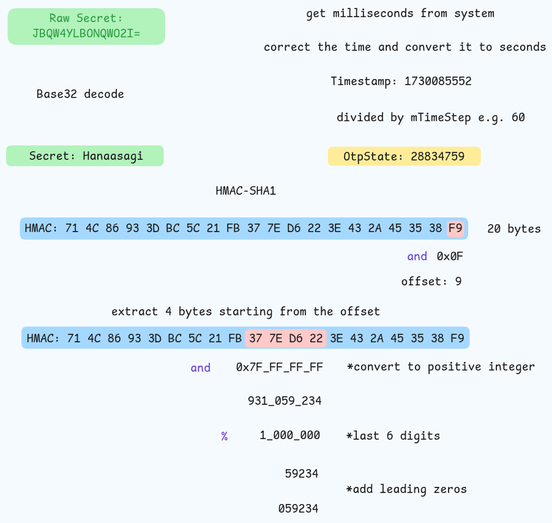
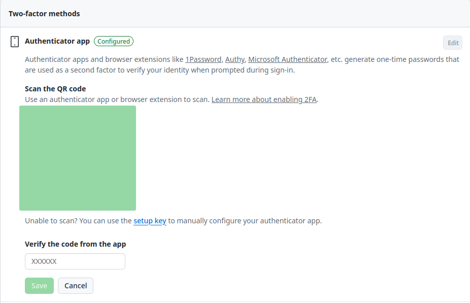
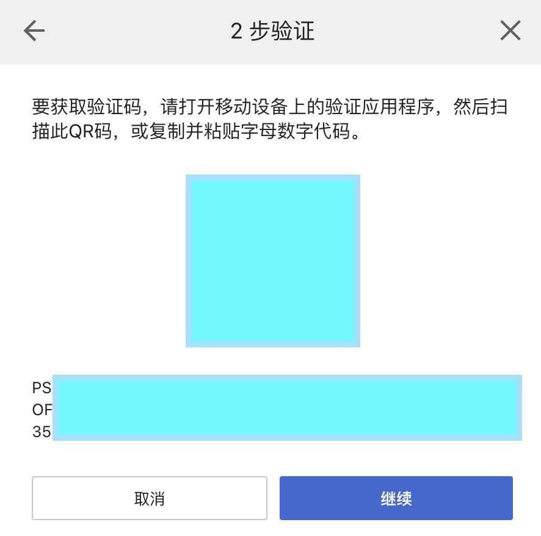

+++
title = "2FA and OTP"
summary = ""
description = ""
categories = [""]
tags = ["OTP", "TOTP", "HOTP", "2FA", "Authentication"]
date = 2024-11-09T23:07:22+09:00
draft = false

+++


## One-Time Password


简称 OTP，它有两个 RFC 可以参考:

- https://datatracker.ietf.org/doc/html/rfc4226
- https://datatracker.ietf.org/doc/html/rfc6238


其中 RFC 6238 是基于 RFC 4226 的，使用时间作为状态变数进行计算。

找了一个开源的项目 Google Authenticator for Android 来看一下 OTP 的实现，这个项目现在是 Archive 的状态，不过没有大碍。

- 项目地址: https://github.com/google/google-authenticator-android
- commit sha: 6f65e99fcbc9bbefdc3317c008345db595052a2b


### 流程图

TOTP 的生成步骤如下图所示。对于 HTOP 的话把 `OtpState` 的生成方式换一下即可，比如自增计数器




### 细节分析


 Google Authenticator for Android 中的 OTP 相关的实现和 RFC 6238 中给出的示例 Java 代码逻辑基本一致。OTP 的相关实现在 `OtpProvider` 这个类中。首先来看入口方法 `getCurrentCode`

https://github.com/google/google-authenticator-android/blob/6f65e99fcbc9bbefdc3317c008345db595052a2b/java/com/google/android/apps/authenticator/otp/OtpProvider.java#L76-L100

```java
  private String getCurrentCode(AccountIndex account, byte[] challenge) throws OtpSourceException {
    // Account is required.
    if (account == null) {
      throw new OtpSourceException("No account");
    }


    OtpType type = mAccountDb.getType(account);
    String secret = getSecret(account);


    long otpState = 0;


    if (type == OtpType.TOTP) {
      // For time-based OTP, the state is derived from clock.
      otpState =
          mTotpCounter.getValueAtTime(Utilities.millisToSeconds(mTotpClock.nowMillis()));
    } else if (type == OtpType.HOTP){
      // For counter-based OTP, the state is obtained by incrementing stored counter.
      mAccountDb.incrementCounter(account);
      Integer counter = mAccountDb.getCounter(account);
      otpState = counter.longValue();
    }


    String result = computePin(secret, otpState, challenge);
    return result;
  }
```


获取 `account` 的 OTP 类型和 `secret`。对于 TOTP，它使用当前时间计算状态；对于 HOTP，它使用 `account` 维度的递增计数器。两者计算之后的值抽象为一个状态 `optState` 参与之后的算法计算。我们来看一下 TOTP 的实现


#### 处理时间

因为 TOTP 依赖在生成和校验的时候依赖设备时间一致性， 所以`mTotpClock.nowMillis()` 获取的是修正之后的时间，尽可能减少偏差值

https://github.com/google/google-authenticator-android/blob/6f65e99fcbc9bbefdc3317c008345db595052a2b/java/com/google/android/apps/authenticator/otp/TotpClock.java#L55-L72

```java
  @Override
  public long nowMillis() {
    return mSystemWallClock.nowMillis() + getTimeCorrectionMinutes() * Utilities.MINUTE_IN_MILLIS;
  }
  
  /**
   * Gets the currently used time correction value.
   * 
   * @return number of minutes by which this device is behind the correct time.
   */
  public int getTimeCorrectionMinutes() {
    synchronized (mLock) {
      if (mCachedCorrectionMinutes == null) {
        mCachedCorrectionMinutes = mPreferences.getInt(PREFERENCE_KEY_OFFSET_MINUTES, 0); 
      }
      return mCachedCorrectionMinutes;
    }
  }
```


时间修正值是通过网络获取的 https://github.com/google/google-authenticator-android/blob/6f65e99fcbc9bbefdc3317c008345db595052a2b/java/com/google/android/apps/authenticator/timesync/SyncNowController.java#L208-L232


在获取到毫秒精度的时间后，将其转换为秒。然后除以 `mTimeStep`，这样可以保证在一定的时间区间内，OTP 生成的结果是一致的

https://github.com/google/google-authenticator-android/blob/6f65e99fcbc9bbefdc3317c008345db595052a2b/java/com/google/android/apps/authenticator/otp/TotpCounter.java#L97C1-L128C4

```java
  /**
   * Gets the value of this counter at the specified time.
   * 
   * @param time time instant (seconds since UNIX epoch) for which to obtain the value.
   * 
   * @return value of the counter at the {@code time}.
   */
  public long getValueAtTime(long time) {
    assertValidTime(time);
    
    // According to the RFC:
    // T = (Current Unix time - T0) / X, where the default floor function is used. 
    //   T  - counter value,
    //   T0 - start time.
    //   X  - time step.
    
    // It's important to use a floor function instead of simple integer division. For example,
    // assuming a time step of 3:
    // Time since start time: -6 -5 -4 -3 -2 -1  0  1  2  3  4  5  6
    // Correct value:         -2 -2 -2 -1 -1 -1  0  0  0  1  1  1  2
    // Simple division / 3:   -2 -1 -1 -1  0  0  0  0  0  1  1  1  2
    //
    // To avoid using Math.floor which requires imprecise floating-point arithmetic, we
    // we compute the value using integer division, but using a different equation for
    // negative and non-negative time since start time.
    long timeSinceStartTime = time - mStartTime;
    if (timeSinceStartTime >= 0) {
      return timeSinceStartTime / mTimeStep;
    } else {
      return (timeSinceStartTime - (mTimeStep - 1)) / mTimeStep;
    }
  }
```


如果 `timeSinceStartTime` 为负，这意味着指定的时间在起始时间之前。为了确保向下取整，使用 `(timeSinceStartTime - (mTimeStep - 1))` 来实现一个效果类似于 `Math.floor` 的效果。这样做可以确保在负时间区间也能够正确地得到计数器值，避免因直接整除而导致的错误


#### 生成 OTP

核心的计算并生成实际的 OTP 的逻辑在 `computePin` 方法中

https://github.com/google/google-authenticator-android/blob/6f65e99fcbc9bbefdc3317c008345db595052a2b/java/com/google/android/apps/authenticator/otp/OtpProvider.java#L112-L137

```java
  /**
   * Computes the one-time PIN given the secret key.
   *
   * @param secret the secret key
   * @param otpState current token state (counter or time-interval)
   * @param challenge optional challenge bytes to include when computing passcode.
   * @return the PIN
   */
  private String computePin(String secret, long otpState, byte[] challenge)
      throws OtpSourceException {
    if (secret == null || secret.length() == 0) {
      throw new OtpSourceException("Null or empty secret");
    }


    try {
      Signer signer = AccountDb.getSigningOracle(secret);  // [1]
      PasscodeGenerator pcg = new PasscodeGenerator(signer,  // [2]
        (challenge == null) ? PIN_LENGTH : REFLECTIVE_PIN_LENGTH);


      return (challenge == null) ?
             pcg.generateResponseCode(otpState) :
             pcg.generateResponseCode(otpState, challenge);
    } catch (GeneralSecurityException e) {
      throw new OtpSourceException("Crypto failure", e);
    }
  }
```


[1] 处获取 singer 对象

https://github.com/google/google-authenticator-android/blob/6f65e99fcbc9bbefdc3317c008345db595052a2b/java/com/google/android/apps/authenticator/otp/AccountDb.java#L446-L467

```java
  public static Signer getSigningOracle(String secret) {
    try {
      byte[] keyBytes = decodeKey(secret);
      final Mac mac = Mac.getInstance("HMACSHA1");
      mac.init(new SecretKeySpec(keyBytes, ""));


      // Create a signer object out of the standard Java MAC implementation.
      return new Signer() {
        @Override
        public byte[] sign(byte[] data) {
          return mac.doFinal(data);
        }
      };
    } catch (DecodingException
        | NoSuchAlgorithmException
        | InvalidKeyException
        | IllegalArgumentException error) {
      Log.e(LOCAL_TAG, error.getMessage());
    }


    return null;
  }


  private static byte[] decodeKey(String secret) throws DecodingException {
    return Base32String.decode(secret);
  }
```


1. 将 BASE 32 编码的密钥解码为字节数组。

2. 使用 HMAC-SHA1 算法和解码后的密钥初始化 `Mac` 对象。

3. 返回一个 `Signer` 对象，该对象可以用于签名任意数据，生成的签名是通过 HMAC-SHA1 算法生成的。


再来看 [2] 处的代码

https://github.com/google/google-authenticator-android/blob/6f65e99fcbc9bbefdc3317c008345db595052a2b/java/com/google/android/apps/authenticator/otp/PasscodeGenerator.java#L147-L163

```java
  /**
   * Powers of 10 to shorten the pin to the desired number of digits. This
   * prevents invalid OTP generation when Math.pow() is implemented incorrectly
   * (e.g. when 10^6 != 1000000), and matches the reference implementation in
   * RFC 6238. Must be kept in sync with {@link #MAX_PASSCODE_LENGTH}.
   */
  private static final int[] DIGITS_POWER =
      {1, 10, 100, 1000, 10000, 100000, 1000000, 10000000, 100000000, 1000000000};java
  
  /**
   * @param state 8-byte integer value representing internal OTP state.
   * @param challenge Optional challenge as array of bytes.
   * @return A decimal response code
   * @throws GeneralSecurityException If a JCE exception occur
   */
  public String generateResponseCode(long state, byte[] challenge)
      throws GeneralSecurityException {
    if (challenge == null) {
      return generateResponseCode(state);
    } else {
      // Allocate space for combination and store.
      byte[] value =
          ByteBuffer.allocate(8 + challenge.length)
              .putLong(state) // Write out OTP state
              .put(challenge, 0, challenge.length) // Concatenate with challenge.
              .array();
      return generateResponseCode(value);
    }
  }
  
  /**
   * @param challenge An arbitrary byte array used as a challenge
   * @return A decimal response code
   * @throws GeneralSecurityException If a JCE exception occur
   */
  public String generateResponseCode(byte[] challenge)
      throws GeneralSecurityException {
    byte[] hash = signer.sign(challenge);


    // Dynamically truncate the hash
    // OffsetBits are the low order bits of the last byte of the hash
    int offset = hash[hash.length - 1] & 0xF;
    // Grab a positive integer value starting at the given offset.
    int truncatedHash = hashToInt(hash, offset) & 0x7FFFFFFF;
    int pinValue = truncatedHash % DIGITS_POWER[codeLength];
    return padOutput(pinValue);
  }


  private String padOutput(int value) {
    String result = Integer.toString(value);
    for (int i = result.length(); i < codeLength; i++) {
      result = "0" + result;
    }
    return result;
  }

  /**
   * Grabs a positive integer value from the input array starting at
   * the given offset.
   * @param bytes the array of bytes
   * @param start the index into the array to start grabbing bytes
   * @return the integer constructed from the four bytes in the array
   */
  private int hashToInt(byte[] bytes, int start) {
    DataInput input = new DataInputStream(
        new ByteArrayInputStream(bytes, start, bytes.length - start));
    int val;
    try {
      val = input.readInt();
    } catch (IOException e) {
      throw new IllegalStateException(e);
    }
    return val;
  }
```


这里通过 HMAC-SHA1 计算得到 hash 后，取此 hash 最后一个字节的低 4 位作为一个起始偏移量，然后读取一个 4 字节的整数。通过和 `0x7FFFFFFF` 进行与运算得到正整数。比如我们需要生成 6 字符长度的 OTP 码，那么对 `1000000` 进行模运算，得到一个小于 6 位的整数 `pinValue`。在 `padOutput` 方法中对这个整数转换成字符串然后补前缀 0


#### 服务端验证

服务端获取到提交的 token 后，根据当前服务端的时间，使用相同的算法也生成一个 `OtpState`。因为时间同步的问题，通常会基于这个 `OtpState` 生成一个数组，比如 `[OtpState - 1, OtpState, OtpState + 1]`。在这个数组上，使用相同的算法生成 N 个 token。如果这个其中存在和用户提交的 token 相等的，那么认证通过


TOTP 的问题在于，因为双方使用的时间区间来进行生成。所以在这个时间区间内生成的 TOTP 都是有效的。如果需要一次性校验，那么服务端可以通过记录最近一次的时间区间，然后拒绝掉之后相同区间提交。


###  等价 Python 实现

下面是一个 Python 的实现

```python
import sys
import hmac
import hashlib
import base64
import time
import struct

import unittest
from unittest.mock import patch


class TOTPGenerator:
    """
    TOTP Generator
    """

    def __init__(self, secret, interval=60):
        self.secret = secret
        self.interval = interval
        self.key_bytes = self.decode_key(secret)

    def decode_key(self, secret):
        return base64.b32decode(secret, casefold=True)

    def hmac_sha1(self, message):
        return hmac.new(self.key_bytes, message, hashlib.sha1).digest()

    def dynamic_truncation(self, hmac_result):
        offset = hmac_result[-1] & 0x0F
        truncated_hash = (
            struct.unpack(">I", hmac_result[offset : offset + 4])[0] & 0x7FFFFFFF
        )
        return truncated_hash

    def get_state(self):
        return int(time.time()) // self.interval

    def generate(self):
        state = self.get_state()

        hmac_result = self.hmac_sha1(struct.pack(">Q", state))

        truncated_hash = self.dynamic_truncation(hmac_result)

        pin_value = truncated_hash % (1_000_000)
        return self.pad_output(pin_value)

    def pad_output(self, value):
        result = str(value)
        return result.zfill(6)


class TestTOTPGenerator(unittest.TestCase):
    def setUp(self):
        self.secret = "7777777777777777"

    @patch.object(TOTPGenerator, "get_state", return_value=0)
    def test_generate_first_case(self, mock_get_state):
        _ = mock_get_state
        generator = TOTPGenerator(self.secret)
        result = generator.generate()
        self.assertEqual(result, "724477")

    @patch.object(TOTPGenerator, "get_state", return_value=123456789123456789)
    def test_generate_second_case(self, mock_get_state):
        _ = mock_get_state
        generator = TOTPGenerator(self.secret)
        result = generator.generate()
        self.assertEqual(result, "815107")


if __name__ == "__main__":
    if len(sys.argv) > 1 and sys.argv[1] == "--test":
        sys.argv.pop(1)
        unittest.main()

    secret = "JBQW4YLBONQWO2I="
    totp_generator = TOTPGenerator(secret)
    totp = totp_generator.generate()
    print("Current TOTP:", totp)
```


## Two-Factor Authentication


简称 2FA，现在普极度已经很高了，比如短信验证码，动态令牌等，这里不再展开。具体可以参考这个文章  https://brainstation.io/cybersecurity/two-factor-auth


### 2FA 流程设计


#### GitHub

以 GitHub 为例

1. GitHub 生成二维码
2. 用户使用第三方客户端，比如 Authy，扫描这个二维码
3. 用户使用第三方客户端中生成 TOTP Code，在表单中提交，进行初次验证
4. GitHub 对 TOTP Code 进行校验，确认双方生成规则一致





我们来看一下 GitHub 的这个二维码包含了哪些数据

```
otpauth://totp/GitHub:Hanaasagi?secret=TOPSECRET&issuer=GitHub
```


这个比较简单，仅包含了 `secret` 和 `issuer`。我们可以看一下 Google Authenticator 的 URI 格式，参考 https://github.com/google/google-authenticator/wiki/Key-Uri-Format

```
otpauth://TYPE/LABEL?PARAMETERS
```

其中 `TYPE` 表示 OTP 的类型（支持 "totp" 和 "hotp"），`LABEL` 包含账户信息（例如服务提供商名称和用户邮箱），`PARAMETERS` 包含密钥和相关参数。

核心参数包括：
1. **Secret**：这是必填项，是一个使用 Base32 编码的密钥。
2. **Issuer**：推荐填写的服务提供商名称，帮助标识该账户所属的服务。
3. **Algorithm**：可选项，指定加密算法（默认 SHA1，可选 SHA256 和 SHA512）。
4. **Digits**：可选项，指定 OTP 长度（默认为 6 位数字）。
5. **Counter**：如果类型是 "hotp"，则需要提供初始计数值。
6. **Period**：如果类型是 "totp"，则可选地设置 OTP 的有效期（默认 30 秒）。


对于 Secret 的存储，可以参考互联网密钥存储的方法


#### Sony

我们再来看一下 Sony 的交互流程




Sony 同时提供了二维码和一个字符串。这个二维码扫描出来的格式是

```
otpauth://totp/Sony:USEREMAIL?secret=TOPTSECRET&issuer=Sony
```

字符串就是这里面的 `secret` 字段。这里的交互是考虑到了一些人使用的客户端是 PC 端的，所以直接显示了 `secret`。


为了防止 OTP 生成设备遗失，当我们扫描后，Sony 会提供 6 组 token 要求你备份下来。每一个都是一次性的 token，在恢复帐号的时候需要同时提供任意两组


下面是一个 System Design 的视频，可以参考

```md

```


## Reference

- https://www.ietf.org/rfc/rfc4226.txt
- https://www.ietf.org/rfc/rfc6238.txt
- https://blog.unclezs.com/pages/85e727/#hotp%E5%8E%9F%E7%90%86
- https://www.researchgate.net/publication/373573136_A_Complete_One-Time_Passwords_OTP_Solution_Using_Microservices_A_Theoretical_and_Practical_Approach
