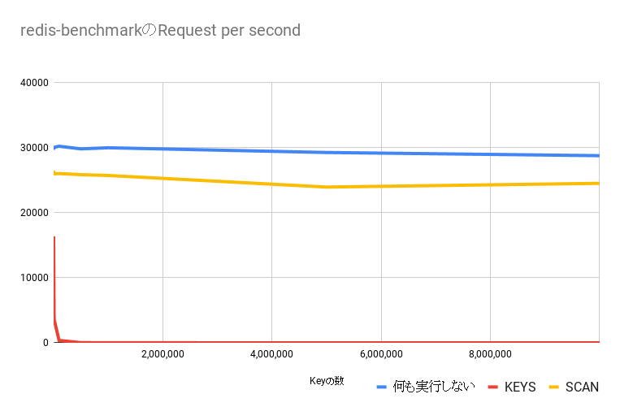

+++
title = "Redis 中的 KEYS 命令"
summary = ""
description = ""
categories = ["redis", "database", "performance"]
tags = ["keys-command", "redis-internals"]
date = 2024-12-15T09:23:29+09:00
draft = false

+++


## KeysCommand

我们来看一下 `KEYS` 命令的代码，版本为 Redis 7.2.6

```c
// https://github.com/redis/redis/blob/ae6a2aa95cd094b032e7a69b8b59f64dd1ed085f/src/db.c#L785
void keysCommand(client *c) {
    dictIterator *di;
    dictEntry *de;
    sds pattern = c->argv[1]->ptr;
    int plen = sdslen(pattern), allkeys;
    unsigned long numkeys = 0;
    void *replylen = addReplyDeferredLen(c);


    di = dictGetSafeIterator(c->db->dict);
    allkeys = (pattern[0] == '*' && plen == 1);
    robj keyobj;
    while((de = dictNext(di)) != NULL) {
        sds key = dictGetKey(de);


        if (allkeys || stringmatchlen(pattern,plen,key,sdslen(key),0)) {
            initStaticStringObject(keyobj, key);
            if (!keyIsExpired(c->db, &keyobj)) {
                addReplyBulkCBuffer(c, key, sdslen(key));
                numkeys++;
            }
        }
        if (c->flags & CLIENT_CLOSE_ASAP)
            break;
    }
    dictReleaseIterator(di);
    setDeferredArrayLen(c,replylen,numkeys);
}
```


逻辑上是迭代了整个 Redis 的键空间，如果匹配用户的过滤条件，那么写入到对应 Client 的响应缓冲区中。看得时候比较疑惑为什么使用 `dictGetSafeIterator` 而不是 `dictGetIterator`？感觉现在这里替换为 `dictGetIterator` 也是可以的


### `dictGetSafeIterator` vs `dictGetIterator`

所谓 `safe` 其实是因为 Redis 的扩容是渐进式的，将一次全量的扩容进行分步执行，均摊到很多条命令的执行过程中。这个思路和编程语言的 GC 差不多。所以我们希望在迭代器的生命周期内，Redis 对于我们呈现出一个一致的状态，不多不少正确地返回所有的 KEY


```c
dictIterator *dictGetSafeIterator(dict *d) {
    dictIterator *i = dictGetIterator(d);

    i->safe = 1;
    return i;
}

dictEntry *dictNext(dictIterator *iter)
{
    while (1) {
        if (iter->entry == NULL) {
            if (iter->index == -1 && iter->table == 0) {
                if (iter->safe)
                    dictPauseRehashing(iter->d);
                else
                    iter->fingerprint = dictFingerprint(iter->d);
            }
            iter->index++;
            if (iter->index >= (long) DICTHT_SIZE(iter->d->ht_size_exp[iter->table])) {
                if (dictIsRehashing(iter->d) && iter->table == 0) {
                    iter->table++;
                    iter->index = 0;
                } else {
                    break;
                }
            }
            iter->entry = iter->d->ht_table[iter->table][iter->index];
        } else {
            iter->entry = iter->nextEntry;
        }
        if (iter->entry) {
            /* We need to save the 'next' here, the iterator user
             * may delete the entry we are returning. */
            iter->nextEntry = dictGetNext(iter->entry);
            return iter->entry;
        }
    }
    return NULL;
}
```


`dictGetSafeIterator` 和 `dictGetIterator` 的区别也就是 `safe` 字段的值。当我们使用 `dictNext` 进行迭代的时候，会调用 `dictPauseRehashing` 将 rehash 步骤标记为暂停状态。这样我们在迭代中，即使调用内部的一些函数，也不会触发 `_dictRehashStep` 影响到我们迭代器了


拿 `dictFind` 为例

```c
dictEntry *dictFind(dict *d, const void *key)
{
    dictEntry *he;
    uint64_t h, idx, table;

    if (dictSize(d) == 0) return NULL; /* dict is empty */
    if (dictIsRehashing(d)) _dictRehashStep(d);
    h = dictHashKey(d, key);
    for (table = 0; table <= 1; table++) {
        idx = h & DICTHT_SIZE_MASK(d->ht_size_exp[table]);
        he = d->ht_table[table][idx];
        while(he) {
            void *he_key = dictGetKey(he);
            if (key == he_key || dictCompareKeys(d, key, he_key))
                return he;
            he = dictGetNext(he);
        }
        if (!dictIsRehashing(d)) return NULL;
    }
    return NULL;
}

/* This function performs just a step of rehashing, and only if hashing has
 * not been paused for our hash table. When we have iterators in the
 * middle of a rehashing we can't mess with the two hash tables otherwise
 * some elements can be missed or duplicated.
 *
 * This function is called by common lookup or update operations in the
 * dictionary so that the hash table automatically migrates from H1 to H2
 * while it is actively used. */
static void _dictRehashStep(dict *d) {
    if (d->pauserehash == 0) dictRehash(d,1);
}
```


可以看到在 Redis 的实现内，即使我们调用看起来像是只读操作的函数其实含有隐式的写入。类似的还有 `dictGetRandomKey` 等函数，具体可以搜一下 `_dictRehashStep` 的调用处


回到我们的 `KEYS` 命令的实现，我们使用的 `dictGetKey` 来获取的 `key` 字符串，这个函数就是取得 `dictEntry` 的 `key` 字段而已，不会触发额外的逻辑


而`keyIsExpired` 函数的确存在调用 `dictFind` 的可能性，但是其是在 `db->expires` 中进行查找，和我们的键空间不是一个，所以没有影响到我们的迭代器

```c
long long getExpire(redisDb *db, robj *key) {
    dictEntry *de;

    /* No expire? return ASAP */
    if (dictSize(db->expires) == 0 ||
       (de = dictFind(db->expires,key->ptr)) == NULL) return -1;

    return dictGetSignedIntegerVal(de);
}

/* Check if the key is expired. */
int keyIsExpired(redisDb *db, robj *key) {
    /* Don't expire anything while loading. It will be done later. */
    if (server.loading) return 0;

    mstime_t when = getExpire(db,key);
    mstime_t now;

    if (when < 0) return 0; /* No expire for this key */

    now = commandTimeSnapshot();

    /* The key expired if the current (virtual or real) time is greater
     * than the expire time of the key. */
    return now > when;
}

```


所以个人觉得在 7.2.6 版本下的 Redis 中是可以直接使用 `dictGetIterator` 的。而使用 `dictGetIterator` 的一个大的限制就是，我们不能在迭代期间去做修改的，原因是在 `dictNext` 首次迭代的时候会调用 `dictFingerprint` 生成一个 fingerprint，代表了此刻 Reids 的一些状态。


```c
void dictResetIterator(dictIterator *iter)
{
    if (!(iter->index == -1 && iter->table == 0)) {
        if (iter->safe)
            dictResumeRehashing(iter->d);
        else
            assert(iter->fingerprint == dictFingerprint(iter->d));
    }
}

void dictReleaseIterator(dictIterator *iter)
{
    dictResetIterator(iter);
    zfree(iter);
}

```


在释放迭代器对象的时候，会检查两个时刻的 figerprint，如果不相等，那么直接 panic 的。


所以看起来两个函数作用如下

- `dictGetSafeIterator` 由 Redis 保证一致性，暂停 rehash。调用者可以不用在意内部状态，相对安全地调用 Redis 的函数接口

- `dictGetIterator` 由调用者保证一致性，需要人为避免迭代过程中调用一些类似 `dictFind` 的带有 rehash 副作用的函数


那么为什么这里代码中使用的是 `dictGetSafeIterator` 呢？

这感觉更像是一个历史遗留问题。早期版本的 Redis 会在 `KEYS` 命令执行过程中，判断并且删除过期的 KEY。不过在这个 [commit](https://github.com/redis/redis/commit/edc47a3ad262439eda8b3c2266597179caad301a#diff-7adb516f69cdcafa3c44249b43cc789b564182dbfce54da02df047c20afe5718L1142) 中，使用 `keyIsExpired` 替换了 `expireIfNeeded` ，移除了这个逻辑。之前版本实现中的 `expireIfNeeded` 会调用到 `dbGenericDelete` 函数，是会触发 rehash 的，因此我们不能使用 `dictGetIterator` 


### 性能损耗


我本地测试环境

|              |                                                              |
| ------------ | ------------------------------------------------------------ |
| **Kernel**   | Linux 6.12.3-arch1-1 x86_64                                  |
| **CPU**      | AMD Ryzen 7 5800H with Radeon Graphics, 8 核心 / 16 线程, 基础频率 3.33 GHz, 最大频率 4.46 GHz |
| **内存**     | DDR4 Synchronous Unbuffered (Unregistered), 总容量 32 GiB, 频率 3200 MHz (0.3 ns) |
| **DIMM 0**   | 16 GiB, Samsung M471A2G44AM0-CWE                             |
| **DIMM 1**   | 16 GiB, Samsung M471A2G44AM0-CWE                             |
| **L1 Cache** | 512 KiB, 1 GHz, Level 1                                      |
| **L2 Cache** | 4 MiB, 1 GHz, Level 2                                        |
| **L3 Cache** | 16 MiB, 1 GHz, Level 3                                       |


使用 Lua 脚本插入一千万 key

```lua
-- @Filename: insert_keys.lua
-- @Usage:
-- redis-cli --eval insert_keys.lua
for i = 1, 10000000 do
    redis.call("SET", "my_test_key:index:" .. i, "value_" .. math.random(1, 10000000000))
end
return "Done"
```


修改源码在 `keysComnand` 中加入时间测量逻辑，简单测量了几个情况:


- 注释掉 if，只调用 `dictNext` 遍历键空间，耗时 0.592 秒
- 执行 `KEYS xxxx*` ，调用 `stringmathlen` 比较字符串，但响应数据量为 0，耗时 1.665 秒
- 执行 `KEYS *`，耗时 2.586 秒


可以看到 Redis 在全量遍历键空间的时候，千万量级也只需要 600ms 左右。但是牵扯到字符串比较和写入 Client 的响应缓冲的时候，耗时会陡增。千万字符串比较消耗 1000ms 左右，千万量级写入缓冲区消耗 1000ms 左右(这两个数据是和 KEY 长度相关的)。需要注意

1. 这里 `addReplyBulkCBuffer` 不会真正的发送数据，而是仅写入缓冲区
2. Redis 已经优化过写入缓冲区的逻辑，之前版本会有额外的 malloc，参考这个 PR https://github.com/redis/redis/pull/12036。但是这里依旧需要 1000ms，因为 `memcpy` 看起来不可避免  https://github.com/redis/redis/blob/f8942f93a6b156f2b05cd40940b9a23feb68de0c/src/networking.c#L407C9-L407C15


因为限制于 Redis 本身的 IO 模型，如果 `KeysCommand`  长时间无法返回，那么会导致

1. 阻塞其他 Client 的连接
2. 阻塞已经连接的 Client 执行新命令
3. 阻塞已经连接的 Client 的数据返回
4. 即使此 Client 被 kill，阻塞依旧持续


从监控上会发现

1. 字符串比较导致的d CPU 使用率升高，集中在 `%usr` 上，且单核 CPU
2. RSS 可能短暂升高，取决于匹配到的 KEY 的长度和数量，因为存在 `memcpy` 复制到缓冲区


理论上是这样的，但是现实中它执行速度很快，这也就是我们为啥会有这种疑问 [why my redis command keys does not block my other operation](https://stackoverflow.com/questions/53261450/why-my-redis-command-keys-does-not-block-my-other-operation)。即使阻塞，但在数据规模不大的情况下，这种性能下降无法通过体感感知到，通过 benchmark 脚本则可以看出变化


## Benchmark

搜了一下，发现之前有人做过 `KEYS` 的性能测试，这里直接引用一下 https://qiita.com/yukinarit/items/8324edbeebee8d35c894 的结果


测试环境:

- CentOS Linux release 7.4.1708 (Core)
- Intel(R) Core(TM) i7-7700 CPU @ 3.60GHz
- DDR4 16GB RAM
- redis-server 5.0.7


这个 Redis 版本比较老了。虽然 Redis 之后版本引入了 IO 线程，但是执行线程还是一个。在 `KEYS` 命令中阻塞位置不会改变，结果应该相差不大


### 测试结果图表



- 蓝色曲线: 仅执行 redis-benchkmark 的结果
- 黄色曲线: 一个客户端持续执行 `SCAN`，redis-benchmark 的结果
- 红色曲线: 一个客户端持续执行 `KEYS`，redis-benchmark 的结果


### 测试结果数据

#### 什么都未执行时的结果

| Key 数量   | Redis-benchmark 的 RPS |
| ---------- | ---------------------- |
| 1,000      | 29638.41               |
| 10,000     | 29994.00               |
| 100,000    | 30165.91               |
| 500,000    | 29761.91               |
| 1,000,000  | 29931.16               |
| 5,000,000  | 29205.61               |
| 10,000,000 | 28719.13               |

#### 持续执行 `KEYS` 的结果

| Key 数量   | Redis-benchmark 的 RPS |
| ---------- | ---------------------- |
| 1,000      | 16353.23               |
| 10,000     | 3630.82                |
| 100,000    | 373.79                 |
| 500,000    | 31.03                  |
| 1,000,000  | 14.02                  |
| 5,000,000  | 2.52                   |
| 10,000,000 | 1.08                   |

#### 持续执行 `SCAN` 的结果 

| Key 数量   | Redis-benchmark 的 RPS |
| ---------- | ---------------------- |
| 1,000      | 26413.10               |
| 10,000     | 25940.34               |
| 100,000    | 25974.03               |
| 500,000    | 25806.45               |
| 1,000,000  | 25680.53               |
| 5,000,000  | 23900.57               |
| 10,000,000 | 24473.81               |


## Reference

https://qiita.com/yukinarit/items/8324edbeebee8d35c894
