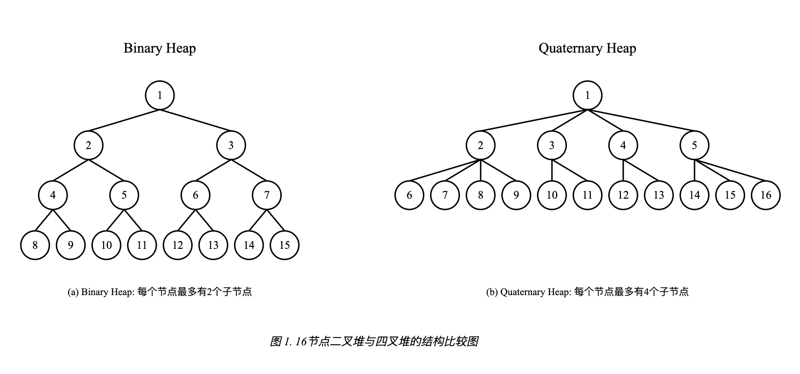
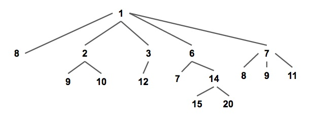

+++
title = "libxev 源码阅读 - Pairing Heap"
summary = ""
description = ""
categories = ["source-code-reading"]
tags = ["zig", "heap", "pairing-heap"]
date = 2024-12-27T19:21:51+09:00
draft = false

+++


Pairing Heap 是 libxev 中用到的一个数据结构，用于 Timer 的维护。因为在事件循环中，我们需要获取即将/已经超时的定时器，所以需要一种数据结构提供极快的 `getMin` 和 `deleteMin` 操作。最小堆正式符合这一特点的结构。更常见的数据结构是使用四叉堆，比如 Golang。


## Quaternary Heap


二叉堆和四叉堆都属于d-ary-heap，可以使用数组来存储




关于二叉堆和四叉堆的性能比较可以参考

- [Golang 计时器与四叉堆](https://grzhan.tech/2024/05/10/QuaHeapBench/)

- [为什么Golang的Timer实现使用四叉堆而不是二叉堆](https://vearne.cc/archives/39627)


## Pairing-Heap


以最小堆为例，配对堆是一棵满足堆性质的带权多叉树，每个节点的值都小于或等于他的所有的子节点





在基于指针的实现中，为了支持随机存取存储器（RAM）上的机器操作，以及减少键值操作，每个节点可以使用三个指针来实现。这通过将节点的子节点表示为一个双向链表实现：

- 一个指针指向节点的第一个子节点
- 一个指针指向其下一个兄弟节点
- 一个指针指向其上一个兄弟节点（对于最左边的兄弟节点，该指针指向其父节点）


这种结构也可以看作是[“左子树-右兄弟”（Left-child right-sibling）二叉树](https://en.wikipedia.org/wiki/Left-child_right-sibling_binary_tree?useskin=vector)的一种变体


### Insert


将新的元素视为一个堆和原堆进行合并。令两个根节点较小的一个为新的根节点，然后将较大的根节点作为它的子节点插入进去


需要注意插入操作是没有按照值的大小对子节点进行维护的。但是最右边的节点是最早的子节点，最左边的节点是最近的子节点。


### deleteMin


1. 根节点为最小节点，直接移除
2. 将子节点两两进行一次合并操作
3. 将新产生的堆 **从右往左**，逐个合并


为什么需要两遍合并，可以参考 [Why does pairing heap need that special two passes when delete_min?](https://stackoverflow.com/questions/22478773/why-does-pairing-heap-need-that-special-two-passes-when-delete-min)


配对堆具体的实现代码可以参考 https://github.com/mitchellh/libxev/blob/db6a52bafadf00360e675fefa7926e8e6c0e9931/src/heap.zig#L24


## Benchmark


参考 wiki ，各种堆的时间复杂度为

| Heap Type            | Find Min | Delete Min   | Decrease Key | Insert       | Meld         | Make Heap |
| -------------------- | -------- | ------------ | ------------ | ------------ | ------------ | --------- |
| **Binary**           | Θ(1)     | Θ(log n)     | Θ(log n)     | Θ(log n)     | Θ(n)         | Θ(n)      |
| **Skew**             | Θ(1)     | O(log n) am. | O(log n) am. | O(log n) am. | O(log n) am. | Θ(n) am.  |
| **Leftist**          | Θ(1)     | Θ(log n)     | Θ(log n)     | Θ(log n)     | Θ(log n)     | Θ(n)      |
| **Binomial**         | Θ(1)     | Θ(log n)     | Θ(log n)     | Θ(1) am.     | Θ(log n)     | Θ(n)      |
| **Skew Binomial**    | Θ(1)     | Θ(log n)     | Θ(log n)     | Θ(1)         | Θ(log n)     | Θ(n)      |
| **2–3 Heap**         | Θ(1)     | O(log n) am. | Θ(1)         | Θ(1) am.     | O(log n)     | Θ(n)      |
| **Bottom-up Skew**   | Θ(1)     | O(log n) am. | O(log n) am. | Θ(1) am.     | Θ(1) am.     | Θ(n) am.  |
| **Pairing**          | Θ(1)     | O(log n) am. | o(log n) am. | Θ(1)         | Θ(1)         | Θ(n)      |
| **Rank-pairing**     | Θ(1)     | O(log n) am. | Θ(1) am.     | Θ(1)         | Θ(1)         | Θ(n)      |
| **Fibonacci**        | Θ(1)     | O(log n) am. | Θ(1) am.     | Θ(1)         | Θ(1)         | Θ(n)      |
| **Strict Fibonacci** | Θ(1)     | Θ(log n)     | Θ(1)         | Θ(1)         | Θ(1)         | Θ(n)      |
| **Brodal**           | Θ(1)     | Θ(log n)     | Θ(1)         | Θ(1)         | Θ(1)         | Θ(n)      |


在 `deleteMin` 操作时，虽然 Pairing Heap 的时间复杂度为 o(log n) am；二叉堆的时间复杂度为 Θ(log n)，看起来 Pairing Heap 是更优的。但是实际测试下来二叉堆的耗时更少一点，参考 https://github.com/Hanaasagi/heap-benchmark。大概是因为 Pairing Heap 存在缓存命中问题。所以其实 Big O 这种还是要结合具体的计算机架构来讨论才具有实际意义，比如 HashMap 是 O(1)，但是在一些场景是不如直接遍历一个数组的


```
  Operating System: linux x86_64
  CPU:              AMD Ryzen 7 5800H with Radeon Graphics
  CPU Cores:        8
  Total Memory:     27.271GiB


benchmark              runs     total time     time/run (avg ± σ)     (min ... max)                p75        p99        p995
-----------------------------------------------------------------------------------------------------------------------------
B_HeapInsert           8191     1.499s         183.021us ± 31.67us    (166.5us ... 814.134us)      185.147us  270.284us  476.942us
B_HeapInsertWithAlloc  8191     1.541s         188.167us ± 29.909us   (170.621us ... 750.858us)    190.316us  241.998us  462.346us
B_HeapDeleteMin        2047     1.228s         600.258us ± 33.905us   (563.894us ... 1.105ms)      610.198us  762.102us  788.432us
Q_HeapInsert           8191     1.22s          149.062us ± 30.254us   (133.326us ... 752.255us)    150.297us  187.173us  440.486us
Q_HeapInsertWithAlloc  8191     1.225s         149.659us ± 27.223us   (135.073us ... 760.078us)    151.624us  184.589us  339.706us
Q_HeapDeleteMin        2047     1.108s         541.296us ± 29.77us    (508.65us ... 798.35us)      554.117us  679.271us  704.693us
P_HeapInsert           65535    950.686ms      14.506us ± 8.855us     (11.943us ... 966.388us)     14.387us   24.305us   27.168us
P_HeapDeleteMin        2047     1.908s         932.325us ± 44.969us   (870.776us ... 1.382ms)      950.813us  1.116ms    1.156ms
```


## Reference

- https://grzhan.tech/2024/05/10/QuaHeapBench/

- https://colobu.com/2024/11/18/go-internal-ds-4-ary-heap/
- https://www.cs.princeton.edu/~wayne/teaching/fibonacci-heap.pdf
