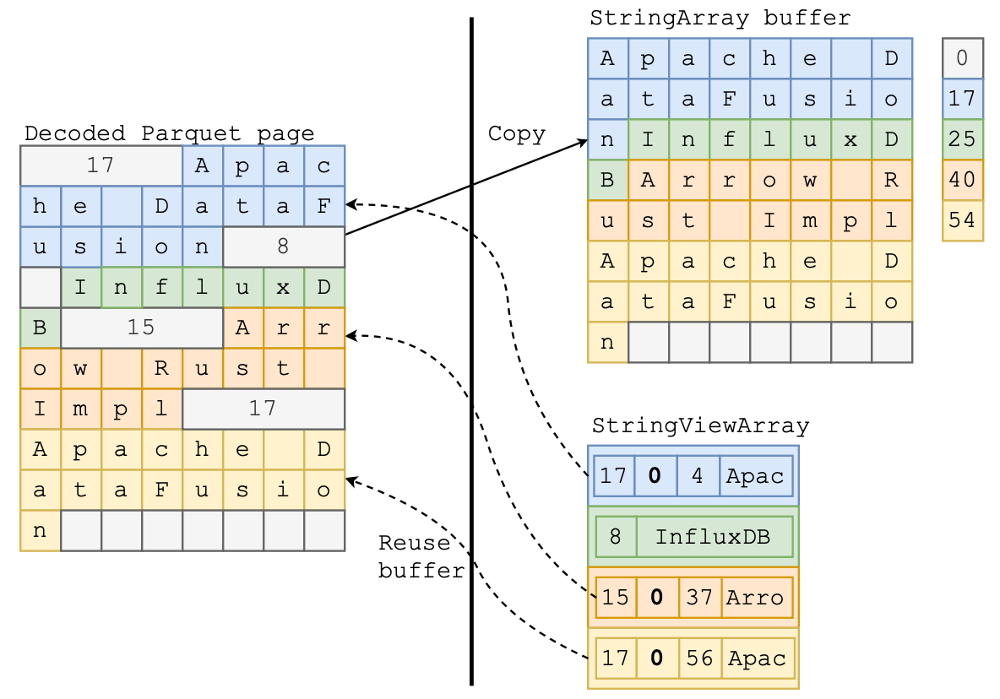

+++
title = "字符串布局优化"
summary = ""
description = ""
categories = ["optimization"]
tags = ["string", "memory-layout", "optimization"]
date = 2025-02-08T11:03:52+09:00
draft = false

+++

本文是对于以下文章的阅读笔记，学习一下字符串的内存布局优化


- [Why German Strings are Everywhere](https://cedardb.com/blog/german_strings/)
- [A Deep Dive into German Strings](https://cedardb.com/blog/strings_deep_dive/)
- [Using StringView / German Style Strings to Make Queries Faster: Part 1- Reading Parquet](https://datafusion.apache.org/blog/2024/09/13/string-view-german-style-strings-part-1/)
- [Using StringView / German Style Strings to make Queries Faster: Part 2 - String Operations](https://datafusion.apache.org/blog/2024/09/13/string-view-german-style-strings-part-2/)


## C 中的字符串

在 C 中，字符串被表示为以 `\0` 结尾的字节序列


这种简单模型在实践中存在一些问题：

- 如果字符串未正确终止，可能导致读取超出预期范围，带来安全隐患
- 计算字符串长度需要遍历整个字符串
- 扩展字符串时需要手动分配新的内存，移动字符串并释放旧的内存


----


## C++ 中的字符串

C++ 标准库提供了更高级的字符串实现，如 `std::string`，它存储字符串的长度、指向实际数据的指针以及当前缓冲区容量。此外，这种实现还支持短字符串优化（Short String Optimization，SSO）。长度较短的字符串可以直接就地存储，即设置容量字段中的某个位，容量和指针字段被直接用来存储字符串本身。这种优化省去了每次访问字符串时的内存分配和指针解引用。参考 https://devblogs.microsoft.com/oldnewthing/?p=109742


----


## CedarDB 中的字符串

基于以下理由：

- 尽管字符串可以存储任意长度的文本，但大多数情况下存储的是较短且可预测的数据。例如，ISO 国家代码（如 `USA`、`DEU`），枚举值（如 `MALE`、`FEMALE`），ISBN 等

- 大多数数据在写入后很少被修改，但会被频繁读取。使用不可变字符串可以避免锁开销

- 很多操作只需要访问字符串的一部分：

  - 例如，在执行 `SELECT * FROM messages WHERE starts_with(content, 'http');` 时，只需检查每个字符串的前四个字符。如果字符串不是短字符串，我们依然需要解引用指针。每次都解引用一个指针来比较前四个字符，显然很浪费

  - 再例如另一个查询：

    ```sql
    SELECT sum(p.amount)
    FROM purchases p, books b
    WHERE p.ISBN = b.ISBN AND b.title = 'Gödel, Escher, Bach: An Eternal Golden Braid';
    ```

    在这里，我们需要比较所有的 ISBN 并将书名与常量进行匹配。尽管必须比较完整的字符串以确保匹配，但很多书的名字显然不会是 _Gödel, Escher, Bach_。只要字符串的开头字符不匹配，我们就可以立即排除。


所以设计目标是：

- 紧凑存储，避免频繁解引用
- 避免动态内存分配，提高并发下效率
- 前缀索引，提高部分字符串操作的效率


CedarDB 选择使用 16 字节表示字符串，其中 4 字节用于存储长度。字符串的最大长度在 4 GiB 以内是可以接受的。


对于短字符串（小于等于 12 字节），直接就地存储数据


对于长字符串


`prefix` 存储了一个四字符的前缀。在执行相等/不等比较、字典序排序或前缀比较时避免了指针解引用的操作，提高了效率。`ptr` 则是实际数据的地址，CedarDB 选择使用不可变字符串，因此不需要存储 `capacity` 。缺点是向字符串追加数据变得昂贵，必须分配新的缓冲区并复制。


值得注意 `ptr` 的长度只有 62 bit，额外的 2 bit 用于存储生命周期信息。分为以下三种：

- 持久字符串（persistent）：生命周期等同于进程自身，可以在任何时间进行安全读取。所有短字符串可以说都是一种持久字符串，因为通过栈/寄存器进行复制
- 临时字符串（temporary）：类似于 C++ 中的临时对象，按照 RAII 规则进行管理。
- 瞬态字符串（transient）：相当于内存页某个区域的指针，自身无生命周期，需要关注对应的内存页的生命周期。比如，从磁盘读取了一页数据，那么直接指向而不是分配内存创建一个字符串。类似于创建了一个 `std::string_view`


###  选择 16 字节还是 24 字节

参考 C++ 中 `std::string` 的实现，字符串是 24 字节的，包含 8 字节的指针，8 字节的长度和 8 字节的容量。但是在 CedarDB 的这两篇文章中使用的是 16 字节的字符串。原因如下：

1. 每个字符串可以减少 8 字节的占用，对于大量依赖只读字符串进行比较的场景，这样可以减少约 33% 的空间占用。这点考虑是和使用场景相关的

2. 根据 System V 调用约定，大结构体需要通过堆栈传递，但大小不超过 16 字节的值可通过两个寄存器传递。因此，保持字符串表示在 16 字节以内，可避免每次函数调用时通过堆栈传递的开销。例如，比较两个字符串时，使用 16 字节表示的字符串可直接通过 CPU 寄存器传递，执行仅需 4 条指令，而使用 `std::string` 表示的字符串则需要 37 条指令

   参考汇编代码 https://godbolt.org/z/W1aTMG7sP


###  为什么使用最高有效位（MSB）进行标记

在 Tagging Pointer 中，可以选择使用 最高有效位（MSB） 或 最低有效位（LSB） 进行存储额外信息

1. 最高有效位（MSB）标记方式：
   - 由于当前没有任何计算机拥有 128 PiB 以上的内存，部分指针位仍未被使用，因此可以安全地存储额外信息
2. 最低有效位（LSB）标记方式：
   - 低位标记的好处是：当前的计算机架构已经使用这些位，因此它们不会受到未来架构变化的影响。但问题在于：使用 LSB 进行标记需要所有数据对齐到 4 字节，这样才能确保最低两位始终为 0 （2 bit 存储生命周期信息）。而 CedarDB 需要尽可能紧凑存储字符串，并且支持字节级寻址，因此不能强制 4 字节对齐。


由于以上原因，CedarDB 选择使用 MSB


### 指针标记是否安全

这取决于具体架构。当前所有计算机架构都不会使用完整的 64 位地址，即使是最新的 x86-64 扩展，最多也只使用 57 位地址，因此仍然 有 7 位可用于存储额外信息。无论是 LSB 还是 MSB 方式，在内存访问操作前，都需要去除标记，否则可能导致错误。反过来只要我们满足指针规范化形式就是安全的


### 处理短字符串的优势

另一个优势是可以直接在 CPU 寄存器中处理短字符串（不超过 12 个字符）。例如，来看字符串相等性检查：

```cpp
#include <cstdint>
#include <cstring>
struct data128_t { uint64_t v[2]; };

bool isEqual(data128_t a, data128_t b) {
    if (a.v[0] != b.v[0]) return false;
    auto len = (uint32_t) a.v[0];
    if (len <= 12) return a.v[1] == b.v[1];
    return memcmp((char*) a.v[1], (char*) b.v[1], len) == 0;
}

bool isEqualAlt(data128_t a, data128_t b) {
    auto aLen = (uint32_t) a.v[0];
    auto aPtr = aLen <= 12 ? (char*)&a.v + 4 : (char*)a.v[1];
    auto bLen = (uint32_t) b.v[0];
    auto bPtr = bLen <= 12 ? (char*)&b.v + 4 : (char*)b.v[1];
    return memcmp(aPtr, bPtr, aLen) == 0;
}
```


`isEqual` 和 `isEqualAlt` 的功能相同。然而 `isEqual` 利用字符串布局进行了特殊优化。在数据库系统的连接和过滤操作中，大部分比较结果通常是不相等的。为了优化这种情况，首先检查两字符串的长度是否相等，这可以通过简单的寄存器比较完成。绝大多数情况下这一步会得出结果。而对于短字符串的情况，通过比较第二个 8 字节，直接完成相等性判断，无需调用 `memcmp` 或进行栈操作


----


## Rust 中的 compact_str


Rust 和 C++ 类似，`String` 由三个字段组成，每个字段的大小与 `usize` 相同。其内存布局类似于以下结构：

`String: [ ptr<8> | len<8> | cap<8> ]`

- `ptr` 是一个指针，指向堆上存储字符串的位置
- `len` 是字符串的长度
- `cap` 是指针指向的缓冲区的总容量


在 Rust 中也有一些独特的字符串实现，比如

- [compact_str](https://crates.io/crates/compact_str)
- [smartstring](https://crates.io/crates/smartstring)


我们看一下 `compact_str` 中的实现，参考 https://github.com/ParkMyCar/compact_str?tab=readme-ov-file#how-it-works


`compact_str` 的想法也是 SSO。将元数据存储在栈上的同时，直接存储字符串本身。不过其实现和上面提到的都不同。`compact_str` 的大小为 24 字节，和标准库的 `String` 保持大小一致。总体内存布局如下：

`CompactString: [ buffer<23> | len<1> ]`


最后一个字节用于标志位，具体规则如下：

- `0b11XXXXXX`：前两位为 1，表示内联短字符串，并且后 6 位用于存储字符串长度
- `0b11111110`：全 1，尾部为 0，表示堆分配长字符串


通过这个标志位，布局分为下面两种情况：

- 对于短字段符串（小于等于 24 字节）直接内联存储，布局为  `{ buffer: [u8; 24] }`
- 对于长字符串（大于 24 字节）和标准库的 `String` 相同 ，布局为`{ ptr: NonNull<u8>, len: usize, cap: Capacity }`


### 24 字节空间被如何利用

对于内联字符串，栈上只有一个 24 字节的缓冲区。为了解决这个问题，利用了字符串的最后一个字节只能在 `[0, 192)` 范围内这一特性。根据 Rust 的规则，所有字符串都是有效的 UTF-8，因此最后一个字符的可能字节模式只能是以下两种：

- `0b0XXXXXXX`：范围为 `[0, 128)`。
- `0b10XXXXXX`：范围为 `[128, 192)`。

这意味着范围 `[192, 255]` 的值未被使用。可以使用 `[192, 215]` 的值来表示长度范围 `[0, 23]`。如果最后一个字节的值小于 192，则表示这是一个 UTF-8 字符，字符串长度默认为 24。具体展开来说分为如下几种情况：

- `[0, 191]`：这是 UTF-8 字符的最后一个字节，字符串存储在栈上，长度为 24
- `[192, 215]`：表示长度范围 `[0, 23]`，字符串存储在栈上
- `216`：字符串存储在堆上
- `217`：字符串存储为 `&'static str`
- `[218, 255]`：未使用，通常表示 `Option<CompactString>` 的 `None` 变体


---


## Arrow 中的 StringViewArray


参考 https://arrow.apache.org/docs/format/Columnar.html#variable-size-binary-view-layout

```
* Short strings, length <= 12
  | Bytes 0-3  | Bytes 4-15                            |
  |------------|---------------------------------------|
  | length     | data (padded with 0)                  |

* Long strings, length > 12
  | Bytes 0-3  | Bytes 4-7  | Bytes 8-11 | Bytes 12-15 |
  |------------|------------|------------|-------------|
  | length     | prefix     | buf. index | offset      |
```


`StringViewArray` 由以下三个部分组成：

1. 视图数组（view array）
2. 缓冲区（buffers）
3. 缓冲区指针（buffer pointers，ID），用于将缓冲区偏移量映射到其物理位置

每个视图占用 16 字节，其内容根据字符串的长度有所不同：

- 字符串长度 <= 12 字节：前 4 字节存储字符串长度，剩余 12 字节存储内联的字符串内容。
- 字符串长度 > 12 字节：字符串存储在单独的缓冲区中。视图的前 4 字节存储字符串长度，接下来 4 字节存储字符串的前缀， 4 字节存储缓冲区 ID，最后的 的 4 字节存储缓冲区偏移量


**P.S. 需要注意，此图和最新文档中描述的结构中字段位置不相同**


如上图所示

1. 字符串 `"Apache DataFusion"`（长度 17 字节）
   - `StringArray` 和 `StringViewArray` 都将字符串存储在缓冲区的起始位置
   - `StringViewArray` 还会将前 4 字节（`"Apac"`）内联存储在结构中
2. 字符串 `"InfluxDB"`（长度 8 字节）
   - `StringViewArray` 直接在视图结构中存储完整字符串，而 `StringArray` 仍然将字符串存储在缓冲区中。
3. 字符串 `"Arrow Rust Impl"`（长度 15 字节）
   - 由于字符串长度超过 12 字节，无法完全内联存储。
   - `StringViewArray` 的存储方式与第一个字符串相同，即前 4 个字节内联存储，其余部分存入缓冲区。
4. 重复字符串 `"Apache DataFusion"`（长度 17 字节）
   - `StringViewArray` 允许避免字符串内容的重复存储，可以通过指向先前存储位置的视图来重用相同的字符串数据。


这个设计的思路类似 CedarDB，不过对于 `ptr` 字段进行了修改。将 `ptr` 拆分为了 Buffer 的序号和偏移量。


这么设计的原因是 Parquet 格式采用的编码格式与原始的 Arrow `StringArray` 略有不同。在 Parquet 中，字符串长度与实际的字符串数据是内联存储的。`StringArray` 要求数据缓冲区必须是连续且紧凑的，所有字符串必须彼此相邻存储。这一要求意味着，在将 Parquet 字符串数据读取到 Arrow `StringArray` 时，需要执行额外的复制操作，将字符串字节数据重新整理到新的缓冲区，并在一个单独的偏移数组中维护索引信息。然而复制字符串往往是低效的，因为在典型查询中，大部分数据在加载后会立即被筛选掉导致刚刚复制的数据很快就被丢弃。

相比之下，使用 `StringViewArray` 读取 Parquet 数据可以直接复用 Parquet 页面存储的原始数据缓冲区，而无需进行字符串数据的重新排列，因为 `StringViewArray` 不要求字符串数据必须是连续存储的。例如下图`StringViewArray` 直接引用了解码后的 Parquet 页面缓冲区，其中 `"Arrow Rust Impl"` 这个字符串的视图存储了偏移量 `37` 和长度 `15`，从而高效地在原始缓冲区中定位该字符串，而无需额外的复制操作




这个解决的问题和 CedarDB 中的瞬态字符串（transient）很像


----

## 小结

1. 根据是否需要字节对齐，选择 MSB 或 LSB 进行标记指针
2. 16 字节可以有效利用寄存器，但是标准库大部分是 24 字节的实现
3. 根基字符串特征可以极限 SSO，比如 `compact_str`

总之，字符串的具体优化需要看需求场景


## Reference

- [Why German Strings are Everywhere](https://cedardb.com/blog/german_strings/)
- [A Deep Dive into German Strings](https://cedardb.com/blog/strings_deep_dive/)
- [Using StringView / German Style Strings to Make Queries Faster: Part 1- Reading Parquet](https://datafusion.apache.org/blog/2024/09/13/string-view-german-style-strings-part-1/)
- [Using StringView / German Style Strings to make Queries Faster: Part 2 - String Operations](https://datafusion.apache.org/blog/2024/09/13/string-view-german-style-strings-part-2/)


