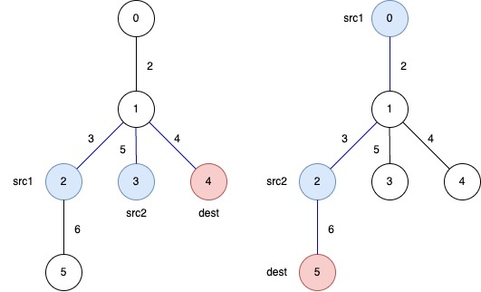

+++
title = "LeetCode Weekly Contest 450"
summary = ""
description = ""
categories = ["algorithm"]
tags = ["LeetCode"]
date = 2025-05-18T16:00:31+09:00
draft = false

+++


## 3550. Smallest Index With Digit Sum Equal to Index


### 题目

[3550. Smallest Index With Digit Sum Equal to Index](https://leetcode.com/problems/smallest-index-with-digit-sum-equal-to-index/)


给定一个整数数组 `nums`，返回满足 **`nums[i]` 的各位数字之和等于索引 `i`**  条件的最小索引 `i`；如果不存在，那么返回 `-1`


这个题的约束是

- `1 <= nums.length <= 100`
- `0 <= nums[i] <= 1000`


### 思路

1. 数值是整数，并且本身在 `1000` 之内，看起来不需要额外考虑
2. 数组长度最大只有 `100` 并且非空


直接顺序遍历判断即可

```go
package main

import (
	"fmt"
)

func sumOfDigits(num int) int {
	sum := 0
	for num > 0 {
		sum += num % 10
		num /= 10
	}
	return sum
}

func smallestIndex(nums []int) int {
	for i, num := range nums {
		if sumOfDigits(num) == i {
			return i
		}
	}
	return -1
}

func main() {
	fmt.Println(smallestIndex([]int{1, 3, 2}))   // 2
	fmt.Println(smallestIndex([]int{1, 10, 11})) // 1
	fmt.Println(smallestIndex([]int{1, 2, 3}))   // -1
}

```


## 3551. Minimum Swaps to Sort by Digit Sum


### 题目

[3551. Minimum Swaps to Sort by Digit Sum](https://leetcode.com/problems/minimum-swaps-to-sort-by-digit-sum/)

给定一个由 **互不相同的正整数** 组成的数组 `nums`。需要根据**每个数字的数位和**来**升序排列**数组：

- 如果两个数字的数位和相同，则数值较小的数字排在前面。

返回：将数组 `nums` 排成这种排序顺序**所需的最小交换次数**。


示例：

输入：`nums = [18, 43, 34, 16]`

- 数位和：[9, 7, 7, 7]
- 按规则排序后：[16, 34, 43, 18]
- 所以：
  - `18` ↔ `16`：1 次
  - `43` ↔ `34`：1 次
     → 共需要 2 次交换
     输出：`2`


### 思路

1. 可以复用上一道题的 `sumOfDigits` 函数
2. 求解数组排序元素间所需最小交换次数这类问题可以使用**置换环**， 可以参考 https://www.cnblogs.com/TTS-TTS/p/17047104.html。排序所需最小交换次数为`数组长度-环的个数`


```go
package main

import (
	"fmt"
	"sort"
)

func sumOfDigits(num int) int {
	sum := 0
	for num > 0 {
		sum += num % 10
		num /= 10
	}
	return sum
}

func minSwaps(nums []int) int {
	numsLen := len(nums)

	type Pair struct {
		value    int
		index    int // original index
		digitSum int // sum of digits
	}

	original := make([]Pair, numsLen)
	for i := 0; i < numsLen; i++ {
		original[i] = Pair{
			value:    nums[i],
			index:    i,
			digitSum: sumOfDigits(nums[i]),
		}
	}

	sorted := make([]Pair, numsLen)
	copy(sorted, original)

	// 排序目标数组：按 digit sum 升序，若相等按值升序
	sort.Slice(sorted, func(i, j int) bool {
		if sorted[i].digitSum < sorted[j].digitSum {
			return true
		} else if sorted[i].digitSum > sorted[j].digitSum {
			return false
		} else {
			return sorted[i].value < sorted[j].value
		}
	})

	// 构建原 index 到目标 index 的映射
	pos := make([]int, numsLen) // pos[i] 表示原始位置 i 的元素要去的位置
	isAllSame := true           // fast path 如果排序前后下标均相同，那么直接返回 0
	for i := 0; i < numsLen; i++ {
		pos[sorted[i].index] = i
		if isAllSame && sorted[i].index != i {
			isAllSame = false
		}
	}

	if isAllSame {
		return 0
	}

	// 计算最小交换次数（利用置换环）
	visited := make([]bool, numsLen)
	swaps := 0

	for i := 0; i < numsLen; i++ {
		if visited[i] || pos[i] == i {
			continue
		}
		// 找一个环
		cycleLen := 0
		j := i
		for !visited[j] {
			visited[j] = true
			j = pos[j]
			cycleLen++
		}
		if cycleLen > 0 {
			swaps += cycleLen - 1
		}
	}

	return swaps
}

func main() {
	fmt.Println(minSwaps([]int{37, 100}))        // 1
	fmt.Println(minSwaps([]int{22, 14, 33, 7}))  // 0
	fmt.Println(minSwaps([]int{18, 43, 34, 16})) // 2
}

```


## 3552. Grid Teleportation Traversal

### 题目

[3552. Grid Teleportation Traversal](https://leetcode.com/problems/grid-teleportation-traversal/)


给你一个大小为 `m x n` 的二维字符网格 `matrix`，用字符串数组表示，其中 `matrix[i][j]` 表示第 `i` 行和第 `j` 列处的单元格。每个单元格可以是以下几种字符之一：

- `'.'` 表示一个空单元格。
- `'#'` 表示一个障碍物。
- 一个大写字母（`'A'` 到 `'Z'`）表示一个传送门。

你从左上角单元格 `(0, 0)` 出发，目标是到达右下角单元格 `(m - 1, n - 1)`。你可以从当前位置移动到相邻的单元格（上、下、左、右），移动后的单元格必须在网格边界内且不是障碍物**。**

如果你踏入一个包含传送门字母的单元格，并且你之前没有使用过该传送门字母，你可以立即传送到网格中另一个具有相同字母的单元格。这次传送不计入移动次数，但每个字母对应的传送门在旅程中 **最多** 只能使用一次。

返回到达右下角单元格所需的 **最少** 移动次数。如果无法到达目的地，则返回 `-1`。

 

**示例 1：**

**输入：** matrix = ["A..",".A.","..."]

**输出：** 2

**解释：**


- 在第一次移动之前，从 `(0, 0)` 传送到 `(1, 1)`。
- 第一次移动，从 `(1, 1)` 移动到 `(1, 2)`。
- 第二次移动，从 `(1, 2)` 移动到 `(2, 2)`。


### 思路


我们可以把这个矩阵看作一个无权图

- 每个格子是一个节点。

- 从一个可通行的格子可以走向上下左右四个方向。

- 如果当前格子是传送门，还可以“瞬移”到所有同样字母的格子。

- 这些“移动”或“传送”操作的 cost 都是 1


通过 BFS 的思路，按照层次遍历。从左上角出发首先探索距离起点为 1 的所有节点；然后是距离为 2 的节点；然后是 3，4，5...

当我们第一次碰到右下角的时候，便是最短的路径


```golang
package main

import (
	"container/list"
	"fmt"
)

type Position struct {
	row int
	col int
}

func isPortal(ch byte) bool {
	return ch >= 'A' && ch <= 'Z'
}

func isObstacle(ch byte) bool {
	return ch == '#'
}
func isEmptyCell(ch byte) bool {
	return ch == '.'
}

func minMoves(matrix []string) int {
	rows, cols := len(matrix), len(matrix[0])

	grid := make([][]byte, rows)
	for i := range matrix {
		grid[i] = []byte(matrix[i])
	}

	portals := make(map[byte][]Position)
	// 取出所有的传送门
	for r := 0; r < rows; r++ {
		for c := 0; c < cols; c++ {
			ch := grid[r][c]
			if isPortal(ch) {
				portals[ch] = append(portals[ch], Position{r, c})
			}
		}
	}

	usedPortals := make(map[byte]bool)

	queue := list.New()
	start := grid[0][0]

	// 处理起始位置，初始化 BFS
	if isObstacle(start) {
		return -1
	} else if isEmptyCell(start) {
		queue.PushBack(Position{0, 0})
		grid[0][0] = '#'
	} else if isPortal(start) {
		for _, p := range portals[start] {
			queue.PushBack(p)
			grid[p.row][p.col] = '#'
		}
		usedPortals[start] = true
	} else {
		panic("Invalid chars")
	}

	steps := 0

	// BFS
	for queue.Len() > 0 {
		for i := queue.Len(); i > 0; i-- {
			curr := queue.Remove(queue.Front()).(Position)

			if curr.row == rows-1 && curr.col == cols-1 {
				return steps
			}

			// 尝试四方向移动
			for _, d := range [][]int{{0, 1}, {0, -1}, {1, 0}, {-1, 0}} {
				nextRow, newCol := curr.row+d[0], curr.col+d[1]
				// 越界?
				if nextRow >= 0 && nextRow < rows && newCol >= 0 && newCol < cols {
					ch := grid[nextRow][newCol]
					switch {
					case isEmptyCell(ch):
						queue.PushBack(Position{nextRow, newCol})
						grid[nextRow][newCol] = '#'
					case isPortal(ch) && !usedPortals[ch]:
						for _, p := range portals[ch] {
							queue.PushBack(p)
							grid[p.row][p.col] = '#'
						}
						usedPortals[ch] = true
					}
				}
			}
		}
		steps++
	}

	return -1
}

func main() {
	fmt.Println(minMoves([]string{"A..", ".A.", "..."}))                // Output: 2
	fmt.Println(minMoves([]string{".#...", ".#.#.", ".#.#.", "...#."})) // Output: 13
	fmt.Println(minMoves([]string{".A", "CA"}))                         // Output: 1
}

```


## 3553. Minimum Weighted Subgraph With the Required Paths II

### 题目

[3553. Minimum Weighted Subgraph With the Required Paths II](https://leetcode.com/problems/minimum-weighted-subgraph-with-the-required-paths-ii/)

树有 `n` 个节点，编号 `0` ~ `n-1`，`edges[i] = [u, v, w]` 表示 `u` 和 `v` 之间有条权重为 `w` 的边。`queries[j] = [src1, src2, dest]`，要求找到一个包含 `src1, src2, dest` 的连通子树，且在该子树中 `src1` 和 `src2` 都可以走到 `dest`。求这个子树的最小权重和


比如这个例子

**Input:** `edges = [[0,1,2],[1,2,3],[1,3,5],[1,4,4],[2,5,6]]`, `queries = [[2,3,4],[0,2,5]]`



需要输出

- `answer[0]`: The total weight of the selected subtree that ensures a path from `src1 = 2` and `src2 = 3` to `dest = 4` is `3 + 5 + 4 = 12`.
- `answer[1]`: The total weight of the selected subtree that ensures a path from `src1 = 0` and `src2 = 2` to `dest = 5` is `2 + 3 + 6 = 11`.


### 思路

- 树是无环的

- `src1`、`src2`、`dest` 三点不同


在树中，两个节点之间的路径是唯一的。


我们设：

- `dist[x]` 表示节点 x 到根的路径总权重。
- `lca(u, v)` 表示节点 u 和 v 的最近公共祖先。

有以下公式：



\\(dist(u,v)=dist[u]+dist[v]−2⋅dist[lca(u,v)]\\)


如果我们想要计算三点的最小子树权重，它等于：



\\(dist[A]+dist[B]+dist[C]−dist[lca(A,B)]−dist[lca(B,C)]−dist[lca(C,A)]\\)


这里参考倍增法求解 LCA https://www.cnblogs.com/ofnoname/p/18823468


```go
package main

import (
	"fmt"
)

type Edge struct {
	dest   int
	weight int
}

var (
	LOG int

	tree  [][]Edge // 邻接表
	depth []int    // 每个节点的深度
	dist  []int    // 每个节点到根的距离

	// parent[u][k] 表示：从节点 u 往上跳 2^k 步后的祖先节点。
	// 举例来说：
	//     parent[u][0] 是 u 的直接父亲。
	//     parent[u][1] 是 u 的祖父（跳两步）。
	//     parent[u][2] 是 u 的曾祖父（跳四步）。
	parent [][]int
)

func dfs(u, p, d, w int) {
	depth[u] = d
	parent[u][0] = p
	dist[u] = w
	for _, e := range tree[u] {
		if e.dest != p {
			dfs(e.dest, u, d+1, w+e.weight)
		}
	}
}

func initLCA(n int) {
	for k := 1; k < LOG; k++ {
		for u := 0; u < n; u++ {
			if parent[u][k-1] != -1 {
				parent[u][k] = parent[parent[u][k-1]][k-1]
			} else {
				parent[u][k] = -1
			}
		}
	}
}

func lca(u, v int) int {
	if depth[u] < depth[v] {
		u, v = v, u
	}
	// 把u提升到和v同一深度
	for i := LOG - 1; i >= 0; i-- {
		if parent[u][i] != -1 && depth[parent[u][i]] >= depth[v] {
			u = parent[u][i]
		}
	}
	if u == v {
		return u
	}
	// 同步提升u,v
	for i := LOG - 1; i >= 0; i-- {
		if parent[u][i] != -1 && parent[u][i] != parent[v][i] {
			u = parent[u][i]
			v = parent[v][i]
		}
	}
	return parent[u][0]
}

func minimumWeight(edges [][]int, queries [][]int) []int {
	n := len(edges) + 1
	LOG = 1 // 倍增法中需要的最大层数
	for (1 << LOG) <= n {
		LOG++
	}

	tree = make([][]Edge, n)
	for _, e := range edges {
		src, dest, weight := e[0], e[1], e[2]
		// 无向树
		tree[src] = append(tree[src], Edge{dest, weight})
		tree[dest] = append(tree[dest], Edge{src, weight})
	}

	depth = make([]int, n)
	dist = make([]int, n)

	parent = make([][]int, n)
	for i := range parent {
		parent[i] = make([]int, LOG)
		for j := range parent[i] {
			parent[i][j] = -1
		}
	}

	dfs(0, -1, 0, 0)
	initLCA(n)

	result := make([]int, len(queries))
	for i, q := range queries {
		src1, src2, dest := q[0], q[1], q[2]
		lca1 := lca(src1, src2)
		lca2 := lca(src2, dest)
		lca3 := lca(dest, src1)
		// 三点子树权重和
		result[i] = dist[src1] + dist[src2] + dist[dest] - dist[lca1] - dist[lca2] - dist[lca3]
	}
	return result
}

func main() {
	edges := [][]int{{0, 1, 2}, {1, 2, 3}, {1, 3, 5}, {1, 4, 4}, {2, 5, 6}}
	queries := [][]int{{2, 3, 4}, {0, 2, 5}}
	fmt.Println(minimumWeight(edges, queries)) // [12 11]

	edges2 := [][]int{{1, 0, 8}, {0, 2, 7}}
	queries2 := [][]int{{0, 1, 2}}
	fmt.Println(minimumWeight(edges2, queries2)) // [15]
}


```


## 置换环


对于输入数组 `A`


```
[a1, a2, a3, a4, a5, a6]
```


经过若干次元素交换，可以得到数组 `B`


```
[b1, b2, b3, b4, b5, b6]
```


对于每个元素 `A[i]`，和其在 `B` 中对应的元素 `B[j]`，我们可以构建一个映射关系 `i -> j`，记作 `f(i)`。我们进行分类讨论


1. `i = j` ，即经过 N 次交换后元素的位置不变。此时我们的最小交换次数可以不考虑这个元素（相当于没有交换此元素）

2. `i != j`，我们经过交换后，使用原数组 `i`  位置的元素替换了原数组 `j` 位置的元素。那么原数组 `j` 位置的元素，我们也可以通过映射关系 `f` 来得到新的位置 `k` 。此时有两种情况

   1. `i = k` ，我们实现了两个元素的交换，最小交换次数为 1
   2. `i != k`，我们可以递归此过程，计算 `f(k)` 的值，依次类推下去...我们会重复遍历到 `(i, j, k ...)`中的一个位置，产生一个环

   

用实际例子来看一下：

假设输入数组 `A` 为

```
[1, 2, 3]
```


1. 如果 `f(0) = 1`，`f(1) = 0` ，我们会得到

```
[2, 1, 3]
```


2. 如果 `f(0) = 1`，`f(1) = 2`，`f(2) = 0` ，我们会得到

```
[3, 1, 2]
```


首先对于一个长度为 `k` 的环，我们通过交换得到目标排列的的最小交换次数是 `k - 1`。这个可以由数学归纳法证明


对于 `k = 1`

- 环：仅有一个元素 `a1`，它已经在正确的位置
- 交换次数：1 - 1 = 0 次（无需交换）


对于 `k > 1`

已知在不改变环长度的条件下，继续任意交换元素，并不影响最小交换次数。比如 `[1, 2, 3]` 交换为 `[3, 1, 2]` 和 `[2, 3, 1]` 的最小次数是一样的。不妨考虑一个长度为 `k` 的循环右移的环：`a1→a2→⋯→ak→a1`。


- 第一步交换：交换 `a1` 和 `a2` 的位置。
  - `a1` 归位到正确位置，`a2` 被移动到原 `a` 的位置。
  - 剩余元素形成一个长度为 `k - 1` 的环 `a2→a3→⋯→ak→a2`。
- 应用归纳假设：剩余长度为 `k−1` 的环需要 `(k−1)−1=k−2` 次交换。


每次交换至少归位一个元素，并将剩余部分分解为更小的环。依次类推得到 `k - 1`


有了这个结论，我们可以计算长度为 `n` 的数组。将其划分为 `m` 个环。每个环的长度是 `k1, k2, k3, ... km`。所以总共的最小交换次数是 `(k1 - 1) + (k2 - 1) + ...  +(km -1)` ，计算后得到 `(k1 + k2 + k3 ... +km) - m `，得到 `n - m`


举例

```
A = [0, 1, 2, 3, 4, 5]
B = [0, 3, 1, 4, 2, 5]
```


映射关系

```
0 -> 0 自环，长度 1
1 -> 2 -> 4 -> 3 -> 1 长度 4
5 -> 5 自环， 长度 1
```


所以最小交换的次数为元素个数 6 减去 环的个数 3 ，为 3


模版代码如下

```go
package main

func minSwaps(source, target []int) int {
	n := len(source)
	if n != len(target) {
		panic("")
	}

	posInSource := make(map[int]int, n)
	for i, val := range source {
		posInSource[val] = i
	}

	pos := make([]int, n)
	for i := 0; i < n; i++ {
		pos[i] = posInSource[target[i]]
	}

	visited := make([]bool, n)
	swaps := 0
	for i := 0; i < n; i++ {
		if visited[i] || pos[i] == i {
			continue
		}
		cycleLen := 0
		j := i
		for !visited[j] {
			visited[j] = true
			j = pos[j]
			cycleLen++
		}
		swaps += cycleLen - 1
	}

	return swaps
}

func main() {
	a := []int{0, 1, 2}
	// a := []int{1, 0, 2}
	// a := []int{2, 0, 1}
	b := []int{2, 0, 1}
	println(minSwaps(a, b)) // Output: 2

	a = []int{3, 5, 4, 1, 2, 0}
	// a = []int{1, 5, 4, 3, 2, 0}
	// a = []int{5, 1, 4, 3, 2, 0}
	// a = []int{0, 1, 4, 3, 2, 5}
	// a = []int{0, 1, 2, 3, 4, 5}
	b = []int{0, 1, 2, 3, 4, 5}
	println(minSwaps(a, b)) // Output: 4

	a = []int{0}
	b = []int{0}
	println(minSwaps(a, b)) // Output: 0
}

```


