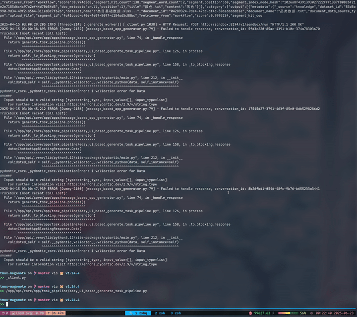

+++
title = "如何写一个 Terminal Text Picker"
summary = ""
description = ""
categories = [""]
tags = []
date = 2025-06-28T11:03:22+09:00
draft = false

+++


本文是 https://github.com/Hanaasagi/magonote 这个项目的开发笔记，记录一下如何编写一个类似 vimium 的 Text Picker。


项目效果如下




## 屏幕内容获取

在 tmux 环境中，我们需要获取当前 pane 的屏幕内容来进行文本匹配。这个过程分为几个步骤：


首先，我们需要知道当前哪个 pane 是活动的，以及它的基本信息：

```bash
tmux list-panes -F "#{pane_id}:#{?pane_in_mode,1,0}:#{pane_height}:#{scroll_position}:#{window_zoomed_flag}:#{?pane_active,active,nope}"
```


这个命令会返回所有 pane 的信息，格式为：` ID:是否在模式中:高度:滚动位置:是否缩放:是否活动`。我们从中找到标记为 `active` 的那一行。


可以使用 `capture-pane` 来获取 pane 的屏幕内容

```bash
tmux capture-pane -J -t <pane_id> -p
```


参数说明：

- `-J`: 保持行连接，避免因为 pane 宽度限制而人为换行
- `-t <pane_id>`: 指定要捕获的 pane 
- `-p`: 直接输出到标准输出，而不是写入缓冲区


额外的，如果用户在查看历史内容（即有滚动），我们需要指定捕获的范围：

```bash
tmux capture-pane -J -t <pane_id> -p -S <start> -E <end>
```

其中 `-S` 指定开始行，`-E` 指定结束行。通过这种方式，我们可以捕获用户当前正在查看的内容，而不是 pane 的最新内容。


## 文本识别


通过正则表达式，我们可以对于常见的文本进行提取，比如 URL， 文件路径。但是对于类似 `docker ps` 输出的容器名称，我们很难使用正则提取，因为会提取到很多额外的文本噪声。一种方式是识别屏幕内容的上下文，这种方式难以实现。一是因为不是每个人都是 `docker ps` ，所有的命令都可能有 alias 存在。二是当命令输出本身超过屏幕高度的时候，我们无法获取到上下文了


不过我们可以转换一个角度，很多命令的输出都是有格式的，比如在对齐上。我们可以通过算法来识别文本中的类似于网格布局的文本


核心思路是：如果多行文本形成了网格结构，那么在相同的列位置上，大部分行都会有空格分隔符。对于给定的文本行集合，我们逐字符分析每一行，统计空格信息

```
ID        NAME      STATUS    PORTS
12abc     nginx     running   80:8080
34def     redis     stopped   6379:6379
```


我们为每个字符位置维护两个计数器：

- `spaceCount[i]`: 位置 i 上有多少行是空格
- `nonSpaceCount[i]`: 位置 i 上有多少行是非空格字符


然后寻找从非空格到空格的转换点，这些位置很可能是列的边界：

1. 计算每个位置的空格比例：`spaceRatio = spaceCount[i] / totalLines`
2. 如果某个位置的空格比例超过阈值（比如 70%），且前一个位置有足够的非空格字符，则认为这是一个潜在的列边界
3. 从这个空格位置向后寻找，找到下一个开始有内容的位置，这就是新列的起始位置


特别的，需要移除距离太近的列边界（比如小于 3 个字符的距离），避免把一个单词内部的空隙误认为是列分隔，不然效果不够理想


引入一个置信度代表我们有多少的概率可以认为这是一个网格结构。对于识别出的每一列，计算有多少行在该列位置确实有内容开始。最终的置信度是所有列对齐度的平均值，再加上一些奖励因子：

- 列数奖励：更多的列意味着更结构化的数据
- 行数奖励：更多的行意味着更一致的格式


## Hints 生成


用户指定一组候选的字符集合，比如 `['a', 'b', 'c', 'd']`。我们需要为所有的匹配项生成 Hint，如果在屏幕上同时出现了 `a` 和 `ab` 这种 Hint，那么我们需要额外的加一个超时来判断用户输入 `a` 之后是想输入 `a` 还是 `ab`。为了避免这种问题，我们可以让所有的 Hint，任何一个都不是其他的前缀。


这个问题可以转化为一个经典的问题，前缀自由码 (prefix-free) 。数据结构上可以使用 K 叉树来表示


```


graph TD
  ROOT((root))
  ROOT --> A1[a]
  ROOT --> B1[b]
  ROOT --> C1[c]

  A1 --> AA[a]
  A1 --> AB[b]
  A1 --> AC[c]

  B1 --> BA[a]
  B1 --> BB[b]
  B1 --> BC[c]

  C1 --> CA[a]
  C1 --> CB[b]
  C1 --> CC[c]
  

```


我们可以根据需要生成的 Hint 数量来决定这个树的深度。比如这个 3 层深度的树，可以支持最大 9 个 Hint。从根节点到叶节点的一个路径便是前缀自由的。


在生成的过程中，我们可以使用 BFS 来做，不必使用树的结构


```
初始状态

    候选字符集合: [a, b, c]
    初始的 hints: [a, b, c]

第一步：移除最后一个 hint

    pop last -> c
    hints = [a, b]

。
第二步：用 alphabet 扩展这个前缀

    for ch in alphabet:
        new_hint = c + ch

    得到的新 hint 候选是：

    ca, cb, cc

第三步：追加回 hints

hints = [ca, cb, cc, a, b]

```


扩展阅读

- Kraft-McMillan inequality

- Huffman Coding


## 文本复制


我们拿到用户选择的文本后，可以直接通过一些命令行工具来复制到系统粘贴版，比如 `xclip`。但是对于在 ssh 等环境中，我们需要通过 OSC52 转义序列，输出到 Terminal 中，然后借助 Terminal 来复制到当前机器的粘贴板。这个操作需要 Terminal 支持，不过大部分的都是支持的


之前做 Vim 插件的时候就实现过类似的需求 https://github.com/Hanaasagi/remote-copy.vim/blob/56f2509d1d7effdc12bcd87a720de419171de3af/autoload/lib/python/remote_copy/handler.py#L13


这里主要要解决的是如何将转义后的序列输出到 Terminal 中，在执行 magonote 的时候是通过 `tmux run-shell -b` 来后台执行的。我们没有一个合适的 `fd` 将内容注入进去


可以试一下，下面的代码是复制不了的

```bash
$ cat test.sh
#!/bin/bash
echo -e "\ePtmux;\e\e]52;c;aGVsbG8=\x07\e\\"

$ tmux run-shell -b test.sh  # 需要绝对路径
```


但是可以通过 `tmux` 来获取当前 pane 的 pid，然后直接写入到这个进程的 stdin 中绕过去


```bash
#!/bin/bash
pane_pid=$(tmux display-message -p "#{pane_pid}")
echo -e "\ePtmux;\e\e]52;c;aGVsbG8=\x07\e\\" > /proc/$pane_pid/fd/1

$ tmux run-shell -b test.sh  # 需要绝对路径
```

