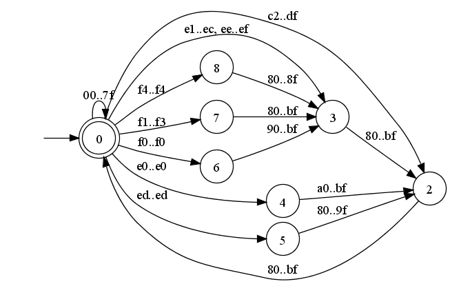
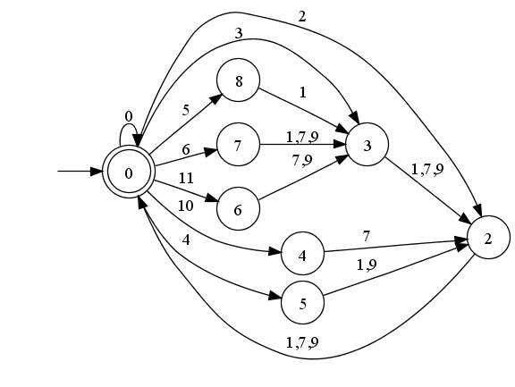

+++
title = "Decode UTF-8"
summary = ""
description = ""
categories = [""]
tags = []
date = 2025-08-19T00:17:33+09:00
draft = false
+++

学习一点古老技法 https://bjoern.hoehrmann.de/utf-8/decoder/dfa/


该技法被下面项目使用:
- https://github.com/oven-sh/bun/blob/29068c2118b272a2eec97b66b43269e6c3dd4456/src/string/immutable/unicode.zig#L1469
- https://github.com/nlohmann/json/blob/52d3f6e034504b4097741b2da5b644a38ee273ff/include/nlohmann/detail/output/serializer.hpp#L898


已知可能存在的问题:
- https://git.sr.ht/~slink/hoehrmann-utf8
- https://github.com/hoehrmann/utf-8-misc/issues/1 这个问题在 2010 版本代码 decode 的时候我没有复现


## 前置知识

- UTF-8 使用 1 到 4 个字节表示一个 Unicode 字符。在最初的 UTF-8 设计里是说可以 5 到 6 个字节的，但是目前没有实际用途，因为 Unicode 的范围是 U+0000 ~ U+10FFFF (共 1114112 个 codepoint)

- ASCII 范围的字符 (U+0000 ~ U+007F) 用 1 个字节，兼容早期的 ASCII。其他字符使用 2~4 个字节

- 字节模式有规律
   每个字节都有特定的前缀，能判断这是多字节序列中的第几个字节：

  - 单字节 (ASCII): `0xxxxxxx`
    - 多字节起始字节：
      - 2 字节: `110xxxxx`
      - 3 字节: `1110xxxx`
      - 4 字节: `11110xxx`

  - 后续字节 (Continuation byte): `10xxxxxx`

- 自同步 (Self-synchronizing) 

  - UTF-8 任意位置向前/向后扫描时，都能快速定位下一个字符的边界。

  - 这是因为 continuation byte 一定以 `10` 开头，而起始字节不会。

- 不会出现 `0x00`  (除了空字符本身) 

  - 在非 ASCII 情况下，UTF-8 不会产生额外的 `0x00`，对 C 语言等依赖 `\0` 结尾的系统友好。


| Unicode 码点范围   | UTF-8 字节序列                      |
| ------------------ | ----------------------------------- |
| U+0000 ~ U+007F    | 0xxxxxxx                            |
| U+0080 ~ U+07FF    | 110xxxxx 10xxxxxx                   |
| U+0800 ~ U+FFFF    | 1110xxxx 10xxxxxx 10xxxxxx          |
| U+10000 ~ U+10FFFF | 11110xxx 10xxxxxx 10xxxxxx 10xxxxxx |


## 实现

核心思路是表驱动 DFA:

- 将每个输入字节先映射到一个小整数类型
- 使用 "状态 + 类型 -> 下一状态" 的转移表推进解析与合法性判断
- 在推进过程中用统一的位运算累积码点

优点是:
- 范围判断被预先比编码进表；运行时只做两次数组访问与少量位运算
- 分支极少，对 CPU 预测与流水线更友好
- 数据局部性好：`utf8d` 很小，容易命中 CacheLine


### 1. 字节->类型映射

Hoehrmann 的做法是:
- 先对所有 0x00..0xFF 的字节做一次分类，映射成一个小整数类型
- 这些类型是按 UTF-8 的语义划分的: 例如 ASCII 是一类；后续字节 (10xxxxxx) 再细分为几类；E0/ED/F0/F4 这种后续受限的起始字节被分配到独立的类型；C0/C1、F5..FF 归入非法起始类

这样做的好处:
- 运行时不再对字节本身做复杂比较，只需一次表查找就得到类型
- 后续的合法性判断通通化为 "状态 + 类型 -> 下一状态" 的查表问题





比如:
- 00..7F -> 0 (ASCII) 
- 80..8F -> 1，90..9F -> 9，A0..BF -> 7 (续字节按范围细分) 
- C2..DF -> 2 (2 字节起始) 
- E0 -> 10；E1..EC、EE..EF -> 3；ED -> 4 (3 字节起始，E0/ED 特化) 
- F0 -> 11；F1..F3 -> 6；F4 -> 5 (4 字节起始，F0/F4 特化) 
- C0/C1、F5..FF -> 8 (非法起始) 


这些类型其实刚好把 UTF-8 的需要特别判断的点单独抽出来了：

- E0 的第二个字节必须是 A0..BF (避免过长) ，因此 E0 拿到“10”类型，在状态表中可以让“与 1 和 9 类续字节的组合”直接进入拒绝，保留与 7 类的组合；
- ED 用于屏蔽代理区间 D800..DFFF，对应第二个字节必须是 80..9F，因此 ED 拿到“4”类型；
- F0 的第二个字节必须是 90..BF (避免过长) ，所以 F0 拿到“11”类型；
- F4 的第二个字节必须是 80..8F (不超过 U+10FFFF) ，所以 F4 拿到“5”类型。


### 2. 用"状态 + 类型"查表来推进解析与合法性检查




有了类型，下一步是把我们现在在多字节编码的哪个阶段抽象成状态

- 当读到起始字节 (非 ASCII) 后，我们期待若干个续字节
- 每读到一个合规续字节，期待的数量减一。减到 0 则组装出完整码点 (ACCEPT)
- 如果某一步读到的类型不在当前状态允许的集合中，就进入 REJECT
- 有些起始字节 (E0/ED/F0/F4) 会选择不同的后续字节子类


### 3. 同时用位运算累积码点


合法性仅靠状态转移可判断，但我们还要恢复码点的数值。
- 若在续字节阶段：`codep = (codep << 6) | (byte & 0x3F)` (把 6 位有效负载拼到码点末尾) 
- 若在起始字节阶段：`codep = (0xFF >> type) & byte` (用类型决定掩码：起始 1/2/3/4 字节分别对应 0x7F/0x1F/0x0F/0x07) 


文章中提到了两个版本

- 最初版：`UTF8_ACCEPT=0`，`UTF8_REJECT=1`，索引 `256 + state*16 + type`
- 2010 改进版本：`UTF8_ACCEPT=0`，`UTF8_REJECT=12`，状态值在转移表中已经预乘了 16，因此索引计算简化为 `256 + state + type`


核心状态转移代码

```c
// 取 2010 版本
uint32_t decode(uint32_t* state, uint32_t* codep, uint32_t byte) {
  uint32_t type = utf8d[byte];                 // 1) 查字节类型
  *codep = (*state != UTF8_ACCEPT)             // 2) 无分支累积码点
    ? (byte & 0x3Fu) | (*codep << 6)
    : (0xFFu >> type) & byte;
  *state = utf8d[256 + *state + type];         // 3) 查表推进状态 (状态已预乘16) 
  return *state;                               // 4) 返回新状态
}
```

将 `state`/`codep` 持久化在调用方，实现流式的解码

- `UTF8_ACCEPT`: 读完一个完整码点或处于起始位置
- `UTF8_REJECT`: 非法路径
- 其它正值: 处于"期待 n 个后续字节"的中间状态


### 防过长 (overlong) 

- 2 字节最小码点是 U+0080 (`11000010 10000000` 即 C2 80) 。因此：
  - C0/C1 作为起始都非法 (已在“字节->类型”映射中分到非法类) 
  - 对 3 字节起始 E0：第二个字节必须是 A0..BF (类 7) ，否则 E0 80..9F 会形成 2 字节可表达的值的过长变体。
  - 对 4 字节起始 F0：第二个字节必须是 90..BF (类 9) ，否则 F0 80..8F 会形成 3 字节可表达的值的过长变体。

表中正是通过给 E0/F0 单独类型 (10/11) ，并让与不合要求的续字节类型组合的转移指向 `REJECT` 来实现的。


### 禁代理区间 (surrogate) 

- 代理区 U+D800..U+DFFF 在 UTF-8 中非法。其 3 字节编码落点恰好是 `ED A0..ED BF`。
- 因此 ED 被分到特化类型 4，使 "ED -> 第二字节=类 7 (A0..BF) " 的组合进入 `REJECT`，而 "ED -> 第二字节=类 1 (80..8F) 或 9 (90..9F)" 保持继续，从而避开 D800..DFFF。


### 控上界 (≤ U+10FFFF) 

- 4 字节编码上界是 F4 8F BF BF (U+10FFFF) 。
- 因此 F4 被分到特化类型 5，使 "F4 -> 第二字节=类 1 (80..8F) " 合法；若第二字节到 90..BF (类 9) ，则转移 `REJECT`。


## 示例

###  例子 1：`E4 B8 96` (“世” U+4E16) 

步骤：
1) 读 `0xE4`：类型为 3 (3 字节起始的常规类) 。
   - 状态：从 `ACCEPT` (起始) 转到“期待 2 个续字节”的状态。
   - 码点累积：`codep = (0xFF >> 3) & 0xE4 = 0x1F & 0xE4 = 0x04` (起始有效位 1110xxxx 中的 `0100`) 。

2) 读 `0xB8`：类型为 7 (A0..BF 的续字节子类) 。
   - 状态：从“期待 2 个续字节”转到“期待 1 个续字节”。
   - 码点累积：`codep = (0x04 << 6) | (0xB8 & 0x3F) = 0x100 | 0x38 = 0x138`。

3) 读 `0x96`：类型为 9 (90..9F 的续字节子类) 。
   - 状态：从“期待 1 个续字节”回到 `ACCEPT` (完成) 。
   - 码点累积：`codep = (0x138 << 6) | (0x96 & 0x3F) = 0x4E16`，即 U+4E16。

在这个过程中，合法性 (每步都查了"状态 × 类型") 与数值累积 (位运算) 同时完成，中途任一步不符合 (例如 E0 后第二个字节落在 80..9F) 都会直接走到 `REJECT`。

### 例子 2：`F0 9F 98 80` (U+1F600，😀) 

步骤：
1) 读 `0xF0`：类型 11 (四字节起始中"第二字节受限为 90..BF"的特化) 。
   - 状态：从 `ACCEPT` 进入"四字节起始后的第 1 阶段"。
   - 码点累积：`codep = (0xFF >> 11) & 0xF0 = 0 & 0xF0 = 0x00`。
   - 注：`0xFF >> 11 = 0`，F0 字节作为 4 字节序列起始，其有效载荷为 0。

2) 读 `0x9F`：类型 9 (90..9F) 。
   - 状态：满足 F0 的限制，从第 1 阶段 -> 第 2 阶段。
   - 码点累积：`codep = (0x00 << 6) | (0x9F & 0x3F) = 0x1F`。

3) 读 `0x98`：类型 9 (90..9F) 。
   - 状态：第 2 阶段 -> 第 3 阶段。
   - 码点累积：`codep = (0x1F << 6) | (0x98 & 0x3F) = 0x7D8`。

4) 读 `0x80`：类型 1 (80..8F) 。
   - 状态：第 3 阶段 -> `ACCEPT`。
   - 码点累积：`codep = (0x7D8 << 6) | (0x80 & 0x3F) = 0x1F600`。

如果第 2 步把 `0x9F` 换成 `0x8F` (即 F0 8F 98 80) ，会因 "F0 的第二字节必须 ≥ 0x90 "而在状态表里直接走向 `REJECT`，这就是“防过长编码”的查表体现。

### 例子 3：`ED A0 80` (禁止代理区间示例，必须 REJECT) 

1) `0xED`：类型 4 (ED 特化，用以限制第二字节) 。
2) `0xA0`：类型 7 (A0..BF) 。
- 在表中，`(状态_after_ED, 类型=7)` 会进入 `REJECT`，因为 ED 之后不能跟 A0..BF (这恰好对应 UTF-16 代理区间的编码范围) 。


## 代码

加了一点调试信息

```c
#include <stdint.h>
#include <stdio.h>

#define UTF8_ACCEPT 0
#define UTF8_REJECT 12

// Copyright (c) 2008-2009 Bjoern Hoehrmann <bjoern@hoehrmann.de>
// See https://bjoern.hoehrmann.de/utf-8/decoder/dfa/ for details.
static const uint8_t utf8d[] = {
  // The first part of the table maps bytes to character classes that
  // to reduce the size of the transition table and create bitmasks.
  0,0,0,0,0,0,0,0,0,0,0,0,0,0,0,0,  0,0,0,0,0,0,0,0,0,0,0,0,0,0,0,0,
  0,0,0,0,0,0,0,0,0,0,0,0,0,0,0,0,  0,0,0,0,0,0,0,0,0,0,0,0,0,0,0,0,
  0,0,0,0,0,0,0,0,0,0,0,0,0,0,0,0,  0,0,0,0,0,0,0,0,0,0,0,0,0,0,0,0,
  0,0,0,0,0,0,0,0,0,0,0,0,0,0,0,0,  0,0,0,0,0,0,0,0,0,0,0,0,0,0,0,0,
  1,1,1,1,1,1,1,1,1,1,1,1,1,1,1,1,  9,9,9,9,9,9,9,9,9,9,9,9,9,9,9,9,
  7,7,7,7,7,7,7,7,7,7,7,7,7,7,7,7,  7,7,7,7,7,7,7,7,7,7,7,7,7,7,7,7,
  8,8,2,2,2,2,2,2,2,2,2,2,2,2,2,2,  2,2,2,2,2,2,2,2,2,2,2,2,2,2,2,2,
  0,3,3,3,3,3,3,3,3,3,3,3,3,4,3,3, 11,6,6,6,5,8,8,8,8,8,8,8,8,8,8,8,

  // The second part is a transition table that maps a combination
  // of a state of the automaton and a character class to a state.
   0,12,24,36,60,96,84,12,12,12,48,72, 12,12,12,12,12,12,12,12,12,12,12,12,
  12, 0,12,12,12,12,12, 0,12, 0,12,12, 12,24,12,12,12,12,12,24,12,24,12,12,
  12,12,12,12,12,12,12,24,12,12,12,12, 12,24,12,12,12,12,12,12,12,24,12,12,
  12,12,12,12,12,12,12,36,12,36,12,12, 12,36,12,12,12,12,12,36,12,36,12,12,
  12,36,12,12,12,12,12,12,12,12,12,12,
};

static inline uint32_t decode(uint32_t* state, uint32_t* codep, uint32_t byte)
{
    uint32_t type = utf8d[byte];

    *codep = (*state != UTF8_ACCEPT) ? (byte & 0x3fu) | (*codep << 6) : (0xff >> type) & (byte);

    *state = utf8d[256 + *state + type];
    return *state;
}

static void decode_and_trace(const uint8_t* s)
{
    uint32_t state = UTF8_ACCEPT;
    uint32_t codepoint = 0;
    size_t i = 0;

    printf("Input bytes (hex):\n");
    for (const uint8_t* p = s; *p; ++p) {
        printf("%02X ", *p);
    }
    printf("\\0\n\n");

    for (const uint8_t* p = s; *p; ++p, ++i) {
        uint32_t prev_state = state;
        uint32_t byte = *p;
        uint32_t type = utf8d[byte];

        (void)type;

        (void)decode(&state, &codepoint, byte);

        printf("[%02zu] byte=0x%02X type=%u prev_state=%u new_state=%u codep=0x%08X\n",
            i, byte, type, prev_state, state, codepoint);

        if (state == UTF8_ACCEPT) {
            printf("  -> ACCEPT codepoint U+%04X\n", codepoint);
        } else if (state == UTF8_REJECT) {
            printf("  -> REJECT (invalid sequence). Emit U+FFFD and reset.\n");
            state = UTF8_ACCEPT;
            codepoint = 0;
        }
    }

    if (state != UTF8_ACCEPT) {
        printf("(end) Incomplete sequence. Emit U+FFFD.\n");
    }
}

int main(void)
{
    static const char* string_0= "Hello, 世界! ";
    static const char* string_1 = "\xF0\x9F\x98\x80"; // U+1F600 😀
    static const char* string_2 = " BAD:\xC0\xAF"; // overlong '/'
    static const char* string_3 = "世";
    static const char* string_4 = "큀";  // ED 81 80

    const uint8_t *input = (const uint8_t *)string_3;

    printf("UTF-8 DFA decode trace\n");
    printf("Decoding string literal: %s\n\n", (const char*)input);

    decode_and_trace(input);

    (void)string_0;
    (void)string_1;
    (void)string_2;
    (void)string_3;
    (void)string_4;

    return 0;
}
```
