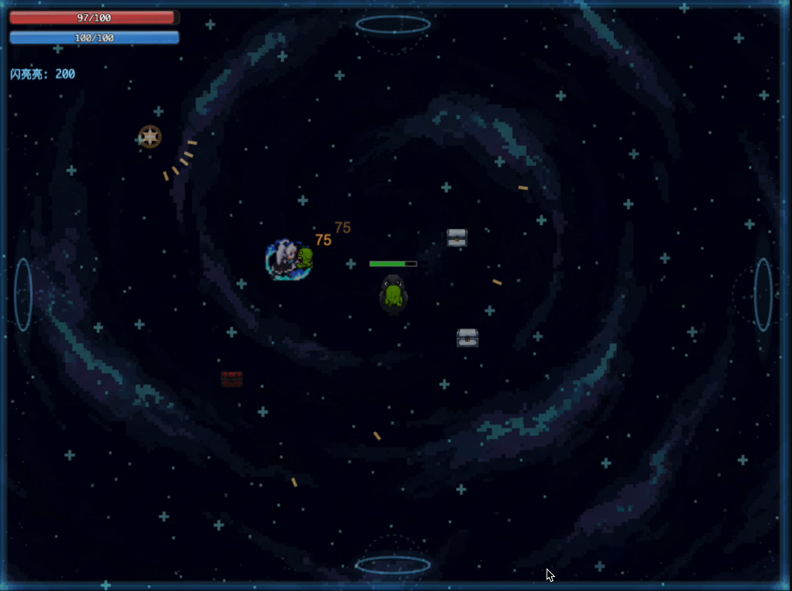
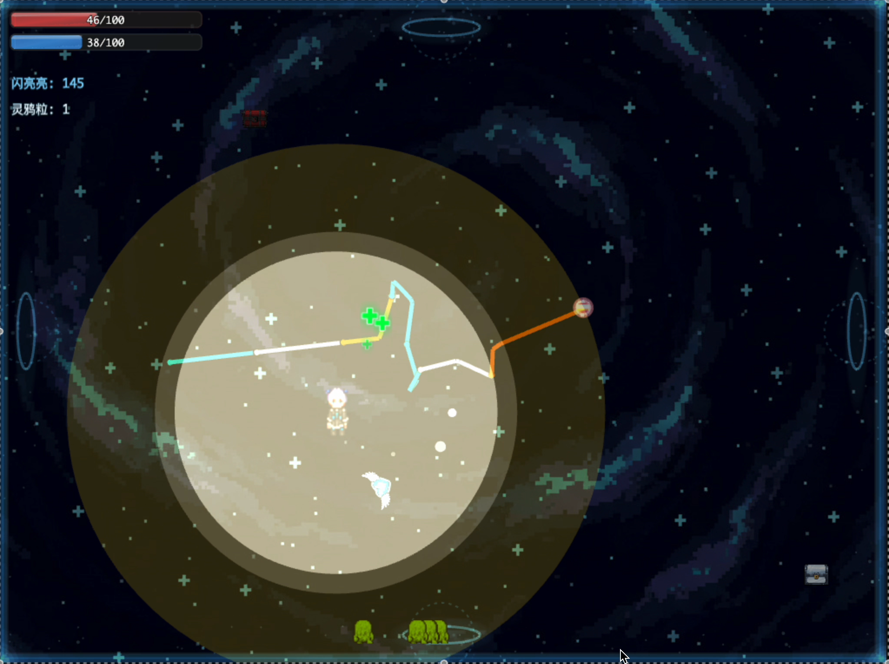
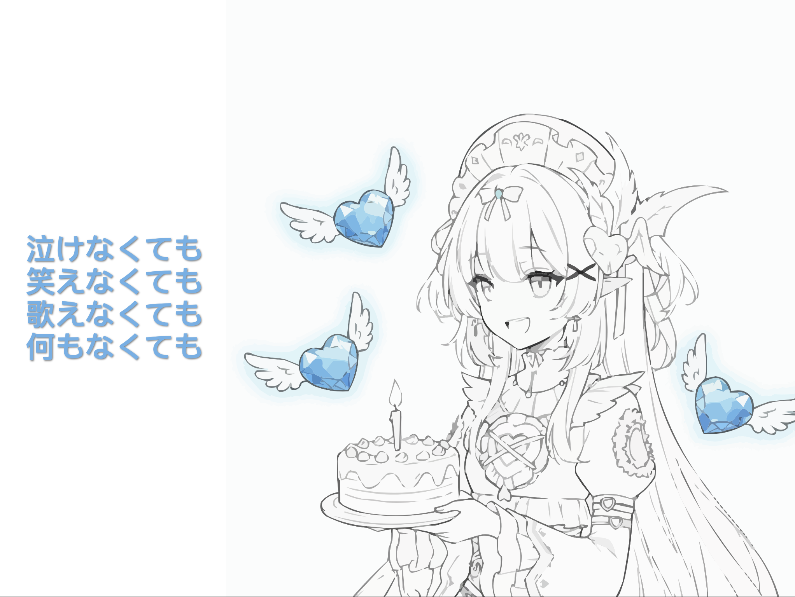
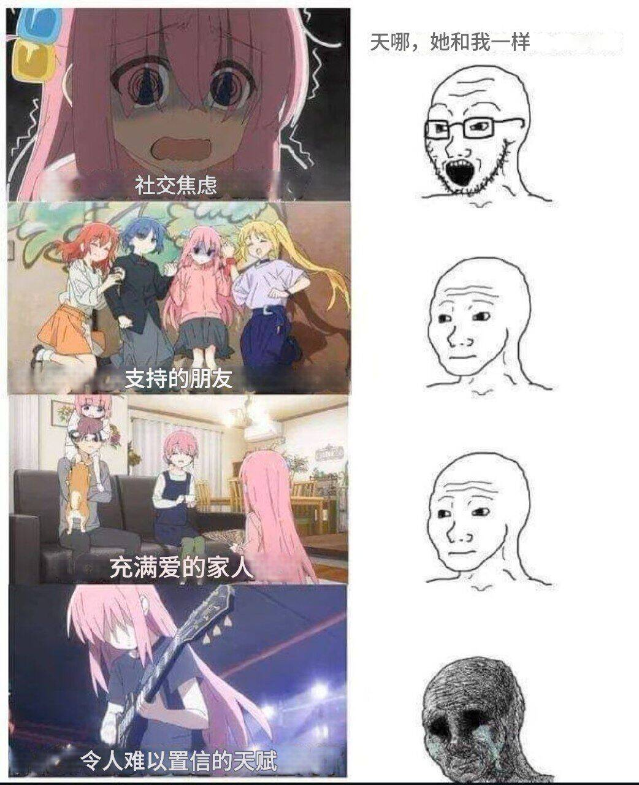

+++
title = "游戏开发记录"
summary = ""
description = ""
categories = [""]
tags = []
date = 2025-10-12T00:03:22+09:00
draft = false

+++

下面我来讲述一下我失败的游戏开发经历，之后有空的话代码会开源，但是概率比较小

## 技术选型

因为是送给 V 作为生日礼物的，所以觉得使用 Unity 之类的开发桌面游戏不太适合。毕竟谁会点开一个陌生人发的 exe 文件呢，还是选择 Web 游戏比较合理。
虽然 Unity, Godot 之类的游戏开发框架是可以支持 Web 端导出的，但是由于时间紧迫想避免踩坑兼容性的问题，所以首选 TypeScript

经过几番搜索思考，选择了 phaser.js 作为开发框架。 phaser.js 现在也是支持 Bun.js 的，必须采用！

## 关于创作

首先我面临的是时间不够的问题，从开始决定做这个事情之后。我只有 50 天的开发时间，如果能够每天下班干满 2 小时，那么也只有 100 小时的开发时间

我需要在这 100 小时内做

1. 设计游戏
2. 游戏素材
3. 游戏代码
4. 调试 Bug

参考了一下以撒是在两个人的情况下耗时四个月空闲时间做出的游戏。所以我肯定要通过一些特殊的手段来做，比如 AI

游戏素材是对于我来说比较耗时的部分。我希望尽可能地做一个可以复用素材的游戏，所以还是 roguelike 的游戏比较好。
参考 Hades 还有以撒，很多敌人都是重复的，地图是重复的。通过奖励机制，build 机制可以增加游戏的可玩性

最后思考下来，最终还是选择了 2D 像素风格的游戏定位

### 游戏素材

- 一些简单的素材可以在 https://opengameart.org/ 找到，比如我们敌人的序列帧等
- nano banana 也可以生成一些贴图素材，需要手动切图，然后改成 alpha 通道的
- 素材不清晰可以使用 https://imgupscaler.ai/
- 去除背景可以使用 https://www.photoroom.com/zh/tools/background-remover
- 游戏的 BGM 也可以在 https://opengameart.org/ 找到
- 一些简单的动画效果，可以借助 ADD 通过代码来实现，不用引入额外的素材了

### 主角序列帧

对于玩家的序列帧我是用了 https://www.pixellab.ai/ 进行生成，可以生成
- 八向移动序列帧
- 近战攻击
- 远程攻击

等，但是 AI 依然存在一致性的问题，需要我们反复 review 再生成，这个也比较麻烦

### 地图设计

不知道从哪里冒出来的 idea，我实现了一个 4x4 的房间地图，一共 16 个房间。然后相邻的房间通过传送门连接
但为了增加难度，实现了一个方向旋转的功能，进入下一个房间之后连接方向会随机旋转。这样构成一个迷宫的感觉，避免使用 BFS 来直接通关

但为了避免玩家晕头转向，设计了一个绘画的系统。玩家可以在房间内自由绘画，来做标记

为了增加游戏的可玩性加了两种不同的房间
1. 迷雾房间: 限制玩家的视野，类似宝可梦需要开闪光术的那种地图
2. 镜像房间: 反转玩家的移动方向

### 奖励系统

引入金币机制，敌人概率掉落，房间宝箱掉落。设计了一种额外的宝箱，会爆炸但是会得到高额的报酬，来一个高风险高回报的交换。
参考了 Hades 的房门设计。在玩家触碰传送门的时候，进行二选一。

思考过做一个 build 系统，但的确有点复杂了，需要一些创意还有各种效果的实现。所以主要围绕着 HP/MP 的上限，玩家数值的各种数值等

因为有点空余时间，实现了一个远程攻击多弹道的奖励

### 存档/复活

最开始没有想做存档系统的，但是因为考虑到那个人的游戏水平，所以准备做存档。不过代码已经被糊成了屎山，读档的时候总有状态上的问题，所以放弃了

不过存档并不是唯一一种可以让玩家在一局游戏重复体验的机制。可以引入复活道具，为了避免复活的时候，近战敌人立即将玩家再次杀死，所以做了一个弹开周围敌人的机制

### 敌人设计

敌人设计就是远程和近战两种，一部分用的开源的素材，一部分用的矢量图形叠加 ADD 效果。近战和远程的攻击模式可以直接复用，套用在各种敌人上面。敌人的伤害和 HP 等依据经过的房间数量进行补正

除了这两大类游戏，还设计了两种特殊敌人

- 会进行绘画的敌人
- 会擦除玩家绘画的敌人

这两类敌人是为了干扰玩家的绘画标记

### Boss 设计

时间来不及，直接复用了玩家的代码模组，然后在序列帧上加了一个暗红色的遮罩。加了一些比较弱智的玩家行为判定，使其看起来像是一个 Boss

遮罩效果和素材的微放大可以用于各种敌人的强化版，这样依旧是为了复用素材

### 设计通关彩蛋

彩蛋是游离在 phaser.js 之外的，直接通过在相同位置覆盖一个画面来做出来的。这个彩蛋总共改了很多次

第一版彩蛋我希望就是一个通关立绘，然后播放一首适合的音乐。再显示一个成就系统，设计一些有意思的称号。但是思考了一下，成就系统没有意义。

第二版我在通关立绘上下了功夫，我将立绘变成 svg，编写了模拟手写绘画效果的代码。这样可以让画面不再静止。
但是产生了一个问题，在 png 转换成 svg 的时候会丢失一些图像信息的，所以我多加了一个完整的立绘。然后通过代码叠在相同的位置浮现出来

第三版因为画面比较空，我在左边写了一个音乐播放器的那种歌词效果。seek 一下 music 的时间戳，比对 lrc 文件即可

第四版因为通关的时候突然播放音乐然后显示这个彩蛋感觉起来很突兀，所以又在中间加了一个过渡的效果。参考了宝可梦绿宝石那种通关之后，玩家自己移动的那种效果

第五版中间又加了一层效果，将玩家在 4x4 的所有房间内的绘画都浮现出来，然后模糊消失

## 做这件事情是否值得

从客观的角度来说，我认为这个事情是不值得的。因为非技术从业者很难明白从零写一个游戏需要耗费多少精力，很容易让别人认为你做了一件很简单的事情。而且我发现普通人对于 AI 有一个很大的误解，认为 AI 是只要两三句话说明需求，然后就可以非常简单地生成出来东西的，是一种非常廉价的事情！而实体礼物更容易看出来价值量的，尤其是手工做的礼物，普通人也可以想象出来背后付出多少汗水。

并且游戏这个东西投入和产出是很难成正比的，想想那些发售后销量暴死的游戏，风险是非常高的。很有可能你做出来的一个东西，对方只会玩一次就弃掉了。你做了一个游戏，但是对方不喜欢，还勉强的在直播的时候玩。你作为观众在看，是不是尬到要钻到地洞里面呢？

其实这个游戏我还埋了很多小彩蛋的，但是他直接选择走了最短捷径，很多彩蛋都没有遇到。

总之不建议做，这没有意义。你的时间应该放到更有意义的事情上！

