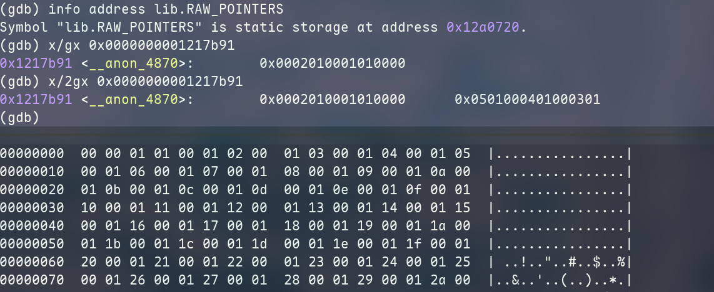

+++
title = "Heisenbug"
summary = ""
description = ""
categories = ["Zig"]
tags = [""]
date = 2025-11-29T17:00:00+09:00
draft = false

+++


事情是这样的，最近收到一个 PR https://github.com/dying-will-bullet/deunicode/pull/2，非常感谢 [Ethan Evans](https://github.com/ethanavatar) 。这个 PR 是升级 Zig 版本到 0.15.1 的，改动点是 Zig 那些 break change 的 API。但是在合并之后我发现这个改动在 Zig 0.15.2 是会单元测试失败的。查了一下发现这个问题还是比较有意思的


## 环境

复现问题的环境如下:

- 代码 commit  `63051c6`
- Zig 0.15.1 / 0.15.2 /  v0.16.0-dev.1484+d0ba6642b 。可以使用 `mise` 来切换 Zig 版本
- LLVM 21.1.6
- Linux 6.17.8-arch1-1 x86_64 unknown amd64


## 现象描述

这个代码逻辑比较简单，就是查表然后做 deunicode，这代码本身也是从 Rust 版本移植过来的。让我们直接切入到主题里面，首先使用 Zig 0.15.1 版本


**现象一**： 在存在 `std.debug.assert(custom_placeholder.len > 0);` 这行代码的时候，执行 `zig build test` 是 All passed 的。但是如果移除这一行，则单元测试会失败

https://github.com/dying-will-bullet/deunicode/blob/63051c6cac4631483ff49f85992ca0d380e830ef/src/lib.zig#L132-L136

```zig
        if (res == null) {
            std.debug.assert(custom_placeholder.len > 0);  // 这行
            try out.appendSlice(custom_placeholder);
            continue;
        }
```


**现象二**： 更加神奇的是，在**移除** `assert` 这一行并且将下面两行反注释掉，试图通过 `print` 了解我们的返回结果的时候，我们的单元测试又会通过

https://github.com/dying-will-bullet/deunicode/blob/63051c6cac4631483ff49f85992ca0d380e830ef/src/lib.zig#L261-L262

```
    // std.debug.print("{any}\r\n", .{res});
    // std.debug.print("{any}\r\n", .{expect});
```


**现象三**： 在移除 `assert` 这一行并且将下面被注释的所有测试用例全部反注释之后，我们所有的单元测试都会成功！

**现象四**： 即使不是 `assert` ，我们增加 `print` 这种不会被编译优化掉的语句在其他的位置，也会导致测试成功通过

**现象五**：以上所有的现象在 `aarch64` 均无法复现，但是在 `amd64` 下可以复现。`win` 下不确定，因为我没有 windows

**现象六**： 升级到 Zig 0.15.2 或者当前的 master 后，不管怎样测试都会失败


根据以上六个现象，我们可以发现

1. 当我们试图修改代码增加调试行为的时候，bug 似乎会消失
2. 不同平台行为不一致
3. 我们跑单个测试用例也存在失败的情况，那么这个和 race condition 无关
4. 单个测试用例会失败，多个测试用例则会成功。那么大概率说明并不是 buffer 被复用，没有清理导致的

5. 似乎这个 bug 和我们 `.text` 段的内容有关。也有可能是 stack 上预留的空间长度有关，因为增加 `assert` 或者 `print` 之后，会涉及新的栈上的变量空间预留，导致 `sub`  的值增大
6. 疑似和编译器行为有关系


## Debug

对于这种奇怪的问题，最好的方式是直接 `GDB` 进去调试


下文中引用两个 binary 来进行对比，编译器版本是 Zig 0.15.1

- `./.zig-cache/o/10c1e6a7582bccf5604417e043694e46/test` 失败的
- `./.zig-cache/o/4956a4125b6989c9d0d9954375054576/test` 成功的


我们将失败的单元测试的 binary 通过 GDB 进行调试。132 行这里对应 `if (res == null) {`

```
Reading symbols from ./.zig-cache/o/10c1e6a7582bccf5604417e043694e46/test...
(gdb) break src/lib.zig:131
Breakpoint 1 at 0x10359e7: file lib.zig, line 132.
(gdb) r
Starting program: /home/kumiko/deunicode/.zig-cache/o/10c1e6a7582bccf5604417e043694e46/test
[New LWP 358477]

Thread 1 "test" hit Breakpoint 1, lib.deunicodeCustomAlloc (allocator=..., s=..., custom_placeholder=...) at lib.zig:132
132             if (res == null) {
(gdb) print res
$1 = {has_value = 0, null = <incomplete type>, ? = {ptr = 0x0, len = 0}}

```


而成功的单元测试的 binary 通过 GDB 进行调试

```
Reading symbols from ./.zig-cache/o/4956a4125b6989c9d0d9954375054576/test...
(gdb) break src/lib.zig:131
Breakpoint 1 at 0x10359e7: file lib.zig, line 132.
(gdb) r
Starting program: /home/kumiko/deunicode/.zig-cache/o/4956a4125b6989c9d0d9954375054576/test
[New LWP 363772]

Thread 1 "test" hit Breakpoint 1, lib.deunicodeCustomAlloc (allocator=..., s=..., custom_placeholder=...) at lib.zig:132
132             if (res == null) {
(gdb) print res
$1 = {has_value = 18972131, null = <incomplete type>, ? = {ptr = 0x1217de3 <__anon_4870+594> "AE\002C", len = 2}}

```


简单对比一下首次断点触发后的 `res` 变量的值，我们发现在失败的情况下我们的 `res == null`。会走到我们 `if` 的分支里面然后 `appendSlice`

```zig
        if (res == null) {
            std.debug.assert(custom_placeholder.len > 0);
            try out.appendSlice(custom_placeholder);
            continue;
        }

```


得到

```
(gdb) print out
$6 = {items = {ptr = 0x7ffff6fc0000 "[?]", '\252' <repeats 12 times>, len = 3},
  capacity = 15, allocator = {ptr = 0x11eed10 <testing.allocator_instance>,
    vtable = 0x11f69e0 <__anon_1857>}}

```


这里 `[?]` 字符是我们的 `custom_placeholder` 的变量的值，这就导致了我们最终的结果是和 `expect` 不同的。那么为什么我们的 `res` 在这里会是 `null` 呢。我们向上来阅读代码

```zig
        const res = if (has_next_cache) blk: {
            break :blk next_cache;
        } else blk: {
            break :blk getReplacement(codepoint.?);
        };

```


对于一个函数来说，如果它没有副作用（纯函数），一致的输入总会得到一致的输出的。通过断点，我们可以发现 `codepoint` 的值是正常被迭代出来的。也就是说我们的输入是一致的

```
Reading symbols from ./.zig-cache/o/10c1e6a7582bccf5604417e043694e46/test...
(gdb) break src/lib.zig:122
Breakpoint 1 at 0x10358ef: file lib.zig, line 122.
(gdb) r
Starting program: /home/kumiko/deunicode/.zig-cache/o/10c1e6a7582bccf5604417e043694e46/test
[New LWP 467141]

Thread 1 "test" hit Breakpoint 1, lib.deunicodeCustomAlloc (allocator=..., s=...,
    custom_placeholder=...) at lib.zig:122
warning: Source file is more recent than executable.
122             const res = if (has_next_cache) blk: {
(gdb) p/x *(int*)&codepoint
$1 = 0xc6
(gdb) c
Continuing.
[0/1] Test
Thread 1 "test" hit Breakpoint 1, lib.deunicodeCustomAlloc (allocator=..., s=..., custom_placeholder=...) at lib.zig:122
122             const res = if (has_next_cache) blk: {
(gdb) p/x *(int*)&codepoint
$2 = 0x6e
(gdb) c
Continuing.
[0/1] Test
Thread 1 "test" hit Breakpoint 1, lib.deunicodeCustomAlloc (allocator=..., s=..., custom_placeholder=...) at lib.zig:122
122             const res = if (has_next_cache) blk: {
(gdb) p/x *(int*)&codepoint
$3 = 0x65
```


```zig
test "test conversion alloc" {
    try testing.expect(try checkConversionAlloc("Æneid", "AEneid"));
}
```


```
>>> chr(0xc6)
'Æ'
>>> chr(0x6e)
'n'
>>> chr(0x65)
'e'

```


那么问题就是出在我们的 `getReplacement` 的实现上了。一种可能是我们的 `getReplacement` 被莫名奇妙 `inline` 掉了，一些 `buffer` 上的操作导致污染了栈空间的变量。通过执行 `layout split` 我们可以看到汇编代码

```
0x1035dea <lib.deunicodeCustomAlloc+3306>       call   0x103acc0 <lib.getReplacement>
```


这里使用了 `call` ，所以并没有被 `inline` 。当然在非 `inline` 的情况下，也是可以污染栈空间的。缓冲区溢出攻击和是否 `inline` 其实也没啥关系的。但是这一行提醒了我


```
0x1035dc8 <lib.deunicodeCustomAlloc+3272>       call   0x103ac70 <debug.FullPanic((function 'defaultPanic')).unwrapNull>
```


现代语言的默认编译 flag 下，都是有越界 `panic` 保护的。我们的代码没有 `panic`，所以非常大的概率我们的栈空间没有被污染掉！我们需要调整 debug 的方向


我们直接 `break lib.getReplacement` 来看一下这个函数被编译成什么样子，以下是失败版本的

```
(gdb) break lib.getReplacement
Breakpoint 1 at 0x103ac94
(gdb) r
Starting program: /home/kumiko/deunicode/.zig-cache/o/10c1e6a7582bccf5604417e043694e46/test
[New LWP 572209]

Thread 1 "test" hit Breakpoint 1, 0x000000000103ac94 in lib.getReplacement (cp=572209)
(gdb) info registers
rax            0xc6                198
rbx            0x1                 1
rcx            0x0                 0
rdx            0xc6                198
rsi            0x7fffffffbe00      140737488338432
rdi            0x7fffffffc378      140737488339832
rbp            0x7fffffffbf70      0x7fffffffbf70
rsp            0x7fffffffbf70      0x7fffffffbf70
r8             0x1                 1
r9             0x7fffffffd1a8      140737488343464
r10            0x7fffffffa3d8      140737488331736
r11            0x0                 0
r12            0x0                 0
r13            0x0                 0
r14            0x0                 0
r15            0x0                 0
rip            0x103ac94           0x103ac94 <lib.getReplacement+4>
eflags         0x202               [ IF ]
cs             0x33                51
ss             0x2b                43
ds             0x0                 0
es             0x0                 0
fs             0x0                 0
gs             0x0                 0
fs_base        0x11ec010           18792464
gs_base        0x0                 0
(gdb) disassemble lib.getReplacement
Attempt to extract a component of a value that is not a structure.
(gdb) x/32i $pc
=> 0x103ac94 <lib.getReplacement+4>:    sub    $0x150,%rsp
   0x103ac9b <lib.getReplacement+11>:   mov    %eax,0x130(%rsp)
   0x103aca2 <lib.getReplacement+18>:   mov    %eax,%eax
   0x103aca4 <lib.getReplacement+20>:   mov    %rax,(%rsp)
   0x103aca8 <lib.getReplacement+24>:   mov    $0x11eb000,%rbx
   0x103acaf <lib.getReplacement+31>:   mov    (%rbx),%rdx
   0x103acb2 <lib.getReplacement+34>:   lea    0x8(%rsp),%rbx
   0x103acb7 <lib.getReplacement+39>:   mov    %rbx,0x18(%rsp)
   0x103acbc <lib.getReplacement+44>:   mov    0x18(%rsp),%rdi
   0x103acc1 <lib.getReplacement+49>:   mov    %rdx,0x20(%rsp)
   0x103acc6 <lib.getReplacement+54>:   mov    0x20(%rsp),%rsi
   0x103accb <lib.getReplacement+59>:   movq   $0x10,0x28(%rsp)
   0x103acd4 <lib.getReplacement+68>:   mov    0x28(%rsp),%rcx
   0x103acd9 <lib.getReplacement+73>:   rep movsb %ds:(%rsi),%es:(%rdi)
   0x103acdb <lib.getReplacement+75>:   mov    %rax,%rdx
   0x103acde <lib.getReplacement+78>:   cmp    0x10(%rsp),%rdx
   0x103ace3 <lib.getReplacement+83>:   jb     0x103acfc <lib.getReplacement+108>
   0x103ace9 <lib.getReplacement+89>:   mov    $0x11f6be0,%rbx
   0x103acf0 <lib.getReplacement+96>:   mov    (%rbx),%rax
   0x103acf3 <lib.getReplacement+99>:   mov    0x8(%rbx),%rdx
   0x103acf7 <lib.getReplacement+103>:  jmp    0x103b0ca <lib.getReplacement+1082>
   0x103acfc <lib.getReplacement+108>:  jmp    0x103ad01 <lib.getReplacement+113>
   0x103ad01 <lib.getReplacement+113>:  mov    $0x11eb000,%rbx
   0x103ad08 <lib.getReplacement+120>:  mov    (%rbx),%rdx
   0x103ad0b <lib.getReplacement+123>:  lea    0x30(%rsp),%rbx
   0x103ad10 <lib.getReplacement+128>:  mov    %rbx,0x40(%rsp)
   0x103ad15 <lib.getReplacement+133>:  mov    0x40(%rsp),%rdi
   0x103ad1a <lib.getReplacement+138>:  mov    %rdx,0x48(%rsp)
   0x103ad1f <lib.getReplacement+143>:  mov    0x48(%rsp),%rsi
   0x103ad24 <lib.getReplacement+148>:  movq   $0x10,0x50(%rsp)
   0x103ad2d <lib.getReplacement+157>:  mov    0x50(%rsp),%rcx
   0x103ad32 <lib.getReplacement+162>:  rep movsb %ds:(%rsi),%es:(%rdi)

```


这里无法直接 `disassemble lib.getReplacement` 来查看汇编代码，但是可以通过 `PC` 寄存器来看。我们需要对比 `getReplacement` 的实现

```zig
pub fn getReplacement(cp: u21) ?[]const u8 {
    const i = @as(usize, cp);
    if (i >= POINTERS.*.len) {
        return null;
    }

    const p = POINTERS.*[i];

    // if length is 1 or 2, then the "pointer" data is used to store the char
    const chars = if (p.len <= 2) blk: {
        // NOTE: not p.chr
        // break :blk POINTERS.*[i].chr[0..@as(usize, p.len)];
        break :blk POINTERS.*[i].chr[0..@as(usize, p.len)];
    } else blk: {
        const map_pos = @as(usize, (@as(u16, p.chr[0]) | (@as(u16, p.chr[1]) << 8)));
        // unknown characters are intentionally mapped to out of range length
        const start = map_pos;
        const end = @as(usize, map_pos + p.len);
        if (start >= MAPPING.len or end >= MAPPING.len) {
            return null;
        }
        break :blk MAPPING.*[start..end];
    };

    return chars;
}
```


源代码中一共有两个地方显式返回了 `null`，我们先来看第一处

```zig
    if (i >= POINTERS.*.len) {
        return null;
    }
```

这个地方很有可能就是

```
   0x103acde <lib.getReplacement+78>:   cmp    0x10(%rsp),%rdx
   0x103ace3 <lib.getReplacement+83>:   jb     0x103acfc <lib.getReplacement+108>
```


直接在指令的地方下断点

```
(gdb) break *0x103acde
Breakpoint 2 at 0x103acde
(gdb) c
Continuing.
[0/1] Test
Thread 1 "test" hit Breakpoint 2, 0x000000000103acde in lib.getReplacement (cp=198)
(gdb) print/x $rdx
$1 = 0xc6
(gdb) x/gx $rsp + 0x10
0x7fffffffbe30: 0x0000000000000000

```


这里的 `rdx` 就是我们的 `i` 变量，而 `0x10(%rsp)` 则是我们的 `POINTERS.*.len`。对的它的值是 `0` 。这就造成了我们的 `if` 条件恒成立，然后返回了 `null`。OK，我们大致定位到问题所在的具体片段了


我们看测试通过的二进制版本，这里的值是啥

```
Starting program: /home/kumiko/deunicode/.zig-cache/o/4956a4125b6989c9d0d9954375054576/test

This GDB supports auto-downloading debuginfo from the following URLs:
  <https://debuginfod.archlinux.org>
Enable debuginfod for this session? (y or [n]) y
Debuginfod has been enabled.
To make this setting permanent, add 'set debuginfod enabled on' to .gdbinit.
[New LWP 1148235]

Thread 1 "test" hit Breakpoint 1, 0x000000000103acc4 in lib.getReplacement (cp=1148235)
(gdb)  x/32i $pc
=> 0x103acc4 <lib.getReplacement+4>:    sub    $0x150,%rsp
   0x103accb <lib.getReplacement+11>:   mov    %eax,0x130(%rsp)
   0x103acd2 <lib.getReplacement+18>:   mov    %eax,%eax
   0x103acd4 <lib.getReplacement+20>:   mov    %rax,(%rsp)
   0x103acd8 <lib.getReplacement+24>:   mov    $0x11eb000,%rbx
   0x103acdf <lib.getReplacement+31>:   mov    (%rbx),%rdx
   0x103ace2 <lib.getReplacement+34>:   lea    0x8(%rsp),%rbx
   0x103ace7 <lib.getReplacement+39>:   mov    %rbx,0x18(%rsp)
   0x103acec <lib.getReplacement+44>:   mov    0x18(%rsp),%rdi
   0x103acf1 <lib.getReplacement+49>:   mov    %rdx,0x20(%rsp)
   0x103acf6 <lib.getReplacement+54>:   mov    0x20(%rsp),%rsi
   0x103acfb <lib.getReplacement+59>:   movq   $0x10,0x28(%rsp)
   0x103ad04 <lib.getReplacement+68>:   mov    0x28(%rsp),%rcx
   0x103ad09 <lib.getReplacement+73>:   rep movsb %ds:(%rsi),%es:(%rdi)
   0x103ad0b <lib.getReplacement+75>:   mov    %rax,%rdx
   0x103ad0e <lib.getReplacement+78>:   cmp    0x10(%rsp),%rdx
   0x103ad13 <lib.getReplacement+83>:   jb     0x103ad2c <lib.getReplacement+108>
   0x103ad19 <lib.getReplacement+89>:   mov    $0x11f6be0,%rbx
   0x103ad20 <lib.getReplacement+96>:   mov    (%rbx),%rax
   0x103ad23 <lib.getReplacement+99>:   mov    0x8(%rbx),%rdx
   0x103ad27 <lib.getReplacement+103>:  jmp    0x103b0fa <lib.getReplacement+1082>
   0x103ad2c <lib.getReplacement+108>:  jmp    0x103ad31 <lib.getReplacement+113>
--Type <RET> for more, q to quit, c to continue without paging--
   0x103ad31 <lib.getReplacement+113>:  mov    $0x11eb000,%rbx
   0x103ad38 <lib.getReplacement+120>:  mov    (%rbx),%rdx
   0x103ad3b <lib.getReplacement+123>:  lea    0x30(%rsp),%rbx
   0x103ad40 <lib.getReplacement+128>:  mov    %rbx,0x40(%rsp)
   0x103ad45 <lib.getReplacement+133>:  mov    0x40(%rsp),%rdi
   0x103ad4a <lib.getReplacement+138>:  mov    %rdx,0x48(%rsp)
   0x103ad4f <lib.getReplacement+143>:  mov    0x48(%rsp),%rsi
   0x103ad54 <lib.getReplacement+148>:  movq   $0x10,0x50(%rsp)
   0x103ad5d <lib.getReplacement+157>:  mov    0x50(%rsp),%rcx
   0x103ad62 <lib.getReplacement+162>:  rep movsb %ds:(%rsi),%es:(%rdi)
(gdb) break *0x103ad0e
Breakpoint 2 at 0x103ad0e
(gdb) c
Continuing.
[0/1] Test
Thread 1 "test" hit Breakpoint 2, 0x000000000103ad0e in lib.getReplacement (cp=198)
(gdb) print/x $rdx
$1 = 0xc6
(gdb) x/gx $rsp + 0x10
0x7fffffffbb70: 0x0000000700000000


```


OK，这里是不会触发 `if` 条件返回 `null` 的。但是等等，这里的 `0x0000000700000000` 是什么？


回顾一下我们的结构体的定义

```zig
const Ptr = struct {
    chr: [2]u8 align(1),
    len: u8 align(1),
};
```


那么每个 `Ptr` 的大小是：

- `chr: [2]u8`: 2 byte

- `len: u8` : 1 byte

总共 3 个字节。对的，这里没有 4 字节 align 的，会造成寻址时候额外的负担。


```zig
const RAW_POINTERS = @embedFile("./pointers.bin");
const MAPPING = @embedFile("./mapping.txt");
var POINTERS: *[]const Ptr = @ptrCast(@alignCast(@constCast(&RAW_POINTERS)));
```


我们的 `pointers.bin` 文件是 `420000` 字节，`420000 / 3` 等于 `140000`。这里我们应该期望 `POINTERS.*.len` 的值为 `140000` 才对。所以说其实不管测试能通过还是不能通过的版本，我们的代码都是存在问题的，只是恰好它通过了而已！


我们针对这三行代码仔细研究一下

```
(gdb) info variables RAW_POINTERS
All variables matching regular expression "RAW_POINTERS":

File lib.zig:
18:     static [420000:0]u8 * const lib.RAW_POINTERS;
(gdb) info address lib.RAW_POINTERS
Symbol "lib.RAW_POINTERS" is static storage at address 0x12a0720.
(gdb) info files
Symbols from "/home/kumiko/deunicode/.zig-cache/o/10c1e6a7582bccf5604417e043694e46/test".
Local exec file:
        `/home/kumiko/deunicode/.zig-cache/o/10c1e6a7582bccf5604417e043694e46/test', file type elf64-x86-64.
        Entry point: 0x116dd20
        0x0000000001001000 - 0x0000000001004740 is .rodata
        0x0000000001004740 - 0x0000000001004f40 is .rodata.cst
        0x0000000001004f40 - 0x0000000001004f47 is .rodata.str
        0x0000000001004f48 - 0x00000000010340a0 is .eh_frame
        0x00000000010340a0 - 0x0000000001034f64 is .eh_frame_hdr
        0x0000000001035000 - 0x00000000011e9d2a is .text
        0x00000000011ea000 - 0x00000000011ea008 is .tdata
        0x00000000011ea008 - 0x00000000011ea010 is .tbss
        0x00000000011eb000 - 0x00000000011f6998 is .data
        0x00000000011f69a0 - 0x00000000012a5c98 is .data.rel.ro
        0x00000000012a5c98 - 0x00000000012a5cb0 is .got.plt
        0x00000000012a5cc0 - 0x00000000012a6d40 is .bss
        0x00007ffff7ffd120 - 0x00007ffff7ffd170 is .hash in system-supplied DSO at 0x7ffff7ffd000
        0x00007ffff7ffd170 - 0x00007ffff7ffd1d4 is .gnu.hash in system-supplied DSO at 0x7ffff7ffd000
        0x00007ffff7ffd1d8 - 0x00007ffff7ffd340 is .dynsym in system-supplied DSO at 0x7ffff7ffd000
        0x00007ffff7ffd340 - 0x00007ffff7ffd3dc is .dynstr in system-supplied DSO at 0x7ffff7ffd000
        0x00007ffff7ffd3dc - 0x00007ffff7ffd3fa is .gnu.version in system-supplied DSO at 0x7ffff7ffd000
        0x00007ffff7ffd400 - 0x00007ffff7ffd438 is .gnu.version_d in system-supplied DSO at 0x7ffff7ffd000
        0x00007ffff7ffd438 - 0x00007ffff7ffd558 is .dynamic in system-supplied DSO at 0x7ffff7ffd000
        0x00007ffff7ffd560 - 0x00007ffff7ffd570 is .rodata in system-supplied DSO at 0x7ffff7ffd000
        0x00007ffff7ffd570 - 0x00007ffff7ffd5c4 is .note in system-supplied DSO at 0x7ffff7ffd000
        0x00007ffff7ffd5c4 - 0x00007ffff7ffd618 is .eh_frame_hdr in system-supplied DSO at 0x7ffff7ffd000
        0x00007ffff7ffd618 - 0x00007ffff7ffd778 is .eh_frame in system-supplied DSO at 0x7ffff7ffd000
        0x00007ffff7ffd780 - 0x00007ffff7ffe6ed is .text in system-supplied DSO at 0x7ffff7ffd000
        0x00007ffff7ffe6ed - 0x00007ffff7ffe7bf is .altinstructions in system-supplied DSO at 0x7ffff7ffd000
        0x00007ffff7ffe7bf - 0x00007ffff7ffe7fb is .altinstr_replacement in system-supplied DSO at 0x7ffff7ffd000

```


`RAW_POINTERS` 的地址为 `0x12a0720`

-  `.rodata` 的范围是 `0x1001000 - 0x1004740`

- `.data.rel.ro` 的范围是 ` 0x11f69a0 - 0x12a5c98`


因为我们使用的 `var` 而不是 `const` 来定义的变量，所以 `RAW_POINTERS` 位于 `.data.rel.ro` 中。下面是两个 section 的差别，摘录自 GPT:

- `.rodata`

  - `.rodata`（read-only data）节用于存放编译期就能确定值、而且在程序运行期间永远不需要修改的“只读数据”。典型内容包括：字符串常量（如 `"hello world"`）、`const` 修饰的全局/静态变量（其值是 compile-time constant）等。 [ps-hung+2Kayssel+2](https://ps-hung.gitbooks.io/lld/text-data-rodata-bss-sections.html?utm_source=chatgpt.com)

  - 这部分数据在加载到内存后通常被映射成只读 (read-only) —— 即程序不能写入它，从而保证常量不会被意外修改。 [LWN.net+1](https://lwn.net/Articles/531148/?utm_source=chatgpt.com)

- `.data.rel.ro`

  - `.data.rel.ro` 节（“data, relocation-relro”）用于那些“如果只是常量，就应当是只读，但因为它们需要重定位 (relocation) —— 即它们的最终地址 / 值 在链接时或运行时才确定” 的数据。 [Stack Overflow+2MaskRay+2](https://stackoverflow.com/questions/7029734/what-is-the-data-rel-ro-used-for?utm_source=chatgpt.com)

  - 换句话说，如果一个全局/静态变量是“常量语义 (程序中不再修改)”但它初始化所依赖的内容（例如函数指针，或其他变量/符号地址）在编译时未知，需要通过重定位 (relocation) 来修正其地址，这种数据就放到 `.data.rel.ro`。 [Stack Overflow+2The Rust Programming Language Forum+2](https://stackoverflow.com/questions/7029734/what-is-the-data-rel-ro-used-for?utm_source=chatgpt.com)

  - 在动态链接 (shared libraries / PIE) 的情况下，链接器和运行时 linker 会先处理 relocation（把正确的地址写入 `.data.rel.ro`），然后把这个节设为只读，这就是所谓的 “RELRO” — 即 “Relocation Read-Only” 机制。 [Stack Overflow+2](https://stackoverflow.com/questions/7029734/what-is-the-data-rel-ro-used-for?utm_source=chatgpt.com)


稍微绕远了，让我们回到问题本身上，下面这行代码为啥有问题。看起来很多 `@` 就像工作群里面的消息一样令人烦躁

```zig
var POINTERS: *[]const Ptr = @ptrCast(@alignCast(@constCast(&RAW_POINTERS)));
```


为什么我们通过单元测试的 binary，仅仅只有 `len` 不对呢？我们代码后面可是有使用 

```zig
    const p = POINTERS.*[i];
```

访问过 `pointers.bin` 中的数据的。我们知道 `POINTERS` 的类型是 `*[]const Ptr`，它是一个指针，指向了 `slice`。而 `slice` 的内存布局类似是这样的

```c
struct {
    void* ptr;
    usize len;
}
```


我们再使用 GDB 来看一下

- 测试通过的

```
(gdb) info address lib.POINTERS
Symbol "lib.POINTERS" is static storage at address 0x11eb000.
(gdb) x/gx 0x11eb000
0x11eb000 <lib.POINTERS>:       0x00000000012a0720
(gdb) x/2gx 0x12a0720
0x12a0720 <lib.RAW_POINTERS>:   0x0000000001217b91      0x0000000700000000

```

- 不通过的

```
(gdb) info variables lib.POINTERS
All variables matching regular expression "lib.POINTERS":

File lib.zig:
20:     static struct []const lib.Ptr *lib.POINTERS;
(gdb) info address lib.POINTERS
Symbol "lib.POINTERS" is static storage at address 0x11eb000.
(gdb) x/gx 0x11eb000
0x11eb000 <lib.POINTERS>:       0x00000000012a0720
(gdb) x/2gx 0x12a0720
0x12a0720 <lib.RAW_POINTERS>:   0x0000000001217b91      0x0000000000000000
```


`0x0000000001217b91` 这个地址是对的，就是存储的我们 `pointers.bin` 中的二进制内容（图有字节序问题，不妨碍）




我们来整理一下当前的状况:

1. `RAW_POINTERS` 是一个指针，指向了嵌入到二进制中的 `pointers.bin` 的数据起始位置
2. `POINTERS` 是一个指针，指向了 slice header
3. slice header 是一个内存区域，它的 `ptr` 部分指向了 `RAW_POINTERS` 变量的地址。而 `len` 是错的


大概就是这样子

```
POINTERS(0x11eb000) -> slice header(0x00000000012a0720) == RAW_POINTERS(0x00000000012a0720)
                                                                     |
						- *ptr 0x0000000001217b91	-> pointers.bin 文件
						- len  0x0000000000000000
```


我们 `RAW_POINTERS` 和 slice header 是同一个内存区域，那么为什么使用 `RAW_POINTERS.len` 就不会有问题呢？莫非其实它的 `len` 存储在其他的地方？我们来看一下文档


 [@embedFile](https://ziglang.org/documentation/master/#toc-embedFile)

```
@embedFile(comptime path: []const u8) *const [N:0]u8
```

> ​      This function returns a compile time constant pointer to null-terminated, fixed-size array with length equal to the byte count of the file given by `path`. The contents of the array are the contents of the file. This is equivalent to a [string literal](https://ziglang.org/documentation/master/#String-Literals-and-Unicode-Code-Point-Literals)      with the file contents.      


`embedFile` 返回的是 `*const [N:0]u8` 类型。它是指向长度为 N 的数组的指针。

Zig 的数组类型 `[N:sentinel]T` 表示：

- 一个长度为 `N` 的固定长度数组
- 数组最后自动带一个 sentinel（这里是 `0`）
- 用来表示 C 风格的字符串等


它并不是一个 slice header 的结构！长度 N 是直接被编译进去的常量。所以我们在转换成 slice header 的时候 `len` 的区域是一个随机值的内存。我们修改代码无法复现 bug 是因为我们的 `.text`  section 的长度变了，导致我们 `.data.rel.ro` 会被重新计算，这就导致 `len` 的值是不一样的


所以也很好修，只要将 `len` 的值覆盖一次就可以避免了


另外推荐这篇 [Migrating from GitHub to Codeberg](https://ziglang.org/news/migrating-from-github-to-codeberg/)


