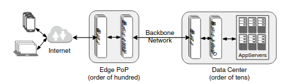
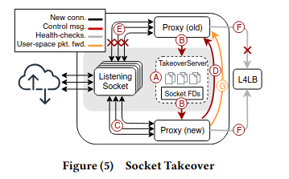
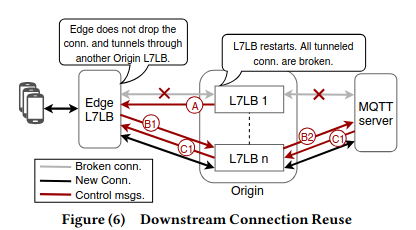
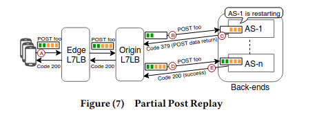

+++
title = "阅读 Zero Downtime Release"
summary = ""
description = ""
categories = [""]
tags = []
date = 2025-12-15T10:15:25+09:00
draft = false

+++

原文地址: https://research.facebook.com/publications/zero-downtime-release-disruption-free-load-balancing-of-a-multi-billion-user-website/

# BACKGROUND AND MOTIVATION

## 基础设施背景

Facebook 的 Web 流量基础设施是一个多层、地理分布式系统：

- 数据中心（DC）：数量为数十个量级，部署原始(origin) L7LB 与 AppServer
- 边缘 PoP（Point of Presence）：数量为数百个量级，靠近用户，为 HTTP、视频、MQTT 等提供边缘接入与缓存

在每一层

- L4LB（四层负载均衡，Layer 4 Load Balancer）：
  Facebook 使用 Katran，这是一个透明的、基于 XDP 的 L4 负载均衡层，位于网络路由器与 L7LB 之间，起到桥接作用。路由器通过 ECMP 将数据包均匀分发到 L4LB 层；随后，L4LB 使用一致性哈希将流量进一步负载均衡到一组 L7LB 实例上。

- L7LB（七层负载均衡，Layer 7 Load Balancer）：
  在七层负载均衡方面，Facebook 使用 Proxygen，这是一个内部自研的代理系统，其职责远超传统的 L7 负载均衡器。Proxygen 以多种模式运行
  - 作为反向代理处理外部请求、负载均衡到上游 AppServer
  - 作为前向代理处理内部出站请求
  - 作为 HTTP 服务器库，被其他服务嵌入使用
  - 支持多种传输协议： TCP、UDP
  - 支持多种应用协议：HTTP/1.1、HTTP/2、QUIC、MQTT 等
  - 为 CDN 提供缓存、维护 TLS 安全、健康检查 AppServer、收集监控指标等

- AppServer 层：HHVM 及其他应用服务器
  - 部署在原始数据中心，负责实际业务逻辑
  - HHVM 服务器主要处理短生命周期 API 请求，但也承载长生命周期任务（如大型 POST 上传）

## 传统 "排空 + 滚动更新" 带来的问题

传统方式：

1. 选择一批机器(例如集群的 5%–20%)，标记为排空中
2. 通过健康检查失败，使 L4LB/L7LB 不再将新连接打到这些机器上
3. 等待一段排空时间，让现有连接尽量自己自然结束
4. 排空时间结束：
   - 剩余连接直接被强制终止
   - 进程重启，加载新代码
   - 重新加入负载均衡池
   
   

这一技术在中小规模 OSP 里是实践标准，但在 Facebook 的规模下引发下面的问题：

- 集群容量降低 + 尾延迟恶化
  - 在一次 Edge 集群发布中，Facebook 观察到：在滚动更新过程中，集群容量持续低于 85%，与每批下线的比例（15%–20%）一致。
  - 容量下降导致资源争用上升，并引起尾部延迟显著抬高。
  - 经验结果：集群容量每减少约 10%，尾延迟就会明显升高。
- CPU 利用率显著提高
  - 当 10% 的原始 Proxygen 实例重启时：AppServer 层 CPU 有约 20% 的周期被用于重建状态（TCP 重连、TLS 会话、应用层状态）。
- 冲击 ISP 与蜂窝网络
  - 当大规模连接被同时重启：蜂窝塔需要处理大量信令，用于重新建立无线和 IP 层连接
- 直接中断最终用户体验
  - 对于长连接（如 MQTT）和长时间上传（大 POST 请求）：它们的生命周期往往超过排空时间，因此不可避免地被强制中断。
  - 用户侧表现为：HTTP 500 错误、超时重试、页面重新加载、重新上传大文件或重新开始会话。
  - 在 Facebook 的规模下，P99.9 的大量请求足够大，几乎必然跨越排空时间，因此传统排空策略对尾部用户尤其糟糕。

# DESIGN CHOICES

## 理想方案

### 1. 语言层支持

某些语言（如 Erlang）在不终止进程的前提下替换代码，实现无缝升级。但是绝大多数 Facebook 服务并非使用这类语言。将整个服务栈重写为具备热升级能力的语言，在工程上不现实

### 2. 纯内核支持（套接字迁移 / `SO_REUSEPORT`）

更常见的做法是依赖操作系统：

- 通过内核 API 让新旧进程共享 / 迁移监听套接字：
  - `SO_REUSEPORT` 允许多个进程/线程绑定到同一 IP:Port，由内核做负载均衡
  - 旧进程在排空，新进程启动并接手新连接
  
  

**问题 1：数据包路由不一致**

- 在某个时间窗口内，旧进程尚未完全退出，新进程已开始接受新包：
  - 同一个 TCP/UDP 四元组的数据包可能被分配到不同进程。
  - 在 Facebook 的规模下，即使“极短暂的模糊窗口”也会造成大量错误路由。
- 文章通过实验量化了这一点：
  - 在套接字交接阶段，UDP 数据包错误路由数量会激增，导致应用层错误。
  - 这对依赖 UDP 的应用（如 QUIC、webRTC）尤其致命。

**问题 2：可扩展性与状态问题**

- 每个实例维持数十万连接：
  - 内核级套接字迁移在这种量级下可扩展性堪忧。
  - TLS 等安全状态不能简单复制到另一个进程，涉及敏感内存与密钥。

**问题 3：应用状态不会被迁移**

- `SO_REUSEPORT` 或类似迁移机制只对传输层状态生效：
  - 应用层缓存、会话状态仍然绑定在旧进程内存。
  - 终止旧进程就等于丢弃这部分状态。

### 3. 协议 + 内核联合支持

另一个更现实的设想是：

1. 利用内核提供的基本套接字迁移能力，让旧实例逐步排空
2. 同时依赖协议层的优雅关闭语义（如 HTTP/2 的 GOAWAY）
3. 让上游组件（如代理层）参与协调长连接迁移

然而问题是：

- HTTP/1.1 与 MQTT 等协议本身并不支持类似 GOAWAY 的机制
- 现有内核 API 对于基于 UDP 的应用仍然不够用，无法避免路由不一致导致的中断

综上，Facebook 总结出理想的零停机发布系统应当满足：

- **通用性**：能跨多种语言、多种协议工作，而不是仅适用于 Erlang 或仅适用于 HTTP/2。
- **状态保留或外部化**：尽可能避免通过重启重建状态的成本，对不可迁移的状态，要通过外部组件来重建/重放。
- **优雅处理长连接**：不能仅仅依赖短暂的排空时间，需要有显式机制避免杀死长连接。

# Zero Downtime Release

最终设计目标：在不重构业务的前提下，利用自身端到端可控的基础设施，在不同层各自引入适配机制，共同实现零停机发布：

- **套接字接管（Socket Takeover）**：解决 L7LB(Proxygen) 重启的零停机。
- **下游连接重用（Downstream Connection Reuse, DCR）**：解决 MQTT 长连接在 Proxygen 重启时的中断问题。
- **部分回放重发（Partial Replay & Retry, PPR，HTTP 状态码 379）**：解决 AppServer 重启对长 POST 请求的影响。

三种机制作用在不同层、不同协议上，但可以同时启用且互不依赖

## Socket Takeover

对 Proxygen（边缘和原始的 L7LB）来说，希望做到：

- 在同一台机器上并行运行旧实例和新实例：
  - 新实例处理所有新连接和 L4LB 健康检查。
  - 旧实例只负责排空已有连接。
- 整个过程中：
  - 监听套接字永不关闭，从 L4LB(Katran) 视角看，L7LB 实例始终在线。
  - 不需要在 L4 层修改任何配置。

Facebook 在 Proxygen 的重启中，利用 Linux `CMSG`/`SCM_RIGHTS` 机制实现套接字接管：

1. 旧 Proxygen 启动一个 Server 监听一个 Unix 域套接字路径
2. 新 Proxygen 启动后连接到该 Unix 套接字
3. 旧实例通过 `sendmsg + CMSG/SCM_RIGHTS` 将所有监听套接字 fd 传递给新实例

   - 在接收端，`recvmsg` 之后遍历 `cmsghdr`，解析出 `SCM_RIGHTS` 附带的 fd。这些 fd 在新进程中表现得好像是通过 `dup()` 获得的一样:

     1. 引用计数增加

     1. 指向同一内核 `struct file` 和 `struct socket` 对象
4. 新实例拿到 fd 后，开始监听与旧实例完全相同的 VIP/端口，接收新连接和健康检查流量
5. 新实例确认就绪后，旧实例才停止接受新连接并进入排空阶段

### 工作流程

A: Socket Takeover 服务建立

- 旧的 Proxygen 实例创建一个 Socket Takeover 服务器，并将其绑定到一个预先指定的路径。
- 新的 Proxygen 进程启动，并主动连接到该 Socket Takeover 服务器。

B: 传递套接字 fd

- Socket Takeover 服务器通过 UNIX 域套接字，使用 `sendmsg()` + `CMSG`
- 将其所绑定的一组 套接字 fd 列表发送给新的 Proxygen 进程。

C: 新实例开始监听 VIP

- 新的 Proxygen 进程开始监听这些 fd 所对应的 VIP，具备接收新连接的能力。

D: 发送确认，触发连接耗尽

- 新进程向旧的 Socket Takeover 服务器发送确认信号，
- 表示已成功接管监听，可以开始耗尽旧连接（connection draining）。

E: 旧实例停止接收新连接

- 旧 Proxygen 进程在收到确认后：
  - 停止处理新的连接请求
  - 仅继续服务已有连接，并逐步将其耗尽

F: 接管 L4LB 健康检查

- 新的 Proxygen 实例接管来自 L4LB（Katran） 的运行状况检查探测（health check probes）的响应职责。

G: 耗尽阶段持续运行

- 系统保持该状态，直到连接耗尽周期结束。
- 在此期间，属于旧进程的 UDP 数据包仍然在用户态中被正确路由到对应的进程进行处理。

## Downstream Connection Reuse

Facebook 的 MQTT 流量是这样穿越基础设施的：

- 最终用户与边缘 Proxygen 之间是一个长寿命连接
- 边缘 Proxygen 与原始 MQTT 代理之间通过 HTTP/2 隧道承载 MQTT 流量
- 在原始层，Proxygen 只是中继数据包：
  - 只要边缘与 MQTT 代理双方都连着，“哪一台原始 Proxygen 充当中继不重要”
  - 这使得原始 Proxygen 在 MQTT 隧道上可以视为逻辑无状态

基于这一点，Facebook 设计了下游连接重用(DCR)：在原始 Proxygen 重启时，不是直接断联，而是把下游边缘的连接“换一个原始节点”继续中继

### 工作流程

1. 当一个原始 Proxygen 实例要重启时：
   - 它向下游边缘 LB 发送重连请求消息，告知其将要重启。
2. 边缘 LB 收到后并不立刻断开 MQTT 客户端连接，而是：
   - 携带用户 ID(user-id) 发起一个新的“重连请求”到原始层。
3. 在原始层，另一个健康的 Proxygen 实例：
   - 根据 user-id 通过一致性哈希定位到相同的 MQTT 后端代理。
   - 如果该代理仍持有该用户的连接上下文，则接受“重连”，建立新的隧道。
4. MQTT 代理返回确认，新的路径就绪。
5. 边缘继续通过新原始 Proxygen + 原有 MQTT 代理来转发用户数据流。
6. 如果无法找到对应上下文（例如后台已断开）：
   - 新原始返回“重连拒绝”。
   - 边缘丢弃连接，客户端将按正常逻辑重连。

## Partial Post Replay

AppServer 重启时，最棘手的是：

- 长时间的 POST 上传请求，尤其是大对象、多 GB 文件上传。
- 排空时间非常短（10–15 秒），远不足以等待这类请求自然结束。

传统处理方式：

1. 直接失败，返回 HTTP 500：
   - 用户看到“内部服务器错误”，需要手动重试或重新上传。
2. 返回 307 临时重定向：
   - 引导客户端从头重试整个请求，开销非常大。
3. 在代理层完全缓冲请求数据，再在失败时重试：
   - 对于高并发大 POST 来说，代理缓存成本高得不可接受。

### 解决思路

Facebook 引入了 HTTP 状态码 379 和一套协作机制：

- 当 AppServer 决定重启时：
  - 不直接返回 500 或 307。
  - 而是返回 379 + 已接收的部分 POST 数据 给下游（原始 Proxygen）。
- Proxygen 将 379 视为一种内部信号，而非用户可见状态码：
  - 拿着原始请求的 header + 部分 body 的“断点位置”，在集群内选择另一个健康的 AppServer。
  - 将这部分数据重放到新的服务器上，从而继续完成请求。
- 对用户来说：
  - 看到的依然是一个正常的成功响应。
  - 并不知道中间发生了重放

为避免误触，Facebook 制定了严格条件：

- 只有在看到状态码 379 且 status message 为 "Partial POST" 时，代理才会启用 PPR。
- 这样可以防止：
  - 某些上游代理或应用误用 379 代码导致逻辑出错
  - 非 PPR 参与方错误地触发回放行为

## 三种机制的组合

### 不同层的约束与选择

- Proxygen(L7LB) 层：
  - 有较长的排空期（20 分钟）。
  - 机器资源相对充足，能在同一台机器上同时运行旧/新两个进程。
  - 适用机制：
    - 套接字接管(SOCKET TAKEOVER) 用于所有 TCP/UDP 流量。
    - DCR 用于 MQTT 等长连接协议。

- AppServer 层：
  - 工作负载以短请求为主，排空期只有 10–15 秒。
  - 机器在 CPU 和内存上较为紧张，无法同时运行两个 HHVM 实例：
    - HHVM 的缓存预热极其占用内存。
  - 因此不适合套接字接管。
  - 适用机制：
    - 仅使用 PPR（379 + 部分回放重发）来避免长 POST 超时和中断。

### 并行启用与互不依赖

- 套接字接管与 DCR 在 Proxygen 重启时同时发生：
  - 套接字接管保证 TCP/UDP 监听与新连接零中断。
  - DCR 专门处理 MQTT 隧道中的长连接。
- PPR 与前两者独立：
  - 在 AppServer 层由 HHVM 与原始 Proxygen 协同工作。
  - 在 PPR 回放时，如果选中的下一个 HHVM 实例也在排空中，则再换一台，最多重试 10 次。

# 遇到的一些问题

## 共享套接字的副作用与调试困难

当通过 `SCM_RIGHTS` 将套接字所有权从旧进程转移到新进程时，内核中的套接字状态不会因为用户空间进程重启而改变。这意味着如果内核的套接字状态本身进入了某种错误状态（例如 sk_buff 缓冲区没有被正确清理），单纯回滚用户态二进制版本，并不能复原问题。

文章提到一个具体案例：

- 在启用 UDP GSO(Generic Segmentation Offload) 后，内核写路径中存在一个 bug：
  - 某些系统调用失败后，UDP 套接字（或其 `sk_buff`）中的缓冲没有被正确清除。
  - 随着时间推移，缓冲慢慢堆积，最终导致无法发送任何后续数据包。
- 由于套接字接管保持了原有内核套接字对象的存活，即使多次重启应用进程：
  - 错误状态依然存在。
  - 这极大增加了诊断和缓解难度。

建议措施

- 设计时就要允许在运行中动态关闭套接字接管功能：
  - 在初始化阶段，如果无法从旧进程接收 fd，就 fallback 为正常创建并绑定新 socket
  - 在关闭阶段，如果检测到异常，也可以通过健康检查失败的方式，通知 L4LB 暂停发新流量，而不是继续复用旧套接字。
- 同时，在监控中加入细粒度指标：
  - 每个套接字队列长度。
  - 读/写失败次数。
  - 丢弃数据包数量。
  - 跨进程传递的 fd 计数等。
  
  

## fd 泄漏

通过 **SCM_RIGHTS** 传递套接字本质上等价于 `dup(fd)`：

- 如果新进程在收到 fd 后既不监听也不关闭：
  - 这些套接字在内核中仍然是活动的
  - 继续接收自己在 **SO_REUSEPORT** 环中的随机份额数据包。
- 结果是：
  - 这些数据包会在队列中被吃掉但不处理，对用户表现为大量连接超时。

建议措施

- 新进程必须对每个收到的 fd 做出明确决策：
  - 要么开始监听，
  - 要么立即关闭。
- 同时通过监控快速发现“有流量但长期无读取”的套接字

## 旧实例的过早终止

在发布阶段，通常存在一个时间窗口：

- 新旧两个实例都在同一台机器上运行。
- 如果旧实例在新实例尚未完全就绪前就退出：
  - 会导致明显中断。
  
  

建议措施

- 在新旧实例之间构建一个显式的消息交互协议：
  - 使用同一个 Unix 域套接字通道，不仅传递 fd，还传递控制信号。
  - 只有在新实例明确确认“已经接管并稳定提供服务”后，旧实例才可以进入排空和终止阶段。
  
  

## 版本兼容性与回滚

套接字接管机制本身也在不断演进：

- 新版本(n+1) 必须和旧版本(n) 兼容：
  - `n -> n`：在生产环境中重启现有版本
  - `n -> n+1`：部署新实现
  - `n+1 -> n`：因 bug 回滚到旧实现
  - `n+1 -> n+1`：在新版本基础上重启
  
  

建议措施

- 在消息协议中加入显式版本协商：
  - 如果新旧进程找不到兼容版本，需优雅地放弃接管。
  - 避免出现"一半使用新协议，一半使用旧协议"导致的服务不可用。
  
  

## 可用性风险与健康检查

发布过程本身会放大可用性风险：

- 在高峰期部署时，临时的 CPU / 内存压力可能让部分实例健康检查失败。
- 如果 L4LB 基于一致性哈希将流量路由到被突然剔除/新增的一批 L7LB，将导致数据包路由拓扑的瞬间震荡。

建议措施

- 在 L4LB(Katran) 层引入连接表缓存 + LRU。对于已建立连接，优先保持路由稳定，避免因后端列表短暂波动而改变目标。
